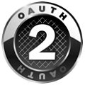

<properties
   pageTitle="Azure Active Directory Developer Guide | Microsoft Azure"
   description="Dieser Artikel enthält eine umfassende Anleitung für Entwickler Orientierung Ressourcen für Azure Active Directory."
   services="active-directory"
   documentationCenter="dev-center-name"
   authors="bryanla"
   manager="mbaldwin"
   editor=""/>

<tags
   ms.service="active-directory"
   ms.devlang="na"
   ms.topic="hero-article"
   ms.tgt_pltfrm="na"
   ms.workload="identity"
   ms.date="10/24/2016"
   ms.author="mbaldwin"/>

# Azure Active Directory developer's guide

## (Übersicht)
Als eine Verwaltung Identität als (IDMaaS) Serviceplattform bietet Azure Active Directory (AD) Entwicklern eine effiziente Möglichkeit Identitätsmanagement in ihre Programme integriert werden soll. Die folgenden Artikel enthalten eine Übersicht über Durchführung und die wichtigsten Features von Azure AD. Es wird empfohlen, dass Sie in der Reihenfolge zu lesen oder [erste](#getting-started) Schritte springen, wenn Sie bereit sind, zu erhalten.

1. [Die Vorteile von Azure AD-Integration](./develop/active-directory-how-to-integrate.md): erfahren Sie, warum die Integration mit Azure AD die bestmögliche Lösung für die sichere Anmeldung und Autorisierung bietet.

1. [Azure AD-Authentifizierungsszenarien](active-directory-authentication-scenarios.md): vereinfachte Authentifizierung in Azure AD, um die Anmeldung an Ihrer Anwendung nutzen.

1. [Integration von Applications mit Azure AD](active-directory-integrating-applications.md): Informationen zum Hinzufügen, aktualisieren und Entfernen von Applications Azure AD- und zu den branding Richtlinien für integrierte apps.

1. [Azure AD Graph-API](active-directory-graph-api.md): mithilfe der Azure AD Graph-API programmgesteuert Azure AD über Endpunkte REST-API zugreifen. Die Azure AD Graph-API ist auch über [Microsoft Graph](https://graph.microsoft.io/)zugegriffen werden kann. Microsoft Graph bietet eine einheitliche API, die Zugriff auf mehrere Microsoft Cloud-Dienst APIs, über einen einzelnen REST-API Endpunkt sowie mit einem einzelnen Token ermöglicht.

1. [Azure AD-Authentifizierung Bibliotheken](active-directory-authentication-libraries.md): einfach Benutzer authentifiziert, um Access Token zu erhalten, indem Sie Azure AD-Authentifizierung Bibliotheken für .NET, JavaScript, Ziel-C, Android und mehr.

## Erste Schritte

Diese Lernprogramme für mehrere Plattformen zugeschnitten sind und bieten Ihnen einen schnellen Einstieg Entwickeln mit Azure Active Directory. Voraussetzung ist müssen Sie [erhalten eine Azure Active Directory-Mandanten](active-directory-howto-tenant.md).

### Mobile und PC-Anwendung Schnellstart Führungslinien

|||||||
|:--:|:--:|:--:|:--:|:--:|:--:|:--:|:--:|
|[iOS](active-directory-devquickstarts-ios.md)|[Android](active-directory-devquickstarts-android.md)|[.NET](active-directory-devquickstarts-dotnet.md)|[Windows-Dienst](active-directory-devquickstarts-windowsstore.md)|[Xamarin](active-directory-devquickstarts-xamarin.md)|[Cordova](active-directory-devquickstarts-cordova.md)|[Nahtlose direkt in OAuth 2.0](active-directory-protocols-oauth-code.md)|

### Web-Anwendung Schnellstart Führungslinien

||||| | 
|:--:|:--:|:--:|:--:|:--:|:--:|
|[.NET](active-directory-devquickstarts-webapp-dotnet.md)|[Java](active-directory-devquickstarts-webapp-java.md)|[AngularJS](active-directory-devquickstarts-angular.md)|[JavaScript](https://github.com/Azure-Samples/active-directory-javascript-singlepageapp-dotnet-webapi)|[Node.js](active-directory-devquickstarts-openidconnect-nodejs.md)|[Nahtlose direkt in OpenID verbinden](active-directory-protocols-openid-connect-code.md)|

### Schnellstart-Leitfäden Web-API

||
|:--:|:--:|
|[.NET](active-directory-devquickstarts-webapi-dotnet.md)|[Node.js](active-directory-devquickstarts-webapi-nodejs.md)

### Das Directory Schnellstarthandbuch Abfragen

| |
|:--:|
|[Diagramm-API](active-directory-graph-api-quickstart.md)|

## Gewusst wie

Die folgenden Artikel wird beschrieben, wie für bestimmte Aufgaben mithilfe von Azure Active Directory:

- [Abrufen einer Azure AD-Mandanten](active-directory-howto-tenant.md)
- [Melden Sie sich unter Verwendung des Anwendungsmusters mit mehreren Mandanten jeder Azure AD-Benutzer](active-directory-devhowto-multi-tenant-overview.md)
- Aktivieren Sie Cross-app SSO mithilfe von ADAL, [Android](active-directory-sso-android.md) und [iOS](active-directory-sso-ios.md) -Geräte
- [Stellen Sie eine Anwendung Elemente verwenden zertifiziert für Azure AD](active-directory-devhowto-appsource-certified.md)
- [Liste der Anwendungs im Katalog Azure AD-Anwendung](active-directory-app-gallery-listing.md)
- [Senden Sie Web apps für Office 365 auf dem Dashboard Verkäufer](https://msdn.microsoft.com/office/office365/howto/submit-web-apps-seller-dashboard)
- [Verstehen des Anwendungsmanifests Azure Active Directory](active-directory-application-manifest.md)
- [Grundlegendes zu den branding Richtlinien für die Anmeldung und app Acquisition Schaltflächen in der Clientanwendung](active-directory-branding-guidelines.md)
- [Vorschau: Wie Sie apps zu erstellen, die Benutzer, die mit sowohl persönlichen und geschäftlichen oder schulnotizbücher Konten anmelden](active-directory-appmodel-v2-overview.md)
- [Vorschau: Wie Sie apps zu erstellen, die registrieren, und melden Sie sich Nutzer](../active-directory-b2c/active-directory-b2c-overview.md)
- [Vorschau: Konfigurieren von token Lebensdauer in Azure AD](active-directory-configurable-token-lifetimes.md) mithilfe der PowerShell. Zum Konfigurieren von über die Azure AD Graph-API finden Sie unter [Richtlinie Vorgänge](https://msdn.microsoft.com/library/azure/ad/graph/api/policy-operations) und die [Richtlinie Entität](https://msdn.microsoft.com/library/azure/ad/graph/api/entity-and-complex-type-reference#policy-entity) Details.

## Bezug

Dieser Artikel enthält einen Verweis Foundation für REST und Authentifizierungsbibliothek APIs, Protokolle, Fehler, Codebeispielen und Endpunkte.  

###  Support
- [Markierter Fragen](http://stackoverflow.com/questions/tagged/azure-active-directory): Suchen Azure Active Directory-Lösungen auf Stapelüberlauf durch Suchen nach Kategorien [Azure-Active Directory](http://stackoverflow.com/questions/tagged/azure-active-directory) und [adal](http://stackoverflow.com/questions/tagged/adal).
- Sehen Sie sich die [Azure AD-Entwicklertools Glossar](active-directory-dev-glossary.md) Definitionen von häufig verwendeten Begriffen im Zusammenhang mit der Anwendungsentwicklung und Integration.

### Code

- [Azure Active Directory öffnen Source - Bibliotheken](http://github.com/AzureAD): die einfachste Möglichkeit, eine Bibliothek Quelle zu suchen mit unserer [Bibliotheksliste](active-directory-authentication-libraries.md)ist.

- [Beispiele für Azure Active Directory](https://github.com/azure-samples?query=active-directory): die einfachste Möglichkeit zum Durchsuchen der Liste von Beispielen wird mithilfe der [Suchindex Codebeispielen](active-directory-code-samples.md).

- [Active Directory Authentifizierung Bibliothek (ADAL) für .NET](https://github.com/AzureAD/azure-activedirectory-library-for-dotnet) - Dokumentation steht für [die letzte Hauptversion](https://docs.microsoft.com/active-directory/adal/microsoft.identitymodel.clients.activedirectory) und die [die vorherige Hauptversion](https://docs.microsoft.com/active-directory/adal/v2/microsoft.identitymodel.clients.activedirectory).

### Diagramm-API

- [Diagramm-API-Referenz](https://msdn.microsoft.com/library/azure/hh974476.aspx): REST Bezug für die Azure Active Directory Graph-API. [Die interaktive Graph-API Bezug Oberfläche anzeigen](https://msdn.microsoft.com/Library/Azure/Ad/Graph/api/api-catalog).

- [Diagramm-API Berechtigung Bereiche](https://msdn.microsoft.com/Library/Azure/Ad/Graph/howto/azure-ad-graph-api-permission-scopes): OAuth 2.0 Berechtigung Bereiche, die verwendet werden, um den Zugriff zu steuern, die eine app zu Directory-Daten in einen Mandanten enthält.

### Authentifizierung und Autorisierung Protokolle

- [Bei der Anmeldung Schlüssel Rollover in Azure AD](active-directory-signing-key-rollover.md): erfahren Sie mehr über Azure AD-Signieren Key Rollover Cadence und wie Sie die Taste für die am häufigsten verwendeten Anwendungsszenarien zu aktualisieren.

- [OAuth 2.0-Protokoll: verwenden die Autorisierung Code erteilen](active-directory-protocols-oauth-code.md): Sie können das OAuth 2.0-Protokoll Autorisierung Code erteilen, verwenden, um die Autorisierung des Zugriffs auf Webanwendungen und Web-APIs in Ihrem Azure-Active Directory-Mandanten.

- [OAuth 2.0-Protokoll: Grundlegendes zu den implizit erteilen](active-directory-dev-understanding-oauth2-implicit-grant.md): erfahren Sie mehr über die erteilen implizit Autorisierung für eine Anwendung richtig ist.

- [OAuth 2.0-Protokoll: Dienst Dienst Anrufe verwenden Clientanmeldeinformationen](active-directory-protocols-oauth-service-to-service.md): erteilen der OAuth 2.0-Client-Anmeldeinformationen dieser Funktion kann einen Webdienst (ein vertrauliche Client) mit einem eigenen Anmeldeinformationen authentifizieren beim Aufrufen von einem anderen Webdienst, statt die Identität eines Benutzers. In diesem Szenario ist der Client in der Regel einen mittleren Ebene-Webdienst, eine Daemon-Dienst oder Website an.

- [OpenID verbinden 1.0-Protokoll: Anmeldung und Authentifizierung](active-directory-protocols-openid-connect-code.md): der OpenID verbinden 1.0-Protokoll erweitert OAuth 2.0 für den Einsatz als Authentication-Protokoll. Eine Clientanwendung können Sie erhalten eine Id_token zum Verwalten der Anmeldevorgang oder Erweitern des Ablaufs Autorisierung Code, um eine Id_token und die Autorisierung Code erhalten.

- [SAML 2.0-Protokoll Bezug](active-directory-saml-protocol-reference.md): der SAML 2.0-Protokoll ermöglicht Applikationen eine einzelne anmelden Erfahrung ihren Benutzern zur Verfügung gestellt.

- [WS-Verbund 1.2-Protokoll](http://docs.oasis-open.org/wsfed/federation/v1.2/os/ws-federation-1.2-spec-os.html): Azure Active Directory unterstützt WS-Verbund 1.2 gemäß der Spezifikation Web Services Federation Version 1.2. Weitere Informationen zum Dokument Metadaten Föderation finden Sie unter [Föderation Metadaten](active-directory-federation-metadata.md).

- [Unterstützte Typen von Token und anfordern](active-directory-token-and-claims.md): Sie können mit diesem Leitfaden zu verstehen und Auswerten der Ansprüche in der Token SAML 2.0 und JSON Web Token (JWT).

## Videos

### Erstellen

Diese Übersichtspräsentationen auf die Entwicklung von apps mithilfe von Azure Active Directory-Feature Lautsprecher, die direkt in dem Entwicklungsteam arbeiten. Die Präsentationen hervorgehen grundlegende Themen, einschließlich IDMaaS, Authentifizierung, Identität Föderation und einmaliges Anmelden.

- [Microsoft-Identität: Status der Union und zukünftigen Ausrichtung](https://azure.microsoft.com/documentation/videos/build-2016-microsoft-identity-state-of-the-union-and-future-direction/)
- [Azure-Active Directory: Identitätsmanagement als Service für moderne Applikationen](https://azure.microsoft.com/documentation/videos/build-2015-azure-active-directory-identity-management-as-a-service-for-modern-applications/)
- [Entwickeln Sie moderne Webanwendungen mit Azure Active Directory](https://azure.microsoft.com/documentation/videos/build-2015-develop-modern-web-applications-with-azure-active-directory/)
- [Entwickeln Sie moderne systemeigene Applikationen mit Azure Active Directory](https://azure.microsoft.com/documentation/videos/build-2015-develop-modern-native-applications-with-azure-active-directory/)

### Azure Freitag
[Azure Freitag](https://azure.microsoft.com/documentation/videos/azure-friday/) ist eine wiederkehrende Freitag 1:1-Videoreihe, der sich, kurze (10 bis 15 Minuten) mit einer Vielzahl von Themen Azure-Experten interviewt.  Verwenden Sie das Feature Services-Filter auf der Seite, um alle Azure Active Directory-Videos anzuzeigen.

- [Azure Identität 101](https://azure.microsoft.com/documentation/videos/azure-identity-basics/)
- [Azure Identität 102](https://azure.microsoft.com/documentation/videos/azure-identity-creating-active-directory/)
- [Azure Identität 103](https://azure.microsoft.com/documentation/videos/azure-identity-application-to-authenticate/)

## Für soziale Netzwerke

- [Active Directory-Teamblog](http://blogs.technet.com/b/ad/): dem neuesten Stand der Welt der Azure-Active Directory.

- [Azure Active Directory Graph-Teamblog](http://blogs.msdn.com/b/aadgraphteam): Azure Active Directory-Informationen, die speziell für die Graph-API gelten.

- [Cloud Identität](http://www.cloudidentity.net): Ideen auf Identitätsmanagement als Service, aus einer Hauptbenutzer Azure Active Directory PM.  

- [Azure Active Directory auf Twitter](https://twitter.com/azuread): Azure Active Directory Ankündigungen in 140 Zeichen oder weniger.

## Windows Server lokal Entwicklung
Leitfaden für die Verwendung von Windows Server und Active Directory Federation Services (ADFS) Entwicklung finden Sie unter:

- [AD FS Szenarien für Entwickler](https://technet.microsoft.com/windows-server-docs/identity/ad-fs/overview/ad-fs-scenarios-for-developers): bietet einen Überblick über die AD FS-Komponenten und wie diese, Details zu den unterstützten Authentifizierung/Autorisierung Szenarien geeignet ist.
- [AD FS Vorgehensweisen](https://technet.microsoft.com/windows-server-docs/identity/ad-fs/ad-fs-development): eine Liste mit – Exemplarische Vorgehensweise Artikeln, die eine schrittweise Anleitung zum Implementieren der zugehörigen Authentifizierung/Autorisierung Zahlungen zur Verfügung zu stellen.
