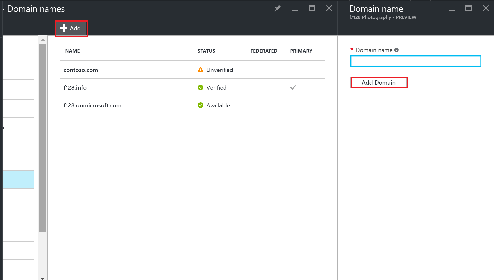
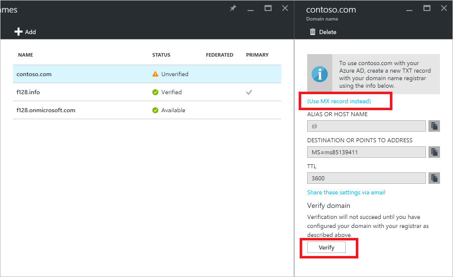

<properties
    pageTitle="Hinzufügen von Ihren benutzerdefinierten Domänennamen zu Azure Active Directory-Vorschau | Microsoft Azure"
    description="Wie Azure Active Directory Ihres Unternehmens Domänennamen hinzugefügt, und wie Sie den Namen der Domäne überprüfen."
    services="active-directory"
    documentationCenter=""
    authors="jeffsta"
    manager="femila"
    editor=""/>

<tags
    ms.service="active-directory"
    ms.workload="identity"
    ms.tgt_pltfrm="na"
    ms.devlang="na"
    ms.topic="article"
    ms.date="10/17/2016"
    ms.author="curtand"/>

# Fügen Sie einen benutzerdefinierten Domänennamen zu Azure Active Directory-Vorschau

> [AZURE.SELECTOR]
- [Azure-portal](active-directory-domains-add-azure-portal.md)
- [Azure klassischen-portal](active-directory-add-domain.md)

Sie besitzen ein oder mehrere Domänennamen, die Ihre Organisation verwendet, um eine Geschäftsbeziehung unterhalten, und Ihre Benutzer melden Sie sich mit dem Unternehmensnetzwerk mit Ihrem Domänennamen Ihres Unternehmens. Vorschau Azure Active Directory (Azure AD) können Sie Ihren Domänennamen Ihres Unternehmens zu Azure AD ebenfalls hinzufügen. [Was ist in der Vorschau?](active-directory-preview-explainer.md) Dies können Sie Benutzernamen im Verzeichnis zuweisen, die an die Benutzer, vertraut, z. B. sind ‘alice@contoso.com.’ der Vorgang ist einfach:

1. Hinzufügen des benutzerdefinierten Domänennamens zum Verzeichnis
2. Hinzufügen eines DNS-Eintrags für den Namen der Domäne bei der domänenregistrierungsstelle
3. Überprüfen Sie den benutzerdefinierten Domänennamen in Azure Active Directory

## Wie füge ich einen Domänennamen?

1.  Melden Sie sich mit dem [Azure-Portal](https://portal.azure.com) mit einem Konto, eines globalen Administrators für das Verzeichnis ist.

2.  Wählen Sie **Weitere Dienste**aus, geben Sie **Azure Active Directory** in das Textfeld ein, und wählen Sie dann die **EINGABETASTE**.

    

3. Wählen Sie auf der ***Name des Verzeichnisses*** Blade **Domänennamen**ein.

4. Wählen Sie auf das Blade ** *Directory-Name* - Domänennamen** den Befehl **Hinzufügen** aus.

  

5. Klicken Sie auf den **Domänennamen** Blade Geben Sie den Namen Ihrer benutzerdefinierten Domäne in das Feld, beispielsweise "contoso.com", und wählen Sie dann auf **Domäne hinzufügen**. Achten Sie darauf, dass die. com-, .NET- oder andere Erweiterung auf oberster Ebene aufnehmen möchten.

6. Der ***Domänenname*** Blade (d. h., das Blade, das geöffnet wird, die Ihren neuen Domänennamen in dem Titel enthält), können Sie die DNS-Einträge zu, der Azure AD verwendet werden, um sicherzustellen, dass Ihre Organisation den benutzerdefinierten Domänennamen besitzt.

  

Jetzt, da Sie den Namen der Domäne hinzugefügt haben, muss im Besitz der Organisation den Namen der Domäne Azure AD überprüfen. Bevor diese Überprüfung Azure AD ausgeführt werden kann, müssen Sie einen DNS-Eintrag in der DNS-Zonendatei für den Namen der Domäne hinzufügen. Diese Aufgabe wird der Website für Domänennamen-Registrierungsstelle für den Namen der Domäne durchgeführt.

## Fügen Sie bei der domänenregistrierungsstelle für die Domäne den DNS-Eintrag hinzu

Im nächsten Schritt zur Verwendung von Ihren benutzerdefinierten Domänennamen mit Azure AD wird die DNS-Zonendatei für die Domäne aktualisieren. Dadurch Azure AD, um sicherzustellen, dass Ihre Organisation den benutzerdefinierten Domänennamen zugegriffen werden.

1.  Melden Sie sich an den Domänennamen-Registrierungsstelle für die Domäne aus. Wenn Sie Zugriff auf den DNS-Eintrag aktualisieren besitzen, bitten Sie die Person oder ein Team, hat dieses Access Schritt 2 ausführen und, damit Sie wissen, wenn es abgeschlossen ist.

2.  Aktualisieren der DNS-Zonendatei für die Domäne durch den DNS-Eintrag enthalten, das Sie von Azure AD hinzufügen. Dieser DNS-Eintrag ermöglicht Azure AD Ihre Besitzrechte für die Domäne überprüft. Der DNS-Eintrag ändern keine Verhaltensweisen wie e-Mail-Weiterleitung oder Bereitstellung auf einem Webserver.

Hilfe zu dieser den DNS-Eintrag hinzufügen finden Sie unter [Anweisungen zum Hinzufügen eines DNS-Eintrags bei beliebte DNS-Registrierungsstelle](https://support.office.com/article/Create-DNS-records-for-Office-365-when-you-manage-your-DNS-records-b0f3fdca-8a80-4e8e-9ef3-61e8a2a9ab23/)

## Überprüfen Sie den Domänennamen mit Azure AD-

Nachdem Sie den DNS-Eintrag hinzugefügt haben, sind Sie bereit sind, überprüfen Sie den Domänennamen mit Azure AD-.

Erst die DNS-Einträge weitergegeben wurden, kann ein Domänennamen überprüft werden. Diese Verteilung häufig dauert nur wenige Sekunden, aber können manchmal nehmen eine Stunde oder mehr. Wenn die Überprüfung erste Mal nicht funktioniert, versuchen Sie es erneut.

1.  Melden Sie sich mit dem [Azure-Portal](https://portal.azure.com) mit einem Konto, eines globalen Administrators für das Verzeichnis ist.

2.  Wählen Sie **Durchsuchen**, geben Sie User Management in das Textfeld ein, und wählen Sie dann die **EINGABETASTE**.

    

3. Wählen Sie auf der Blade **User Management - Domänennamen** , den Sie überprüfen möchten nicht überprüft Domänennamen aus.

4. Wählen Sie in der ***Domänenname*** Blade (d. h., das Blade, das geöffnet wird, die Ihren neuen Domänennamen in dem Titel enthält), **Überprüfen** , um die Überprüfung abzuschließen.

Jetzt können Sie [die Namen der Benutzer, die Ihren benutzerdefinierten Domänennamen enthalten, zuweisen](active-directory-users-create-azure-portal.md).

## Behandlung von Problemen

Wenn Sie einen benutzerdefinierten Domänennamen nicht überprüfen können, versuchen Sie Folgendes. Wir verwenden die am häufigsten verwendeten und nach unten zu den wenigsten allgemeinen arbeiten.

1.  **Warten Sie eine Stunde**. DNS-Einträge müssen zum Verteilen, bevor Azure AD die Domäne überprüft werden kann. Dies kann eine Stunde oder länger dauern.

2.  **Sicherstellen, dass der DNS-Eintrag eingegeben wurde, und es korrekt sind**. Führen Sie diesen Schritt bei der Website, für die domänenregistrierungsstelle für die Domäne. Azure AD kann den Domänennamen nicht überprüfen, falls der DNS-Eintrag nicht in der DNS-Zonendatei vorhanden ist, oder wenn es sich nicht um eine genaue Übereinstimmung mit den DNS-Eintrag ist die Azure AD. Wenn Sie keinen Zugriff auf DNS-Einträge für die Domäne auf den Domänennamen-Registrierungsstelle aktualisieren Teilen Sie den DNS-Eintrag mit der Person oder ein Team in Ihrer Organisation, die diese zugreifen können, und bitten Sie den DNS-Eintrag hinzufügen.

3.  **Löschen Sie den Domänennamen aus einem anderen Verzeichnis in Azure Active Directory**. Ein Domänennamen kann in nur ein einzelnes Verzeichnis überprüft werden. Wenn Sie ein Domänennamen in einem anderen Verzeichnis zuvor überprüft wurde, müssen sie es gelöscht werden, bevor sie in Ihrem neuen Verzeichnis überprüft werden kann. Weitere Informationen zum Löschen von Domänennamen, lesen Sie [Verwalten benutzerdefinierten Domänennamen](active-directory-domains-manage-azure-portal.md)ein.    

## Fügen Sie weitere benutzerdefinierten Domänennamen

Wenn Ihre Organisation mehrere benutzerdefinierten Domänennamen, wie etwa 'contoso.com' und 'contosobank.com', verwendet, können Sie diese bis zu einem Maximum von 900 Domänennamen hinzufügen. Verwenden Sie die gleichen Schritte in diesem Artikel jeder mit den Domänennamen Ihrer hinzufügen.

## Nächste Schritte

[Verwalten von benutzerdefinierten Domänennamen](active-directory-domains-manage-azure-portal.md)
