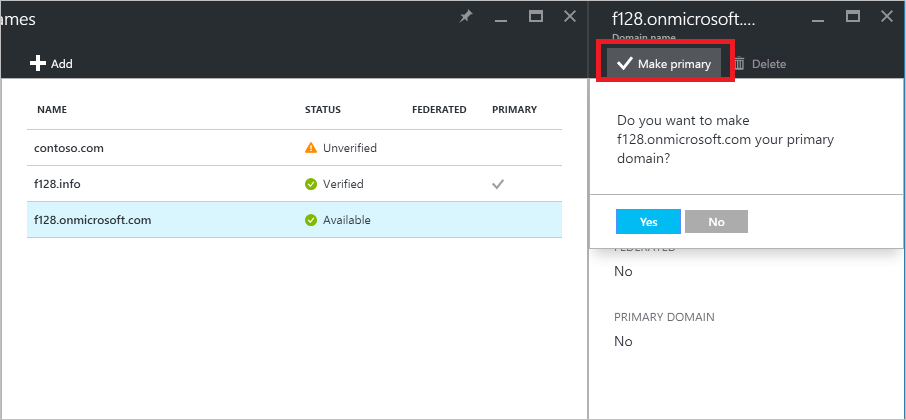

<properties
    pageTitle="Verwalten von benutzerdefinierten Domänennamen in der Vorschau Azure Active Directory | Microsoft Azure"
    description="Konzepte und Vorgehensweisen für die Verwaltung von Domänennamen in Azure Active Directory"
    services="active-directory"
    documentationCenter=""
    authors="jeffsta"
    manager="femila"
    editor=""/>

<tags
    ms.service="active-directory"
    ms.workload="identity"
    ms.tgt_pltfrm="na"
    ms.devlang="na"
    ms.topic="article"
    ms.date="09/12/2016"
    ms.author="curtand;jeffsta"/>

# Verwalten von benutzerdefinierten Domänennamen in der Vorschau Azure Active Directory

Ein Domänennamen ist ein wichtiger Teil des Bezeichners für viele Directory Ressourcen: Es ist Teil einer Benutzernamen oder e-Mail-Adresse für einen Benutzer, einen Teil der Adresse für eine Gruppe, und kann Bestandteil der app-ID-URI für eine Anwendung. Eine Ressource in der Vorschau Azure Active Directory (Azure AD) kann einen Domänennamen enthalten, der bereits sichergestellt ist, dass das Verzeichnis gehören, die die Ressource enthält. [Was ist in der Vorschau?](active-directory-preview-explainer.md) Nur globale Administratoren kann Verwaltungsaufgaben für die Domäne in Azure AD ausführen.

## Festlegen des primären Domänennamens für Ihre Azure AD-Verzeichnis

Wenn Ihr Verzeichnis erstellt wurde, wird der ursprünglichen Domänennamen, wie z. B. 'contoso.onmicrosoft.com', auch des primären Domänennamens. Die primäre Domäne ist dem Standarddomänennamen für einen neuen Benutzer aus, wenn Sie einen neuen Benutzer erstellen. Optimiert die Aktualisierungsprozess für ein Administrator zum Erstellen neuer Benutzer im Portal. So ändern Sie den Namen der primäre Domäne

1.  Melden Sie sich mit dem [Azure-Portal](https://portal.azure.com) mit einem Konto, eines globalen Administrators für das Verzeichnis ist.

2.  Wählen Sie **Weitere Dienste**aus, geben Sie **Azure Active Directory** in das Textfeld ein, und wählen Sie dann die **EINGABETASTE**.

    

3. Wählen Sie auf der ***Name des Verzeichnisses*** Blade **Domänennamen**ein.

4. Wählen Sie in der Blade ** *Directory-Name* - Domänennamen** den Domänennamen, den Sie den Namen für die primäre Domäne zu machen möchten.

5.  Wählen Sie in der ***Domänenname*** Blade (d. h., das Blade, das geöffnet wird, die Ihren neuen Domänennamen in dem Titel enthält), **Stellen Sie primäre** Befehl ein. Bestätigen Sie Ihrer Wahl, wenn Sie dazu aufgefordert werden.

    

Sie können Ändern des primären Domänennamens für Ihr Verzeichnis alle überprüft benutzerdefinierte Domäne sein, die keine partnerverbundkontakte hinzugefügt wird. Ändern die primäre Domäne für Ihr Verzeichnis ändert sich nicht auf den Namen der Benutzer für alle vorhandenen Benutzer aus.

## Hinzufügen von benutzerdefinierten Domänennamen zu Ihrer Azure AD

Sie können bis zu 900 benutzerdefinierten Domänennamen jedes Azure AD-Verzeichnis hinzufügen. Der Vorgang zum [Hinzufügen eines weiteren benutzerdefinierten Domänennamens](active-directory-domains-add-azure-portal.md) ist für den ersten benutzerdefinierten Domänennamen.

## Hinzufügen einer benutzerdefinierten Domäne Unterdomänen

Wenn Sie einen Domänennamen auf dritter Ebene wie "europe.contoso.com" zum Verzeichnis hinzufügen möchten, sollten Sie zuerst hinzufügen und überprüfen die Domäne zweiter Ebene, wie etwa "contoso.com". Die Unterdomäne wird automatisch von Azure AD überprüft werden. Aktualisieren Sie die Seite im Browser, die die Domänen Listen, um anzuzeigen, dass die Unterdomäne, die Sie soeben hinzugefügt haben, überprüft wurden.

## Was zu tun ist, wenn Sie die DNS-Registrierungsstelle für Ihren benutzerdefinierten Domänennamen ändern

Wenn Sie die DNS-Registrierungsstelle für Ihren benutzerdefinierten Domänennamen ändern, können Sie weiterhin Ihre benutzerdefinierten Domänennamen mit Azure AD selbst ohne Unterbrechung und ohne zusätzliche Konfigurationsaufgaben verwenden. Wenn Sie Ihren benutzerdefinierten Domänennamen mit Office 365 verwenden, finden Sie in der Dokumentation Dienste Intune oder andere Dienste, die auf benutzerdefinierten Domänennamen in Azure AD aufsetzen.

## Löschen Sie einen benutzerdefinierten Domänennamen

Sie können einen benutzerdefinierten Domänennamen aus Ihrer Azure Active Directory löschen, wenn Ihre Organisation nicht mehr diesen Domänennamen verwendet, oder wenn Sie diesen Domänennamen mit einem anderen Azure AD verwenden müssen.

Wenn Sie um einen benutzerdefinierten Domänennamen zu löschen, müssen Sie zunächst sicherstellen, dass keine Ressourcen in Ihrem Verzeichnis auf den Namen der Domäne verlassen. Sie können keinen Domänennamen aus Ihrem Verzeichnis löschen, wenn:

-   Jeder Benutzer hat einen Benutzernamen, e-Mail-Adresse oder Proxyadresse, die den Domänennamen einschließt.

-   Jede Gruppe verfügt über eine e-Mail-Adresse oder Proxyadresse, die den Domänennamen einschließt.

-   Jeder Anwendung in Ihrer Azure AD weist eine app URI-ID, die den Domänennamen einschließt.

Sie müssen ändern oder Löschen von Ressource dieser Art in Ihrem Verzeichnis Azure AD-, bevor Sie den benutzerdefinierten Domänennamen löschen können.

## Verwenden von PowerShell oder Graph-API zum Verwalten von Domänennamen

Die meisten Verwaltungsaufgaben für Domänennamen in Azure Active Directory können auch noch abgeschlossen werden müssen, verwenden Microsoft PowerShell oder programmgesteuert mithilfe von Azure AD Graph-API (im öffentlichen Preview).

-   [Mithilfe der PowerShell Domänennamen in Azure AD verwalten](https://msdn.microsoft.com/library/azure/e1ef403f-3347-4409-8f46-d72dafa116e0#BKMK_ManageDomains)

-   [Verwenden zum Verwalten von Domänennamen in Azure AD Graph-API](https://msdn.microsoft.com/Library/Azure/Ad/Graph/api/domains-operations)

## Nächste Schritte

-   [Hinzufügen von benutzerdefinierten Domänennamen](active-directory-domains-add-azure-portal.md)
