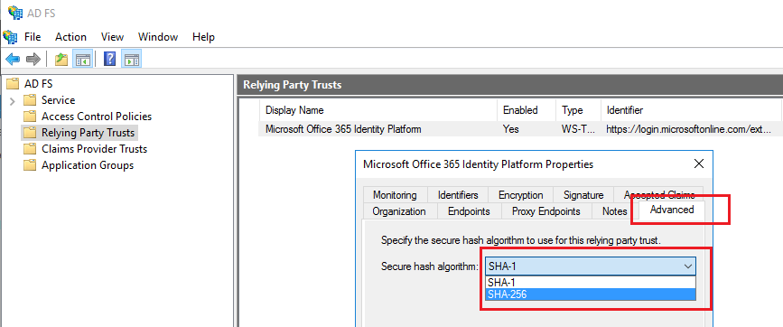

<properties
    pageTitle="Änderung Signatur Hashalgorithmus für Office 365 die Antwort Partei Trust | Microsoft Azure"
    description="Diese Seite enthält Richtlinien für das Ändern von SHA Algorithmus für Föderation Trust mit Office 365"
    keywords="SHA1, SHA256, O365, Partnerverbund, Aadconnect, Adfs, Ad fs, Sha ändern, Föderation Trust, Partei Trust verlassen"
    services="active-directory"
    documentationCenter=""
    authors="anandyadavmsft"
    manager="samueld"
    editor=""/>

<tags
    ms.service="active-directory"
    ms.workload="identity"
    ms.tgt_pltfrm="na"
    ms.devlang="na"
    ms.topic="article"
    ms.date="08/01/2016"
    ms.author="anandy"/>

# Ändern der Signatur Hashalgorithmus für Office 365 Trust Partei Antworten

## (Übersicht)

Azure Active Directory Federation Services (AD FS) meldet seine Token mit Microsoft Azure Active Directory um sicherzustellen, dass er manipuliert werden können. Diese Signatur kann auf SHA1 oder SHA256 basieren. Azure-Active Directory unterstützt jetzt Token mit einem Algorithmus SHA256 angemeldet, und es wird empfohlen, den Algorithmus Token Signieren SHA256 für die höchste Sicherheitsstufe Einstellung. In diesem Artikel werden die Schritte zum Signieren von Token Algorithmus der sicherer SHA256 Ebene festlegen.

## Ändern der Algorithmus Token signieren

Nachdem Sie den Algorithmus der Signatur mit einer der folgenden zwei Prozesse festgelegt haben, meldet AD FS im Token für Office 365 Partei Trust mit SHA256 verlassen. Sie müssen keine zusätzliche Konfiguration Änderungen vornehmen, und diese Änderung hat keine Auswirkung auf Ihren Zugriff auf Office 365 oder einer anderen Anwendung Azure AD-.

### AD FS-Verwaltungskonsole

1. Öffnen Sie die AD FS-Verwaltungskonsole auf dem primären ADFS-Server.
2. Erweitern Sie den AD FS-Knoten, und klicken Sie auf **Vertrauen verlassen**.
3. Mit der rechten Maustaste in Ihr Office 365/Azure sich verlassen Partei vertrauen, und wählen Sie **Eigenschaften**aus.
4. Wählen Sie die Registerkarte **Erweitert** , und wählen Sie den sicheren Hashalgorithmus SHA256.
5. Klicken Sie auf **OK**.

### AD FS-PowerShell-cmdlets

1. Öffnen Sie auf einem beliebigen Server AD FS PowerShell unter Administratorrechte.
2. Legen Sie den sicheren Hashalgorithmus mithilfe des Cmdlets **Set-AdfsRelyingPartyTrust** aus.

 <code>Set-AdfsRelyingPartyTrust -TargetName 'Microsoft Office 365 Identity Platform' -SignatureAlgorithm 'http://www.w3.org/2001/04/xmldsig-more#rsa-sha256'</code>

## Lesen Sie auch

* [Reparieren von Office 365 Trust mit Azure AD-verbinden](./active-directory-aadconnect-federation-management.md#repairing-the-trust)
