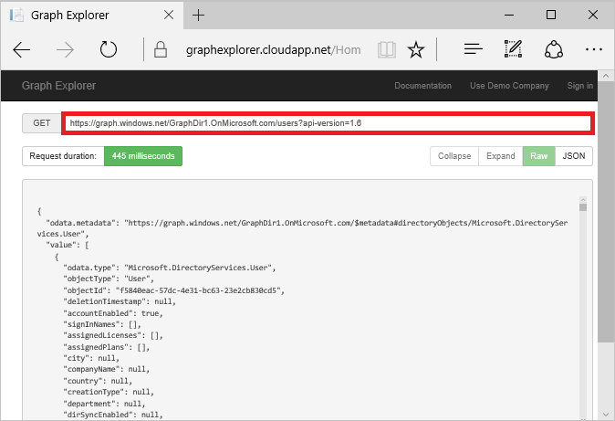

<properties
   pageTitle="Schnellstart für das Azure AD-Diagramm API | Microsoft Aure"
   description="Die Azure Active Directory Graph-API bietet programmgesteuerten Zugriff auf Azure AD über OData REST-API Endpunkte. Applikationen können mithilfe der Graph-API ausführen erstellen, lesen, aktualisieren und löschen Sie Vorgänge wie Directory-Daten und Objekte."
   services="active-directory"
   documentationCenter="n/a"
   authors="PatAltimore"
   manager="mbaldwin"
   editor=""
   tags=""/>


   <tags
      ms.service="active-directory"
      ms.devlang="na"
      ms.topic="article"
      ms.tgt_pltfrm="na"
      ms.workload="identity"
      ms.date="09/16/2016"
      ms.author="patricka"/>

# <a name="quickstart-for-the-azure-ad-graph-api"></a>Schnellstart für das Azure AD-Diagramm API

Die Azure Active Directory (AD) Graph-API bietet programmgesteuerten Zugriff auf Azure AD über OData REST-API Endpunkte. Applikationen können mithilfe der Graph-API ausführen erstellen, lesen, aktualisieren und löschen Sie Vorgänge wie Directory-Daten und Objekte. Beispielsweise können Sie die Graph-API verwenden, um einen neuen Benutzer erstellen, anzeigen oder aktualisieren die Eigenschaften des Benutzers, Benutzerkennworts ändern, Gruppenmitgliedschaft für rollenbasierte Zugriff aktivieren, deaktivieren oder löschen Sie den Benutzer. Weitere Informationen zu den Graph-API-Funktionen und die Anwendungsszenarien finden Sie unter [Azure AD Graph-API](https://msdn.microsoft.com/Library/Azure/Ad/Graph/api/api-catalog) und [Azure AD Graph-API erforderliche Komponenten](https://msdn.microsoft.com/library/hh974476.aspx). 

> [AZURE.IMPORTANT] Azure AD-Graph-API Funktionalität steht auch über [Microsoft Graph](https://graph.microsoft.io/), eine einheitliche API, die APIs von anderen Microsoft-Diensten, wie etwa OneDrive, Outlook, OneNote, Planer und Office Graph an, der Zugriff über einen einzelnen Endpunkt und mit einem einzelnen Token enthält.

## <a name="how-to-construct-a-graph-api-url"></a>Zum Erstellen einer Graph-API-URL

In Graph-API können Sie den Zugriff auf Directory-Daten und Objekte (Zählung ausnehmen, Ressourcen oder Einheiten), anhand, die Sie Vorgänge, durchführen möchten, URLs basierend auf dem Open Data (OData)-Protokoll verwenden. In Graph-API verwendeten URLs bestehen aus vier Hauptteilen: service Root, Mandanten Bezeichner, Ressourcenpfad und Zeichenfolge Abfrageoptionen: `https://graph.windows.net/{tenant-identifier}/{resource-path}?[query-parameters]`. Beispiel: die folgenden URL: `https://graph.windows.net/contoso.com/groups?api-version=1.6`.

- **Dienst**: In Azure AD-Graph-API ist der Stammwebsitesammlung Dienst immer https://graph.windows.net.
- **Bezeichner des Mandanten**: Dies kann einen überprüft (registrierten) Domänennamen im Beispiel oben "contoso.com" sein. Sie können auch einen Mandanten Objekt-ID oder den "Myorganiztion" oder "ich" alias sein. Weitere Informationen finden Sie unter [adressieren-Einheiten und Vorgänge in der Graph-API](https://msdn.microsoft.com/Library/Azure/Ad/Graph/howto/azure-ad-graph-api-operations-overview)).
- **Pfad Ressource**: in diesem Abschnitt einer URL identifiziert die Ressource aus, um ein interaktives mit (Benutzer, Gruppen, einen bestimmten Benutzer oder eine bestimmte Gruppe usw.) Im Beispiel oben ist es auf oberster Ebene "Gruppen" Adresse, die Ressource festgelegt. Sie können auch eine bestimmte Entität, Adresse, beispielsweise "Benutzer / {ObjectId}" oder "Benutzer/UserPrincipalName".
- **Abfrageparameter**:? trennt Abschnitt Pfad Ressourcen aus dem Abschnitt der Abfrage Parameter. Der Abfrageparameter "api-Version" ist für alle Besprechungsanfragen in der Graph-API erforderlich. Die Graph-API unterstützt auch die folgenden Optionen des OData-Abfrage: **$filter**, **$orderby**, **$Erweitern**, **$top**und **$format**. Die folgende Abfrageoptionen werden nicht unterstützt: **$count**, **$inlinecount**und **$skip**. Weitere Informationen finden Sie unter [unterstützte Abfragen, Filter und Paging Optionen in Azure AD Graph-API](https://msdn.microsoft.com/Library/Azure/Ad/Graph/howto/azure-ad-graph-api-supported-queries-filters-and-paging-options).

## <a name="graph-api-versions"></a>Diagramm-API-Versionen

Sie geben Sie die Version für die Anforderung einer Graph-API in der Abfrageparameter "api-Version". Für Version 1.5 oder höher verwenden Sie einen numerischen Versionswert an. API-Version 1.6 =. Für frühere Versionen verwenden Sie eine Datumszeichenfolge, die in das Format JJJJ-MM-TT hält; beispielsweise api Version 2013-11-08 =. Verwenden Sie für Preview-Features die Zeichenfolge "Beta"; beispielsweise api Version Beta =. Weitere Informationen zu den Unterschieden zwischen Versionen Graph-API finden Sie unter [Azure AD Graph-API Versioning](https://msdn.microsoft.com/Library/Azure/Ad/Graph/howto/azure-ad-graph-api-versioning).

## <a name="graph-api-metadata"></a>API-Graph-Metadaten

-API Graph-Metadaten-Datei zurückzukehren, fügen Sie das Segment "$metadata" nach den Mandanten Bezeichner enthält im Beispiel-URL für, gibt die folgende URL Metadaten für das Demounternehmen das Graph-Explorer verwendet: `https://graph.windows.net/GraphDir1.OnMicrosoft.com/$metadata?api-version=1.6`. Sie können diese URL in der Adressleiste eines Webbrowsers auf die Metadaten finden Sie unter eingeben. Das CSDL-Metadaten-Dokument zurückgegeben werden die Elemente und komplexe Typen, deren Eigenschaften, und die Funktionen und Aktionen, die von der Version von Graph-API angeforderte verfügbar gemacht werden. Der api-Version-Parameter ausgelassen wird die Metadaten für die neueste Version zurück.

## <a name="common-queries"></a>Allgemeine Abfragen

[Azure AD Graph-API allgemeine Abfragen](https://msdn.microsoft.com/Library/Azure/Ad/Graph/howto/azure-ad-graph-api-supported-queries-filters-and-paging-options#CommonQueries) Listen allgemeine Abfragen, die mit dem Azure AD-Diagramm, einschließlich Abfragen, die zum Zugreifen auf oberster Ebene Ressourcen in Ihrem Verzeichnis verwendet werden können und Abfragen auszuführende Vorgänge in Ihrem Verzeichnis verwendet werden können.

Beispielsweise `https://graph.windows.net/contoso.com/tenantDetails?api-version=1.6` gibt Unternehmensinformationen für Verzeichnis "contoso.com".

Oder `https://graph.windows.net/contoso.com/users?api-version=1.6` Listet alle Benutzerobjekte in dem Verzeichnis "contoso.com".

## <a name="using-the-graph-explorer"></a>Mithilfe des Graph-Explorers

Der Graph-Explorer für die Azure AD Graph-API können Sie die Daten Directory Abfragen während der Erstellung der Anwendung.

> [AZURE.IMPORTANT] Schreiben oder Löschen von Daten aus einem Verzeichnis unterstützt der Graph-Explorer nicht. Sie können nur gelesen Vorgänge in Ihrem Verzeichnis Azure AD-mit dem Diagramm-Explorer ausführen.

Im folgenden finden Sie die Ausgabe würde finden Sie unter würden Sie navigieren Sie zu der Graph-Explorer, wählen Sie die Demo Unternehmen verwenden, und geben Sie `https://graph.windows.net/GraphDir1.OnMicrosoft.com/users?api-version=1.6` zur Anzeige aller Benutzer im Verzeichnis Demo:



**Laden Sie das Graph-Explorer**: Navigieren Sie zu [https://graphexplorer.cloudapp.net/](https://graphexplorer.cloudapp.net/), um das Tool zu laden. Klicken Sie auf **Die Demo Unternehmen verwenden** , um das Graph-Explorer für Daten von einem Mandanten Stichprobe auszuführen. Anmeldeinformationen mit der Demounternehmen benötigen nicht. Alternativ können Sie klicken Sie auf **Anmelden** und melden Sie sich mit Ihrer Anmeldeinformationen Azure AD-Graph-Explorer für Ihre Mandanten ausführen. Wenn Sie anhand Ihrer eigenen Mandanten Graph-Explorer ausführen, müssen Sie oder Ihr Administrator bei der Anmeldung Zustimmung. Wenn Sie ein Office 365-Abonnement besitzen, haben Sie automatisch einem Azure AD-Mandanten. Sind die Anmeldeinformationen, die Sie zum Anmelden bei Office 365 verwenden, wirklich, Azure AD-Konten, und Sie können diese Anmeldeinformationen mit Graph-Explorer.

**Ausführen einer Abfrage**: zum Ausführen einer Abfrage, geben Sie Ihre Abfrage in das Textfeld Anforderung, und klicken Sie auf die **erste** , oder klicken Sie auf die **EINGABETASTE** . Die Ergebnisse werden im Feld Antwort angezeigt. Beispielsweise `https://graph.windows.net/graphdir1.onmicrosoft.com /groups?api-version=1.6` wird eine Liste aller Gruppenobjekte im Verzeichnis Demo.

Beachten Sie die folgenden Features und Schwächen der Graph-Explorer ein:
- AutoVervollständigen-Funktion auf Ressourcen legt fest. Um dies zu sehen, klicken Sie auf **Die Demo Unternehmen verwenden** , und klicken Sie dann auf das Textfeld Anforderung (Stelle, an der die URL des Unternehmens angezeigt wird). Sie können eine Ressource aus der Dropdownliste festlegen auswählen.

- Unterstützt die "ich" und "MeineOrganisation" Adressieren Aliases. Beispielsweise können Sie `https://graph.windows.net/me?api-version=1.6` , um das Objekt des Benutzers angemeldet zurückzukehren oder `https://graph.windows.net/myorganization/users?api-version=1.6` , um alle Benutzer in der aktuellen Verzeichnisses zurückzukehren. Beachten Sie, dass einen Fehler using-alias "ich" für das Demounternehmen zurückgegeben werden, da kein die Anforderung ausführenden Benutzer angemeldet ist.

- Eine Antwort Kopfzeilen Abschnitt. Dies kann helfen Beheben von beim Ausführen von Abfragen Problemen verwendet werden.

- Ein JSON-Viewer für die Antwort mit Funktionen erweitern und reduzieren.

- Keine Unterstützung für die Anzeige einer Miniaturansicht des Fotos.

## <a name="using-fiddler-to-write-to-the-directory"></a>Verwenden von Fiddler sowie das Schreiben in Verzeichnis

Im Sinne dieses Schnellstarthandbuch können Fiddler Web Debugger Sie damit ausführen 'Schreiben' Operationen gegen Sie üben Azure AD-Verzeichnis. Weitere Informationen und Fiddler installieren finden Sie unter [http://www.telerik.com/fiddler](http://www.telerik.com/fiddler).

Im folgenden Beispiel werden Sie Fiddler Web Debugger verwenden, um eine neue Sicherheitsgruppe 'MyTestGroup' in Ihrem Verzeichnis Azure AD-erstellen.

**Besorgen Sie sich eine Access-Token**: für den Zugriff auf Azure AD Graph Clients für Azure AD zuerst authentifiziert erforderlich sind. Weitere Informationen finden Sie unter [Authentifizierungsszenarien Azure AD](active-directory-authentication-scenarios.md).

**Verfassen und Ausführen einer Abfrage**: die folgenden Schritte aus.

1. Öffnen Sie Fiddler Web Debugger, und wechseln Sie zur Registerkarte **Composer** .
2. Da Sie eine neue Sicherheitsgruppe erstellen möchten, wählen Sie als die HTTP-Methode aus dem Dropdownmenü **Bereitstellen** . Weitere Informationen zu Vorgängen und Berechtigungen eines Gruppenobjekts finden Sie unter [Gruppe](https://msdn.microsoft.com/Library/Azure/Ad/Graph/api/entity-and-complex-type-reference#GroupEntity) innerhalb der [Azure AD Graph REST-API-Referenz](https://msdn.microsoft.com/Library/Azure/Ad/Graph/api/api-catalog).
3. Geben Sie in das Feld neben dem **Beitrag**, in die folgenden Zeichen als die Anfrage-URL: `https://graph.windows.net/mytenantdomain/groups?api-version=1.6`.

    > [AZURE.NOTE] Sie müssen mit dem Domänennamen Ihres eigenen Azure AD-Verzeichnisses Mytenantdomain einsetzen.

4. Geben Sie im Feld direkt unter dem Beitrag Drop-Down-Folgendes ein:

    ```
Host: graph.windows.net
Authorization: your access token
Content-Type: application/json
```

    > [AZURE.NOTE] Wechseln der &lt;Ihrer Access-Token&gt; mit dem Access-Token für Ihr Azure AD-Verzeichnis.

5. Geben Sie im Feld **Textkörper anfordern** Folgendes ein:

    ```
        {
            "displayName":"MyTestGroup",
            "mailNickname":"MyTestGroup",
            "mailEnabled":"false",
            "securityEnabled": true
        }
```

    Weitere Informationen zum Erstellen von Gruppen finden Sie unter [Erstellen von Gruppen](https://msdn.microsoft.com/Library/Azure/Ad/Graph/api/groups-operations#CreateGroup).

Weitere Informationen zum Azure AD--Einheiten und Datentypen, die von Graph verfügbar gemacht werden und Informationen über die Vorgänge, die für diese mit Graph ausgeführt werden können, finden Sie unter [Azure AD Graph REST-API-Referenz](https://msdn.microsoft.com/Library/Azure/Ad/Graph/api/api-catalog).

## <a name="next-steps"></a>Nächste Schritte

- Erfahren Sie mehr über die [Azure AD Graph-API](https://msdn.microsoft.com/Library/Azure/Ad/Graph/api/api-catalog)
- Weitere Informationen zu [Azure AD Graph-API Berechtigung Bereiche](https://msdn.microsoft.com/Library/Azure/Ad/Graph/howto/azure-ad-graph-api-permission-scopes)
