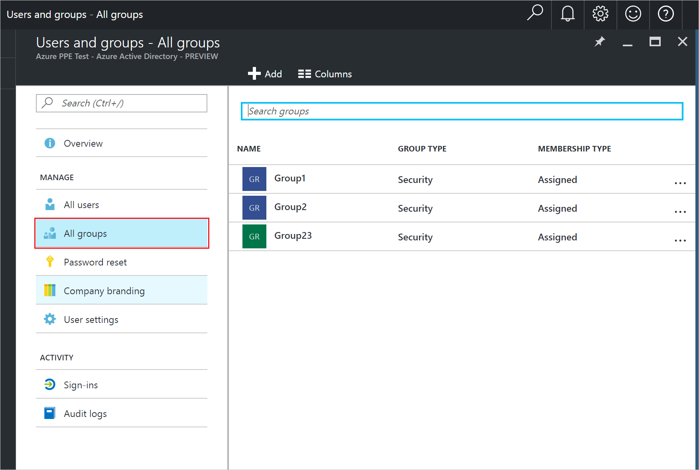
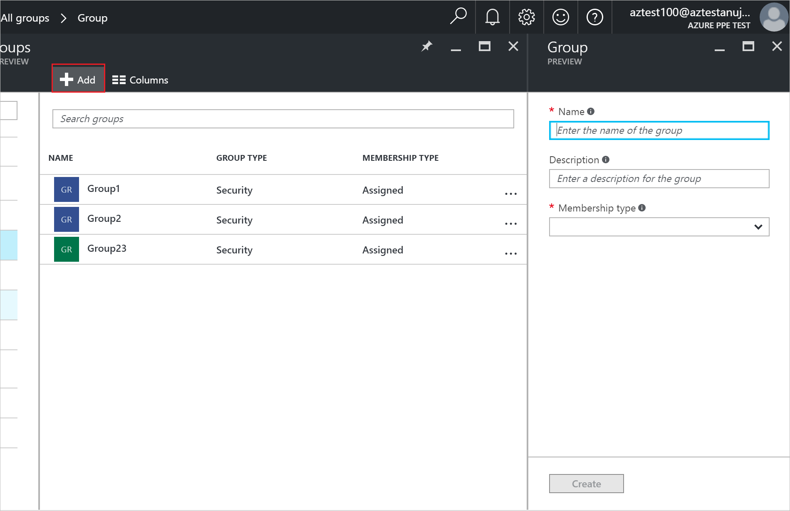
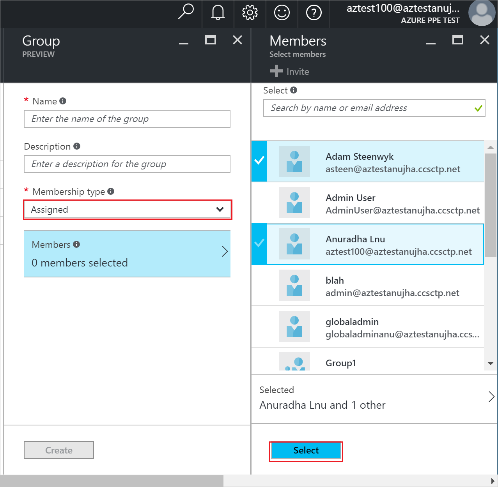
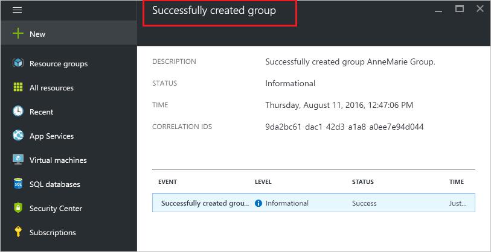

<properties
    pageTitle="Erstellen einer neuen Gruppe in Azure Active Directory-Vorschau | Microsoft Azure"
    description="So erstellen Sie eine Gruppe in Azure Active Directory und Benutzer (Mitglieder) zur Gruppe hinzufügen"
    services="active-directory"
    documentationCenter=""
    authors="curtand"
    manager="femila"
    editor=""/>

<tags
    ms.service="active-directory"
    ms.workload="identity"
    ms.tgt_pltfrm="na"
    ms.devlang="na"
    ms.topic="article"
    ms.date="10/17/2016"
    ms.author="curtand"/>

# Erstellen einer neuen Gruppe in Azure Active Directory-Vorschau

> [AZURE.SELECTOR]
- [Azure-portal](active-directory-groups-create-azure-portal.md)
- [Azure klassischen-portal](active-directory-accessmanagement-manage-groups.md)
- [PowerShell](active-directory-accessmanagement-groups-settings-v2-cmdlets.md)

In diesem Artikel wird erläutert, wie erstellen und Füllen einer neuen Gruppe in der Vorschau Azure Active Directory (Azure AD). [Was ist in der Vorschau?](active-directory-preview-explainer.md) Verwenden Sie eine Gruppe wie z. B. das Zuweisen von Lizenzen oder die Berechtigungen auf eine Anzahl von Benutzern oder Geräten auf einmal ausführen.

## Wie erstelle ich eine Gruppe?

1. Melden Sie sich mit dem [Azure-Portal](https://portal.azure.com) mit einem Konto, eines globalen Administrators für das Verzeichnis ist.

2. Wählen Sie **Weitere Dienste**aus, geben Sie **Benutzer und Gruppen** in das Textfeld ein, und wählen Sie dann die **EINGABETASTE**.

  

3. Klicken Sie auf das Blade **Benutzer und Gruppen** wählen Sie **alle Gruppen**aus.

  

4. Wählen Sie in der **Benutzer und Gruppen - alle Gruppen** Blade Befehl **Hinzufügen** aus.

  

5. Fügen Sie in der **Gruppe** Blade einen Namen und eine Beschreibung für die Gruppe ein.

6. Auswählen, um Elemente in der Gruppe hinzufügen wählen Sie im Feld **Typ Mitgliedschaft** **zugewiesen** aus, und wählen Sie dann auf **Mitglieder**. Weitere Informationen dazu, wie Sie die Zugehörigkeit zu einer Gruppe dynamisch verwalten finden Sie unter [verwenden Attribute zum Erstellen erweiterter Regeln für Gruppenmitgliedschaft](active-directory-groups-dynamic-membership-azure-portal.md).

  

5. Wählen Sie in der **Mitglieder** Blade eine oder mehrere Benutzer oder Geräte zur Gruppe hinzufügen, und wählen Sie die Schaltfläche **Wählen Sie** am unteren Rand der Blade sie zur Gruppe hinzufügen aus. Das Feld **Benutzername** filtert die Basis des Abgleichs der Eingabe, um einen beliebigen Teil eines Namens Benutzer oder Gerät anzeigen. Es werden keine Platzhalterzeichen im Feld akzeptiert.

6. Wenn Sie Mitglieder der Gruppe hinzugefügt haben, wählen Sie in der **Gruppe** Blade **Erstellen** .    

  

## Weitere Informationen

Die folgenden Artikel enthalten weitere Informationen zum Azure Active Directory.

* [Finden Sie unter vorhandene Gruppen](active-directory-groups-view-azure-portal.md)
* [Verwalten einer Gruppe](active-directory-groups-settings-azure-portal.md)
* [Verwalten von Gruppenmitgliedern](active-directory-groups-members-azure-portal.md)
* [Verwalten von Mitgliedschaften einer Gruppe](active-directory-groups-membership-azure-portal.md)
* [Verwalten von dynamischen Regeln für Benutzer in einer Gruppe](active-directory-groups-dynamic-membership-azure-portal.md)
