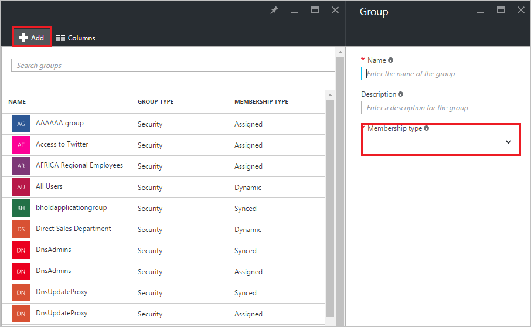
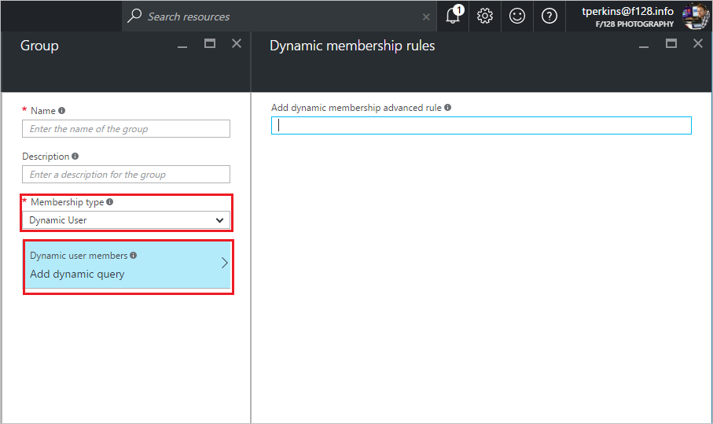

<properties
    pageTitle="Verwenden von Attributen zum Erstellen erweiterter Regeln für Gruppenmitgliedschaft in Azure Active Directory-Vorschau | Microsoft Azure"
    description="Zum Erstellen erweiterter Regeln für die dynamische Gruppenmitgliedschaft einschließlich unterstützt Regeloperatoren für Ausdrücke und Parameter."
    services="active-directory"
    documentationCenter=""
    authors="curtand"
    manager="femila"
    editor=""/>

<tags
    ms.service="active-directory"
    ms.workload="identity"
    ms.tgt_pltfrm="na"
    ms.devlang="na"
    ms.topic="article"
    ms.date="09/12/2016"
    ms.author="curtand"/>

# Verwenden von Attributen zum Erstellen erweiterter Regeln für Gruppenmitgliedschaft in Azure Active Directory-Vorschau

Azure-Portal bietet Ihnen die Möglichkeit zum Erstellen erweiterter Regeln um komplexere Attribut-basierte dynamische Mitgliedschaften für Azure Active Directory (Azure AD) Preview-Gruppen zu aktivieren. [Was ist in der Vorschau?](active-directory-preview-explainer.md) In diesem Artikel werden die Regel Attribute und die Syntax, um diese erweiterten Regeln erstellen.

## Zum Erstellen der erweiterten Regel

1.  Melden Sie sich mit dem [Azure-Portal](https://portal.azure.com) mit einem Konto, eines globalen Administrators für das Verzeichnis ist.

2.  Wählen Sie **Weitere Dienste**aus, geben Sie **Benutzer und Gruppen** in das Textfeld ein, und wählen Sie dann die **EINGABETASTE**.

  

3.  Klicken Sie auf das Blade **Benutzer und Gruppen** wählen Sie **alle Gruppen**aus.

  

4. Wählen Sie in der **Benutzer und Gruppen - alle Gruppen** Blade Befehl **Hinzufügen** aus.

  

5. Geben Sie in der **Gruppe** Blade einen Namen und eine Beschreibung für die neue Gruppe ein. Wählen Sie eine **Mitgliedschaft geben** von **Dynamischen Benutzer** oder **Dynamische Gerät**, je nachdem, ob Sie eine Regel für Benutzer oder Geräte erstellen möchten, und wählen Sie dann auf **Dynamische Abfrage hinzufügen**. Den Attributen, die für das Geräteregeln verwendet finden Sie unter [Verwenden von Attributen zum Erstellen von Regeln für Geräteobjekte](#using-attributes-to-create-rules-for-device-objects).

  

6. Geben Sie in der **dynamischen Mitgliedschaftsregeln** Blade die Regel in der Regel **Hinzufügen dynamischen Mitgliedschaft erweitert** , drücken Sie die EINGABETASTE, und wählen Sie dann **Erstellen** am unteren Rand der Blade.

7. Wählen Sie in der **Gruppe** Blade zum Erstellen der Gruppe **Erstellen** aus.

## Erstellen einer erweiterten Regel Textkörper

Die erweiterte Regel, die Sie für die dynamischen Mitgliedschaften für Gruppen erstellen können ist im Wesentlichen ein binäre Ausdruck, der besteht aus drei Teilen und in ein Ergebnis true oder false ergibt. Die drei Bereiche sind:

- Linke parameter
- Binäre operator
- Rechte Konstante

Eine vollständige erweiterte Regel sieht ungefähr wie folgt aus: (LeftParameter BinaryOperator "RightConstant"), wobei die öffnende und schließende Klammer für den gesamten binäre Ausdruck erforderlich sind, doppelte Anführungszeichen sind erforderlich, damit die richtigen Konstante und die Syntax für den linken Parameter ist user.property. Eine erweiterte Regel kann mehrere binäre Ausdrücke durch getrennt bestehen die - und, - oder, und - nicht logische Operatoren.

Es folgen Beispiele für eine ordnungsgemäß erstellter erweiterte Regel:

- (user.department - Eq "Umsatz")- oder (user.department - Eq "Marketing")
- (user.department - Eq "Umsatz")- und - nicht (user.jobTitle-enthält "SDE")

Die vollständige Liste der unterstützten Parameter und Operatoren für Ausdrücke Regel finden Sie in den folgenden Abschnitten. Den Attributen, die für das Geräteregeln verwendet finden Sie unter [Verwenden von Attributen zum Erstellen von Regeln für Geräteobjekte](#using-attributes-to-create-rules-for-device-objects).

Die Gesamtlänge der Hauptteil der erweiterten Regel darf 2048 Zeichen nicht überschreiten.

> [AZURE.NOTE]
>Zeichenfolge und Regex Vorgänge Groß-und Kleinschreibung. Sie können auch ausführen Null Prüfungen mit $null als Konstante, beispielsweise, user.department - Eq $null.
Zeichenfolgen mit Angebote "sollte mit Escapezeichen ' Zeichen, beispielsweise user.department - Eq \`"Umsatz".

## Unterstützte Ausdruck Regeloperatoren
Die folgende Tabelle enthält alle unterstützten Ausdruck Regeloperatoren und deren Syntax im Textkörper der erweiterten Regel verwendet werden:

| Operator        | Syntax         |
|-----------------|----------------|
| Ist nicht gleich      | Neuer-            |
| Gleich          | -eq            |
| Nicht beginnt mit: | -notStartsWith |
| Beginnt mit:     | StartsWith-    |
| Nicht enthält.    | -notContains   |
| Enthält        | -enthält      |
| Keine Übereinstimmung       | -notMatch      |
| Vergleich           | -entsprechen         |

## Behebung von Abfrage zurück
Die folgende Tabelle listet mögliche Fehler und zur Behebung, wenn sie auftreten

| Fehler beim Analysieren der Abfrage     | Verwendung der Fehler       | Korrigierte Verwendung             |
|-----------------------|-------------------|-----------------------------|
| Fehler: Attribut nicht unterstützt.                                      | (user.invalidProperty - Eq "Wert")       | (user.department - Eq "Wert") Eigenschaft sollte eine aus der [Eigenschaftenliste unterstützt](#supported-properties)entsprechen.                          |
| Fehler: Operator wird auf Attribut nicht unterstützt.                       | (user.accountEnabled-WAHR enthält)                                                                               | (user.accountEnabled - Eq WAHR) Eigenschaft ist des Typs Boolean. Verwenden Sie die unterstützten Operatoren (-Eq oder - neuer) für booleschen Typ in der vorstehenden Liste aus.                                                                                                                                   |
| Fehler: Fehler beim Kompilieren der Abfrage.                                      | (user.department - Eq "Umsatz")- und (user.department - Eq "Marketing")(user.userPrincipalName-match"*@domain.ext") | (user.department - Eq "Umsatz")- und (user.department - Eq "Marketing") Logische Operatoren sollte eine aus der Liste der unterstützten Eigenschaften für den oben angegebenen übereinstimmen. (user.userPrincipalName-entsprechen ".*@domain.ext")or(user.userPrincipalName -entsprechen "@domain.ext$")Error in reguläre Ausdrücke. |
| Fehler: Binäre Ausdruck ist nicht im richtigen Format.                     | (user.department – Eq "Umsatz") (user.department - Eq "Umsatz") (user.department-Eq "Umsatz")                             | (user.accountEnabled - Eq WAHR)- und (user.userPrincipalName-enthält"alias@domain") Abfrage enthält mehrere Fehler vorliegen. Klammer nicht in den richtigen Ort.                                                                                                                            |
| Fehler: Unbekannte Fehler bei dynamische Mitgliedschaften einrichten. | (user.accountEnabled - Eq "True" und user.userPrincipalName-enthält"alias@domain")                               | (user.accountEnabled - Eq WAHR)- und (user.userPrincipalName-enthält"alias@domain") Abfrage enthält mehrere Fehler vorliegen. Klammer nicht in den richtigen Ort.                                                                                                                            |

## Unterstützte Eigenschaften
Im folgenden sind alle Benutzereigenschaften, die Sie in die erweiterte Regel verwenden können:

### Eigenschaften des Typs boolean

Zulässige Operatoren

* -eq

* Neuer-

| Eigenschaften     | Zulässigen Werte  | Verwendung                          |
|----------------|-----------------|--------------------------------|
| accountEnabled | wahr falsch      | user.accountEnabled - Eq WAHR)  |
| dirSyncEnabled | wahr falsch null | (user.dirSyncEnabled - Eq WAHR) |

### Eigenschaften des Typs string

Zulässige Operatoren

* -eq

* Neuer-

* -notStartsWith

* StartsWith-

* -enthält

* -notContains

* -entsprechen

* -notMatch

| Eigenschaften                 | Zulässigen Werte                                                                                        | Verwendung                                                     |
|----------------------------|-------------------------------------------------------------------------------------------------------|-----------------------------------------------------------|
| Ort                       | Alle Zeichenfolgenwert oder $null                                                                           | (user.city - Eq "Wert")                                   |
| Land                    | Alle Zeichenfolgenwert oder $null                                                                            | (user.country - Eq "Wert")                                |
| Abteilung                 | Alle Zeichenfolgenwert oder $null                                                                          | (user.department - Eq "Wert")                             |
| displayName                | Jeder Zeichenfolgenwert, der                                                                                 | (user.displayName - Eq "Wert")                            |
| facsimileTelephoneNumber   | Alle Zeichenfolgenwert oder $null                                                                           | (user.facsimileTelephoneNumber - Eq "Wert")               |
| Vorname                  | Alle Zeichenfolgenwert oder $null                                                                           | (user.givenName - Eq "Wert")                              |
| Position                   | Alle Zeichenfolgenwert oder $null                                                                           | (user.jobTitle - Eq "Wert")                               |
| e-Mail-Nachrichten                       | Alle Zeichenfolgenwert oder $null (SMTP-Adresse des Benutzers)                                                  | (user.mail - Eq "Wert")                                   |
| mailNickName               | Alle Zeichenfolgenwert (e-Mail-Alias des Benutzers)                                                            | (user.mailNickName - Eq "Wert")                           |
| Mobile                     | Alle Zeichenfolgenwert oder $null                                                                           | (user.mobile - Eq "Wert")                                 |
| objectId                   | GUID des User-Objekts                                                                            | (user.objectId - Eq "1111111-1111-1111-1111-111111111111") |
| passwordPolicies           | Keine DisableStrongPassword DisablePasswordExpiration DisablePasswordExpiration, DisableStrongPassword |   (user.passwordPolicies - Eq "DisableStrongPassword")                                                      |
| physicalDeliveryOfficeName | Alle Zeichenfolgenwert oder $null                                                                            | (user.physicalDeliveryOfficeName - Eq "Wert")             |
| Postleitzahl                 | Alle Zeichenfolgenwert oder $null                                                                            | (user.postalCode - Eq "Wert")                             |
| preferredLanguage          | ISO 639-1-code                                                                                        | (user.preferredLanguage - Eq "En-US")                      |
| sipProxyAddress            | Alle Zeichenfolgenwert oder $null                                                                            | (user.sipProxyAddress - Eq "Wert")                        |
| Bundesstaat                      | Alle Zeichenfolgenwert oder $null                                                                            | (user.state - Eq "Wert")                                  |
| streetAddress              | Alle Zeichenfolgenwert oder $null                                                                            | (user.streetAddress - Eq "Wert")                          |
| Nachname                    | Alle Zeichenfolgenwert oder $null                                                                            | (user.surname - Eq "Wert")                                |
| telephoneNumber            | Alle Zeichenfolgenwert oder $null                                                                            | (user.telephoneNumber - Eq "Wert")                        |
| usageLocation              | Zwei nummerierte Ländercode                                                                           | (user.usageLocation - Eq "USA")                             |
| userPrincipalName          | Jeder Zeichenfolgenwert, der                                                                                     | (user.userPrincipalName - eq"alias@domain")               |
| Benutzertyp                   | Mitglied Gast $null                                                                                    | (user.userType - Eq "Element")                              |

### Eigenschaften des Typs String Websitesammlung

Zulässige Operatoren

* -enthält

* -notContains

| Poperties      | Zulässigen Werte                        | Verwendung                                                |
|----------------|---------------------------------------|------------------------------------------------------|
| otherMails     | Jeder Zeichenfolgenwert, der                      | (user.otherMails-enthält"alias@domain")           |
| proxyAddresses | SMTP: alias@domain smtp:alias@domain | (user.proxyAddresses-enthält "SMTP:alias@domain") |

## Erweiterung und benutzerdefinierten Attributen
Erweiterung und benutzerdefinierten Attributen werden in dynamischen Mitgliedschaftsregeln unterstützt.

Erweiterungsattribute werden von lokal Fenster Server Active Directory synchronisiert, und führen das Format der "ExtensionAttributeX", wobei X 1-15 entspricht.
Ein Beispiel für eine Regel, die eine Erweiterungsattribut verwendet werden sollte

(user.extensionAttribute15 - Eq "Marketing")

Benutzerdefinierte Attribute werden lokal Windows Server Active Directory oder aus einer verbundenen SaaS-Anwendung von synchronisiert und die des Formats "user.extension_[GUID]\__ [Attribut]", wobei [GUID] den eindeutigen Bezeichner in AAD für die Anwendung, die das Attribut in AAD erstellt und [Attribut] ist der Name des das Attribut aus, wie sie erstellt wurde.
Ein Beispiel für eine Regel, die ein benutzerdefiniertes Attribut verwendet wird.

User.extension_c272a57b722d4eb29bfe327874ae79cb__OfficeNumber  

Das Attributname des benutzerdefinierten finden Sie im Verzeichnis durch Abfragen eines Benutzers des Attribut Graph Explorer, und suchen Sie nach dem Attributnamen.

## Regel direkten Vorgesetzten
Sie können nun die Mitglieder in einer Gruppe basierend auf dem Attribut Manager eines Benutzers auffüllen.

**So konfigurieren Sie eine Gruppe als Gruppe "Manager"**

1. Führen Sie die Schritte 1 bis 5 in [die erweiterte Regel erstellen](#to-create-the-advanced-rule), und wählen Sie einen **Typ Mitgliedschaft** von **Dynamischen Benutzer**.

2. Geben Sie auf das Blade **dynamischen Mitgliedschaftsregeln** die Regel mit der folgenden Syntax ein:

    Direkte Berichte für *Vorgesetzten für {ObectID_of_manager}*. Ist ein Beispiel für eine gültige Regel für direkten Vorgesetzten

                    Direct Reports for "62e19b97-8b3d-4d4a-a106-4ce66896a863”

    Dabei ist "62e19b97-8b3d-4d4a-a106-4ce66896a863" ObjectID des Managers. Die Objekt-ID kann in Azure AD auf die **Registerkarte Profil** auf der Benutzerseite für den Benutzer gefunden werden, wer der Manager ist.

3. Wenn Sie diese Regel zu speichern, werden alle Benutzer, die die Regel erfüllen als Mitglieder der Gruppe angehören. Es kann einige Minuten für die Gruppe Anfangs gefüllt dauern.

## Erstellen von Regeln für Geräteobjekte unter Verwendung von Attributen

Sie können auch eine Regel erstellen, die Geräteobjekte zur Mitgliedschaft in einer Gruppe markiert. Die folgenden Gerätattribute können verwendet werden:

| Eigenschaften           | Zulässigen Werte                  | Verwendung                                                |
|----------------------|---------------------------------|------------------------------------------------------|
| displayName          | jeder Zeichenfolgenwert, der                | (device.displayName - Eq "Robert Iphone")                 |
| deviceOSType         | jeder Zeichenfolgenwert, der                | (device.deviceOSType - Eq "IOS")                      |
| deviceOSVersion      | jeder Zeichenfolgenwert, der                | (Gerät. OSVersion - Eq "9.1")                         |
| isDirSynced          | wahr falsch null                 | (device.isDirSynced - Eq "True")                      |
| isManaged            | wahr falsch null                 | (device.isManaged - Eq "False")                       |
| isCompliant          | wahr falsch null                 | (device.isCompliant - Eq "True")                      |

## Weitere Informationen
Die folgenden Artikel liefern zusätzliche Informationen zu Gruppen in Azure Active Directory.

* [Finden Sie unter vorhandene Gruppen](active-directory-groups-view-azure-portal.md)
* [Erstellen einer neuen Gruppe und Hinzufügen von Mitgliedern](active-directory-groups-create-azure-portal.md)
* [Verwalten einer Gruppe](active-directory-groups-settings-azure-portal.md)
* [Verwalten von Mitgliedschaften einer Gruppe](active-directory-groups-membership-azure-portal.md)
* [Verwalten von dynamischen Regeln für Benutzer in einer Gruppe](active-directory-groups-dynamic-membership-azure-portal.md)
