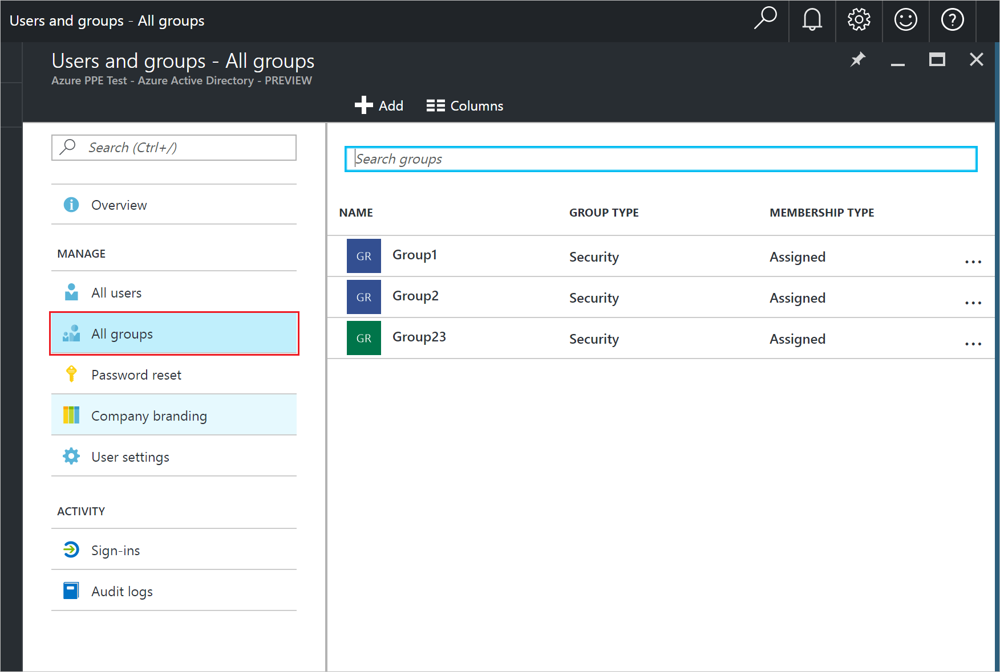

<properties
    pageTitle="Verwalten der Mitglieder für eine Gruppe in Azure Active Directory-Vorschau | Microsoft Azure"
    description="Wie Benutzer und Geräte, die Mitglieder einer Gruppe in Azure Active Directory sind"
    services="active-directory"
    documentationCenter=""
    authors="curtand"
    manager="femila"
    editor=""/>

<tags
    ms.service="active-directory"
    ms.workload="identity"
    ms.tgt_pltfrm="na"
    ms.devlang="na"
    ms.topic="article"
    ms.date="09/12/2016"
    ms.author="curtand"/>

# Verwalten der Mitglieder für eine Gruppe in Azure Active Directory-Vorschau

In diesem Artikel wird erläutert, wie die Mitglieder für eine Gruppe in der Vorschau Azure Active Directory (Azure AD) verwalten. [Was ist in der Vorschau?](active-directory-preview-explainer.md)

## Wie lässt sich suchen die Mitglieder und verwalten können?

1.  Melden Sie sich mit dem [Azure-Portal](https://portal.azure.com) mit einem Konto, eines globalen Administrators für das Verzeichnis ist.

2.  Wählen Sie **Weitere Dienste**aus, geben Sie **Benutzer und Gruppen** in das Textfeld ein, und wählen Sie dann die **EINGABETASTE**.

  

3.  Klicken Sie auf das Blade **Benutzer und Gruppen** wählen Sie **alle Gruppen**aus.

  

4. Klicken Sie auf das Blade **Benutzer und Gruppen - alle Gruppen** wählen Sie eine Gruppe aus.

5. Klicken Sie auf das * *Gruppieren - *Gruppenname* ** Blade, select **Mitglieder **.

  

6. Wählen Sie zum Hinzufügen von Mitgliedern der Gruppe, in der **Gruppe - Mitglieder** Blade, **Hinzufügen von Mitgliedern**aus.

  

7. Wählen Sie in der **Mitglieder** Blade eine oder mehrere Benutzer oder Geräte zur Gruppe hinzufügen, und wählen Sie die Schaltfläche **Wählen Sie** am unteren Rand der Blade sie zur Gruppe hinzufügen aus. Das Feld **Benutzername** filtert die Basis des Abgleichs der Eingabe, um einen beliebigen Teil eines Namens Benutzer oder Gerät anzeigen. Es werden keine Platzhalterzeichen im Feld akzeptiert.

8. Wählen Sie zum Entfernen von Mitgliedern aus der Gruppe, in der **Gruppe - Mitglieder** Blade, ein Mitglied aus.

9. Klicken Sie auf das Blade ***Benutzername*** wählen den Befehl **Entfernen** aus, und bestätigen Sie Ihre Auswahl aufgefordert werden.

  

9. Klicken Sie abschließend Mitglieder für die Gruppe zu ändern, wählen Sie **Speichern**aus.

## Weitere Informationen

Die folgenden Artikel enthalten weitere Informationen zum Azure Active Directory.

* [Finden Sie unter vorhandene Gruppen](active-directory-groups-view-azure-portal.md)
* [Erstellen einer neuen Gruppe und Hinzufügen von Mitgliedern](active-directory-groups-create-azure-portal.md)
* [Verwalten einer Gruppe](active-directory-groups-settings-azure-portal.md)
* [Verwalten von Mitgliedschaften einer Gruppe](active-directory-groups-membership-azure-portal.md)
* [Verwalten von dynamischen Regeln für Benutzer in einer Gruppe](active-directory-groups-dynamic-membership-azure-portal.md)
