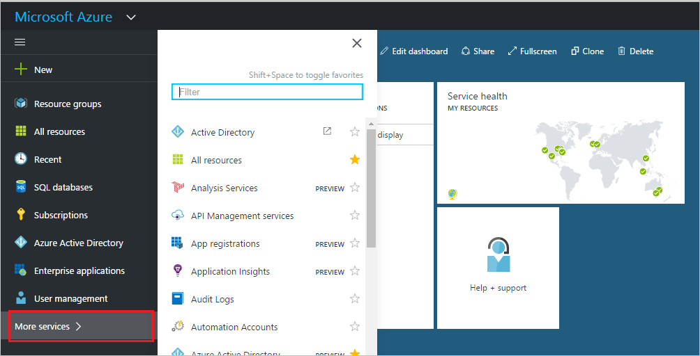
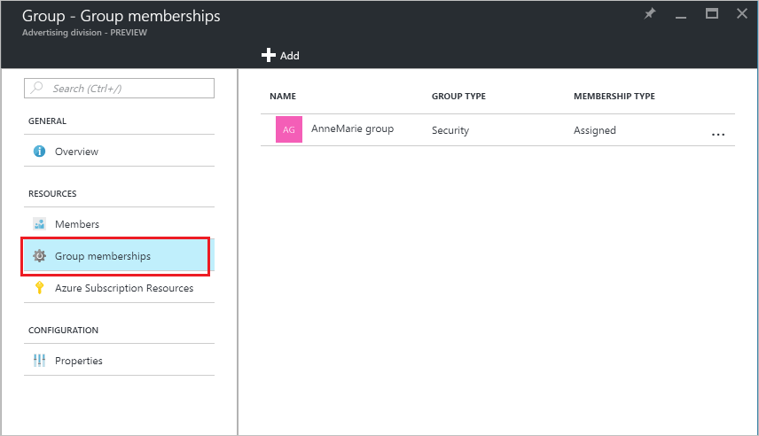
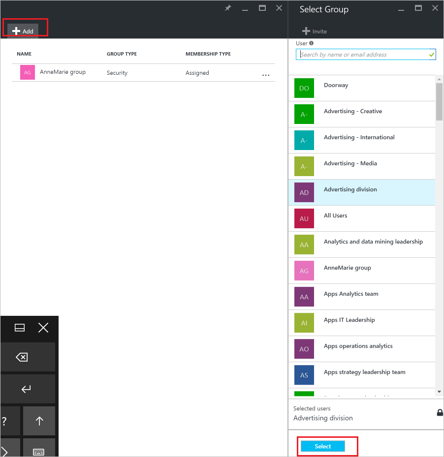
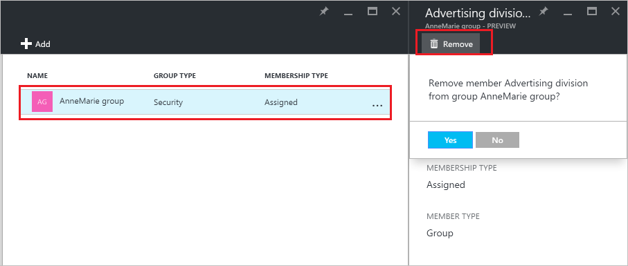

<properties
    pageTitle="Verwalten von Gruppen die Gruppe ein Mitglied in Azure Active Directory-Vorschau ist | Microsoft Azure"
    description="Gruppen können weitere Gruppen Azure Active Directory enthalten. So sieht wie diese Mitgliedschaften verwalten aus."
    services="active-directory"
    documentationCenter=""
    authors="curtand"
    manager="femila"
    editor=""/>

<tags
    ms.service="active-directory"
    ms.workload="identity"
    ms.tgt_pltfrm="na"
    ms.devlang="na"
    ms.topic="article"
    ms.date="09/12/2016"
    ms.author="curtand"/>

# Verwalten Sie die Gruppen, die die Gruppe ein Mitglied in Azure Active Directory-Vorschau ist

Gruppen können weitere Gruppen Azure Active Directory-Vorschau enthalten. [Was ist in der Vorschau?](active-directory-preview-explainer.md) So sieht wie diese Mitgliedschaften verwalten aus.

## Wie finde ich die Gruppen, die, denen Meine Gruppe ein Mitglied ist?

1.  Melden Sie sich mit dem [Azure-Portal](https://portal.azure.com) mit einem Konto, eines globalen Administrators für das Verzeichnis ist.

2.  Wählen Sie **Weitere Dienste**aus, geben Sie **Benutzer und Gruppen** in das Textfeld ein, und wählen Sie dann die **EINGABETASTE**.

  

3.  Klicken Sie auf das Blade **Benutzer und Gruppen** wählen Sie **alle Gruppen**aus.

  

4. Klicken Sie auf das Blade **Benutzer und Gruppen - alle Gruppen** wählen Sie eine Gruppe aus.

5. Klicken Sie auf das * *Group - *Gruppenname* ** Blade, select **gruppieren Sie Mitgliedschaften **.

  

6. Wählen Sie den **Hinzufügen** -Befehl aus, um die Gruppe als Mitglied einer anderen Gruppe, in der **Gruppe - Gruppenmitgliedschaft** Blade, hinzuzufügen.

7. Wählen Sie eine Gruppe aus dem Blade **Gruppe auswählen** , und wählen Sie dann auf die Schaltfläche **Wählen Sie** am unteren Rand der Blade. Sie können die Gruppe jeweils nur einer Gruppe hinzufügen. Das Feld **Benutzername** filtert die Basis des Abgleichs der Eingabe, um einen beliebigen Teil eines Namens Benutzer oder Gerät anzeigen. Es werden keine Platzhalterzeichen im Feld akzeptiert.

  

8. Wählen Sie eine Gruppe, um die Gruppe als Mitglied einer anderen Gruppe, in der **Gruppe - Gruppenmitgliedschaft** Blade, zu entfernen.

9. Klicken Sie auf das Blade ***Gruppenname*** wählen den Befehl **Entfernen** aus, und bestätigen Sie Ihre Auswahl aufgefordert werden.

  

9. Klicken Sie abschließend Mitgliedschaften für die Gruppe zu ändern, wählen Sie **Speichern**aus.

## Weitere Informationen

Die folgenden Artikel enthalten weitere Informationen zum Azure Active Directory.

* [Finden Sie unter vorhandene Gruppen](active-directory-groups-view-azure-portal.md)
* [Erstellen einer neuen Gruppe und Hinzufügen von Mitgliedern](active-directory-groups-create-azure-portal.md)
* [Verwalten einer Gruppe](active-directory-groups-settings-azure-portal.md)
* [Verwalten von Gruppenmitgliedern](active-directory-groups-members-azure-portal.md)
* [Verwalten von dynamischen Regeln für Benutzer in einer Gruppe](active-directory-groups-dynamic-membership-azure-portal.md)
