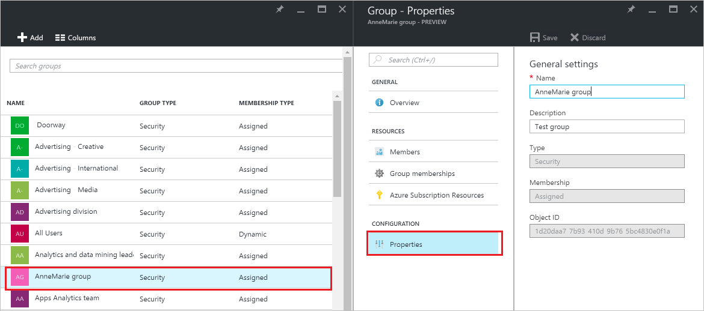
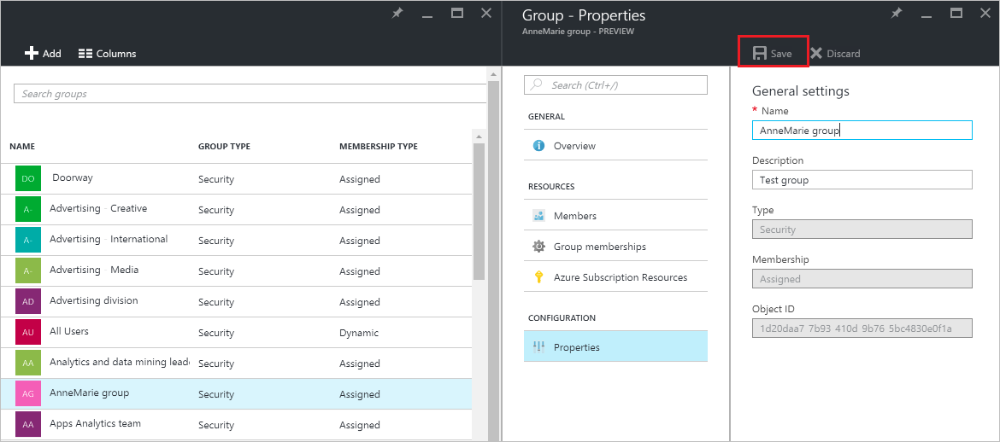

<properties
    pageTitle="Verwalten die Einstellungen für eine Gruppe in Azure Active Directory-Vorschau | Microsoft Azure"
    description="So bearbeiten Sie die Eigenschaften und andere Einstellungen Konfiguration für eine Gruppe in Azure Active Directory"
    services="active-directory"
    documentationCenter=""
    authors="curtand"
    manager="femila"
    editor=""/>

<tags
    ms.service="active-directory"
    ms.workload="identity"
    ms.tgt_pltfrm="na"
    ms.devlang="na"
    ms.topic="article"
    ms.date="09/12/2016"
    ms.author="curtand"/>

# Verwalten der Einstellungen für eine Gruppe in Azure Active Directory-Vorschau

In diesem Artikel wird erläutert, wie die Einstellungen für eine Gruppe in der Vorschau Azure Active Directory (Azure AD) ändern. [Was ist in der Vorschau?](active-directory-preview-explainer.md)

## Wie kann ich suchen und Ändern der Einstellungen?

1.  Melden Sie sich mit dem [Azure-Portal](https://portal.azure.com) mit einem Konto, eines globalen Administrators für das Verzeichnis ist.

2.  Wählen Sie **Weitere Dienste**aus, geben Sie **Benutzer und Gruppen** in das Textfeld ein, und wählen Sie dann die **EINGABETASTE**.

  

3.  Klicken Sie auf das Blade **Benutzer und Gruppen** wählen Sie **alle Gruppen**aus.

  

4. Klicken Sie auf das Blade **Benutzer und Gruppen - alle Gruppen** wählen Sie eine Gruppe aus.

5. Klicken Sie auf das * *Gruppieren - *Gruppenname* ** Blade, select **Eigenschaften **.

  

6. Wenn die gewünschten Eigenschaften für die Gruppe zu ändern, wählen Sie **Speichern**aus.    

  

## Weitere Informationen

Die folgenden Artikel enthalten weitere Informationen zum Azure Active Directory.

* [Finden Sie unter vorhandene Gruppen](active-directory-groups-view-azure-portal.md)
* [Erstellen einer neuen Gruppe und Hinzufügen von Mitgliedern](active-directory-groups-create-azure-portal.md)
* [Verwalten von Gruppenmitgliedern](active-directory-groups-members-azure-portal.md)
* [Verwalten von Mitgliedschaften einer Gruppe](active-directory-groups-membership-azure-portal.md)
* [Verwalten von dynamischen Regeln für Benutzer in einer Gruppe](active-directory-groups-dynamic-membership-azure-portal.md)
