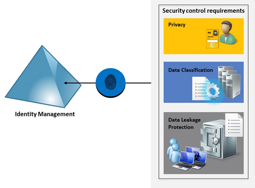

<properties
    pageTitle="Azure Active Directory Hybrid Identität Entwurf Faktoren - bestimmen Content Management Anforderungen | Microsoft Azure"
    description="Stellt einen Einblick in den Content Management-Anforderungen Ihres Unternehmens feststellen. In der Regel, wenn ein Benutzer seine eigenen Gerät hat möglicherweise er auch mehrere Anmeldeinformationen verfügen, die nach der Anwendung alternierende wird, die er verwendet. Es ist wichtig, um zu unterscheiden, welche Inhalte mit persönlichen Anmeldeinformationen im Vergleich zu den erstellten corporate Anmeldeinformationen erstellt wurde. Ihre Identität Lösung sollten Interaktion mit Cloud Services bieten eine nahtlose Verwendung an den Endbenutzer während Ihrer Privatsphäre sicherzustellen und erhöhen Sie den Schutz vor Datenverlust."
    documentationCenter=""
    services="active-directory"
    authors="billmath"
    manager="femila"
    editor=""/>

<tags
    ms.service="active-directory"
    ms.devlang="na"
    ms.topic="article"
    ms.tgt_pltfrm="na"
    ms.workload="identity" 
    ms.date="08/08/2016"
    ms.author="billmath"/>

# Ermitteln Sie Content Management Anforderungen für Ihre Identität Hybrid-Lösung

Grundlegendes zu den Content Management-Anforderungen für Ihr Unternehmen kann Ihre Entscheidung auf welche Hybrid Identität-Lösung mit direkt auswirken. Mit der zu viele mehrerer Geräte und der Möglichkeit der Benutzer, eigene Geräte ([BYOD](http://aka.ms/byodcg)) anzuzeigen das Unternehmen muss eigene Daten schützen, doch es auch muss intakt des Benutzers Datenschutz. In der Regel, wenn ein Benutzer seine eigenen Gerät hat möglicherweise er auch mehrere Anmeldeinformationen verfügen, die nach der Anwendung alternierende wird, die er verwendet. Es ist wichtig, um zu unterscheiden, welche Inhalte mit persönlichen Anmeldeinformationen im Vergleich zu den erstellten corporate Anmeldeinformationen erstellt wurde. Ihre Identität Lösung sollten Interaktion mit Cloud Services bieten eine nahtlose Verwendung an den Endbenutzer während Ihrer Privatsphäre sicherzustellen und erhöhen Sie den Schutz vor Datenverlust. 

Ihre Identität Lösung werden von den verschiedenen technischen Steuerelementen dazu verwendet wird, um Content Management bereitstellen, wie in der folgenden Abbildung dargestellt:
 

**Sicherheit-Steuerelemente, die Ihre Identität Managementsystem werden genutzt werden**

Im Allgemeinen werden Content Management Anforderungen Ihre Identität Management-System in den folgenden Bereichen nutzen:

- Datenschutz: Identifizieren des Benutzers, der eine Ressource besitzt, und die entsprechenden Steuerelemente zum Verwalten von Integrität anwenden.
- Klassifizierung von Daten: Identifizieren Sie die Benutzer oder Gruppe und Zugriffsebene für ein Objekt entsprechend der Einstufung. 
- Offenlegung Datenschutz: Sicherheit Steuerelemente für alle Daten zur Vermeidung von Offenlegung verantwortlich müssen Interaktion mit der Identität-System, um die Identität des Benutzers zu überprüfen. Dies ist auch wichtig zur Prüfung Spur.

>[AZURE.NOTE]
[Klassifizierung von Daten für Cloud Readiness](http://download.microsoft.com/download/0/A/3/0A3BE969-85C5-4DD2-83B6-366AA71D1FE3/Data-Classification-for-Cloud-Readiness.pdf) für Weitere Informationen zu best Practices und Richtlinien für Klassifizierung von Daten zu lesen.

Beim Planen Ihrer Identität Hybrid-Lösung sicherzustellen, dass je nach den Erfordernissen Ihrer Organisation die folgenden Fragen beantwortet werden:

- Verfügt Ihr Unternehmen Sicherheit Steuerelemente eingeführt, um den Datenschutz erzwingen?
 - Wenn Ja, werden diese Steuerelemente Sicherheit mit der Identität Hybrid-Lösung zu integrieren, die Sie ergreifen möchten?
- Verwendet Ihr Unternehmen Klassifizierung von Daten?
 - Wenn Ja, wird die aktuelle Lösung mit der Identität Hybrid-Lösung zu integrieren, die Sie ergreifen möchten?
- Verfügt Ihr Unternehmen derzeit eine Lösung für Datenverlust? 
 - Wenn Ja, ist die aktuelle Lösung mit der Identität Hybrid-Lösung zu integrieren, die Sie getroffen abgelegt werden?
- Benötigt Ihr Unternehmen Zugriff auf Ressourcen zu überwachen?
 - Wenn Ja, welcher Art von Ressourcen?
 - Wenn Ja, welche Informationen erforderlich ist?
 - Wenn Ja, muss wo befinden sich das Überwachungsprotokoll? Lokale oder in der Cloud?
- Benötigt Ihr Unternehmen keine e-Mails verschlüsseln, die vertrauliche Daten (SSNs, Kreditkartennummern usw.) enthalten?
- Benötigt Ihr Unternehmen alle Dokumente/Inhalte für externe Business Partner freigegeben verschlüsseln?
- Benötigt Ihr Unternehmen erzwingt Unternehmensrichtlinien auf bestimmte Arten von e-Mails (kann keine allen Antworten, nicht weiterleiten)?
 
>[AZURE.NOTE]
Vergewissern Sie sich zum Erfassen von Notizen für jede Antwort und die Gründe für die Antwort zu verstehen. [Definieren von Strategie für den Datenschutz](active-directory-hybrid-identity-design-considerations-data-protection-strategy.md) wird über die verfügbaren Optionen und vor-und Nachteile der einzelnen Optionen wechseln.  Durch Probleme beantwortet diese Fragen, die Sie auswählen, werden die beste Option ist für Ihr Unternehmen geeignet ist.

## Nächste Schritte
[Ermitteln Sie die Anforderungen für Access-Steuerelement](active-directory-hybrid-identity-design-considerations-accesscontrol-requirements.md)

## Siehe auch
[Entwurf Aspekte (Übersicht)](active-directory-hybrid-identity-design-considerations-overview.md)
