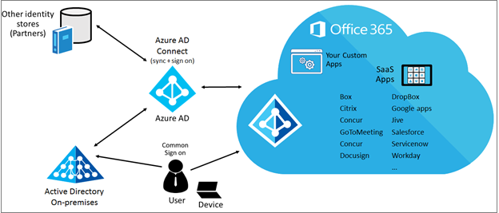
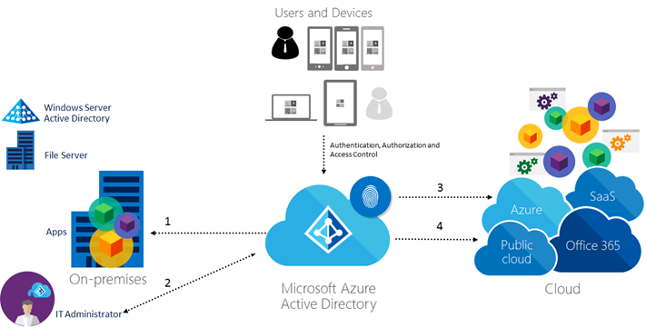

<properties
    pageTitle="Definieren von Azure Active Directory Hybrid Identität gibt - Strategie für den Datenschutz | Microsoft Azure"
    description="Sie definieren die Strategie für den Datenschutz für Ihre Identität Lösung Hybrid, um die Bedürfnisse zuschneiden, die Sie definiert."
    documentationCenter=""
    services="active-directory"
    authors="billmath"
    manager="femila"
    editor=""/>

<tags
    ms.service="active-directory"
    ms.devlang="na"
    ms.topic="article"
    ms.tgt_pltfrm="na"
    ms.workload="identity"
    ms.date="08/08/2016"
    ms.author="billmath"/>

# Definieren der Strategie für den Datenschutz für Ihre Identität Hybrid-Lösung

In dieser Aufgabe erhalten Sie die Strategie für den Datenschutz für Ihre Identität Lösung Hybrid, um die Bedürfnisse zuschneiden definieren, denen Sie im definiert:

- [Ermitteln Sie Daten Schutz Anforderungen](active-directory-hybrid-identity-design-considerations-dataprotection-requirements.md)
- [Ermitteln der Content Management-Anforderungen](active-directory-hybrid-identity-design-considerations-contentmgt-requirements.md)
- [Ermitteln Sie die Anforderungen für Access-Steuerelement](active-directory-hybrid-identity-design-considerations-accesscontrol-requirements.md)
- [Ermitteln der Reaktion Anforderungen](active-directory-hybrid-identity-design-considerations-incident-response-requirements.md)

## Definieren von Datenschutzoptionen
Wie es im [ermitteln Directory-Synchronisierung Anforderungen](active-directory-hybrid-identity-design-considerations-directory-sync-requirements.md)erläutert wurde, sich Microsoft Azure AD für die Synchronisierung mit Ihrer Active Directory-Domänendiensten (AD DS) kann lokalen befindet. Diese Integration ermöglicht Organisationen nutzen Azure AD zum Überprüfen der Anmeldeinformationen des Benutzers, wenn sie versuchen, Ihres Unternehmens Ressourcen zugreifen. Dies kann für beide Szenarien: Daten am Rest lokal und in der Cloud.  Zugriff auf Daten in Azure AD ist Benutzerauthentifizierung über einen Sicherheitstoken-Dienst (STS) erforderlich.

Sobald authentifiziert, der Benutzer Benutzerprinzipalnamen (UPN) aus dem Authentifizierungstoken und die repliziert Partition gelesen wird und Container entspricht der Domäne des Benutzers bestimmt wird. Informationen auf Vorhandensein des Benutzers, Aktivierungsstatus und Rolle wird vom Autorisierungssystem verwendet, um festzustellen, ob der angeforderte Zugriff auf den Mandanten Ziel für diesen Benutzer in dieser Sitzung autorisiert ist. Bestimmte Aktionen autorisierten (insbesondere Benutzer das Zurücksetzen von Kennwörtern erstellen) erstellen Sie eine Prüfliste, die von einem mandantenadministrator zum Verwalten von Compliance zu oder Untersuchungen verwendet werden kann.

Verschieben von Daten aus Ihrem lokalen Datacenter in Azure-Speicher über eine Internetverbindung möglicherweise nicht immer aufgrund der Datenmenge, Bandbreite Verfügbarkeit oder andere Aspekte soweit möglich sein. Der [Import/Export-Speicherdienst Azure](../storage/storage-import-export-service.md) bietet die Option Hardware-basierte für große Datenmengen im BLOB-Speicher platzieren/abrufen. Sie können Sie direkt auf eine Azure Datacenter Festplatten [BitLocker verschlüsselt](https://technet.microsoft.com/library/dn306081#BKMK_BL2012R2) senden, Stelle, an der Cloud-Operatoren werden den Inhalt bei Ihrem Speicherkonto hochladen oder sie können Ihre Azure-Daten auf Ihren Laufwerken zu reduzieren, um Sie wieder herunterladen. Für dieses Verfahren (mit einer BitLocker-Taste vom Dienst während der Einrichtung Auftrag generiert) werden nur verschlüsselte Datenträger akzeptiert. BitLocker Schlüssel wird in Azure separat, bereitgestellt, womit von Band Key Freigabe.

Da die Daten bei der Übertragung in anderen Szenarien stattfinden können, ist auch relevant für wissen, dass Microsoft Azure [virtuelle Netzwerke](https://azure.microsoft.com/documentation/services/virtual-network/) wird verwendet, um Mandanten Datenverkehr voneinander, isolieren beschäftigt Measures, wie z. B. Host und Gast Ebene Firewalls, IP-Paketfiltern, Blockieren von Ports und HTTPS Endpunkte. Die meisten Azure des internen Kommunikation, einschließlich Infrastruktur-zu-Infrastruktur und Infrastruktur-Kunden (lokal) verwenden, sind jedoch auch verschlüsselt. Eine andere wichtiger Punkt ist die Kommunikation in Azure Rechenzentren; Microsoft verwaltet Netzwerke, um sicherzustellen, dass keine virtuellen Computers kann die Identität oder die IP-Adresse eines anderen abzuhören. TLS/SSL wird beim Zugriff auf Azure Storage oder SQL-Datenbanken oder bei der Verbindung mit Cloud-Diensten verwendet. In diesem Fall ist der Kundenadministrator für das Anfordern eines TLS/SSL-Zertifikats und Bereitstellung an ihren Mandanten Infrastruktur verantwortlich. Daten Datenverkehr Verschieben zwischen virtuellen Computern in der gleichen Bereitstellung oder zwischen Mandanten in einer einzigen Bereitstellung über Microsoft Azure Virtual Network kann über verschlüsselte Kommunikationsprotokolle, wie z. B. HTTPS, SSL/TLS oder andere geschützt werden.

Je nachdem, wie Sie die Fragen in [ermitteln Daten Schutz Anforderungen](active-directory-hybrid-identity-design-considerations-dataprotection-requirements.md)beantwortet haben sollten Sie feststellen, wie Sie Ihre Daten schützen möchten, und wie die Identität Hybrid-Lösung auf, die helfen kann. Die Tabelle zeigt die Optionen von Azure unterstützt, die für die einzelnen Daten Schutz Szenarien verfügbar sind.

| Datenschutzoptionen         | Statisch sind in der cloud | Bei Rest lokal | Bei der Übertragung |
|---------------------------------|----------------------|---------------------|------------|
| BitLocker Drive-Verschlüsselung      | X                    | X                   |            |
| SQL Server zum Verschlüsseln der Datenbanken | X                    | X                   |            |
| Virtueller Computer-zu-virtueller Computer-Verschlüsselung             |                      |                     | X          |
| SSL/TLS                         |                      |                     | X          |
| VPN                             |                      |                     | X          |

>[AZURE.NOTE]
Lesen Sie [Compliance vom Feature](https://azure.microsoft.com/support/trust-center/services/) in [Microsoft Azure-Trust Center](https://azure.microsoft.com/support/trust-center/) , um weitere Informationen zu den Zertifizierung erhalten, die jeder Azure Service mit kompatibel ist.
Da die Optionen für den Datenschutz einen Ansatz mit mehreren Ebenen verwenden, Vergleich zwischen diese Optionen sind nicht anwendbar für diese Aufgabe. Stellen Sie sicher, dass Sie Nutzung von alle Optionen für die einzelnen Zustände verfügbar, die die Daten werden sollen.

## Definieren von Optionen für das Content management
Ein Vorteil der Verwendung von Azure AD für die Verwaltung einer Hybrid Identitätsinfrastruktur ist, dass der Prozess vollständig aus Sicht des Endbenutzers transparent ist. Der Benutzer versucht, auf eine freigegebene Ressource zugreifen, die Ressource erfordert eine Authentifizierung des Benutzers haben, senden eine Anforderung Authentifizierung zu Azure AD, um die Token abrufen und auf die Ressource zugreifen. Gesamte Prozess geschieht im Hintergrund, ohne Interaktion mit dem Benutzer. Es ist auch möglich, eine [Gruppe](active-directory-manage-groups.md#getting-started-with-access-management) von Benutzern erteilt akzeptieren, um bestimmte allgemeinen Aktionen durchführen zu können.

Organisationen, die in der Regel Bedenken Datenschutz sind erfordern Klassifizierung von Daten für ihre Lösung. Wenn ihre aktuelle lokale Infrastruktur bereits Klassifizierung von Daten verwendet wird, ist es möglich, Azure AD als Hauptfenster Repository für die Identität des Benutzers zu nutzen. Wenn ein gängiges Tool, dass verwendeten lokalen ist für Klassifizierung von Daten [Data Klassifizierung Toolkit](https://msdn.microsoft.com/library/Hh204743.aspx) für Windows Server 2012 R2 aufgerufen wird. Dieses Tool kann dazu beitragen zu identifizieren, klassifizieren und Schützen von Daten auf Dateiserver in Ihre private Cloud. Es ist auch möglich, die [Automatische Klassifizierung der Datei](https://technet.microsoft.com/library/hh831672.aspx) in Windows Server 2012 dazu nutzen.

Wenn Ihre Organisation keine direkte Klassifizierung von Daten doch vertrauliche Dateien ohne neue Server lokal geschützt werden muss, können sie Microsoft [Azure Rights Management-Dienst](https://technet.microsoft.com/library/JJ585026.aspx)verwenden.  Azure RMS verwendet Verschlüsselung, Identität und Autorisierungsrichtlinien zum Sichern Ihrer Dateien und e-Mail- und es funktioniert über mehrere Geräte – Telefone, Tablets und PCs. Da Azure RMS Cloud-Dienst ist, gibt es keine müssen explizit Vertrauensstellungen mit anderen Organisationen konfigurieren, bevor Sie geschützten Inhalt für diese freigeben können. Wenn sie bereits ein Office 365 oder einem Azure AD-Verzeichnis haben, wird automatisch für die Zusammenarbeit in Organisationen unterstützt. Sie können auch die Directory-Attribute synchronisieren, die Azure RMS eine gemeinsame Identität-Unterstützung für Ihre lokalen Active Directory-Konten mit Azure Active Directory-Synchronisierung Services (AAD synchronisieren) oder Azure AD verbinden muss.

Ein wesentlicher Bestandteil der Content Management ist zu verstehen, wer welche Ressource zugegriffen wird, daher ist eine Funktion Rich-Protokollierung wichtig für die Identität Management-Lösung. Azure AD bietet Log über 30 Tage, einschließlich:

- Änderungen in Rollenmitgliedschaft (ex: Benutzer, die Rolle des globalen Administrators hinzugefügt)
- Updates von Anmeldeinformationen (ex: Kennwort Änderungen)
- Domain Management (ex: Überprüfung einer benutzerdefinierten Domänennamens, und Entfernen einer Domäne)
- Hinzufügen oder Entfernen von applications
- Benutzermanagement (ex: hinzufügen, entfernen oder Aktualisieren eines Benutzers)
- Hinzufügen oder Entfernen von Lizenzen

>[AZURE.NOTE]
Lesen Sie [Microsoft Azure-Sicherheit und Verwaltung von Überwachungsprotokollen](http://download.microsoft.com/download/B/6/C/B6C0A98B-D34A-417C-826E-3EA28CDFC9DD/AzureSecurityandAuditLogManagement_11132014.pdf) Protokollierungsfunktionen in Azure mehr kennen.
Je nachdem, wie Sie die Fragen in [ermitteln Content Management Anforderungen](active-directory-hybrid-identity-design-considerations-contentmgt-requirements.md)beantwortet haben sollten Sie feststellen, wie Sie den Inhalt in Ihre Identität Hybrid-Lösung verwaltet werden sollen. Während alle Optionen auf die Tabelle 6 verfügbar gemachten Integration mit Azure AD Lage sind, ist es wichtig, zu definieren, die für Ihre geschäftliche Anforderungen besser geeignet ist.

| Optionen für das Content management                                                               | Vorteile                                                                                                                                                                                                                                                                                                                                                                                                                                                                                                                                                             | Nachteile                                                                                                                                                                                                                               |
|------------------------------------------------------------------------------------------|------------------------------------------------------------------------------------------------------------------------------------------------------------------------------------------------------------------------------------------------------------------------------------------------------------------------------------------------------------------------------------------------------------------------------------------------------------------------------------------------------------------------------------------------------------------------|---------------------------------------------------------------------------------------------------------------------------------------------------------------------------------------------------------------------------------------------|
| In den lokalen (Active Directory Rights Management Server)                      | Vollzugriff auf die Server-Infrastruktur klassifizieren der Daten   Integrierte Funktion in Windows Server überflüssig zusätzliche Lizenz oder das Abonnement   Kann in Azure AD in einem Szenario Hybrid integriert werden   Informationen Rights Management (IRM)-Funktionen unterstützt in Microsoft Online Services, darunter Exchange Online und SharePoint Online sowie Office 365   Unterstützt die lokale Microsoft-Serverprodukte, wie z. B. Exchange Server, SharePoint-Server und Dateiserver, die Windows-Server und Datei Klassifizierung Infrastruktur (FCI) ausgeführt werden. | Höhere, Wartung (Absätze nicht trennen von Updates, Konfiguration und mögliche Upgrades), seit IT verfügt den Server   Anfordern einer Serverinfrastruktur lokal  Doesn'tleverage Azure-Funktionen systembedingt                                     |
| Zentralisierte in der Cloud (Azure RMS)                                                     | Einfacher verwalten im Vergleich zu den lokalen Lösung   Kann in AD DS in einem Szenario Hybrid integriert werden    Vollständig integriert in Azure AD   Setzt voraus lokale müssen, um den Dienst bereitstellen zu einem server   Unterstützt lokale Microsoft-Serverprodukte wie Exchange Server, SharePoint, Server und Dateiserver, die ausgeführt, Windows Server und Datei Einstufung, Infrastruktur (FCI werden)   IT können vollständig steuern des Mandanten Schlüssel mit BYOK Funktionalität haben.                                                                                    | Ihre Organisation muss ein Cloud-Abonnement verfügen, RMS unterstützt   Ihre Organisation muss ein Verzeichnis Azure AD-zur Unterstützung von Benutzerauthentifizierung für RMS verfügen.                                                                                  |
| Hybrid (Azure RMS integriert, lokalen Active Directory Rights Management-Server) | Dieses Szenario sammelt die Vorteile beider, zentralisierte lokal und in der Cloud.                                                                                                                                                                                                                                                                                                                                                                                                                                                                            | Ihre Organisation muss ein Cloud-Abonnement verfügen, RMS unterstützt   Ihre Organisation muss ein Verzeichnis Azure AD-zur Unterstützung von Benutzerauthentifizierung für RMS verfügen,   Erfordert eine Verbindung zwischen Azure-Cloud-Dienst und lokale Infrastruktur |

## Definieren von Access-Steueroptionen
Durch die Nutzung der Authentifizierung, steuern Zugriffsrechte Funktionen zur Verfügung stehen in Azure AD So aktivieren Sie Ihr Unternehmen mit einer Identität zentralen Repository und ermöglicht Benutzern und Partnern einmaliges Anmelden (SSO) verwenden, wie in der folgenden Abbildung dargestellt werden kann:

Zentrale Verwaltung und vollständig Integration in andere Verzeichnisse durchsuchen

Azure-Active Directory bietet einmaliges Anmelden für Tausende von Applications SaaS und lokalen web-Applikationen. Lesen Sie bitte die [Azure Active Directory Federation Kompatibilitätsliste: Identitätsanbieter von Drittanbietern, die verwendet werden können, um einmaliges Anmelden implementieren](https://msdn.microsoft.com/library/azure/jj679342.aspx) Artikel für weitere Details zu den SSO von Drittanbietern, die von Microsoft getestet wurden. Diese Funktion kann die Organisation eine Vielzahl von Szenarien B2B Beibehaltung Kontrolle über die Identität und Access Verwaltung implementieren. Ist jedoch während der B2B Prozess entwerfen wichtig zu verstehen, die Authentifizierungsmethode, die verwendet werden, indem Sie den Partner und überprüfen, ob diese Methode von Azure unterstützt wird. Diese sind derzeit von Azure AD unterstützten Methoden:

- Security Assertion Markup Language (SAML)
- OAuth
- Kerberos
- Token
- Zertifikate

>[AZURE.NOTE] Lesen Sie [Azure Active Directory-Authentifizierungsprotokolle](https://msdn.microsoft.com/library/azure/dn151124.aspx) erhalten Sie weitere Details zu einzelnen Protokoll und seine Funktionen in Azure.

Mithilfe des Azure AD-Supports, können mobilen branchenanwendungen die gleiche einfache Mobile Dienste Authentifizierung Oberfläche Mitarbeiter, melden Sie sich bei ihrer Windows-Dienste mit ihrer corporate Active Directory-Anmeldeinformationen zulassen. Mit diesem Feature wird Azure AD als Identitätsanbieter in Mobile Services entlang mit anderen Identitätsanbieter, die wir bereits unterstützen unterstützt (einschließlich Microsoft Accounts, Facebook-ID, Google-ID und Twitter-ID). Wenn der lokale apps verwendet die Anmeldeinformationen des Benutzers am des Unternehmens AD DS, sollte der Access-Partner und Benutzer aus der Cloud in Kürze transparent sein. Sie können Verwalten des bedingten Steuerung des Benutzerzugriffs (cloudbasierten) Webanwendungen, Web API, Microsoft-Cloud-Diensten, 3rd Party SaaS Applikationen und systemeigenen (mobile) Clientanwendungen und haben die Vorteile der Sicherheit, Überwachung, Berichterstattung zentraler Stelle. Jedoch, empfiehlt es sich dies in einer Umgebung nicht Herstellung oder mit einem begrenzten Benutzer bestätigen.

>[AZURE.TIP] Es ist wichtig, erwähnen, Azure AD keine Gruppenrichtlinien angezeigt werden, wie AD DS hat. Erzwingen der Richtlinie für Geräte benötigen Sie eine Lösung wie [Microsoft Intune](https://technet.microsoft.com/library/jj676587.aspx)mobilen Gerät.

Nachdem der Benutzer Azure AD verwenden authentifiziert wird, ist es wichtig, für die gewünschte Zugriffsebene für ausgewertet werden soll, dass der Benutzer es hat. Die Zugriffsebene, die der Benutzer über eine Ressource angezeigt wird, kann dies variieren während Azure AD zusätzliche Sicherheitsstufe durch Steuern des Zugriffs auf einige Ressourcen hinzufügen kann, müssen Sie auch behalten Denken Sie daran, dass die Ressource selbst auch eine eigene Liste der Access-Steuerelement separat, wie das Steuerelement Access für Dateien, die in einem Dateiserver kann. In der Abbildung unten sind die Ebenen der Access-Steuerelement, das Ihnen in einem Szenario Hybrid zusammengefasst:

Jeder Interaktion im Diagramm angezeigt wurden, in der Abbildung X stellt eine Access-Steuerelementszenario, die vom Azure AD abgedeckt werden kann. Im folgenden haben Sie eine Beschreibung der einzelnen Szenarien:

1.Klicken bedingte Zugriff auf Programme, die sind gehostet lokalen: können registrierte Geräte mit Access-Richtlinien für Applikationen, die so konfiguriert sind, dass AD FS mit Windows Server 2012 R2 verwenden. Weitere Informationen zum Einrichten von bedingten Zugriff für lokale finden Sie unter [Einrichten von lokalen bedingten Zugriff Azure Active Directory-Gerät Registrierung verwenden](active-directory-conditional-access-on-premises-setup.md).
2.Klicken zugreifen Steuerelement Azure-Verwaltungsportal: Azure verfügt auch über eine Funktion zum Steuern des Zugriffs auf das Portal Management mithilfe von RBAC (Rolle basierend Access Control). Diese Methode ermöglicht das Unternehmen, das die Menge der Vorgänge einschränken, die eine Einzelperson ausführen können, nachdem er auf Azure-Verwaltungsportal zugreifen kann. Mithilfe der RBAC zum Steuern des Zugriffs auf das Portal IT-Administratoren ca Zugriffsrechte für Stellvertretung mithilfe der folgenden Vorgehensweisen Access Management:

 - Gruppe-basierten rollenzuweisung: Sie können Access Azure AD-Gruppen, die synchronisiert werden können von Ihrem lokalen Active Directory zuweisen. So können Sie die vorhandene Investitionen nutzen, die Ihre Organisation in Tools und Prozessen für das Verwalten von Gruppen. Sie können auch das delegierte Gruppe Management-Feature von Azure AD Premium verwenden.
 - Nutzen Sie sich die Rollen in Azure: drei Rollen können – Besitzer, Mitwirkender und Reader, um sicherzustellen, dass Benutzer und Gruppen berechtigt sind nur die Aufgaben ausführen, sie ihre Aufgaben ausführen müssen.
 - Zugriff auf Ressourcen präzise: Sie können Benutzer und Gruppen für ein bestimmtes Abonnement, Ressourcengruppe oder eine einzelne Azure Ressource z. B. einer Website oder eine Datenbank Rollen zuweisen. Auf diese Weise können Sie sicherstellen, dass Benutzer haben Zugriff auf die benötigten Ressourcen und keinen Zugriff auf Ressourcen, die sie nicht benötigen, zu verwalten.

>[AZURE.NOTE] [rollenbasierte Access Steuerelement in Azure](https://azure.microsoft.com/updates/role-based-access-control-in-azure-preview-portal/) erhalten Sie weitere Details zu dieser Funktion zu lesen. Für Entwickler, die beim Erstellen von Applications und das Access-Steuerelement für sie anpassen möchten, ist es auch möglich, Azure AD-Anwendungsrollen für die Autorisierung verwenden. Überprüfen Sie in diesem [Beispiel WebApp-RoleClaims-DotNet](https://github.com/AzureADSamples/WebApp-RoleClaims-DotNet) zum Erstellen der app damit diese Funktion verwendet.

3.Klicken bedingten Zugriff für Office 365-Anwendungen mit Microsoft Intune: Bereitstellung von IT-Administratoren können bedingte Gerät-Richtlinien zum Sichern Ihres Unternehmens Ressourcen, während gleichzeitig Information Worker auf kompatible Geräte Zugriff auf die Dienste zulässt. Weitere Informationen finden Sie unter [Bedingte Gerät-Richtlinien für Office 365-Dienste](active-directory-conditional-access-device-policies.md).

4.konfigurieren bedingten Zugriff für Saas apps: [dieses Feature](http://blogs.technet.com/b/ad/archive/2015/06/25/azure-ad-conditional-access-preview-update-more-apps-and-blocking-access-for-users-not-at-work.aspx) ermöglicht Ihnen pro Anwendung kombinierte Authentifizierung Access Regeln und die Möglichkeit, den Zugriff für Benutzer, die nicht in einem vertrauenswürdigen Netzwerk Sperren konfigurieren. Sie können die kombinierte Authentifizierungsregeln für alle Benutzer anwenden, die mit der Anwendung oder nur für Benutzer in der angegebenen Sicherheitsgruppen zugewiesen sind. Benutzer können aus der Anforderung zum kombinierte Authentifizierung für ausgeschlossen werden, wenn sie die Anwendung zugreifen, über eine IP-Adresse, der Benutzern in innerhalb der Organisation Netzwerk.

Da die Optionen für die Steuerung des Benutzerzugriffs auf einen mehreren Ebenen Ansatz verwenden, Vergleich zwischen diese Optionen sind nicht anwendbar für diese Aufgabe. Stellen Sie sicher, dass Sie Nutzung von alle Optionen für jedes Szenario zur Verfügung, die Sie zum Steuern des Zugriffs auf Ihre Ressourcen erforderlich sind.

## Definieren von Vorfall Besprechungsantworten (Optionen)
Azure AD unterstützen kann IT-Identität potenzieller Risiken in der Umgebung durch die Aktivität des Benutzers, IT-Abteilung kann Überwachung nutzen Azure AD-Zugriff und Verwendungsberichte Videofunktionen um Einsicht in die Integrität und Sicherheit des Verzeichnisses Ihrer Organisation zu erhalten. Mithilfe dieser Informationen kann IT-Administrator besser bestimmen, wo mögliches Sicherheitsrisiko liegen möglicherweise so, dass er angemessen, diese Risiken planen können.  [Azure AD Premium-Abonnement](active-directory-get-started-premium.md) weist eine Reihe von Berichten Sicherheit, mit denen können IT, um diese Informationen zu erhalten. [Azure AD-Berichte](active-directory-view-access-usage-reports.md) werden kategorisiert, wie unten dargestellt:

- **Anomalie Berichte**: Anmelden Ereignisse, die wir gefunden werden abweichenden enthalten. Unser Ziel ist, stellen Sie Folgendes beachten Sie solche Aktivitäten und ermöglichen es Ihnen, vorzunehmen Feststellung darüber, ob ein Ereignis verdächtig ist.
- **Integrierte Anwendung Bericht**: bietet Einblicke in die Cloudanwendungen wie in Ihrer Organisation verwendet werden. Azure-Active Directory bietet Integration in Tausende von Applications Cloud.
- **Berichte über Fehler**: beim Bereitstellen von Konten externen Applikationen auftretende Fehler anzugeben.
- **Benutzerspezifische Berichte**: Gerät/melden Sie sich in Aktivitätsdaten für einen bestimmten Benutzer anzeigen.
- **Aktivitätsprotokolle**: einen Eintrag aller geprüften Ereignisse innerhalb der letzten 24 Stunden, letzten 7 Tage oder letzten 30 Tage als auch Gruppe Aktivität Änderungen und Kennwort zurücksetzen und Registrierung Aktivität enthalten.

>[AZURE.TIP]
Einen anderen Bericht, die auch das Bearbeitung eines Falls Vorfall Antwort Team helfen können ist der [Benutzer mit verlorene Anmeldeinformationen](http://blogs.technet.com/b/ad/archive/2015/06/15/azure-active-directory-premium-reporting-now-detects-leaked-credentials.aspx) -Bericht.  Dieser Bericht Flächen keine Übereinstimmung zwischen diese Liste verlorene Anmeldeinformationen und Ihrem Mandanten.

Weitere wichtige erstellt in Berichten in Azure AD, die während der Reaktion Untersuchung verwendet werden kann und sind:

- **Zurücksetzen des Kennworts Aktivität**: den Administrator bieten Einblicke in aktiv wie das Zurücksetzen von Kennwörtern in der Organisation verwendet wird.
- **Zurücksetzen des Kennworts Registrierungsaktivität**: bietet Einblicke in die Benutzer ihre Methoden für das Zurücksetzen von Kennwörtern, registriert haben und welche Methoden, die sie ausgewählt haben.
- **Gruppenaktivität**: bietet eine Verlaufs von Änderungen in der Gruppe (ex: Benutzer hinzugefügt oder entfernt), die Sie im Bereich Access initiiert wurden.

Nutzen Sie Überwachungsbericht zu erhalten Informationen wie sowie die Core reporting-Funktionen verfügbar in Azure AD Premium, die während eines Vorgangs Vorfall Antwort Untersuchung IT-Abteilung kann auch genutzt werden können:

- Änderungen in Rollenmitgliedschaft (ex: Benutzer, die Rolle des globalen Administrators hinzugefügt)
- Updates von Anmeldeinformationen (ex: Kennwort Änderungen)
- Domain Management (ex: Überprüfung einer benutzerdefinierten Domänennamens, und Entfernen einer Domäne)
- Hinzufügen oder Entfernen von applications
- Benutzermanagement (ex: hinzufügen, entfernen oder Aktualisieren eines Benutzers)
- Hinzufügen oder Entfernen von Lizenzen

Da die Optionen für Vorfall Antwort ein mehreren Ebenen Ansatz, Vergleich zwischen diese Optionen sind nicht anwendbar für diese Aufgabe. Stellen Sie sicher, dass Sie alle verfügbaren Optionen für jedes Szenario genutzt werden, die erfordert reporting Azure AD-Funktion als Teil Ihres Unternehmens Reaktion Prozesses verwendet werden kann.

## Nächste Schritte
[Ermitteln der Hybrid Identität Verwaltungsaufgaben](active-directory-hybrid-identity-design-considerations-hybrid-id-management-tasks.md)

## Siehe auch
[Entwurf Aspekte (Übersicht)](active-directory-hybrid-identity-design-considerations-overview.md)
