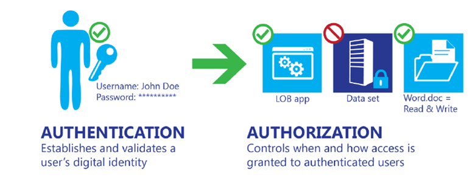
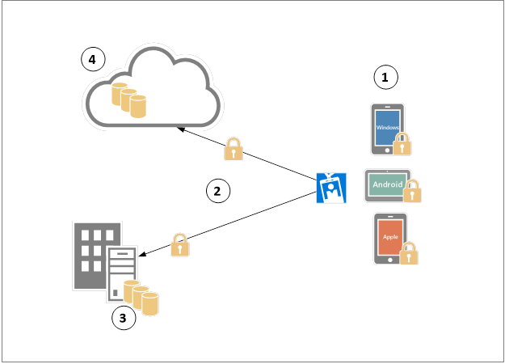

<properties
    pageTitle="Azure Active Directory Hybrid Identität Entwurf Faktoren - bestimmen Daten Schutz Anforderungen | Microsoft Azure"
    description="Beim Planen Ihrer Identität Hybrid-Lösung ermitteln Sie die Daten Schutz Anforderungen für Ihr Unternehmen und welche Optionen für diese Anforderungen am besten erfüllen verfügbar sind."
    documentationCenter=""
    services="active-directory"
    authors="billmath"
    manager="femila"
    editor=""/>

<tags
    ms.service="active-directory"
    ms.devlang="na"
    ms.topic="article"
    ms.tgt_pltfrm="na"
    ms.workload="identity" 
    ms.date="08/08/2016"
    ms.author="billmath"/>

#Zur Verbesserung der Sicherheit von Daten über signifikante Identität Lösung planen

Der erste Schritt zum Schutz der Daten ist erkennen, wer die Daten zugreifen können, und als Teil dieses Prozesses, eine Identität muss, integriert Lösung, die können von Ihrem System Authentifizierung und Autorisierung Funktionen bereitstellt. Authentifizierung und Autorisierung häufig miteinander verwechselt werden, und ihre Rollen falsch verstanden. In der Praxis unterscheiden sich diese ganz, wie in der folgenden Abbildung dargestellt:

 
**Mobiles Gerät Management Lebenszyklusphasen**

Beim Planen Ihrer Hybrid Identität Lösung müssen Sie die Daten Schutz Anforderungen wissen, für Ihr Unternehmen und welche Optionen für diese Anforderungen am besten erfüllen verfügbar sind.
 
>[AZURE.NOTE]
Nachdem Sie die Planung für die Sicherheit abgeschlossen haben, überprüfen Sie die [kombinierte authentifizierungsanforderungen ermitteln](active-directory-hybrid-identity-design-considerations-multifactor-auth-requirements.md) , um sicherzustellen, dass Ihre Auswahl hinsichtlich kombinierte authentifizierungsanforderungen nicht vom Entscheidungen betroffenen vorgenommenen in diesem Abschnitt.

## Ermitteln Sie Daten Schutz Anforderungen
Die meisten Unternehmen haben das Alter der Mobilität, ein gemeinsames Ziel: Aktivieren Sie die Benutzer auf ihren mobilen Geräten während der lokalen oder Remote überall produktiv zu sein, um die Produktivität zu steigern. Während dies ein gemeinsames Ziel sein könnten, werden Unternehmen, die eine solche Verpflichtung verfügen auch Bedeutung hinsichtlich der Betrag von Risiken, die verringert werden muss, um Unternehmensdaten schützen und Verwalten des Benutzers Datenschutz. Jedes Unternehmen müssen verschiedene Punkte, die in diesem Zusammenhang; andere Compliance Regeln, die variieren gemäß der, die Branche das Unternehmen fungiert führen zu anderen Entwurf Entscheidungen. 

Es gibt jedoch einige Sicherheitsaspekte, die untersucht werden soll und überprüft, unabhängig von der Industrie, die im nächsten Abschnitt erläutert werden.

## Daten Schutz Wege

 
**Daten Schutz Wege**

Im obigen Diagramm werden die Identität Komponente der ersten Phase überprüft werden, bevor Daten zugegriffen werden kann. Je nach Status können jedoch diese Daten während der Zeit sein, die darauf zugegriffen wurde. Jeder Zahl in diesem Diagramm stellt einen Pfad aus, in dem Daten Zeitpunkt zu einem bestimmten Zeitpunkt gefunden werden können. Diese Zahlen werden nachstehend erläutert:

1. Datenschutz Ebene der Gerät.
2. Datenschutz unterwegs.
3. Datenschutz, klicken Sie bei Rest lokalen.
4. Datenschutz, während Sie sich bei Rest in der Cloud.

Obwohl die technischen dieser wird steuert aktivieren IT zum Schutz der Daten selbst auf jeweils diese Phasen werden nicht direkt von Angeboten der Hybrid Identität-Lösung ist es erforderlich, dass die Hybrid Identität Lösung Nutzung der sowohl lokalen und Cloud kann Identität Management Ressourcen zum Identifizieren des Benutzers vor dem Zugriff auf die Daten gewähren. Beim Planen Ihrer Identität Hybrid-Lösung sicherzustellen, dass je nach den Erfordernissen Ihrer Organisation die folgenden Fragen beantwortet werden:

## Datenschutz auf rest
Unabhängig davon, wo die Daten statisch sind (Gerät, Cloud oder lokal) ist ist es wichtig, führen Sie eine Bewertung, um den Anforderungen der Organisation in diesem Zusammenhang zu verstehen. Für diesen Bereich Stellen Sie sicher, dass die folgenden Fragen gestellt werden:

- Benötigt Ihr Unternehmen statische Daten schützen?
 - Wenn Ja, ist die Identität Hybrid-Lösung mit Ihrer aktuellen lokalen Infrastruktur integrieren?
 - Wenn Ja, ist die Identität Hybrid-Lösung mit Ihrer Auslastung befindet sich in der Cloud zu integrieren?
- Ist die Cloud Identität Verwaltung können zum Schutz von Anmeldeinformationen des Benutzers und anderen Daten in der Cloud gespeichert?

## Datenschutz bei der Übertragung
Daten im Übergang zwischen dem Gerät und der Datacenter oder zwischen dem Gerät und der Cloud müssen geschützt werden. Jedoch wird in Übertragung bedeutet nicht unbedingt ein Prozesses Kommunikation mit einer Komponente außerhalb der Cloud-Dienst; es intern wird ebenfalls verschoben, z. B. zwischen zwei virtuelle Netzwerke. Für diesen Bereich Stellen Sie sicher, dass die folgenden Fragen gestellt werden:

- Benötigt Ihr Unternehmen schützen von Daten bei der Übertragung?
 - Wenn Ja, ist die Identität Hybrid-Lösung mit sicheren Steuerelementen wie z. B. SSL/TLS integrieren?
- Behält die Cloud Identität Verwaltung den Datenverkehr an und im Verzeichnisspeicher (innerhalb und zwischen Rechenzentren) angemeldet?

## Compliance
Vorschriften, Gesetzen und behördliche Compliance variiert entsprechend der Branche, die Ihr Unternehmen gehört. Unternehmen in hoher Industriezweige müssen Identität-Management Bedenken im Zusammenhang mit Compliance-Probleme beheben. Vorschriften wie Sarbanes-Oxley (SOX), die Lebensversicherung Portabilität und Zuständigkeit Act (HIPAA), der Gramm-Leach-Bliley Act (GLBA) und die Zahlung Card Industry Data Security Standard (PCI DSS) sind sehr strenge zu Identität und Access. Die Hybrid Identität Lösung, die Ihr Unternehmen übernommen werden, müssen die wichtigsten Funktionen, die die Anforderungen der eine oder mehrere der folgenden Vorschriften zu erfüllen wird. Für diesen Bereich Stellen Sie sicher, dass die folgenden Fragen gestellt werden:

- Ist die Identität Hybrid-Lösung mit den gesetzlichen Anforderungen für Ihr Unternehmen?
- Integrierte die Identität Hybrid-Lösung über eine Funktionen, mit die Ihr Unternehmen kompatiblen gesetzlichen Vorschriften werden können? 
 
>[AZURE.NOTE]
Vergewissern Sie sich zum Erfassen von Notizen für jede Antwort und die Gründe für die Antwort zu verstehen. [Definieren von Strategie für den Datenschutz](active-directory-hybrid-identity-design-considerations-data-protection-strategy.md) wird über die verfügbaren Optionen und vor-und Nachteile der einzelnen Optionen wechseln.  Durch Probleme beantwortet diese Fragen, die Sie auswählen, werden die beste Option ist für Ihr Unternehmen geeignet ist.

## Nächste Schritte
 [Ermitteln der Content Management-Anforderungen](active-directory-hybrid-identity-design-considerations-contentmgt-requirements.md)

## Siehe auch
[Entwurf Aspekte (Übersicht)](active-directory-hybrid-identity-design-considerations-overview.md)
