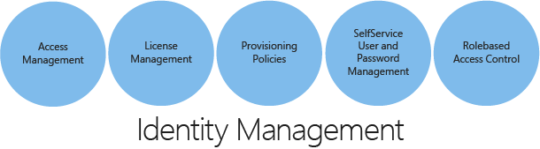
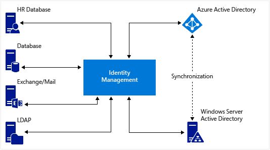

<properties
    pageTitle="Azure Active Directory-Hybrid Identität entwurfsüberlegungen – bestimmen Hybrid Identität Verwaltungsaufgaben | Microsoft Azure"
    description="Mit bedingten Access-Steuerelement überprüft Azure Active Directory die bestimmten Bedingungen, die Sie bei der Authentifizierung des Benutzers und vor dem Gewähren des Zugriffs auf die Anwendung auswählen. Nachdem Sie diese Bedingung erfüllt sind, wird der Benutzer authentifiziert und Zugriff auf die Anwendung zulässig."
    documentationCenter=""
    services="active-directory"
    authors="billmath"
    manager="femila"
    editor=""/>

<tags
    ms.service="active-directory"
    ms.devlang="na"
    ms.topic="article"
    ms.tgt_pltfrm="na"
    ms.workload="identity" 
    ms.date="08/08/2016"
    ms.author="billmath"/>

# Planen der Verwendung von Hybrid Identität Lebenszyklus 

Identität ist eine der Grundlagen der strategische Access Enterprise Mobilität und Anwendung. Ob auf Ihrem mobilen Gerät oder SaaS-app Signieren ist Ihre Identität die EINGABETASTE, um den Zugriff auf alle Elemente aus. Auf der höchsten Ebene umfasst eine Lösung zur Identität Zusammenführung und Synchronisierung zwischen Ihre Identität Repositorys wozu automatisieren und zentrale die Verfahren zum Bereitstellen von Ressourcen. Die Lösung Identität sollte eine zentrale Identität für lokale und Cloud sein, und verwenden irgendeine Identität Föderation auch die zentralen Authentifizierung verwalten und sichere Freigabe und Zusammenarbeit mit externen Benutzern und Unternehmen unterhalten. Ressourcen aus Betriebssysteme und Anwendungen an Personen, die in den Bereich oder mit einer Organisation verbunden ist. Organisationsstruktur kann geändert werden, um die Bereitstellung Richtlinien und Verfahren zu unterstützen.

Es ist es wichtig, dass eine Identität Lösung darüber, wie Sie Ihre Benutzer Befähigungen können, indem diese mit Self-service-Funktionen, um sie produktiv zu halten. Ihre Identität Lösung ist eine sichere, wenn es für alle Ressourcen einmaliges Anmelden für Benutzer ermöglicht Administratoren gar zugreifen benötigten Ebenen standardisierte Verfahren verwenden können für die Verwaltung von Benutzeranmeldeinformationen. Einige Ebenen Administration können verringert oder, je nach den Umfang der Bereitstellung Management-Lösung beseitigt werden. Darüber hinaus können Sie sichere Verwaltungsfunktionen, manuell oder automatisch, zwischen verschiedenen Organisationen verteilen. Domain-Administrator kann beispielsweise nur die Personen und Ressourcen in dieser Domäne dienen. Diese Benutzer kann administrative und provisioning Aufgaben ausführen, aber ist nicht berechtigt, die Konfigurationsaufgaben, z. B. das Erstellen von Workflows ausführen.

## Ermitteln der Hybrid Identität Verwaltungsaufgaben
Verteilen von Verwaltungsaufgaben in Ihrer Organisation verbessert die Genauigkeit und Effizienz der Verwaltung und den Saldo der die Arbeitsbelastung einer Organisation verbessert. Im folgenden werden die PivotTables, die einer Identität robuste Management-System definieren.

 

Um Hybrid Identität Management Vorgänge zu definieren, müssen Sie einige wesentliche Merkmale der Organisation verstehen, die Hybrid Identität wird eingeführt werden. Es ist wichtig zu verstehen, den aktuellen Repositorys für Identität Quellen verwendet wird. Diese wichtige Elemente Wenn Sie wissen, haben die grundlegenden Anforderungen und ausgehend, dass Sie eine genauere Fragen, die Sie zu einer besser Entwurf Entscheidung für Ihre Identität Lösung führt benötigen.  

Definieren diese Anforderungen, während Sie sicher, dass mindestens die folgenden Fragen beantwortet werden

- Bereitstellung von Optionen: 
 - Unterstützt die Identität Hybrid-Lösung eine robuste Konto Access Management und Bereitstellungssystems?
 - Wie Benutzer, Gruppen und Kennwörter um zu verwaltende vertraut sind?
 - Ist die Verwaltung des Lebenszyklus Identität reagiert? 
      - Wie lange dauert Kennwort Updates Konto Unterbrechung?
      
- Verwaltung der Lizenz: 
 - Bedeutet das Hybrid Identität Lösung Ziehpunkte Lizenzmanagement?
     - Wenn Ja, welche Funktionen verfügbar sind?
- Behandelt die Lösung Arbeitsgruppen-Lizenzmanagement? 
      – Wenn Ja, ist es möglich, eine Sicherheitsgruppe zuweisen? 
       – Wenn Ja, wird das Cloud-Verzeichnis automatisch für alle Mitglieder der Gruppe Lizenzen zuweisen? 
        – Was passiert, wenn ein Benutzer später hinzugefügt oder aus der Gruppe entfernt, wird eine Lizenz automatisch zugewiesen oder entfernt werden je nach Bedarf? 

- Integration mit anderen Identitätsanbietern von Drittanbietern:
- Kann diese Hybrid-Lösung mit Drittanbieter-Identitätsanbieter einmaliges Anmelden implementieren werden integriert?
- Ist es möglich, alle anderen Identitätsanbieter in einem zusammenhängenden Identität System zusammengeführt?
- Wenn Ja, wie und welche sind sie verwenden und welche Funktionen zur Verfügung stehen?

## Verwaltung der Synchronisierung
Eines der Ziele eines Identität-Managers, kann der Identitätsanbieter bringen und aufbewahrt werden synchronisiert. Sie behalten die Daten zu synchronisieren, basierend auf einem autorisierenden master Identitätsanbieter. In einem Szenario Hybrid Identität mit einer synchronisierten Management-Modell alle Benutzer und Geräte Identitäten in einem lokalen Server verwalten und die Konten, und optional Kennwörter in der Cloud zu synchronisieren. Der Benutzer die gleiche Kennwort lokalen eingibt, wie er oder Anna wird in der Cloud, und bei der Anmeldung wird das Kennwort überprüft, indem die Identität Lösung. Dieses Modell verwendet eine Directory-Synchronisierungstool.
 
Gemischte Entwurfs die Synchronisierung von der Identität Hybrid-Lösung stellen Sie sicher, dass die folgenden Fragen beantwortet werden: • Was Synchronisieren der Lösungen für die Identität Hybrid-Lösung sind?
• Was die einmaliges Anmelden Funktionen verfügbar sind?
• Was die Optionen für die Identität Föderation zwischen B2B und B2C sind?

## Nächste Schritte
[Ermitteln der Hybrid Identität Management-Einführung](active-directory-hybrid-identity-design-considerations-lifecycle-adoption-strategy.md)

## Siehe auch
[Entwurf Aspekte (Übersicht)](active-directory-hybrid-identity-design-considerations-overview.md)

