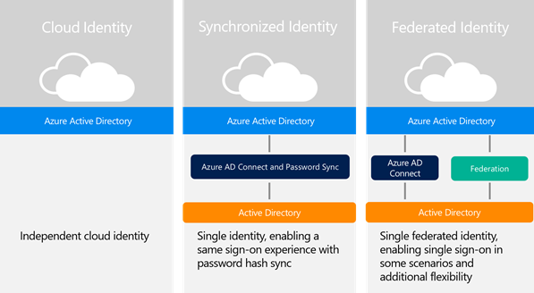
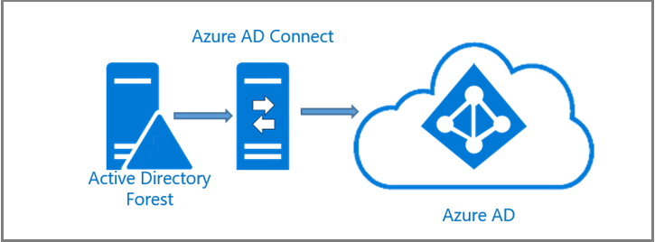
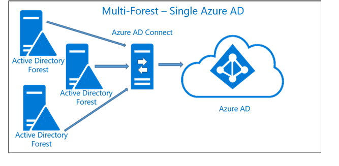
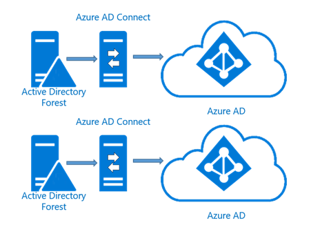
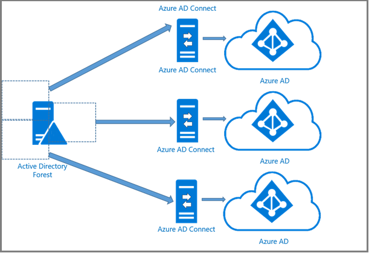

<properties
    pageTitle="Azure Active Directory Hybrid Identität gibt - Definieren einer Hybrid Identität-Einführung | Microsoft Azure"
    description="Mit bedingten Access-Steuerelement überprüft Azure Active Directory die bestimmten Bedingungen, die Sie bei der Authentifizierung des Benutzers und vor dem Gewähren des Zugriffs auf die Anwendung auswählen. Nachdem Sie diese Bedingung erfüllt sind, wird der Benutzer authentifiziert und Zugriff auf die Anwendung zulässig."
    documentationCenter=""
    services="active-directory"
    authors="billmath"
    manager="femila"
    editor=""/>

<tags
    ms.service="active-directory"
    ms.devlang="na"
    ms.topic="article"
    ms.tgt_pltfrm="na"
    ms.workload="identity" 
    ms.date="08/08/2016"
    ms.author="billmath"/>

# Definieren einer Hybrid Identität-Einführung

In dieser Aufgabe erhalten Sie definieren die Hybrid Identität-Einführung nach Ihrer Hybrid Identität-Lösung für die Bedürfnisse zuschneiden, die in erläutert wurden:

- [Ermitteln Sie geschäftliche Anforderungen](active-directory-hybrid-identity-design-considerations-business-needs.md)
- [Ermitteln der Directory-Synchronisierung erforderlich](active-directory-hybrid-identity-design-considerations-directory-sync-requirements.md)
- [Ermitteln Sie die kombinierte authentifizierungsanforderungen](active-directory-hybrid-identity-design-considerations-multifactor-auth-requirements.md)

## Definieren von Business Anforderungen Strategie
Die ersten Aufgabe Adressen bestimmen Organisationen Unternehmen muss.  Dies kann sehr weit gefasste und Umfang verschieben kann auftreten, wenn Sie nicht vorsichtig sind.  In den Anfang Würze aber immer Denken Sie daran, die für einen Entwurf planen, die in der Zukunft zu erleichtern ändern und Tabellenbereich an.  Unabhängig davon, ob es ein einfaches Design oder eine äußerst komplex ist ist Azure Active Directory die Microsoft Identity-Plattform, die Beachten Sie Office 365, Microsoft Online Services und Cloud-Anwendungen unterstützt.

## Definieren einer Integrationsstrategie
Microsoft hat drei Hauptfenster Integrationsszenarios die Cloud Identitäten, synchronisierte Identitäten und verbundenen Identitäten sind.  Planen Sie auf eine der folgenden Strategien Integration eingeführt.  Die Strategie, die Sie auswählen können variieren und die Entscheidungen treffen bei der Auswahl einschließen, welche Art von Benutzerfunktionalität bereitstellen zu können, müssen Sie einige der vorhandenen bereits in-situ-Infrastruktur, und was ist die Kosten effektivsten werden soll.  
 

Die folgenden Szenarien, die in der Abbildung oben definiert sind:

- **Cloud Identitäten**: Hierbei handelt es sich um Identitäten, die ausschließlich in der Cloud vorhanden sind.  Im Falle von Azure AD würden sie insbesondere in Ihrem Verzeichnis Azure AD-befinden.
- **Synchronisierte**: Hierbei handelt es sich um Identitäten, die lokal vorhanden sind und in der Cloud.  Verwenden Azure AD-Verbindung herstellen, diese Benutzer erstellt oder mit vorhandenen Azure AD-Konten beigetreten.  Kennworthash des Benutzers wird aus der lokalen Umgebung synchronisiert, in der Cloud auf was eine Kennworthash aufgerufen wird.  Wenn mit synchronisiert ist eine Einschränkung, wenn ein Benutzer in der lokalen Umgebung deaktiviert ist, kann es für dieses Kontostatus in Azure AD angezeigt bis zu 3 Stunden dauern.  Dies ist aufgrund der Synchronisierung Zeitraum aus.
- **Verbundene**: diese Identitäten vorhanden sein, beide lokal und in der Cloud.  Verwenden Azure AD-Verbindung herstellen, diese Benutzer erstellt oder mit vorhandenen Azure AD-Konten beigetreten.  
 
>[AZURE.NOTE]
Weitere Informationen über die Synchronisierung Weitere Optionen [Integration von Ihrem lokalen Identitäten mit Azure Active Directory](active-directory-aadconnect.md).

In der folgenden Tabelle helfen Ihnen bei der Festlegung, die vor- und Nachteile der folgenden Strategien.

| Strategie         | Vorteile                                                                                                                                                                                                                                                  | Nachteile                                                                                                                                                                                                                                                                                                                                                  |
|------------------|-------------------------------------------------------------------------------------------------------------------------------------------------------------------------------------------------------------------------------------------------------------|----------------------------------------------------------------------------------------------------------------------------------------------------------------------------------------------------------------------------------------------------------------------------------------------------------------------------------------------------------------|
| **Cloud Identitäten** | Einfacher für kleine Unternehmen verwalten.   Nichts zu installieren auf lokale keine zusätzlichen Hardware erforderlich Einfach deaktiviert, wenn der Benutzer das Unternehmen verlassen hat.                                                                                                   | Benutzer müssen sich anmelden beim Auslastung in der Cloud Zugriff auf   Kennwörter möglicherweise oder möglicherweise nicht für Cloud und lokale Identitäten gleich                                                                                                                                                                                                                     |
| **Synchronisiert**     | Lokale Kennwort wird sowohl lokalen authentifizieren und cloud Verzeichnisse durchsuchen  Einfacher für kleine, mittlere und große Organisationen verwalten  Benutzer können einmaliges Anmelden (SSO) für einige Ressourcen haben.   Microsoft bevorzugte Methode für die Synchronisierung   Einfacher zu verwalten | Einige Kunden ihre Verzeichnisse mit der Cloud Fälligkeitsdatum bestimmte Unternehmens Polizei synchronisieren zögern möglicherweise                                                                                                                                                                                                                                                  |
| **Partnersuche**        | Benutzer können einmaliges Anmelden (SSO) haben.  Wenn ein Benutzer beendet wird oder belässt, das Konto sofort deaktiviert werden kann, und Zugriff widerrufen,  Unterstützt erweiterte Szenarien, die nicht sein, mit lesbar synchronisiert                                           | Weitere Schritte zum Einrichten und konfigurieren   Höhere Wartung   Für die Infrastruktur STS möglicherweise zusätzliche Hardware benötigt werden.   Sie erfordern möglicherweise zusätzlichen Hardware zum Installieren des Servers Föderation. Zusätzlicher Software ist erforderlich, wenn AD FS verwendet wird   Die umfassende Setup für SSO erforderlich   Kritisch auftretende Fehler, wenn der Server Föderation ausgefallen ist, wird nicht Benutzer authentifiziert werden |

### Client-Benutzeroberfläche
Die Strategie, die Sie verwenden, wird das Anmeldeverhalten für Benutzer bestimmen.  Den folgenden Tabellen finden Sie Informationen, welche Benutzer ihre Anmeldeverhalten werden erwarten sollte.  Beachten Sie, dass nicht alle partnerverbundkontakte Identitätsanbieter SSO in allen Szenarien unterstützen.

**Domäne verknüpft sind und die private Netzwerk Applications**:
 

|                              | Synchronisierte Identität      | Partnerverbundkontakte Identität                                           |
|------------------------------|----------------------------|--------------------------------------------------------------|
| Webbrowser                 | Formularbasierte Authentifizierung | Einmaliges aktivieren, manchmal erforderlich, um Organisations-ID angeben. |
| Outlook                      | Aufforderung zur Eingabe der Anmeldeinformationen     | Aufforderung zur Eingabe der Anmeldeinformationen                                       |
| Skype for Business (Lync)    | Aufforderung zur Eingabe der Anmeldeinformationen     | einmaligen Anmeldung für Lync, Exchange werden Anmeldeinformationen aufgefordert   |
| SkyDrive Pro                 | Aufforderung zur Eingabe der Anmeldeinformationen     | Einmaliges Anmelden                                               |
| Office Pro Plus Abonnement | Aufforderung zur Eingabe der Anmeldeinformationen     | Einmaliges Anmelden                                               |

**Externe oder nicht vertrauenswürdige Quellen**:

|                              | Synchronisierte Identität      | Partnerverbundkontakte Identität                                           |
|------------------------------|----------------------------|--------------------------------------------------------------|
| Webbrowser                 | Formularbasierte Authentifizierung |  Formularbasierte Authentifizierung |
| Outlook Skype for Business (Lync), Skydrive Pro, Office-Abonnement| Aufforderung zur Eingabe der Anmeldeinformationen     | Aufforderung zur Eingabe der Anmeldeinformationen                                       |
| Exchange ActiveSync    | Aufforderung zur Eingabe der Anmeldeinformationen     | einmaligen Anmeldung für Lync, Exchange werden Anmeldeinformationen aufgefordert   |
| Mobile-apps                 | Aufforderung zur Eingabe der Anmeldeinformationen     | Aufforderung zur Eingabe der Anmeldeinformationen                                               |

Wenn Sie aktuell eine 3rd party IdP oder werden übergeht, um eine verwenden, um die Föderation mit Azure AD Bereitstellen von Aufgabe 1 ermittelt haben, müssen Sie die folgenden unterstützten Funktionen berücksichtigen:
- Alle SAML 2.0-Anbieter, der für das Profil SP Lite kompatibel ist Azure AD-Authentifizierung unterstützt und verknüpften Applikationen
- Unterstützt passiven Authentifizierung, die Authentifizierung auf OWA, SPO usw. erleichtert.
- Exchange Online-Clients können über die SAML 2.0 erweiterte Client Profil (ECP) unterstützt werden

Sie müssen außerdem Achten Sie welche Funktionen nicht zur Verfügung stehen:

- WS-Trust/Verbund nicht unterstützen werden alle anderen aktiven Clients unterbrechen.
 - Das bedeutet, dass keine Lync-Client, OneDrive-Client, Office-Abonnement, Office Mobile vor Office 2016
- Übergang von Office zu passiven Authentifizierung erlaubt eine reines SAML 2.0 IdPs unterstützt, aber Support werden weiterhin auf Basis Client-von-client

>[AZURE.NOTE]
Die am häufigsten aktualisierte Liste finden Sie im Artikel http://aka.ms/ssoproviders.

## Definieren der Strategie für die Synchronisierung
In dieser Aufgabe definieren Sie die Tools, die für die Synchronisierung verwendet wird der Organisation lokaler Daten mit der Cloud und was Suchtopologie, die Sie verwenden sollen.  Da die meisten Organisationen Active Directory verwenden, werden Informationen zur Verwendung von Azure AD verbinden behoben werden die oben aufgeführten Fragen detailliert beschrieben bereitgestellt.  Für Umgebungen, die nicht Active Directory verfügen, gibt es Informationen zur Verwendung von FIM 2010 R2 oder MIM 2016 helfen, diese Strategie planen.  Jedoch zukünftige Versionen Azure AD verbinden wird LDAP-Verzeichnisse durchsuchen, also abhängig von der Zeitachse unterstützt, diese Informationen möglicherweise zu unterstützen.

###Tools für die Synchronisierung
In den Jahren haben verschiedene Tools für die Synchronisierung vorhanden und für verschiedene Szenarios verwendet.  Aktuell besteht Azure AD verbinden die Wahl bei allen unterstützten Szenarien zu wechseln.  AAD synchronisieren und DirSync auch noch versehen sind und sogar möglicherweise in Ihrer Umgebung präsentieren jetzt. 

>[AZURE.NOTE]
Lesen Sie die neuesten Informationen zu den unterstützten Funktionen der einzelnen Tools [Directory Integration Tools Vergleich](active-directory-hybrid-identity-design-considerations-tools-comparison.md) Artikel aus.  

### Unterstützte Topologien
Wenn Sie eine Strategie für die Synchronisierung definieren, muss der Suchtopologie, die verwendet wird, bestimmt werden. Je nach den Informationen, der in Schritt ermittelt wurde können 2 Sie bestimmen, welche Suchtopologie das richtige Schema verwendet wird. Der einzelnen Struktur, auf einzelne Azure AD-Suchtopologie ist die am häufigsten verwendeten und besteht aus einer einzigen Active Directory-Gesamtstruktur und einer einzelnen Instanz von Azure AD.  Dies wird gezeigt, in die Mehrzahl der Szenarien verwendet werden und die erwarteten Suchtopologie bei Verwendung von Installation Azure AD Express verbinden, wie in der folgenden Abbildung gezeigt.
 
Einzelne Gesamtstruktur Szenario kommt es häufig für große und selbst kleine Unternehmen können mehrere Gesamtstrukturen Siehe Abbildung 5.

>[AZURE.NOTE]
Weitere Informationen zu den unterschiedlichen lokalen und Azure AD-Topologien mit Azure AD verbinden lesen synchronisieren im Artikel [Topologien für Azure AD verbinden](active-directory-aadconnect-topologies.md).

 

Szenario mit mehreren Gesamtstrukturen

Wenn dies der Fall und der Suchtopologie multi-forest-Single Azure AD berücksichtigt werden sollen, wenn Folgendes zutrifft:

- Benutzer haben nur 1 Identität in allen Gesamtstrukturen – eindeutig Erkennungszeichen Benutzer unten im Abschnitt dies ausführlicher beschrieben.
- Authentifizierung des Benutzers an die Gesamtstruktur, in der ihre Identität befindet
- Benutzerprinzipalnamen und Quelle Anker (unveränderlich Id) wird aus dieser Gesamtstruktur stammen.
- Alle Gesamtstrukturen stehen den Azure AD verbinden – Dies bedeutet, dass es nicht Domäne beigetreten und in einer DMZ platziert werden kann, wenn dies Dies vereinfacht werden muss.
- Benutzer haben nur ein Postfach
- Die Gesamtstruktur, die Postfach des Benutzers hostet weist die beste Datenqualität für Attribute sichtbar in Exchange globale Adressliste Liste (GAL)
- Wenn auf der Benutzer kein Postfach angezeigt wird, kann dann jeder Gesamtstruktur verwendet werden beteiligen möchten diese Werte
- Wenn Sie ein verknüpftes Postfach verfügen, klicken Sie dann wird auch ein anderes Konto in einer anderen Gesamtstruktur anmelden verwendet.

>[AZURE.NOTE]
Objekte, die in beiden lokal und in der Cloud vorhanden sind, "verbunden" über einen eindeutigen Bezeichner. Im Kontext der Verzeichnissynchronisation wird diese eindeutige ID als die SourceAnchor bezeichnet. Im Kontext des einmaligen Anmeldens wird diese als die ImmutableId bezeichnet. [Entwurfskonzepte für Azure AD verbinden](active-directory-aadconnect-design-concepts.md#sourceanchor) für weitere Aspekte zur Verwendung von SourceAnchor.

Wenn oben nicht true oder sind mehrere aktive Konto oder mehr als einem Postfach, wird Azure AD Verbinden wählen Sie eine und anderen ignorieren.  Wenn Postfächer, aber kein anderes Konto vorhanden sind, diese Konten nicht exportiert werden, Azure AD- und diesen Benutzer kein Mitglied einer beliebigen Gruppen.  Dies unterscheidet sich von wie es in der Vergangenheit mit DirSync wurde und ist beabsichtigt, um eine bessere Support folgenden Szenarien mit mehreren Gesamtstrukturen. Ein Szenario mit mehreren Gesamtstrukturen ist in der folgenden Abbildung gezeigt.
 
 
 
**Mit mehreren Gesamtstrukturen mehrere Azure AD-Szenario**

Es wird empfohlen, dass nur ein einzelnes Verzeichnis in Azure AD für eine Organisation wird jedoch unterstützt er eine 1:1-Beziehung zwischen einem Azure AD verbinden synchronisieren-Server und einem Azure AD-Verzeichnis beibehalten.  Für jede Instanz von Azure AD benötigen Sie eine Installation von Azure AD verbinden.  Ferner Azure AD vorgesehen ist isoliert und Benutzer in einer Instanz von Azure AD werden nicht für Benutzer in einer anderen Instanz angezeigt.

Es ist möglich und unterstützte eine lokale Instanz von Active Directory auf mehrere Azure AD-Verzeichnisse zu verbinden, wie in der folgenden Abbildung dargestellt:

 
 

**Filterung Szenario einzelnen Gesamtstruktur**

Damit diese wie folgt vorgehen muss erfüllt werden:

- Azure AD verbinden synchronisieren Servern müssen konfiguriert sein, zum Filtern, sodass sie jeweils eine gegenseitig Objektgruppe haben.  Dies erledigt, beispielsweise nach jeder Server mit einer bestimmten Domäne oder Organisationseinheit Bereichsdefinition.
- Eine DNS-Domäne kann nur in einem einzigen registriert werden Azure AD-Verzeichnis also die Benutzerprinzipalnamen der Benutzer in der lokalen AD separaten Namespaces verwenden muss
- Benutzer in einer Instanz von Azure AD werden nur Benutzer aus ihrer Instanz verdeckt werden sollen.  Sie werden können nicht auf Benutzer in anderen Instanzen angezeigt
- Nur eine der Azure AD-Verzeichnisse Exchange-Hybrid mit der lokalen aktivieren kann AD
- Gemeinsamen Ausschließlichkeit gilt auch zum Schreiben-zurück.  Dadurch werden einige schreiben-Back-Features, die mit diesem Suchtopologie nicht unterstützt, da diese eine einzelnen lokalen Konfiguration angenommen.  Dies umfasst:
 - Gruppieren schreiben-Back mit Standard-Konfiguration
 - Gerät schreiben-zurück

Achten Sie darauf, dass die folgenden nicht unterstützt wird und nicht als Implementierung ausgewählt werden:

- Es wird nicht unterstützt, damit mehrere Azure AD verbinden synchronisieren Server herstellen von Verbindungen mit demselben Azure AD-Verzeichnis, auch wenn sie zur gegenseitig Festlegen des Objekts synchronisieren konfiguriert sind
- Es wird nicht unterstützt, wenn Sie um das gleiche Benutzerkonto an mehrere Azure AD-Verzeichnisse zu synchronisieren. 
- Es wird auch nicht unterstützt, damit eine Konfiguration ändern, damit Benutzer in einer Azure Active Directory als Kontakte in ein anderes Azure AD-Verzeichnis angezeigt wird. 
- Es ist auch nicht unterstützte Azure AD verbinden synchronisieren Verbindung zu mehreren Azure AD-Verzeichnisse zu ändern.
- Azure AD-Verzeichnisse sind standardmäßig isoliert. Es wird nicht unterstützt, ändern Sie die Konfiguration von Azure AD verbinden synchronisieren zum Lesen von Daten aus einem anderen Azure AD-Verzeichnis in ein Versuch, eine allgemeine und einheitliche GAL zwischen den Verzeichnissen zu erstellen. Wird auch zum Exportieren von Benutzern als Kontakte nicht unterstützt ein anderes lokalen Active Directory mithilfe von Azure AD verbinden synchronisieren.

>[AZURE.NOTE]
Wenn Ihre Organisation Computern in Ihrem Netzwerk herstellen einer Verbindung mit dem Internet hindert, wird in diesem Artikel werden die Endpunkte (Fully IPv4 oder IPv6 Bereiche Adresse), dass in aufgenommen werden sollen Ihre ausgehende zulassen Listen und Internet Explorer vertrauenswürdiger Websites von Client Computern, um sicherzustellen, dass die vorhandenen Computer können erfolgreich Verwenden von Office 365. Weitere Informationen finden Sie bei [Office 365-URLs und IP-Adressbereiche](https://support.office.com/article/Office-365-URLs-and-IP-address-ranges-8548a211-3fe7-47cb-abb1-355ea5aa88a2?ui=en-US&rs=en-US&ad=US).

## Mehrstufige Authentifizierungsstrategie definieren
In dieser Aufgabe definieren Sie die kombinierte Authentifizierungsstrategie zu verwenden.  Zwei verschiedenen Version Datenbankobjekt Azure kombinierte Authentifizierung.  Eine ist eine cloudbasierte und der andere mithilfe von Azure MFA Server basierend auf lokale.  Abhängig von der Auswertung Sie über Sie ermitteln können die Lösung für strategische richtig ist.  Verwenden Sie in der nachfolgenden Tabelle, um zu bestimmen, welche Entwurf Option bewährte Erfüllung Ihres Unternehmens Sicherheit Anforderung:

Mehrstufige Entwurfsoptionen:

| Anlage gesichert                                               | MFA in der cloud | MFA lokal |
|---------------------------------------------------------------|------------------|----------------|
| Microsoft-apps                                                | Ja              | Ja            |
| SaaS apps im app-Katalog                                  | Ja              | Ja            |
| IIS-Applikationen über Azure AD App Proxy veröffentlicht         | Ja              | Ja            |
| IIS-Anwendungen, die nicht über den Azure AD App Proxy veröffentlicht | Nein               | Ja            |
| RAS als VPN, RDG                                     | Nein               | Ja            |

Obwohl Sie an einer Lösung für strategische ausgeglichen möglicherweise, müssen Sie verwenden die Auswertung von oben auf die Stelle, an der der Benutzer gespeichert sind.  Dadurch kann die Lösung zu ändern.  Verwenden Sie in der nachfolgenden Tabelle unterstützen Sie dies zu ermitteln:

| Benutzerstandort einstellen                                                       | Bevorzugtes Design-option                 |
|---------------------------------------------------------------------|-----------------------------------------|
| Azure-Active Directory                                              | Multi-FactorAuthentication in der cloud |
| Azure AD- und lokalen Active Directory mithilfe des Föderation mit AD FS             | Beide                                    |
| Azure AD- und lokalen Active Directory mithilfe von Azure AD verbinden kein Kennwort synchronisieren | Beide                                    |
| Azure AD- und lokalen mit Azure AD-Verbinden mit Kennwort synchronisieren  | Beide                                    |
| Lokalen AD                                                      | Mehrstufige Authentifizierungsserver      |

>[AZURE.NOTE]
Sie sollten auch sicherstellen, dass die kombinierte Authentifizierung Entwurf Option, die Sie ausgewählt haben, die Features unterstützt, die für den Entwurf erforderlich sind.  Weitere Informationen finden Sie unter [auswählen die kombinierte Lösung für Sie](../multi-factor-authentication-get-started.md#what-am-i-trying-to-secure).

## Mehrstufige Authentifizierung Anbieter
Mehrstufige Authentifizierung steht standardmäßig für globale Administratoren, die einen Mandanten Azure Active Directory haben. Hingegen Falls gewünscht zu erweitern kombinierte Authentifizierung für alle Benutzer und/oder möchten Ihre globalen Administratoren Vorteil Features wie die Verwaltungsportal, benutzerdefinierte Grüße und Berichte zu optimieren können, muss dann erwerben und mehrstufige Authentifizierungsanbieter konfigurieren.

>[AZURE.NOTE]
Sie sollten auch sicherstellen, dass die kombinierte Authentifizierung Entwurf Option, die Sie ausgewählt haben, die Features unterstützt, die für den Entwurf erforderlich sind. 

##Nächste Schritte
[Ermitteln Sie Daten Schutz Anforderungen](active-directory-hybrid-identity-design-considerations-dataprotection-requirements.md)

## Siehe auch
[Entwurf Aspekte (Übersicht)](active-directory-hybrid-identity-design-considerations-overview.md)
