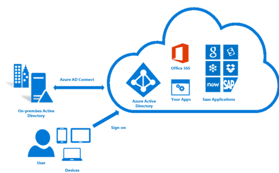

<properties
    pageTitle="Azure Active Directory Hybrid Identität Entwurf Faktoren - bestimmen Hybrid Identität Lebenszyklus-Einführung | Microsoft Azure"
    description="Hilft, die Hybrid Identität Verwaltungsaufgaben entsprechend die verfügbaren Optionen für jede Phase des Lebenszyklus definieren."
    documentationCenter=""
    services="active-directory"
    authors="billmath"
    manager="femila"
    editor=""/>

<tags
    ms.service="active-directory"
    ms.devlang="na"
    ms.topic="article"
    ms.tgt_pltfrm="na"
    ms.workload="identity"
    ms.date="08/08/2016"
    ms.author="billmath"/>

# Ermitteln der Hybrid Identität Lebenszyklus-Einführung
In dieser Aufgabe erhalten Sie definieren die Identität Management-Strategie für Ihre Identität Lösung Hybrid, um die Bedürfnisse zuschneiden, die Sie im [ermitteln Hybrid Identität Verwaltungsaufgaben](active-directory-hybrid-identity-design-considerations-hybrid-id-management-tasks.md)definiert.

Definieren die Hybrid Identität Verwaltungsaufgaben entsprechend den End-to-End-Identität Lebenszyklus präsentiert weiter oben in diesem Schritt müssen Sie erwägen Sie die Optionen für die einzelnen Phasen Lebenszyklus zur Verfügung.

## Access Management und Bereitstellung
Mit einem guten Konto Access Management-Lösung kann Ihrer Organisation genau verfolgen, die in der gesamten Organisation auf welche Informationen zugreifen.

Access-Steuerelement ist eine kritische Funktion von einer zentralen, zentralen Bereitstellungssystems. Neben dem Schutz von vertraulichen Informationen, Access-Steuerelemente verfügbar machen vorhandene Konten, die nicht genehmigte Autorisierungs oder nicht mehr erforderlich sind. Veraltete Konten, die Bereitstellung System Links nicht trennen Kontoinformationen mit autorisierende Informationen zu den Benutzern steuern, wer die Konten besitzen. Autoritative Identität Benutzerinformationen wird in der Regel in die Datenbanken und Verzeichnisse Taschenrechner verwaltet.

Konten in anspruchsvolle IT-Unternehmen umfassen hundert Parameter, die die Behörden definieren, und diese Details durch Ihre Bereitstellungssystems gesteuert werden können. Neue Benutzer können mit den Daten, die Sie aus der autorisierenden Quelle bereitstellen, identifiziert werden. Die Funktion Access Anforderung Genehmigung initiiert die Prozessen, die für diese bereitgestellt Ressource genehmigen (oder ablehnen).

| Lifecycle Management phase          | Lokal                                                                                                                                                                                                                                                       | Cloud                                                                                                                                                                                                                                                                                                                     | Hybrid                                                                                   |
|-------------------------------------|-------------------------------------------------------------------------------------------------------------------------------------------------------------------------------------------------------------------------------------------------------------------|---------------------------------------------------------------------------------------------------------------------------------------------------------------------------------------------------------------------------------------------------------------------------------------------------------------------------|------------------------------------------------------------------------------------------|
| Verwaltung der Benutzerkonten und Bereitstellung | Sie können mithilfe der Funktion® Active Directory-Domänendiensten (AD DS) Servers erstellen eine skalierbare, sichere und verwaltbare Infrastruktur für die ressourcenverwaltung von Benutzern und und bieten Unterstützung für Applikationen wie Microsoft® Exchange Server-Verzeichnis aktiviert.    [Sie können Gruppen in AD DS über eine Identitätsmanager bereitstellen.](https://technet.microsoft.com/library/ff686261.aspx)  [Sie können die Benutzer in AD DS bereitstellen.](https://technet.microsoft.com/library/ff686263.aspx)    Access-Steuerelement können Administratoren zur Verwaltung des Benutzerzugriffs auf freigegebene Ressourcen aus Sicherheitsgründen. Access-Steuerelement wird in Active Directory auf Objektebene durch Festlegen von verschiedenen Ebenen von Access oder die Berechtigungen, um Objekte verwaltet wie Vollzugriff, lesen, schreiben oder kein Zugriff. Access-Steuerelement in Active Directory definiert, wie verschiedene Benutzer können Active Directory-Objekte. Standardmäßig werden Berechtigungen für Objekte in Active Directory auf die sicherste Einstellung festgelegt. | Sie müssen ein Konto für jeden Benutzer zu erstellen, die auf einer Microsoft-Cloud-Dienst zugreifen. Sie können auch Benutzerkonten ändern oder löschen können, wenn sie nicht mehr benötigt werden. Standardmäßig Benutzer verfügen nicht über Administratorberechtigungen, aber Sie können sie wahlweise zuweisen. Weitere Informationen finden Sie unter [Verwalten von Benutzern in Azure Active Directory](active-directory-create-users.md).    Innerhalb von Azure Active Directory ist eines der wichtigsten Features die Möglichkeit zum Verwalten des Zugriffs auf Ressourcen. Diese Ressourcen können Teil des Verzeichnisses, wie in der Groß-/Kleinschreibung von Berechtigungen zum Verwalten von Objekten durch Rollen im Verzeichnis oder Ressourcen, die außerhalb Verzeichnis, wie z. B. SaaS Applications, Azure Services und SharePoint-Websites oder auf lokale Ressourcen werden.    In der Mitte der Azure Active Directory Zugriff ist die Lösung für die Sicherheitsgruppe. Der Ressourcenbesitzer (oder der Administrator des Verzeichnisses) weisen eine Gruppe aus, um einen bestimmten Zugangspunkt nach den Ressourcen zu schaffen, die sie besitzen. Die Mitglieder der Gruppe Zugriff bereitgestellt werden, und der Ressourcenbesitzer kann das Recht, die Mitgliederliste einer Gruppe Person – wie etwa einen Abteilungsleiter oder eine Helpdesk-Administratoren delegieren    Verwalten von Gruppen in Azure AD-Thema enthält weitere Informationen zum Verwalten des Benutzerzugriffs mithilfe der Gruppen.| Erweitern Sie in der Cloud, bis die Synchronisierung und Föderation Active Directory-Identitäten |

## Rollenbasierte Access-Steuerelement
Rollenbasierte Access (RBAC) verwendet Rollen steuern und Bereitstellen von Richtlinien für ausgewertet werden soll, testen und Ihre Geschäftsprozesse und Regeln zum Gewähren des Zugriffs für Benutzer erzwingen. Key Administratoren provisioning Richtlinien erstellen und Zuweisen von Benutzern zu Rollen und die Sätze von Berechtigungen zu Ressourcen für diese Rollen definieren. RBAC erweitert die Identität Management-Lösung um verwenden Prozesse Software- und manuellen Interaktion des Benutzers bei der Bereitstellung zu verringern.
Azure AD RBAC ermöglicht das Unternehmen, das die Menge der Vorgänge einschränken, die eine Einzelperson ausführen können, nachdem er auf Azure-Verwaltungsportal zugreifen kann. Mithilfe der RBAC zum Steuern des Zugriffs auf das Portal IT-Administratoren ca Zugriffsrechte für Stellvertretung mithilfe der folgenden Vorgehensweisen Access Management:

- **Gruppe-basierten rollenzuweisung**: Sie können Access Azure AD-Gruppen, die synchronisiert werden können von Ihrem lokalen Active Directory zuweisen. So können Sie die vorhandene Investitionen nutzen, die Ihre Organisation in Tools und Prozessen für das Verwalten von Gruppen. Sie können auch das delegierte Gruppe Management-Feature von Azure AD Premium verwenden.
- **Nutzung in Rollen in Azure erstellt**: Sie können drei Rollen – Besitzer, Mitwirkender und Reader, um sicherzustellen, dass Benutzer und Gruppen berechtigt sind nur die Aufgaben ausführen, sie ihre Aufgaben ausführen müssen.
- **Granulat Zugriff auf Ressourcen**: Sie können Benutzer und Gruppen für ein bestimmtes Abonnement, Ressourcengruppe oder eine einzelne Azure Ressource z. B. einer Website oder eine Datenbank Rollen zuweisen. Auf diese Weise können Sie sicherstellen, dass Benutzer haben Zugriff auf die benötigten Ressourcen und keinen Zugriff auf Ressourcen, die sie nicht benötigen, zu verwalten.

## Provisioning und anderen Anpassungsoptionen
Ihr Team können Business-Pläne und Anforderungen Sie entscheiden, wie viel die Identität Lösung anpassen. Beispielsweise möglicherweise ein großen Unternehmen einen SmartArt verteilen Plan für Workflows und benutzerdefinierte Netzwerkadapter, die auf einer Zeitachse für die Bereitstellung von Applications, die verschiedenen Standorten weit verbreitet ist inkrementell basiert. Einen anderen Plan der Anpassung können Sie für zwei oder mehr Applications in einer gesamten Organisation, nach dem erfolgreichen Testen bereitgestellt werden bereitstellen. Benutzer-Anwendung Interaktion angepasst werden kann, und Verfahren für die Bereitstellung von Ressourcen möglicherweise geändert werden, um automatisierten Bereitstellung aufnehmen zu können.

Sie können entziehen, um einen Dienst oder eine Komponente zu entfernen. Entfernung von einem Konto bedeutet z. B., dass das Konto aus einer Ressource gelöscht wird.

Hybrid-Modell des Bereitstellung von Ressourcen kombiniert Anfrage und rollenbasierte Ansätze, die beide von Azure AD unterstützt werden. Für eine Teilmenge von Mitarbeitern oder verwaltete Systeme sollten ein Unternehmens am effektivsten Automatisieren von Access mit rollenbasierte Zuordnung. Ein Unternehmen möglicherweise auch alle anderen zugriffsanforderungen oder Ausnahmen durch eine Anforderung basierendes Modell behandeln. Einige Unternehmen möglicherweise mit manuellen Zuordnung beginnen und Richtung eines Modells Hybrid, mit einer Absicht, eine vollständig rollenbasierte Bereitstellung zu einem späteren Zeitpunkt weiterentwickelt.

Anderen Unternehmen möglicherweise nicht praktikabel geschäftlichen Gründen erzielen vollständige rollenbasierte Bereitstellung zu finden, und einen gemischter Ansatz als gewünschte Ziel adressieren. Immer noch in anderen Unternehmen möglicherweise mit nur Anforderung-basiertes provisioning einverstanden, und nicht investieren zusätzlichen Aufwand definieren und rollenbasierte, automatisierte provisioning Richtlinien verwalten möchten.

## Lizenzmanagement
Arbeitsgruppen-Lizenzmanagement in Azure AD-kann Administratoren Zuweisen von Benutzern zu einer Sicherheitsgruppe und Azure AD weist Lizenzen automatisch für alle Mitglieder der Gruppe. Wenn ein Benutzer später hinzugefügt oder aus der Gruppe entfernt, wird eine Lizenz automatisch zugewiesen oder entfernt je nach Bedarf.

Sie können die Gruppen, die Sie synchronisieren aus lokalen AD oder in Azure Active Directory verwalten. Paarweise Zuordnung dies von mit Azure AD-Premium Verwaltung von Self-Service-Gruppen können Sie ganz einfach Lizenzen zugewiesen an die entsprechenden Entscheidungsträger delegieren. Sie können sicher sein, dass Probleme wie lizenzkonflikten und fehlende Standortdaten automatisch sortiert werden.

## Self Überwachung des Benutzeradministration
Wenn Ihre Organisation Bereitstellung von Ressourcen für alle internen Organisationen beginnt, können Sie die Überwachung Self des Verwaltungskonsole Benutzerfunktionen implementieren. Sie können die vor- und die Vorteile der Bereitstellung Benutzer über organisationsinterne hinweg einreichen. In dieser Umgebung ist eine Änderung der Status eines Benutzers automatisch in Zugriffsrechte über die Organisation Begrenzung und Regionen angezeigt. Sie können provisioning senken und den Zugriff und Genehmigung Prozesse optimieren. Die Implementierung erkennt des vollen Potenzials implementieren rollenbasierte Access-Steuerelements für End-to-End-Access Management in Ihrer Organisation an. Sie können die Verwaltungskosten durch automatisierte Verfahren für die Verwaltung der Benutzer bereitgestellt reduzieren. Sicherheit durch Automatisierung der Durchsetzung von Richtlinie, verbessern und optimieren, und zentrale Benutzer Lifecycle Management und Ressourcen für Benutzer große Bevölkerung bereitgestellt.

>[AZURE.NOTE]
Weitere Informationen finden Sie unter Einrichten von Azure AD für die Verwaltung von Self-Service-Anwendung access

Lizenz-basierten (Anspruch-basiert) Azure AD services Arbeit durch Aktivieren eines Abonnements in Ihrem Azure AD-Mandanten Directory-Dienst an. Nachdem das Abonnement aktiv ist können Servicefunktionen von Administratoren Directory-Dienst verwaltet werden und von lizenzierten Benutzern verwendet werden. Weitere Informationen finden Sie unter Funktionsweise von Azure AD-Lizenzierung arbeiten?
Integration in andere 3rd Party-Anbieter

Azure-Active Directory bietet einmalige Anmelden auf und erweiterte Anwendung Zugriffsschutz für Tausende von Applications SaaS und lokalen Webanwendungen. Eine ausführliche Liste Azure Active Directory-Anwendung Katalog für unterstützte SaaS Applikationen, finden Sie unter Azure Active Directory Federation Kompatibilitätsliste: Identitätsanbieter von Drittanbietern, die verwendet werden können, um implementieren einmaliges Anmelden

## Definieren der Synchronisierung management
Integrieren von Ihrem lokalen Verzeichnissen in Azure AD Ihrer Anwender macht produktiver durch Bereitstellen einer gemeinsamen Identität für den Zugriff auf sowohl die Cloud lokalen Ressourcen. Mit dieser Integration können Benutzer und Organisationen folgenden nutzen:

- Organisationen können Benutzer mit einer gemeinsamen Hybrid Identität über lokalen oder Cloud-basierte Services Nutzung von Windows Server Active Directory und dann herstellen von Verbindungen mit Azure Active Directory bereitstellen.
- Administratoren können bedingte basierend auf Anwendungsressource, Gerät und Benutzeridentität, Netzwerkspeicherort und kombinierte Authentifizierung zugreifen.
- Benutzer können ihre allgemeine Identität über Konten in Azure AD zu Office 365, Intune, SaaS apps und Anwendungen von Drittanbietern nutzen.
- Können Entwickler Applications, die allgemeine Identitätsmodell nutzen Integration von Applications in Active Directory lokalen oder Azure für Applikationen cloudbasierten

Die folgende Abbildung enthält ein Beispiel für eine Ansicht auf hoher Ebene Identität Synchronisierungsprozess.

Identität Synchronisierungsprozess

Überprüfen Sie in der folgenden Tabelle aus, um die Optionen für die Synchronisierung vergleichen:

| Management (Synchronisierungsoption)          | Vorteile                                                                                                                                                                                                                                                                                                                                                                                                                                                                                                                                                                                                                                                                                                                                                                                                                                                                                                                                                                     | Nachteile                                                                                                                                                                                                                                                                                  |
|--------------------------------------------|--------------------------------------------------------------------------------------------------------------------------------------------------------------------------------------------------------------------------------------------------------------------------------------------------------------------------------------------------------------------------------------------------------------------------------------------------------------------------------------------------------------------------------------------------------------------------------------------------------------------------------------------------------------------------------------------------------------------------------------------------------------------------------------------------------------------------------------------------------------------------------------------------------------------------------------------------------------------------------|------------------------------------------------------------------------------------------------------------------------------------------------------------------------------------------------------------------------------------------------------------------------------------------------|
| Synchronisieren-basierten (über DirSync oder AADConnect) | Benutzer und Gruppen aus lokalen und Cloud synchronisiert    **Policy-Steuerung**: Kontorichtlinien können festgelegt werden, über Active Directory, die dem Administrator zum Verwalten von Kennwortrichtlinien, Arbeitsstationen, Einschränkungen Sperre Steuerelemente ermöglicht, sowie weitere, ohne zusätzliche Aufgaben in der Cloud.     **Access-Steuerelement**: kann in der Cloud-Service Zugriff einschränken, damit, dass die Dienste über die unternehmensumgebung durch online-Servern oder beides zugegriffen werden können.    Verringert Supportanrufe: Wenn Benutzer weniger Kennwörter haben, sind diese weniger wahrscheinlich, dass Sie diese vergessen.    Sicherheit: Benutzeridentitäten und Informationen sind geschützt, da alle Servern und Diensten in einmaligen Anmeldens vertraut sind, und lokalen gesteuert.    Unterstützung für die strenge Authentifizierung: strenge Authentifizierung (auch als Authentifizierung mit zwei Faktoren bezeichnet) können Sie mit der Cloud-Dienst verwenden. Wenn Sie strenge Authentifizierung verwenden, müssen Sie jedoch einmaliges Anmelden verwenden. |                                                                                                                                                                                                                                                                                                |
| Verbund basierende (über AD FS)           | Aktivierte Sicherheitstoken-Dienst (STS). Wenn Sie ein STS für den einzelnen anmelden Zugriff mit einem Microsoft-Cloud-Dienst konfigurieren, erstellen Sie eine Vertrauensstellung zwischen der lokalen STS und die verbunddomäne, die Sie in Ihrem Azure AD-Mandanten angegeben haben.   Ermöglicht es Endbenutzern mit demselben Satz von Anmeldeinformationen um für mehrere Ressourcen zu erhalten.  Endbenutzer müssen nicht mehrere Sätze von Anmeldeinformationen verwalten. Noch, müssen die Benutzer ihre Anmeldeinformationen auf jede der teilnehmenden Ressourcen, B2B und B2C Szenarien unterstützt.                                                                                                                                                                                                                                                                                                                                                                                                             | Erfordert spezielle Personal für Bereitstellung und Wartung der dedizierten auf Prem AD FS-Servern. Einschränkung der Verwendung von strenge Authentifizierung können, wenn Sie AD FS für Ihr STS verwenden möchten. Weitere Informationen finden Sie unter [Konfigurieren erweiterter Optionen für AD FS 2.0](http://go.microsoft.com/fwlink/?linkid=235649). |

>[AZURE.NOTE]
Weitere Informationen finden Sie unter [Integration von Ihrem lokalen Identitäten mit Azure Active Directory](active-directory-aadconnect.md).

## Siehe auch
[Entwurf Aspekte (Übersicht)](active-directory-hybrid-identity-design-considerations-overview.md)
