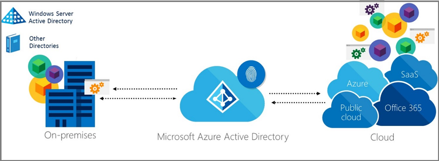

<properties
    pageTitle="Azure Active Directory Hybrid Identität gibt – Übersicht | Microsoft Azure"
    description="Übersicht und Inhalt Karte Hybrid Identität Design Aspekte Guide"
    documentationCenter=""
    services="active-directory"
    authors="billmath"
    manager="femila"
    editor=""/>

<tags
    ms.service="active-directory"
    ms.devlang="na"
    ms.topic="article"
    ms.tgt_pltfrm="na"
    ms.workload="identity" 
    ms.date="08/08/2016"
    ms.author="billmath"/>

# Azure-Active Directory Hybrid Identität Entwurfsaspekte

Consumer-basierte Geräte im Unternehmen weltweit sind nimmt zu, und cloudbasierten Software als Service (SaaS) Applikationen sind leicht zu übernehmen. Verwalten von Steuern des Benutzerzugriffs Anwendung auf interne Rechenzentren und Cloud-Plattformen ist daher schwierig.  Microsoft Identität Lösungen erstrecken lokalen und cloudbasierten-Funktionen, die eine einzelne Benutzeridentität für die Authentifizierung und Autorisierung für alle Ressourcen, unabhängig vom Standort erstellen. Wir nennen diese Hybrid Identität. Es gibt verschiedene Entwurf und Konfigurationsoptionen für Hybrid Identität mithilfe von Microsoft-Lösungen und in manchen Fällen, die sie möglicherweise schwierig zu bestimmen, welche Kombination optimale, werden die Anforderungen Ihrer Organisation. Diese Hybrid Identität Design Aspekte Guide hilft Ihnen zu verstehen, wie zum Entwerfen einer Hybrid Identität Lösung, die das Unternehmen am besten geeignet und Technologie für Ihre Organisation muss.  Mit diesem Leitfaden wird ausführlich, eine Reihe von Schritte und Aufgaben, die Sie folgen können, mit denen Sie die eine Identität Hybrid-Lösung zu entwerfen, die Anforderungen Ihrer Organisation entsprechen. In allen Schritte und Aufgaben präsentiert die Führungslinie die relevanten Technologien und Featureoptionen für Unternehmen besprechen funktionsübergreifendes und Service-Qualität (z. B. Verfügbarkeit, Skalierbarkeit, Leistung, Verwaltung und Sicherheit) Ebene Anforderungen. Insbesondere sind die Hybrid Identität Entwurf Aspekte Leitfaden Ziele die folgenden Fragen beantworten: 

- Welche Fragen stellen und beantworten einen Hybrid Identität-spezifische Entwurf für eine Domäne Technologie oder Problem Laufwerk, dass am besten Meine erfüllt erforderlich?
- Welche Abfolge von Aktivitäten sollte zum Entwerfen einer Lösung aus Hybrid Identität für die Domäne Technologie oder Problem abgeschlossen? 
- Welche Hybrid Identität-Technologie und Konfiguration Optionen stehen zur Verfügung, die mir Meine erfüllen helfen? Was sind die Interaktionen zwischen diesen Optionen, sodass die beste Option für mein Unternehmen ausgewählt werden können?

## Wer ist dieses Handbuch richtet?
 CIO, CITO, Leiter Identität Architekten, Unternehmensarchitekten und IT-Architekten für das Entwerfen einer Lösung Hybrid Identität, mittlere und große Organisationen verantwortlich ist.

## Wie können Sie dieses Handbuch unterstützen? 
In diesem Handbuch können Sie verstehen, wie eine gemischte Identität Lösung zu entwerfen, die eine cloudbasierte Identität Management-System Ihre aktuelle lokale Identität Lösung integrieren ist. Die folgende Grafik zeigt ein Beispiel für eine Identität Hybrid-Lösung, die es IT-Administratoren zum Verwalten ihrer aktuelle Windows Server Active Directory-Lösung integriert werden soll lokal mit Microsoft Azure Active Directory damit Benutzer für einmaliges Anmelden (SSO) für Webanwendungen befindet sich in der Cloud und lokal verwenden können sich befindet.

Die oben gezeigten Abbildung ist ein Beispiel für eine Identität Hybrid-Lösung, die Cloud Services zur Integration mit lokalen Funktionen um eine einzelne Erfahrung mit dem Endbenutzer-Authentifizierungsprozess bereitstellen und zur Vereinfachung ist die Nutzung von IT verwalten diese Ressourcen. Dies ein gängiges vorgehen werden kann, wird jeder Organisation Hybrid Identität Entwurf wahrscheinlich im Beispiel siehe Abbildung 1 aufgrund von verschiedenen Anforderungen abweichen. Dieses Handbuch bietet eine Reihe von Schritte und Aufgaben, die Sie folgen können, um einer Hybrid-Lösung Identität zu entwerfen, die Anforderungen Ihrer Organisation entsprechen. In den folgenden Schritten und Aufgaben enthält der Leitfaden Ihnen funktionsübergreifendes und Dienst Qualität Ebene für Ihre Organisation erfüllen die relevanten Technologien und Featureoptionen zur Verfügung.

**Annahmen**: Sie müssen einige Erfahrung mit Windows Server, Active Directory-Domänendiensten und Azure Active Directory. In diesem Dokument wird davon ausgegangen, dass Ihnen gesuchte wie folgenden Lösungsvorschlägen Ihrer Business auf ihren eigenen oder in einer integrierten Lösung Anforderungen können.

## Entwurf Aspekte (Übersicht)
Dieses Dokument enthält eine Reihe von Schritte und Aufgaben, die Sie folgen können, um eine gemischte Identität Lösung zu entwerfen, die Ihren Anforderungen am besten entspricht. Die Schritte sind in einer bestimmten Reihenfolge präsentiert werden. Entwurfsaspekte, die Sie in späteren Schritten erfahren Sie, müssen Sie möglicherweise in früheren Schritten, allerdings aufgrund widersprüchliche Designoptionen vorgenommenen Entscheidungen zu ändern. Jeder versucht wird, um Sie auf Entwurf Konflikte im gesamten Dokument hinzuweisen. 

Das Design wird Einblenden der zugehörigen, am besten Ihren Anforderungen entspricht, erst nach dem durchlaufen die Schritte so oft wie erforderlich sind, um alle Aspekte innerhalb des Dokuments einbinden. 

| Hybrid Identität Phase                                             | Thema-Liste                                                                                                                                                                                       |
|-------------------------------------------------------------------|--------------------------------------------------------------------------------------------------------------------------------------------------------------------------------------------------|
| Ermitteln der Identität Anforderungen                                   | [Ermitteln Sie geschäftliche Anforderungen](active-directory-hybrid-identity-design-considerations-business-needs.md)  [Ermitteln der Directory-Synchronisierung erforderlich](active-directory-hybrid-identity-design-considerations-directory-sync-requirements.md)  [Ermitteln Sie die kombinierte authentifizierungsanforderungen](active-directory-hybrid-identity-design-considerations-multifactor-auth-requirements.md)  [Definieren einer Hybrid Identität-Einführung](active-directory-hybrid-identity-design-considerations-identity-adoption-strategy.md)                       |
| Zur Verbesserung der Sicherheit von Daten über signifikante Identität Lösung planen | [Ermitteln Sie Daten Schutz Anforderungen](active-directory-hybrid-identity-design-considerations-dataprotection-requirements.md)   [Ermitteln der Content Management-Anforderungen](active-directory-hybrid-identity-design-considerations-contentmgt-requirements.md)  [Ermitteln Sie die Anforderungen für Access-Steuerelement](active-directory-hybrid-identity-design-considerations-accesscontrol-requirements.md)  [Ermitteln der Reaktion Anforderungen](active-directory-hybrid-identity-design-considerations-incident-response-requirements.md)   [Definieren der Strategie für den Datenschutz](active-directory-hybrid-identity-design-considerations-data-protection-strategy.md)  |
| Planen der Verwendung von Hybrid Identität Lebenszyklus                                | [Ermitteln der Hybrid Identität Verwaltungsaufgaben](active-directory-hybrid-identity-design-considerations-hybrid-id-management-tasks.md)   [Synchronisierung Management](active-directory-hybrid-identity-design-considerations-hybrid-id-management-tasks.md)  [Ermitteln der Hybrid Identität Management-Einführung](active-directory-hybrid-identity-design-considerations-lifecycle-adoption-strategy.md) |     

##Dieses Handbuch herunterladen
Sie können eine PDF-Version des Handbuchs Hybrid Identität gibt aus dem [Katalog Technet](https://gallery.technet.microsoft.com/Azure-Hybrid-Identity-b06c8288)herunterladen. 

                                                             
