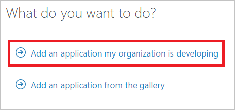
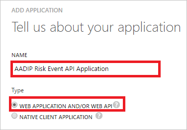
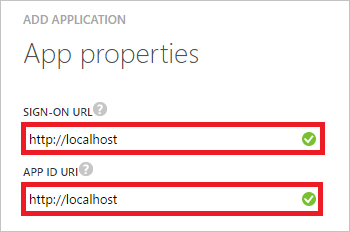
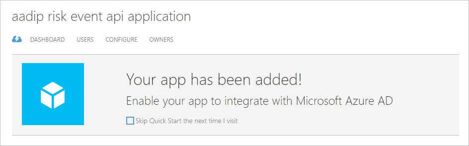
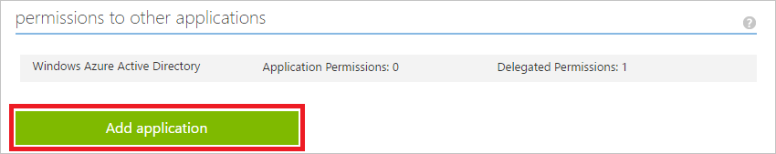
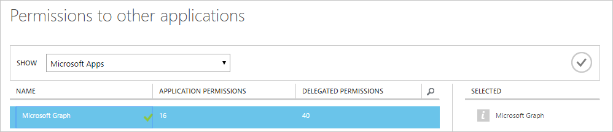
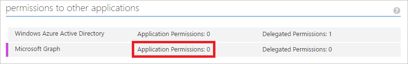
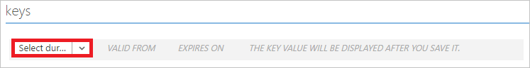
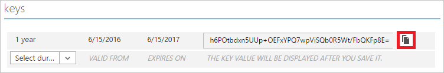

<properties
    pageTitle="Erste Schritte mit Azure Active Directory Identitätsschutz und Microsoft Graph | Microsoft Azure"
    description="Stellt eine Einführung in Microsoft Graph-Abfrage für eine Liste von Risikoereignisse und die zugehörigen Informationen aus Azure Active Directory."
    services="active-directory"
    keywords="Schutz der Azure-active Directory-Identität, Risikoereignis, Sicherheitsrisiko Sicherheitsrichtlinie, Microsoft Graph"
    documentationCenter=""
    authors="markusvi"
    manager="femila"
    editor=""/>

<tags
    ms.service="active-directory"
    ms.workload="identity"
    ms.tgt_pltfrm="na"
    ms.devlang="na"
    ms.topic="article"
    ms.date="08/22/2016"
    ms.author="markvi"/>

# Erste Schritte mit Azure Active Directory Identitätsschutz und Microsoft Graph

Microsoft Graph ist Microsoft einheitlichen API Endpunkt und den Start von [Azure Active Directory Schutz der Identität des](active-directory-identityprotection.md) APIs. Unsere erste API, **IdentityRiskEvents**, können Sie eine Abfrage Microsoft Graph für eine Liste von [Risikoereignisse](active-directory-identityprotection-risk-events-types.md) sowie zugehörige Informationen. In diesem Artikel wird Ihnen einen Einstieg diese API Abfragen. Für umfassenden Einführung, vollständige Dokumentation und den Zugriff auf das Graph-Explorer finden Sie in der [Microsoft Graph-Website](https://graph.microsoft.io/).

Es gibt drei Schritte zum Zugreifen auf Identitätsschutz Daten über Microsoft Graph ein:

1. Fügen Sie eine Anwendung mit einem Client geheim hinzu. 

2. Verwenden Sie diese geheim sowie einige andere Informationen zur Microsoft Graph, Authentifizierung, in dem Sie eine Authentifizierungstoken erhalten. 

3. Verwenden Sie dieses Token nehmen Sie Besprechungsanfragen an den Endpunkt API und Schutz der Identität Daten wieder an.

Bevor Sie beginnen, müssen Sie:

- So erstellen Sie die Anwendung in Azure AD Administratorrechte
- Den Namen des Mandanten Domäne (beispielsweise contoso.onmicrosoft.com)

## Hinzufügen einer Anwendung mit einem Client geheim

1. [Melden Sie sich](https://manage.windowsazure.com) bei Ihrem klassischen Azure-Portal als Administrator an. 

1. Klicken Sie auf den linken Navigationsbereich auf **Active Directory**. 

    

2. Wählen Sie aus der Liste **Verzeichnis** Verzeichnis für das Sie Verzeichnisintegration aktivieren möchten.

3. Klicken Sie im Menü oben auf **Applications**.

    

4. Klicken Sie auf **Hinzufügen** , am unteren Rand der Seite.

    

5. Klicken Sie im Dialogfeld **Was möchten Sie tun** klicken Sie auf **eine Anwendung, die zur Entwicklung von meinem Unternehmen hinzufügen**.

    

5. Klicken Sie im Dialogfeld **Teilen Sie uns zu Ihrer Anwendung** führen Sie die folgenden Schritte aus:

    

    ein. Geben Sie in das Textfeld **Name** einen Namen für die Anwendung (z. B.: AADIP Risiko Ereignis API-Anwendung).

    b. Wählen Sie als **Typ** **Web Anwendung oder Web-API**ein.

    c. Klicken Sie auf **Weiter**.

5. Führen Sie die folgenden Schritte aus, klicken Sie im Dialogfeld **Eigenschaften von App** :

    

    ein. Geben Sie in das Textfeld **Anmelden URL** `http://localhost`.

    b. Geben Sie in das Textfeld **App-ID-URI** `http://localhost`.

    c. Klicken Sie auf **abgeschlossen**.

Ihre kann nun konfigurieren die Anwendung.

## Erteilen der die Anwendungsberechtigung zum Verwenden von der-API

1. Klicken Sie auf Ihrer Anwendung Seite das Menü am oberen klicken Sie auf " **Konfigurieren**". 

    

2. Klicken Sie im Abschnitt **Berechtigungen für andere Programme** auf **Anwendung hinzufügen**.

    

2. Klicken Sie im Dialogfeld **Berechtigungen in anderen Programmen** führen Sie die folgenden Schritte aus:

    

    ein. Wählen Sie **Microsoft Graph**aus.

    b. Klicken Sie auf **abgeschlossen**.

1. Klicken Sie auf **Anwendungsberechtigungen: 0**, und wählen Sie dann auf **Alle Identität Risiko Ereignisinformationen zu lesen**.

    

1. Klicken Sie auf **Speichern** , am unteren Rand der Seite.

    

## Abrufen einer Zugriffstaste

1. Wählen Sie auf Ihrer Anwendung Seite im Abschnitt **Tasten** 1 Jahr als Dauer ein.

    

1. Klicken Sie auf **Speichern** , am unteren Rand der Seite.

    

1. Klicken Sie im Abschnitt Tasten kopieren Sie den Wert von der neu erstellten Schlüssel, und fügen Sie ihn in einem sicheren Ort.

    

    > [AZURE.NOTE] Wenn Sie diesen Schlüssel verlieren, müssen Sie zurück zu diesem Abschnitt, und erstellen einen neuen Product Key. Dieser Taste eine geheim halten: kann jede Person, die Sie Ihre Daten zugreifen.

1. Klicken Sie im Abschnitt **Eigenschaften** kopieren Sie die **Client-ID**, und fügen Sie ihn in einem sicheren Ort. 

## Authentifizieren Sie sich Microsoft Graph und Abfragen Sie die Identität Risiko Ereignisse-API

An diesem Punkt sollten Sie haben:

- Die Client-ID, die Sie über kopiert haben.

- Die Taste, die, der Sie über kopiert haben.

- Den Namen des Mandanten Domäne

Zum Authentifizieren, senden Sie eine Besprechungsanfrage Beitrag zu `https://login.microsoft.com` mit den folgenden Parametern im Textkörper:

- Grant_type: "**Client_credentials**"

- Ressource: "**https://graph.microsoft.com**"

- Client_id:<your client ID>

- Client_secret:<your key>

> [AZURE.NOTE] Sie müssen Werte für die **Client_id** und den **Client_secret** Parameter bereitzustellen.

Bei einem erfolgreichen Abschluss zurückgegeben eines Authentifizierungstoken.  
Um die API aufzurufen, erstellen Sie eine Kopfzeile mit dem folgenden Parameter ein:

    `Authorization`=”<token_type> <access_token>"

Bei der Authentifizierung finden die token Typ und Access Token Sie in der zurückgegebene Token.

Senden Sie diese Kopfzeile als eine Anforderung an den folgenden API-URL:`https://graph.microsoft.com/beta/identityRiskEvents`

Die Antwort ist bei einem erfolgreichen Abschluss eine Sammlung von Identität Risikoereignisse und zugeordneten Daten im OData JSON-Format, die analysiert und wie finden Sie unter Anpassen behandelt werden kann.

So sieht Beispielcode für die Authentifizierung und die-API mithilfe der Powershell Aufrufen aus.  
Fügen Sie einfach Ihre Kunden-ID, wichtiger und Mandanten Domäne.

    $ClientID       = "<your client ID here>"        # Should be a ~36 hex character string; insert your info here
    $ClientSecret   = "<your client secret here>"    # Should be a ~44 character string; insert your info here
    $tenantdomain   = "<your tenant domain here>"    # For example, contoso.onmicrosoft.com

    $loginURL       = "https://login.microsoft.com"
    $resource       = "https://graph.microsoft.com"

    $body       = @{grant_type="client_credentials";resource=$resource;client_id=$ClientID;client_secret=$ClientSecret}
    $oauth      = Invoke-RestMethod -Method Post -Uri $loginURL/$tenantdomain/oauth2/token?api-version=1.0 -Body $body

    Write-Output $oauth

    if ($oauth.access_token -ne $null) {
        $headerParams = @{'Authorization'="$($oauth.token_type) $($oauth.access_token)"}

        $url = "https://graph.microsoft.com/beta/identityRiskEvents"
        Write-Output $url

        $myReport = (Invoke-WebRequest -UseBasicParsing -Headers $headerParams -Uri $url)

        foreach ($event in ($myReport.Content | ConvertFrom-Json).value) {
            Write-Output $event
        }

    } else {
        Write-Host "ERROR: No Access Token"
    } 

## Nächste Schritte

Herzlichen Glückwunsch, soeben erstellte Ihrer ersten Anruf an Microsoft Graph!  
Jetzt können Sie Abfragen Identität Risikoereignisse und verwenden Sie die Daten Belieben.

Finden Sie weitere Informationen zu Microsoft Graph und wie Sie mithilfe der Graph-API Applications erstellen, überprüfen Sie, der [Dokumentation](https://graph.microsoft.io/docs) und viel mehr auf der [Website Microsoft Graph](https://graph.microsoft.io/). Stellen Sie außerdem sicher zu die Seite [Azure AD-Identität Schutz API](https://graph.microsoft.io/docs/api-reference/beta/resources/identityprotection_root) hinweisen, die alle im Diagramm die Identität Schutz-APIs aufgelistet sind. Wenn wir neue Möglichkeiten für die Arbeit mit Identitätsschutz über-API hinzufügen, wird auf der Seite angezeigt werden.

## Zusätzliche Ressourcen

- [Schutz der Azure-Active Directory-Identität](active-directory-identityprotection.md)

- [Arten von Risikoereignisse von Azure Active Directory Identität Protection erkannt](active-directory-identityprotection-risk-events-types.md)

- [Microsoft Graph](https://graph.microsoft.io/)

- [Übersicht über Microsoft Graph](https://graph.microsoft.io/docs)

- [Azure AD-Identität Schutz Dienst Stamm](https://graph.microsoft.io/docs/api-reference/beta/resources/identityprotection_root)
