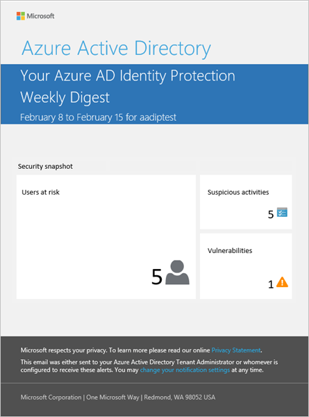
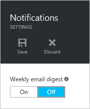
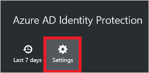
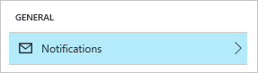

<properties
    pageTitle="Azure Active Directory-Schutz Benachrichtigungen | Microsoft Azure"
    description="Erfahren Sie, wie Ihre Aktivitäten Untersuchung zu Benachrichtigungen unterstützen."
    services="active-directory"
    keywords="Schutz der Azure-active Directory-Identität, Cloud-app-Suche, Verwalten von Applications, Sicherheit, Risiken, Risiko Ebene, Sicherheitsrisiko, Sicherheitsrichtlinie"
    documentationCenter=""
    authors="MarkusVi"
    manager="femila"
    editor=""/>

<tags
    ms.service="active-directory"
    ms.workload="identity"
    ms.tgt_pltfrm="na"
    ms.devlang="na"
    ms.topic="article"
    ms.date="10/20/2016"
    ms.author="markvi"/>

#Azure Active Directory-Schutz Benachrichtigungen 

Azure AD-Schutz sendet zwei Arten von e-Mails automatisierte Benachrichtigung, denen Sie Benutzer Risiken und Risikoereignisse verwalten können:

- Benutzer gefährdet e-Mail benachrichtigen

- Wöchentliche Übersicht-e-Mail

## Benutzer gefährdet e-Mail benachrichtigen

Eine betroffenen e-Mail-Benachrichtigung für Benutzer wird ausgelöst, wenn Azure AD-Schutz ein Konto identifiziert, wie gefährdet. Die e-Mail enthält einen Link zu den Benutzern für Risiko Bericht im Dashboard-Schutz gekennzeichnet. Es empfiehlt sich, dass Sie sofort Benachrichtigungen über untersuchen gefährdet.

## Wöchentliche Übersicht-e-Mail

Wöchentliche Übersicht-e-Mail enthält eine Zusammenfassung der neuen Risikoereignisse an. 
Er enthält:

- Benutzer Risiko
- Verdächtige Aktivitäten
- Erkannte Schwachstellen
- Links zu verwandten Berichte in Schutz der Identität

 

  

Sie können das Senden einer e-Mail-Nachricht eines Wöchentliche Übersicht deaktivieren wechseln.
  

 
 

Geben Sie **im Konfigurationsdialogfeld verwandte öffnen**:

1. Klicken Sie auf das Blade **Azure AD-Schutz** auf **Einstellungen**.
  

 

2. Klicken Sie im Abschnitt **Allgemein** auf **Benachrichtigungen**.
  

 

## Siehe auch

- [Schutz der Azure-Active Directory-Identität](active-directory-identityprotection.md) 

