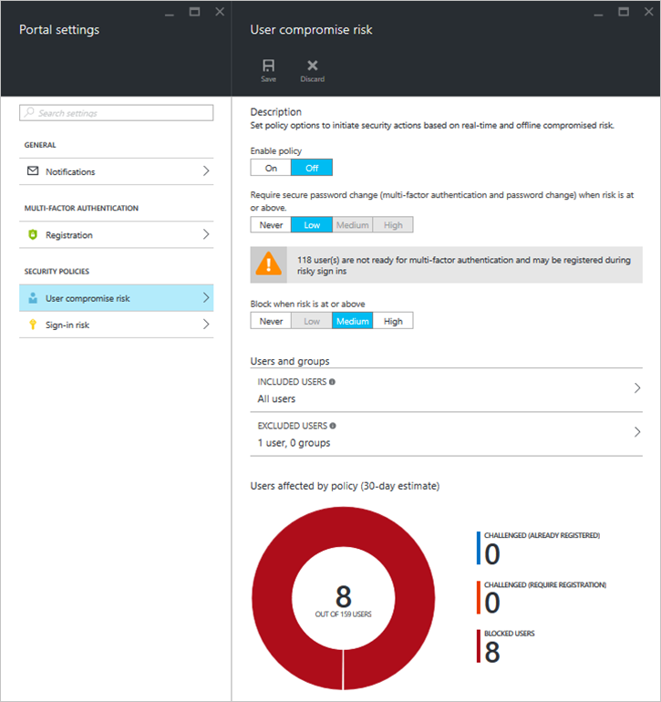
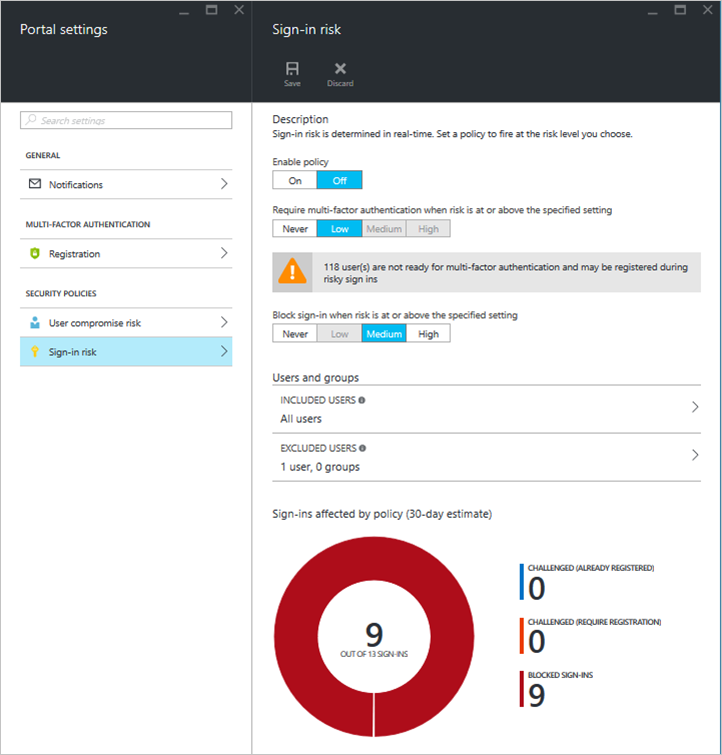

<properties
    pageTitle="Azure Active Directory-Schutz Playbook | Microsoft Azure"
    description="Erfahren Sie, wie Azure AD-Schutz können Sie die Möglichkeit eines Angreifers zu einem betroffenen Identität oder Gerät ausnutzen und eine Identität oder ein Gerät, das vorher vermutet oder bekannte gefährdet wurde gesichert zu beschränken."
    services="active-directory"
    keywords="Schutz der Azure-active Directory-Identität, Cloud-app-Suche, Verwalten von Applications, Sicherheit, Risiken, Risiko Ebene, Sicherheitsrisiko, Sicherheitsrichtlinie"
    documentationCenter=""
    authors="markusvi"
    manager="femila"
    editor=""/>

<tags
    ms.service="active-directory"
    ms.workload="identity"
    ms.tgt_pltfrm="na"
    ms.devlang="na"
    ms.topic="article"
    ms.date="08/22/2016"
    ms.author="markvi"/>

#Azure Active Directory-Schutz playbook 

Diese Playbook können Sie Folgendes ausführen:

- Füllen Sie die Daten in der Umgebung Schutz der Identität, indem Sie Nachbilden einer Risikoereignisse und Schwachstellen
- Einrichten von bedingten Zugriff Risiko basierende Richtlinien, und Testen Sie die Auswirkungen dieser Richtlinien

## Risikoereignisse simulieren

Dieser Abschnitt enthält Schritte für die folgenden Arten von Risiken Ereignis simulieren:

- Melden Sie sich-ins von anonymen IP-Adressen (einfach)
- Melden Sie sich-ins unbekannten Orten (Mittel)
- Unmöglich Reise mit atypische Speicherorten (schwierig)

Andere Risikoereignisse können nicht auf sichere Weise eines simulierten werden.

### Melden Sie sich-ins von anonymen IP-Adressen

Diese Risiken Ereignistyp identifiziert Benutzer, die über eine IP-Adresse angemeldet haben, die als eine anonyme Proxy-IP-Adresse angegeben wurde. Diese Proxys werden von Personen verwendet, die IP-Adresse des Geräts ausblenden möchten, und für Absichten verwendet werden kann.

**Gehen Sie folgendermaßen vor, um eine Anmeldung von anonymen IP-Adresse zu reproduzieren**:

1.  Herunterladen der [Tor Browser](https://www.torproject.org/projects/torbrowser.html.en).
2.  Navigieren Sie mit dem Tor Browser zu [https://myapps.microsoft.com](https://myapps.microsoft.com).   
3.  Geben Sie die Anmeldeinformationen für das Konto ein, die im Bericht **Sign-ins von anonymen IP-Adressen** angezeigt werden soll.

Der Anmeldung wird auf dem Dashboard Identitätsschutz innerhalb von 5 Minuten angezeigt. 

###Melden Sie sich-ins unbekannten Orten

Das Risiko unbekannten Speicherorte ist ein in Echtzeit Auswertung Verfahren, die ältere Anmeldung Speicherorte betrachtet (IP, Breite / Länge und ASN) um neue / unbekannten Speicherorte zu bestimmen. Das System speichert vorherigen IP-Adressen, Breite / Länge und ASNs eines Benutzers und hält diese Orte vertraut sein. Ein Speicherort Anmeldung gilt nicht vertraut sind, ist die Anmeldung Position nicht der vorhandenen vertraut Speicherorte stehenden.

Schutz der Azure-Active Directory-Identität:  

 - verfügt über einen Zeitraum initial Learning 14 Tage, während die nicht als unbekannten Speicherorte neue Speicherorte kennzeichnen.
 - Sign-ins aus vertrauten Geräte und Orte, die geografischen in der Nähe einen vorhandenen vertraut Speicherort sind wird ignoriert.

Um unbekannten Speicherorte simulieren, müssen Sie Anmelden aus einen Speicherort und das Gerät, das das Konto nicht aus vor angemeldet hat. 

**Gehen Sie folgendermaßen vor, um eine Anmeldung von einem unbekannten Speicherort zu reproduzieren**:

1.  Wählen Sie ein Konto mit mindestens einer Anmeldung Verlauf von 14 Tagen aus. 

2.  Führen Sie eine:
    
    ein. Während Sie über ein VPN, navigieren Sie zu [https://myapps.microsoft.com](https://myapps.microsoft.com) , und geben Sie die Anmeldeinformationen für das Konto ein, die, dem Sie für das Risikoereignis simulieren möchten.

    b. Bitten Sie einem Mitarbeiter an einem anderen Speicherort zu melden Sie sich mit der Firma Anmeldeinformationen (nicht empfohlen).

Der Anmeldung wird auf dem Dashboard Identitätsschutz innerhalb von 5 Minuten angezeigt.
 
### Unmöglich Reisen an atypische Position
Simulieren die Bedingung unmöglich Reisen ist schwierig, da der Algorithmus verwendet maschinellen learning zu extrahieren False-Positives, z. B. unmöglich Reisen von vertrauten Geräten aus, oder melden Sie sich-ins von VPN, die durch andere Benutzer im Verzeichnis verwendet werden. Darüber hinaus erfordert der Algorithmus einen Anmeldung Verlauf von 3 bis 14 Tagen für den Benutzer vor dem Start der Risikoereignisse generiert.

**Gehen Sie folgendermaßen vor, um eine unmöglich Reisen an atypische Speicherort zu reproduzieren**:

1.  Mit der standard-Browser, navigieren Sie zu [https://myapps.microsoft.com](https://myapps.microsoft.com).  

2.  Geben Sie die Anmeldeinformationen für das Konto ein, die, dem für ein Ereignis unmöglich Reisen Risiko generiert werden sollen.

3.  Ändern Sie Ihre Benutzer-Agents an. Sie können in Internet Explorer-Benutzer-Agents von Entwicklertools ändern oder Ihre Benutzer-Agents in Firefox und Chrome, die mithilfe eines Benutzer-Agents wechseln Add-on ändern.

4.  Ändern Sie Ihre IP-Adresse ein. Sie können Ihre IP-Adresse ändern, indem Sie ein VPN, ein Add-on Tor verwenden oder einen neuen Computer in Azure in einem anderen Data Center dreht.

5.  Anmeldung [https://myapps.microsoft.com](https://myapps.microsoft.com) wie zuvor mithilfe der Anmeldeinformationen und innerhalb weniger Minuten nach der vorherigen Anmeldung.

Der Anmeldung wird im Dashboard-Schutz innerhalb von 2 bis 4 Stunden angezeigt. 
Aufgrund der komplexen maschinellen learning Modelle verbindet besteht die Möglichkeit, die es nicht ausgewählt werden kann.  Möglicherweise möchten diese Schritte für mehrere Azure AD-Konten repliziert.

## Schwachstellen simulieren 
Schwachstellen sind Schwächen in einer Azure AD-Umgebung, die von einem Akteur Bad genutzt werden können. 3 Arten von Sicherheitslücken dargestellt aktuell werden in Azure AD-Schutz, die andere Features von Azure AD nutzen. Diese Sicherheitslücken werden auf dem Dashboard Identitätsschutz automatisch angezeigt, sobald diese Features eingerichtet sind.

-   Azure AD [kombinierte Authentifizierung?](../multi-factor-authentication/multi-factor-authentication.md)
-   Azure AD- [Cloud-App-Suche](active-directory-cloudappdiscovery-whatis.md).
-   Azure AD- [berechtigten Identitätsmanagement](active-directory-privileged-identity-management-configure.md). 

##Benutzer Kompromisse Risiko

**Klicken Sie zum Testen der Benutzer Kompromisse riskant, gehen Sie folgendermaßen vor**:

1.  Anmelden Sie bei [https://portal.azure.com](https://portal.azure.com) mit globaler Administratoranmeldeinformationen für Ihren Mandanten.

2.  Navigieren Sie zum **Schutz der Identität**. 

3.  Klicken Sie auf das Hauptfenster **Azure AD-Identität Schutz** Blade auf **Einstellungen**. 

4.  Klicken Sie auf das **Portal Einstellungen** Blade unter **Sicherheitsregeln**auf **Benutzer manipulieren Risiko**. 

5.  Klicken Sie auf das **Risiko anmelden** Blade deaktivieren Sie **Regel aktivieren** , und klicken Sie dann auf Einstellungen **Speichern** .

6.  Für ein bestimmtes Benutzerkonto, simulieren einer unbekannten Standorten oder anonyme IP-Risikoereignis. Dadurch wird das Risiko Benutzerebene für diesen Benutzer auf **Mittel**erhöhen.

7.  Warten Sie einige Minuten, und vergewissern Sie sich, dass auf Benutzerebene für Ihre Benutzer **Mittel**ist.

8.  Wechseln Sie zu dem **Portal Einstellungen** Blade.

9.  Wählen Sie auf der **Benutzer Kompromisse Risiko** Blade, klicken Sie unter **Regel aktivieren**möchten **Klicken Sie auf** . 

10. Wählen Sie eine der folgenden Optionen aus:

    ein. Wählen Sie blockieren möchten, **Mittel** , klicken Sie unter **Anmelden blockieren**aus.

    b. Um sicheres Kennwort ändern zu erzwingen, wählen Sie **Mittel** unter **mehrstufige Authentifizierung erforderlich**.

13. Klicken Sie auf **Speichern**.

14. Sie können jetzt Risiko-basierten bedingte Zugriff testen, melden Sie sich mithilfe eines Benutzers mit einem erhöhten Risiko Pegel. Ist das Risiko Benutzer Mittel, abhängig von der Konfiguration der Richtlinie, Ihre Anmeldung ist entweder blockiert werden, oder Sie müssen das Ändern Ihres Kennworts. 
  

 

 
##Anmeldung Risiko

 
**Um bei der Anmeldung in das Risiko zu testen, führen Sie die folgenden Schritte aus:**

1.  Anmelden Sie bei [https://portal.azure.com](https://portal.azure.com) mit globaler Administratoranmeldeinformationen für Ihren Mandanten.

2.  Navigieren Sie zum **Schutz der Identität**.

3.  Klicken Sie auf das Hauptfenster **Azure AD-Identität Schutz** Blade auf **Einstellungen**. 

4.  Klicken Sie auf das **Portal Einstellungen** Blade unter **Sicherheitsregeln**auf **Risiken anmelden**.

5.  Wählen Sie auf der Blade **Melden Sie sich das Risiko ** **auf** unter **Regel aktivieren**. 

7.  Wählen Sie eine der folgenden Optionen aus:

    ein. Wählen Sie blockieren möchten, **Mittel** , klicken Sie unter **Anmelden blockieren**

    b. Um sicheres Kennwort ändern zu erzwingen, wählen Sie **Mittel** unter **mehrstufige Authentifizierung erforderlich**.

8.  Wählen Sie Mittel blockieren möchten, klicken Sie unter blockieren anmelden.

9.  Um kombinierte Authentifizierung zu erzwingen, wählen Sie **Mittel** unter **mehrstufige Authentifizierung erforderlich**.

10. Klicken Sie auf **Speichern**.

11. Sie können jetzt Risiko-basierten bedingte Zugriff testen, durch die unbekannten Standorten oder anonyme IP-Risikoereignisse simulieren, da sie beide **Medium** Risikoereignisse sind.

 

 

## Siehe auch

 - [Schutz der Azure-Active Directory-Identität](active-directory-identityprotection.md)
