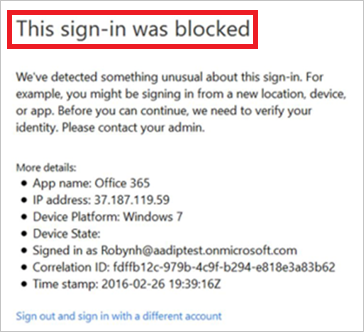
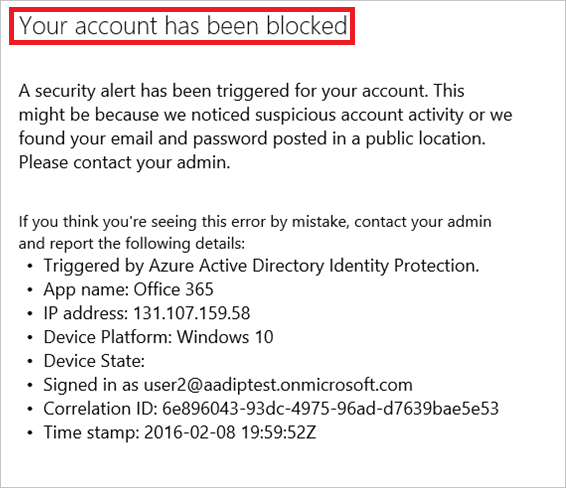

<properties
    pageTitle="Azure Active Directory Identität Protection - Benutzer entsperren | Microsoft Azure"
    description="Erfahren Sie, wie die Benutzer, die durch eine Schutzrichtlinie Azure Active Directory Identität blockiert wurden Blockierung aufheben."
    services="active-directory"
    keywords="Schutz der Azure-active Directory-Identität, Aufheben der Blockierung Benutzer"
    documentationCenter=""
    authors="markusvi"
    manager="femila"
    editor=""/>

<tags
    ms.service="active-directory"
    ms.workload="identity"
    ms.tgt_pltfrm="na"
    ms.devlang="na"
    ms.topic="article"
    ms.date="09/20/2016"
    ms.author="markvi"/>

#Azure Active Directory Identität Protection - Benutzer entsperren

Sie können mit Azure Active Directory Identität Protection Richtlinien, um Benutzer zu blockieren, wenn die konfigurierten Bedingungen erfüllt sind konfigurieren. In der Regel ein blockierter Benutzer Kontakte Helpdesk zum erwirken der freigegeben werden soll. Diese Themen erläutert die Schritte, die Sie zum Aufheben der Blockierung eines gesperrten Benutzers ausführen können.

## Bestimmen Sie den Grund für das Sperren

Als ersten Schritt, ein Benutzers aufgehoben werden muss müssen Sie den Typ der Richtlinie zu ermitteln, das den Benutzer blockiert, da die nächsten Schritte von dieser abhängen. Mit Azure Active Directory Identität Protection kann ein Benutzer entweder durch eine Anmeldung Risiko Richtlinie oder Ablaufrichtlinie für ein Risiko blockiert werden. 

Sie können den Typ der Richtlinie erhalten, die einen Benutzer in die Überschrift im Dialogfeld gesperrt hat, die für den Benutzer bei einer Anmeldung Versuch angezeigt wurde:

|Richtlinie | Dialogfeld "Benutzer"|
|--- | --- |
|Anmeldung Risiko |  |
|Benutzer Risiko |  |

Ein Benutzer, der vom gesperrt ist:

- Eine Anmeldung Risiko-Richtlinie ist auch bekannt als verdächtig anmelden
- Ablaufrichtlinie für ein Risiko ist auch bekannt als ein Konto Risiko

 
## Aufheben der Blockierung verdächtigen Sign-ins

Zum Aufheben der Blockierung einer verdächtigen anmelden, haben Sie die folgenden Optionen aus:

1. **Anmeldung von einem vertrauten Speicherort oder Gerät** – ein häufiger Grund für blockierte verdächtigen Sign-ins sind Anmeldung Versuche von unbekannten Standorten oder Geräte. Ihre Benutzer können schnell ermitteln, ob dies der blockierenden Grund ist, indem Sie versuchen, sich von einem vertrauten Speicherort oder Gerät.

3. **Ausschließen von der Richtlinie** – Wenn Sie denken, dass die aktuelle Konfiguration von der Richtlinie Anmeldung für bestimmte Benutzer Probleme verursacht, können Sie es die Benutzern ausschließen. [Anmeldung Risiko Richtlinie](active-directory-identityprotection.md#sign-in-risk-policy) für Weitere Informationen hierzu finden Sie unter.
 
4. **Deaktivieren Sie die Richtlinie** – Wenn Sie denken, dass die Richtlinienkonfiguration für alle Benutzer Probleme verursacht, können Sie die Richtlinie deaktivieren. [Anmeldung Risiko Richtlinie](active-directory-identityprotection.md#sign-in-risk-policy) für Weitere Informationen hierzu finden Sie unter.

## Aufheben der Blockierung Konten Risiko

Um die Sperrung ein Kontos Risiko aufheben möchten, müssen Sie die folgenden Optionen:

1. **Kennwort zurücksetzen** – Sie können das Kennwort des Benutzers zurücksetzen. Finden Sie detaillierte Informationen zur [Manuelles sicheres Kennwort zurücksetzen](active-directory-identityprotection.md#manual-secure-password-reset) .

2. Einen Benutzer **Ausblenden aller Risikoereignisse** - Ablaufrichtlinie für das Risiko blockiert wird, wenn konfigurierten Risiko Benutzerebene für das Sperren des Zugriffs auf erreicht wurde. Einen Benutzer kann reduziert das Risiko Ebene, indem Sie manuell schließen Risikoereignisse berichtet. Weitere Informationen hierzu finden Sie unter [Risikoereignisse manuell zu schließen](active-directory-identityprotection.md#closing-risk-events-manually).

3. **Ausschließen von der Richtlinie** – Wenn Sie denken, dass die aktuelle Konfiguration von der Richtlinie Anmeldung für bestimmte Benutzer Probleme verursacht, können Sie es die Benutzern ausschließen. [Risiken Ablaufrichtlinie für](active-directory-identityprotection.md#user-risk-policy) Weitere Informationen hierzu finden Sie unter.
 
4. **Deaktivieren Sie die Richtlinie** – Wenn Sie denken, dass die Richtlinienkonfiguration für alle Benutzer Probleme verursacht, können Sie die Richtlinie deaktivieren. [Risiken Ablaufrichtlinie für](active-directory-identityprotection.md#user-risk-policy) Weitere Informationen hierzu finden Sie unter.

## Nächste Schritte

 Möchten Sie mehr über den Schutz von Azure AD-Identität wissen? Schauen Sie sich [Azure Active Directory Identitätsschutz](active-directory-identityprotection.md).
 

