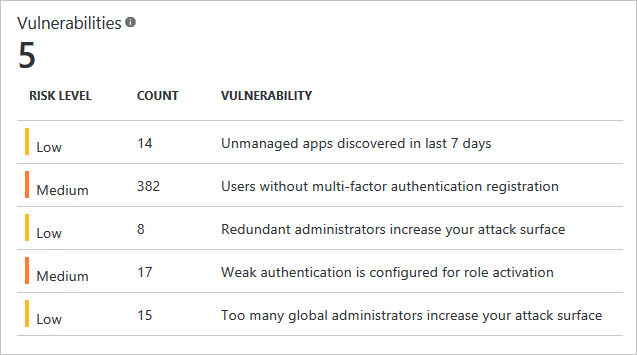

<properties
    pageTitle="Durch Azure Active Directory Identität Protection erkannten Schwachstellen | Microsoft Azure"
    description="Übersicht über entstehen von Azure Active Directory Identität Protection erkannt."
    services="active-directory"
    keywords="Schutz der Azure-active Directory-Identität, Cloud-app-Suche, Verwalten von Applications, Sicherheit, Risiken, Risiko Ebene, Sicherheitsrisiko, Sicherheitsrichtlinie"
    documentationCenter=""
    authors="markusvi"
    manager="femila"
    editor=""/>

<tags
    ms.service="active-directory"
    ms.workload="identity"
    ms.tgt_pltfrm="na"
    ms.devlang="na"
    ms.topic="article"
    ms.date="08/22/2016"
    ms.author="markvi"/>

# Schwachstellen von Azure Active Directory Identität Protection erkannt 

Schwachstellen sind Schwächen in Ihrer Umgebung, die von einem Angreifer genutzt werden können. Es empfiehlt sich, dass Sie die Adresse dieser ausnutzen, um die Sicherheitslage Ihrer Organisation zu verbessern, und verhindern sie ausnutzen.
  

 

Die folgenden Abschnitte enthalten Sie einen Überblick über entstehen von Schutz der Identität gemeldet.

## Mehrstufige Authentifizierung Registrierung nicht konfiguriert 

Dieses Sicherheitsrisiko hilft Ihnen, die Bereitstellung von Azure kombinierte Authentifizierung in Ihrer Organisation steuern. 

Azure kombinierte Authentifizierung bietet eine zweite Sicherheitsebene auf die Benutzerauthentifizierung. Es hilft schützen Sie Zugriff auf Daten und Applikationen während der Besprechung Benutzer bei Bedarf für ein einfacher Vorgang Anmeldung. Es stellt strenge Authentifizierung über eine Reihe von Überprüfungsoptionen für einfache – Anruf, Textnachricht oder mobile-app Benachrichtigung oder Überprüfung Code und 3rd Party Angehörigen Token.

Es empfiehlt sich, dass Sie für Benutzer anmelden-ins Azure mehrstufige Authentifizierung erforderlich. Mehrstufige Authentifizierung spielt eine zentrale Rolle in bedingten Zugriff Risiko basierende Richtlinien über den Schutz der Identität verfügbar.

Weitere Informationen hierzu finden Sie unter [Neuigkeiten Azure kombinierte Authentifizierung?](../multi-factor-authentication/multi-factor-authentication.md)

## Nicht verwaltete Cloud-apps

Dieses Sicherheitsrisiko können Sie nicht verwalteten Cloud-apps in Ihrer Organisation zu identifizieren.
 
In modernen Unternehmen ist IT-Abteilung häufig wissen die Cloudanwendungen, die Benutzer in ihrer Organisation Arbeiten erledigen ihrer Arbeit. Es ist einfach, finden Sie unter Warum Administratoren Fragen zu dem nicht autorisierten Zugriff auf Unternehmensdaten, möglichen Datenverlust und anderen Risiken haben möchten. 

Es empfiehlt sich, dass Ihre Organisation Cloud App Discovery zum Ermitteln von Applications nicht verwalteten Cloud und verwalten diese Azure Active Directory mithilfe von Applications bereitstellen.

Weitere Informationen hierzu finden Sie in der [Cloud nicht verwalteten Programme mit der Cloud-App-Suche suchen](active-directory-cloudappdiscovery-whatis.md).

##Von Sicherheitshinweisen aus der Verwaltung von Berechtigungen Identität

Dieses Sicherheitsrisiko können Sie erkennen und Beheben von Benachrichtigungen über Berechtigungen Identitäten in Ihrer Organisation.  

Damit um Benutzer berechtigten Vorgänge ausführen zu können, müssen Organisationen Benutzer temporär oder permanent vollständigen Zugriff in Azure AD zu erlangen Azure oder Office 365-Ressourcen oder andere SaaS apps. Jeder der folgenden Benutzer die entsprechenden Berechtigungen vergrößert sich die Angriffsfläche Ihrer Organisation. Dieses Sicherheitsrisiko unterstützt Sie beim Identifizieren der Benutzer nicht benötigter berechtigten Zugriff und entsprechende Aktionen zu verringern das Risiko, die, das Sie darstellen. 

Wir empfehlen, Ihrer Organisation mithilfe der Azure AD berechtigten Identität Verwaltung, Steuerelement, verwalten und Überwachen mit Identitäten und deren Zugriff auf Ressourcen in Azure AD sowie andere Microsoft-Onlinedienste wie Office 365 oder Microsoft Intune Berechtigungen.

Weitere Informationen hierzu finden Sie unter [Azure AD berechtigten Identitätsmanagement](active-directory-privileged-identity-management-configure.md). 

## Siehe auch

 - [Schutz der Azure-Active Directory-Identität](active-directory-identityprotection.md)
