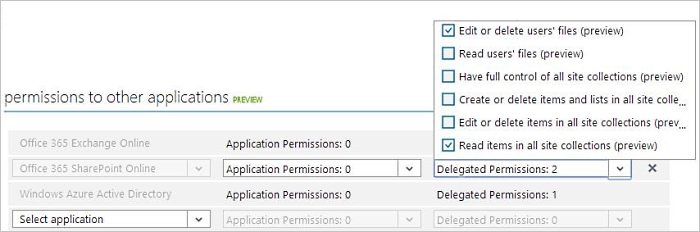
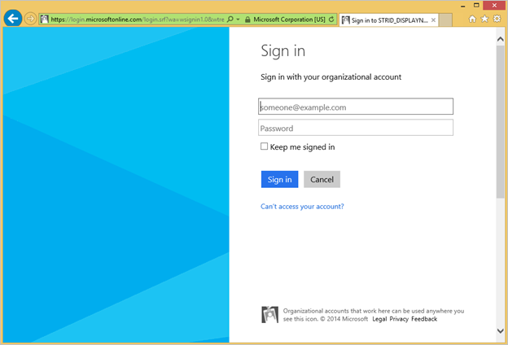
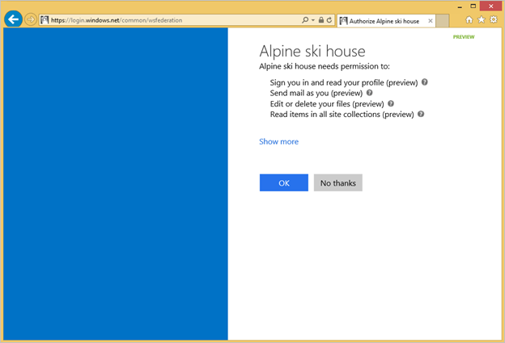
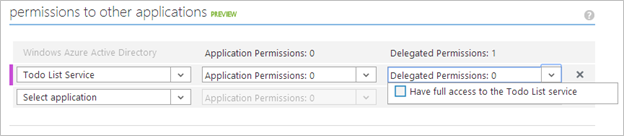
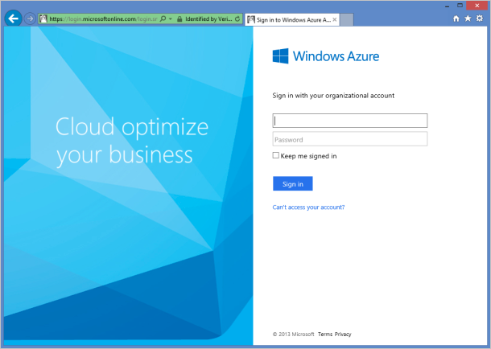
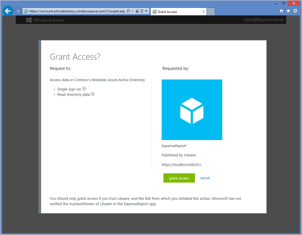

<properties
   pageTitle="Integrieren von Applications in Azure-Active Directory | Microsoft Azure"
   description="Ausführliche Informationen zum Hinzufügen, aktualisieren oder entfernen eine Anwendung in Azure Active Directory (Azure AD)."
   services="active-directory"
   documentationCenter=""
   authors="bryanla"
   manager="mbaldwin"
   editor="mbaldwin" />
<tags
   ms.service="active-directory"
   ms.devlang="na"
   ms.topic="article"
   ms.tgt_pltfrm="na"
   ms.workload="identity"
   ms.date="10/29/2016"
   ms.author="mbaldwin;bryanla" />

# Integrieren von Applications in Azure Active Directory

[AZURE.INCLUDE [active-directory-devguide](../../includes/active-directory-devguide.md)]

Enterprise-Entwickler und Anbieter von Software als Service (SaaS) können entwickeln Sie kommerzielle Cloud Services oder branchenanwendungen, die mit Azure Active Directory (Azure AD) sicheren Anmelden und Autorisierung für ihre Dienste bereitstellen integriert werden können. Um eine Anwendung oder einen bestimmten Dienst mit Azure AD zu integrieren, muss ein Entwickler zuerst die Details zu ihrer Anwendung mit Azure AD über das Azure klassischen Portal registrieren.

In diesem Artikel wird das Hinzufügen, aktualisieren oder entfernen eine Anwendung in Azure AD veranschaulicht. Lernen Sie die verschiedenen Typen von Applications Azure AD integriert werden können, die zum Konfigurieren Ihrer Anwendung Zugriff auf andere Ressourcen wie Web-APIs und vieles mehr.

Erfahren Sie mehr über die zwei Azure AD-Objekte, die eine Anwendung registriert und die Beziehung zwischen ihnen darzustellen, finden Sie unter [Anwendung und Dienst Tilgungsanteile Objekte](active-directory-application-objects.md); Erfahren Sie mehr über die Richtlinien für branding, die Sie bei der Entwicklung von Applications mit Azure Active Directory verwenden sollten, finden Sie unter [Brandingrichtlinien für integrierte Apps](active-directory-branding-guidelines.md).

## Hinzufügen einer Anwendung

Jede Anwendung, die die Funktionen von Azure AD verwenden möchte, muss zuerst in einem Azure AD-Mandanten registriert sein. Dieses Verfahren Registrierung umfasst die zugewiesen Azure AD-Details der Anwendung, beispielsweise die URL an, wo es abgelegt hat, die URL Antworten senden, nachdem ein Benutzer authentifiziert ist, der URI, der app usw. bezeichnet.

Wenn Sie eine Webanwendung, die für Benutzer in Azure AD erstellen-in unterstützt nur muss, können Sie einfach die folgenden Anweisungen folgen. Wenn die Anwendung Anmeldeinformationen oder die Berechtigungen zum Zugriff auf ein Web-API benötigt, oder muss, damit Benutzer aus anderen Azure AD-Mandanten, finden Sie unter [Aktualisieren einer Anwendung](#updating-an-application) Abschnitt fort, Konfigurieren der Anwendung darauf zugreifen können.

### Registrieren Sie eine neue Anwendung im klassischen Azure-Portal

1. Melden Sie sich mit dem [Azure klassische Portal](https://manage.windowsazure.com)aus.

1. Klicken Sie auf dem Active Directory-Symbol in der linken Menü auf, und klicken Sie dann auf das gewünschte Verzeichnis.

1. Klicken Sie im oberen Menü auf **Applications**. Wenn keine apps zu Ihrem Verzeichnis hinzugefügt wurden, wird dieser Seite nur dem hinzufügen einen App-Link angezeigt. Klicken Sie auf den Link, oder Sie können Alternativ klicken Sie auf die Schaltfläche " **Hinzufügen** " auf der Befehlsleiste.

1. Möchten Sie auf der Seite was führen Sie die Seite, klicken Sie auf den Link, um **eine Anwendung, die zur Entwicklung von meinem Unternehmen hinzufügen**.

1. Klicken Sie auf das erkennen Sie müssen uns zu Ihrer Anwendungsseite angeben, einen Namen für die Anwendung ebenso wie die Art der Anwendung angeben, die Sie mit Azure AD registrieren.  Sie können auswählen, entweder eine [Anwendung/WebClient](active-directory-dev-glossary.md#client-application) / [Web Ressource/API-](active-directory-dev-glossary.md#resource-server) Anwendung (möglicherweise auch als dienen beide) oder einer [systemeigenen](active-directory-dev-glossary.md#native-client) Clientanwendung. Sobald Sie fertig sind, klicken Sie auf das Pfeilsymbol in der unteren rechten Ecke der Seite.

1. Klicken Sie auf der Eigenschaftenseite von App Geben Sie der Anmeldung URL und dem App-ID-URI an, wenn zum Registrieren einer Webanwendung oder nur den umleiten URI für eine native Client-Anwendung, und klicken Sie dann klicken Sie auf das Kontrollkästchen in der unteren rechten Ecke der Seite.

1. Ihrer Anwendung hinzugefügt wurde, und Sie werden zur Seite Schnellstart für eine Anwendung weitergeleitet werden. Je nachdem, ob die Anwendung ein Web oder systemeigene Anwendung ist werden Sie unterschiedliche Optionen zum Hinzufügen von weiterer Funktionen an Ihrer Anwendung angezeigt. Nachdem Sie Ihrer Anwendung hinzugefügt wurde, können Sie beginnen, Aktualisieren Ihrer Anwendung, damit Benutzer anmelden, Access Web APIs in einer anderen Anwendung oder konfigurieren mit mehreren Mandanten-Anwendung (wodurch anderen Organisationen zu Ihrer Anwendung zugreifen kann).

>[AZURE.NOTE] Standardmäßig ist die Anwendung neu erstellten Registrierung so konfiguriert, dass Benutzer aus Ihrem Verzeichnis an Ihrer Anwendung anmelden können.

## Aktualisieren einer Anwendung

Nachdem eine Anwendung mit Azure AD registriert wurde, kann es Zugriff Web APIs, in anderen Organisationen und vieles mehr zur Verfügung gestellt werden aktualisiert werden müssen. In diesem Abschnitt werden verschiedene Möglichkeiten, Sie möglicherweise weitere Ihrer Anwendung zu konfigurieren müssen. Zunächst wird zunächst mit Übersicht über das Framework Zustimmung wichtiges Werkzeug zu verstehen, wenn Sie Ressourcen/API Applications erstellen, die von Clientanwendungen, die vom Entwickler in Ihrer Organisation oder einem anderen Anbieter genutzt werden können.

Weitere Informationen über die Funktionsweise Authentifizierung in Azure AD, finden Sie unter [Authentifizierungsszenarien Azure AD](active-directory-authentication-scenarios.md).

### Übersicht über die Zustimmung framework

Azure AD-Zustimmung Framework erleichtert das Entwickeln mit mehreren Mandanten Web- und systemeigenen Clientanwendungen, die auf Web nach einem anderen als dem, in dem die Clientanwendung registriert ist, Azure AD-Mandanten gesicherter APIs zugreifen müssen. Diese Web-APIs gehören die Graph-API, Office 365 und anderen Microsoft-Diensten über eigene Web-APIs. Das Framework basiert auf einen Benutzer oder ein Administrator zugewiesen Zustimmung zur Anwendung mit der Frage in ihrem Verzeichnis, registriert werden, den Zugriff auf Daten Directory beteiligt ist.

Beispielsweise, wenn eine Web-Clientanwendung eine Office 365-Web-API oder einer Ressource Anwendung zum Lesen von Kalenderinformationen über den Benutzer anrufen muss, diesen Benutzer müssen Zustimmung zur Clientanwendung. Nachdem Zustimmung gegeben ist, wird die Clientanwendung möglicherweise rufen Sie das Office 365-Web-API im Namen des Benutzers, und verwenden Sie die Informationen des Kalenders nach Bedarf.

Das Zustimmung Framework ist OAuth 2.0 und seine verschiedenen Zahlungen, klicken Sie auf integriert, wie Autorisierung Code erteilen und Client-Anmeldeinformationen erteilen öffentliche oder vertrauliche Kunden verwenden. Mithilfe von OAuth 2.0 ermöglicht Azure AD viele verschiedene Diagrammtypen Clientanwendungen, beispielsweise auf einem Mobiltelefon, Tablet, Server oder einer Webanwendung erstellen und den Zugriff auf die benötigten Ressourcen.

Ausführlichere Informationen zu Framework Zustimmung finden Sie unter [OAuth 2.0 in Azure AD](https://msdn.microsoft.com/library/azure/dn645545.aspx), [Authentifizierungsszenarien Azure AD-](active-directory-authentication-scenarios.md)und Office 365-Thema [Grundlegendes zu Authentifizierung mit Office 365-APIs](https://msdn.microsoft.com/office/office365/howto/common-app-authentication-tasks).

#### Beispiel für die Zustimmung-Oberfläche

Die folgenden Schritte werden gezeigt, wie die Zustimmung funktioniert nicht bei der Anwendung Entwicklertools und die Benutzer auftreten.

1. Legen Sie auf der Web-Clientanwendung Konfigurationsseite in der klassischen Azure-Portal die Berechtigungen, die die Anwendung mithilfe der Dropdown-Menüs in der Berechtigungen an andere Applikationen-Steuerelement erforderlich ist.

    

1. Beachten Sie, dass die Berechtigungen der Anwendung aktualisiert wurden, die Anwendung wird ausgeführt und ein Benutzer ist dabei, die sie zum ersten Mal verwenden. Wenn die Anwendung noch nicht Access- oder aktualisieren abgerufen wurde token, muss auf die Anwendung auf Gehe zu Azure AD-Autorisierung Endpunkt einen Autorisierungscode abrufen, die zum Erfassen von einer neuen Zugriffs und aktualisieren token.

1. Wenn der Benutzer nicht bereits authentifiziert ist, werden er aufgefordert, Anmelden bei Azure AD.

    

1. Nachdem der Benutzer angemeldet hat, bestimmt Azure AD, ob der Benutzer muss eine Zustimmung Seite angezeigt werden soll. Diese Ermittlung basiert auf, ob der Benutzer (oder Administrator für ihre Organisation) bereits die Anwendung Zustimmung erteilt hat. Wenn die Zustimmung nicht bereits gewährt wurde, in Azure AD fordert den Benutzer zur Bestätigung auf und zeigt die erforderlichen Berechtigungen, die für die Funktion erforderlich. Festlegen von Berechtigungen, die im Dialogfeld Zustimmung angezeigt wird sind identisch mit was in der Berechtigungen an andere Applikationen-Steuerelement im klassischen Azure-Portal aktiviert wurde.

    

1. Nachdem der Benutzer die Erlaubnis erteilt, wird eine Autorisierung an Ihrer Anwendung, ausgegeben, die zum Erfassen von einer Access-Token und aktualisieren Token eingelöst werden können. Weitere Informationen zu diesen Fluss finden Sie unter den Abschnitt [Web-Anwendung, um die web-API Abschnitt](active-directory-authentication-scenarios.md#web-application-to-web-api) [Authentifizierungsszenarien Azure AD](active-directory-authentication-scenarios.md).

### Konfigurieren einer Clientanwendung Zugriff auf die Website APIs

In der Reihenfolge für eine Web/vertrauliche Clientanwendung teilnehmen an einer Autorisierung erteilen Fluss, die Authentifizierung erforderlich ist (und eine Access-Token abrufen) kann, muss es sichere Anmeldeinformationen einzurichten. Die standardmäßige Authentifizierungsmethode unterstützt vom Azure Portal ist Client-ID + symmetrischen Schlüssel. In diesem Abschnitt werden die Konfigurationsschritte für die geheimen Schlüssel des Clients Anmeldeinformationen behandelt.

Darüber hinaus vor kann ein Client Access eine Web-API verfügbar gemacht werden durch die Anwendung einer Ressource (ie: Azure AD Graph-API), das Zustimmung Framework wird sichergestellt, der Client erhält die Berechtigung erteilen, die als erforderlich, basierend auf die angeforderten Berechtigungen. Standardmäßig können alle Programme mit der bereits standardmäßig aktiviert Azure AD-"Melden Sie sich auf Aktivieren und gelesen Benutzerprofil" Berechtigung Berechtigungen aus Azure Active Directory (Graph-API) und Azure Service Management-API auswählen. Wenn die Clientanwendung in einem Office 365 Azure AD-Mandanten registriert wird, werden Web APIs und Berechtigungen für SharePoint und Exchange Online ebenfalls zur Auswahl sein. Sie können [zwei Arten von Berechtigungen](active-directory-dev-glossary.md#permissions) in der Dropdown-Menüs neben der gewünschten Web-API auswählen:

- Berechtigungen für die Anwendung: Die Clientanwendung muss Zugriff auf das Web API direkt als solches (kein Benutzerkontext). Diese Art der Berechtigung erfordert Administrator Zustimmung und ist auch nicht für systemeigene Clientanwendungen verfügbar.

- Delegierte Berechtigungen: Die Clientanwendung muss Zugriff auf das Web-API als der Benutzer angemeldet, aber durch die ausgewählte Berechtigung beschränkter Zugriff. Diese Art der Berechtigung kann von einem Benutzer gewährt werden, wenn die Berechtigung als mit Anforderung der Administrator Zustimmung konfiguriert ist.

#### Zum Hinzufügen von Websitelinks Anmeldeinformationen und Berechtigungen für den Zugriff auf APIs

1. Melden Sie sich bei der [Azure klassischen Portal.](https://manage.windowsazure.com)

1. Klicken Sie auf dem Active Directory-Symbol in der linken Menü auf und dann auf das gewünschte Verzeichnis auf.

1. Klicken Sie auf **Applikationen**im oberen Menü, und klicken Sie dann auf die Anwendung, die Sie konfigurieren möchten. Die Seite Schnellstart wird für einmaliges Anmelden und weiteren Informationen angezeigt. Klicken Sie auf den Link " **Konfigurieren** " am oberen Rand der Seite, die Sie zur Seite von der Anwendung Konfiguration einbezogen werden soll.

1. Wenn Sie einen geheimen Schlüssel für die Webanwendung Anmeldeinformationen hinzufügen möchten, führen Sie einen Bildlauf nach unten zum Abschnitt "Schlüssel".  

    - Erste klicken Sie auf "Select Dauer" Dropdown-Liste, und wählen Sie 1 oder 2 Jahre Dauer. 
    - Dann wird eine neue Zeile, mit dem "Gültig ab" und "Läuft am" Datumsangaben ausgefüllt angezeigt.
    - Die äußersten rechten Spalte enthält den Schlüsselwert, nachdem Sie die Konfiguration Änderungen (siehe unten) speichern. Achten Sie darauf, um wieder zum in diesem Abschnitt, und kopieren Sie sie nach dem Speichern, der Sie wirklich markiert haben, damit Sie ihm zur Verwendung in der Clientanwendung während der Authentifizierung zur Laufzeit ist.

2. Zum Hinzufügen von Berechtigungen für den Ressourcen-APIs aus Ihren Kunden Zugriff auf einen Bildlauf nach unten zum Abschnitt "Berechtigungen für andere Programme". 
    - Klicken Sie zuerst auf die Schaltfläche "Anwendung hinzufügen".
    - Verwenden Sie die Dropdownliste "Anzeigen", um den Typ von Ressourcen auszuwählen, die Sie von auswählen möchten.
    - Die erste Spalte können Sie aus den verfügbaren Ressourcen Clientanwendungen in Ihrem Verzeichnis auszuwählen, die eine Web-API verfügbar zu machen. Klicken Sie auf die Ressource, die, der Sie interessiert sind, und klicken Sie auf das Häkchen in der unteren rechten Ecke.
    - Nachdem Sie ausgewählt haben, sehen Sie die Ressource in der Liste "Berechtigungen für andere Programme" hinzugefügt.
    - Wählen Sie die gewünschten Berechtigungen für die Clientanwendung mit den Dropdown-Listen "Berechtigungen" und "Berechtigungen delegiert".

1. Klicken Sie abschließend auf die Schaltfläche **Speichern** auf der Befehlsleiste. Wenn Sie einen Schlüssel für eine Anwendung angegeben, wird es auch generiert werden, nachdem Sie auf Speichern klicken.

>[AZURE.NOTE] Durch Klicken auf die Schaltfläche Speichern auch automatisch legt die Berechtigungen für eine Anwendung in Ihrem Verzeichnis auf Grundlage der Berechtigungen in anderen Programmen, die Sie konfiguriert.  Sie können diese Anwendungsberechtigungen anzeigen, indem Sie die Registerkarte Anwendung Eigenschaften.

### Konfigurieren einer Ressource Anwendung Web APIs verfügbar machen.

Sie können eine Web-API entwickeln und durch Verfügbarmachen Access [Bereiche](active-directory-dev-glossary.md#scopes) und [Rollen](active-directory-dev-glossary.md#roles)Clientanwendungen zur Verfügung stellen. Eine ordnungsgemäß konfigurierten Web-API wird genau wie die anderen Microsoft-Web-APIs, einschließlich der Graph-API und die Office 365-APIs zur Verfügung gestellt. Access-Bereiche und Rollen sind über eines [Anwendungsmanifest](active-directory-dev-glossary.md#application-manifest), verfügbar, also eine JSON-Datei, die Ihre Identität Anwendungskonfiguration darstellt.  

Im folgende Abschnitt erfahren Sie, wie Sie die Access-Bereiche verfügbar machen, indem Sie die Ressource Anwendungsmanifest ändern.

#### Hinzufügen von Access Bereichen anwendungsspezifische Ressourcen

1. Melden Sie sich mit dem [Azure klassische Portal](https://manage.windowsazure.com)aus.

1. Klicken Sie auf dem Active Directory-Symbol in der linken Menü auf und dann auf das gewünschte Verzeichnis auf.

1. Klicken Sie auf **Applikationen**im oberen Menü, und klicken Sie dann auf die Ressource-Anwendung, die Sie konfigurieren möchten. Die Seite Schnellstart wird für einmaliges Anmelden und weiteren Informationen angezeigt.

1. Klicken Sie auf die Schaltfläche **manifest verwalten** in der Befehlsleiste auf, und wählen Sie **Manifest herunterladen**.

1. Öffnen Sie die JSON-Anwendungsmanifestdatei und Ersetzen Sie "oauth2Permissions" Knoten mit den folgenden JSON-Codeausschnitt. Dieser Ausschnitt ist ein Beispiel für die Verwendung verfügbar machen einen Bereich bekannt als "Benutzeridentitätswechsel", wodurch die Ressourcenbesitzer einer einer Clientanwendung einen Typ von Delegierter Zugriff auf eine Ressource gewähren. Stellen Sie sicher, dass der Text und die Werte für Ihre eigene Anwendung zu ändern:

        "oauth2Permissions": [
        {
            "adminConsentDescription": "Allow the application full access to the Todo List service on behalf of the signed-in   user",
            "adminConsentDisplayName": "Have full access to the Todo List service",
            "id": "b69ee3c9-c40d-4f2a-ac80-961cd1534e40",
            "isEnabled": true,
            "type": "User",
            "userConsentDescription": "Allow the application full access to the todo service on your behalf",
            "userConsentDisplayName": "Have full access to the todo service",
            "value": "user_impersonation"
            }
        ],

    Der ID-Wert muss eine neue generierte GUID, die Sie erstellen, indem Sie mit einem [Tool zum Generieren von GUID](https://msdn.microsoft.com/library/ms241442%28v=vs.80%29.aspx) oder programmgesteuert. Es stellt einen eindeutigen Bezeichner für die Berechtigung, die von der Web-API verfügbar gemacht wird. Nachdem Sie Ihren Kunden zum Anfordern des Zugriffs auf Web API und Anrufe die Web-API ordnungsgemäß konfiguriert ist, wird es ein Token OAuth 2.0 JWT präsentieren, die den Umfang (scp) Anspruch auf den Wert oben, in diesem Fall also User_impersonation festgelegt wurde.

    >[AZURE.NOTE] Sie können weitere Bereiche später nach Bedarf verfügbar machen. Beachten Sie, dass Ihr Web-API mehrere Bereiche, die mit einer Vielzahl von anderen Funktionen verbunden sind möglicherweise zugänglich gemacht wird. Jetzt können Sie den Zugriff auf das Web API steuern, mithilfe des Bereich (scp) Anspruchs im empfangenen OAuth 2.0 JWT Token.

1. Speichern Sie die aktualisierte JSON-Datei, und durch Klicken auf die Schaltfläche **manifest verwalten** in der Befehlsleiste, indem **Manifest hochladen**der aktualisierten Manifestdatei Durchsuchen auswählen und dann diese hochladen. Sobald hochgeladen wird, ist der Web-API jetzt so konfiguriert, dass Sie von einer anderen Anwendung in Ihrem Verzeichnis verwendet werden.

#### Um zu überprüfen, ob das Web wird für andere Programme in Ihrem Verzeichnis API verfügbar gemacht.

1. Im oberen Menü klicken Sie auf **Anwendungen**, wählen Sie die gewünschten Client-Anwendung, die Sie Zugriff auf das Web-API konfigurieren möchten, und klicken Sie dann auf **Konfigurieren**.

1. Führen Sie einen Bildlauf nach unten, bis die Berechtigungen, um den Abschnitt andere Applications. Klicken Sie auf das Dropdownmenü Select-Anwendung, und Sie im Web API auswählen, die Sie nur eine Berechtigung für verfügbar gemacht werden. Wählen Sie im Dropdown-Menü delegierte Berechtigungen die neue Berechtigungsstufe ein.

#### Weitere Informationen zum Anwendungsmanifest
Das Anwendungsmanifest fungiert tatsächlich dafür, aktualisieren die Anwendung Entität aus, die alle Attribute einer Azure AD-Identität Anwendungskonfiguration, einschließlich der API Access Bereiche, die wir besprochen definiert. Weitere Informationen zur Anwendung Entität finden Sie in der [Graph-API-Anwendung Entität Dokumentation](https://msdn.microsoft.com/Library/Azure/Ad/Graph/api/entity-and-complex-type-reference#application-entity). Suchen Sie darin umfassende Referenzinformationen zu der Anwendung Entität Mitglieder verwendet, um Berechtigungen für Ihre API anzugeben:  

- das Element AppRoles, also eine Zusammenstellung von [AppRole](https://msdn.microsoft.com/Library/Azure/Ad/Graph/api/entity-and-complex-type-reference#approle-type) Personen, die zum Definieren der **Anwendung von Berechtigungen** für ein Web-API verwendet werden können  
- das Element oauth2Permissions, also eine Zusammenstellung von [OAuth2Permission](https://msdn.microsoft.com/Library/Azure/Ad/Graph/api/entity-and-complex-type-reference#oauth2permission-type) Personen, die zum definieren die **Delegierte Berechtigungen** für ein Web-API verwendet werden können

Weitere Informationen zum Anwendung verweisen Manifesten Konzepte im Allgemeinen bitte für das [Verständnis des Azure-Active Directory-Anwendungsmanifests](active-directory-application-manifest.md).

### Zugreifen auf das Azure AD-Diagramm und Office 365-APIs

Wie bereits erwähnt neben dem Verfügbarmachen/Zugriff auf APIs auf Ihrer eigenen Applikationen Ressource können Sie auch Ihre Client-Anwendung von Microsoft-Ressourcen verfügbar gemachten APIs Zugriff auf aktualisieren.  Die Azure AD Graph-API, die "Azure Active Directory" in der Liste der Berechtigungen in anderen Programmen bezeichnet wird, ist standardmäßig für alle Programme, die mit Azure AD registriert sind verfügbar. Wenn Sie Ihre Clientanwendung in einem Azure AD-Mandanten erfassen, die nach der Bereitstellung von Office 365 wurde, können Sie auch über die Berechtigungen, die APIs zu verschiedenen Office 365-Ressourcen bereitgestellt werden alle zugreifen.

Für eine ausführliche Übersicht über das Access-Bereiche, bereitgestellt:  

- Azure AD Graph-API, finden Sie in den Bereichen [Berechtigung | Aktienkursen API Konzepte](https://msdn.microsoft.com/Library/Azure/Ad/Graph/howto/azure-ad-graph-api-permission-scopes) Artikel.
- Office 365-APIs finden Sie unter [Authentifizierung und Autorisierung mit gemeinsamer Zustimmung Rahmen](https://msdn.microsoft.com/office/office365/howto/application-manifest) Artikel. Erfahren Sie, wie eine Client-app erstellen, die in Office 365-APIs integriert größere Diskussion finden Sie unter [Einrichten Ihrer Office 365-Entwicklung-Umgebung](https://msdn.microsoft.com/office/office365/HowTo/setup-development-environment) .

>[AZURE.NOTE] Aufgrund der aktuellen Beschränkung können systemeigene Clientanwendungen nur in der Azure AD Graph-API aufrufen, wenn sie die Berechtigung "Zugriff auf das Firmenverzeichnis" verwenden.  Diese Einschränkung gilt nicht für Webanwendungen.

### Konfigurieren von Clientanwendungen mit mehreren Mandanten

Beim Hinzufügen einer Anwendungs zu Azure AD sollten Sie die Anwendung nur von Benutzern in Ihrer Organisation zugegriffen werden. Alternativ sollten Sie die Anwendung von Benutzern in externen Organisationen zugegriffen werden. Diese zwei Anwendungstypen werden als einzelne Mandanten und mit mehreren Mandanten Applikationen bezeichnet. Sie können die Konfiguration von einer einzelnen Mandanten-Anwendung, eine Anwendung mit mehreren Mandanten, wird die unten in diesem Abschnitt werden ändern.

Es ist wichtig, beachten Sie die Unterschiede zwischen einer einzelnen Mandanten und mit mehreren Mandanten Anwendung:  

- Eine einzelne Mandanten Anwendung ist für die Verwendung in einer Organisation vorgesehen. Sie sind in der Regel eine Line-of-Business (LoB)-Anwendung, die von einem Enterprise-Entwickler geschrieben. Nur eine einzelne Mandanten Anwendung von Benutzern in einem Verzeichnis zugegriffen werden muss, und daher nur muss in einem Verzeichnis bereitgestellt werden.
- Eine Anwendung mit mehreren Mandanten zur Verwendung in vielen Organisationen verwendet. Eine Software als Service (SaaS) Web-Anwendung von einer unabhängigen Software Softwareanbietern () in der Regel geschrieben sind. Mehrere Mandanten Applikationen müssen in jedem Verzeichnis, in dem sie verwendet werden, bereitgestellt werden, das Benutzer oder Administrator Zustimmung zu können, die über das Azure AD-Zustimmung Framework unterstützt registrieren erfordert. Beachten Sie, dass alle systemeigenen Clientanwendungen mit mehreren Mandanten standardmäßig sind, wie sie auf die Ressource Besitzers Gerät installiert sind. Finden Sie unter Übersicht über die im Abschnitt Zustimmung Framework über weitere Details auf Zustimmung Framework ein.

#### Aktivieren von externen Benutzern Ihrer Anwendungszugriff auf ihre Ressourcen gewähren

Wenn Sie eine Anwendung, die Sie Ihrem Kunden oder Partnern außerhalb Ihrer Organisation zur Verfügung stellen möchten schreiben, müssen Sie die Anwendungsdefinition im klassischen Azure-Portal zu aktualisieren.

>[AZURE.NOTE] Wenn Sie mit mehreren Mandanten aktivieren zu können, müssen Sie sicherstellen, dass der Anwendungs des App-ID URI in einer Domäne überprüft gehört. Darüber hinaus müssen die Rückgabe-URL mit https:// beginnen. Weitere Informationen finden Sie unter [Anwendung und Dienst Tilgungsanteile Objekte](active-directory-application-objects.md).

So aktivieren Sie den Zugriff auf Ihre app für externe Benutzer 

1. Melden Sie sich bei der [Azure klassischen Portal.](https://manage.windowsazure.com)

1. Klicken Sie auf dem Active Directory-Symbol in der linken Menü auf und dann auf das gewünschte Verzeichnis auf.

1. Klicken Sie auf **Applikationen**im oberen Menü, und klicken Sie dann auf die Anwendung, die Sie konfigurieren möchten. Die Seite Schnellstart wird zusammen mit der Konfigurationsoptionen angezeigt.

1. Erweitern Sie im Abschnitt **Mit mehreren Mandanten Anwendung konfigurieren** der Schnellstart, und klicken Sie auf den Link **Konfigurieren Sie ihn jetzt** im Abschnitt Zugriff aktivieren. Die Eigenschaftenseite für die Anwendung wird angezeigt.

1. Klicken Sie auf die Schaltfläche " **Ja** " neben Anwendung mit mehreren Mandanten ist, und klicken Sie auf die Schaltfläche **Speichern** auf der Befehlsleiste dann.

Nachdem Sie die oben genannten Änderung vorgenommen haben, werden Benutzer und Administratoren in anderen Organisationen, deren Verzeichnis und anderen Daten Ihrer Anwendungszugriff gewähren können.

#### Das Framework Azure AD-Zustimmung zur Laufzeit auslösen

Um die Zustimmung Framework verwenden zu können, müssen mit mehreren Mandanten Clientanwendungen Autorisierung OAuth 2.0 mit anfordern. [Codebeispielen](https://azure.microsoft.com/documentation/samples/?service=active-directory&term=multi-tenant) stehen Ihnen zeigen, wie eine Web-Anwendung, systemeigene Anwendung oder Server-Daemon Anwendung Autorisierungscodes und Access Token Web APIs aufrufen anfordert.

Die Webanwendung möglicherweise auch eine Anmelde Nutzung für Benutzer anbieten. Wenn Sie eine Anmelde Nutzung anbieten, wird davon ausgegangen, dass der Benutzer bei der Anmeldung von Schaltfläche klicken, die Umleitung im Browser zu der Azure AD OAuth2.0 Endpunkt oder außen liegenden Tabellenblättern OpenID verbinden Userinfo autorisieren wird. Diese Endpunkte ermöglichen die Anwendung, um Informationen zu den neuen Benutzer erhalten, durch die Id_token prüfen. Nach der Anmeldung Phase wird dem Benutzer eine Zustimmung Aufforderung ähnlich dem in der Übersicht der Abschnitt Zustimmung Framework abgebildet angezeigt werden.

Alternativ möglicherweise die Webanwendung auch eine Nutzung anbieten, die Administratoren von Mein Unternehmen "Signieren" ermöglicht. Diese Erfahrung würde den Benutzer auch leiten Sie an der Azure AD-OAuth 2.0 autorisieren Endpunkt. In diesem Fall jedoch übergeben eine Aufforderung = Admin_consent Parameter an den Endpunkt Autorisieren der Administrator Zustimmung zur Verfügung steht, erzwingen, wird der Administrator Zustimmung im Namen ihrer Organisation gewähren. Nur von ein Benutzer, der mit einem Konto authentifiziert, die die Rolle des globalen Administrators gehört, kann Zustimmung bieten; andere werden eine Fehlermeldung angezeigt. Auf dem erfolgreiche Zustimmung, wird die Antwort Admin_consent enthalten = wahr. Beim einlösen einer Access-Token erhalten Sie auch eine Id_token, die Informationen für die Organisation bereitstellt, und der Administrator, die für eine Anwendung haben angemeldet.

### Aktivieren der OAuth 2.0 implizit für einzelne Seite Applikationen gewähren

Einzelne Seite der Anwendung (SPAs) sind in der Regel mit einem überladene JavaScript-front-End strukturiert, die im Browser, wodurch der Anwendung Web API aufgerufen Ende, um dessen Geschäftslogik ausführen ausgeführt wird. Für SPAs in Azure AD gehostet wird verwenden Sie OAuth 2.0 implizit erteilen, um die Authentifizierung des Benutzers mit Azure AD- und ein Token, mit denen Sie sichere Anrufe aus der Anwendung JavaScript-Client seine Back-End-Web-API abrufen. Nachdem der Benutzer Zustimmung erteilt hat, kann dieses Authentifizierungsprotokoll der gleichen um Anrufe zwischen dem Client und anderen Web API Ressourcen, die so konfiguriert, dass für die Anwendung secure Token abrufen verwendet werden. Weitere Informationen zu den implizite Autorisierung, finden Sie unter erteilen, und Sie entscheiden, ob er für Ihr Anwendungsszenario richtig ist Hilfe [Grundlegendes zu den OAuth2 implizit erteilen Fluss in Azure Active Directory ](active-directory-dev-understanding-oauth2-implicit-grant.md).

Standardmäßig ist die OAuth 2.0 implizit erteilen für Applikationen deaktiviert. Sie können für eine Anwendung OAuth 2.0 implizit erteilen aktivieren, durch Festlegen der `oauth2AllowImplicitFlow`"' Wert in deren [Anwendungsmanifest](active-directory-application-manifest.md), also eine JSON-Datei, die Ihre Identität Anwendungskonfiguration darstellt.

#### So aktivieren Sie implizit erteilen OAuth 2.0 

1. Melden Sie sich bei der [Azure klassischen Portal.](https://manage.windowsazure.com)
1. Klicken Sie auf dem **Active Directory** -Symbol in der linken Menü auf und dann auf das gewünschte Verzeichnis auf.
1. Klicken Sie auf **Applikationen**im oberen Menü, und klicken Sie dann auf die Anwendung, die Sie konfigurieren möchten. Die Seite Schnellstart wird für einmaliges Anmelden und weiteren Informationen angezeigt.
1. Klicken Sie auf die Schaltfläche **manifest verwalten** in der Befehlsleiste auf, und wählen Sie **Manifest herunterladen**.
Öffnen Sie die JSON-Anwendungsmanifestdatei, und legen Sie den Wert "oauth2AllowImplicitFlow" auf "True". Standardmäßig ist die "false".

    `"oauth2AllowImplicitFlow": true,`

1. Speichern Sie die aktualisierte JSON-Datei, und durch Klicken auf die Schaltfläche **manifest verwalten** in der Befehlsleiste, indem **Manifest hochladen**der aktualisierten Manifestdatei Durchsuchen auswählen und dann diese hochladen. Sobald hochgeladen wird, ist das Web-API jetzt so konfiguriert, dass OAuth 2.0 implizit erteilen für die Benutzerauthentifizierung verwenden.

### Legacy auftritt, für das Gewähren des Zugriffs

In diesem Abschnitt werden die Oberfläche legacy Zustimmung vor 12 März 2014. Diese Erfahrung wird immer noch unterstützt, und wird im folgenden beschrieben. Bevor Sie die neuen Funktionen konnte Sie nur die folgenden Berechtigungen erteilen:

- Melden Sie sich auf Benutzer in ihrer Organisation

- Melden Sie sich auf Benutzer, und Lesen Sie die ihre Organisation Directory Daten (wie die Anwendung nur)

- Melden Sie sich auf Benutzer und Daten lesen und Schreiben ihrer Organisation Verzeichnis (wie die Anwendung nur)

Führen Sie die Schritte in der [Entwicklung mit mehreren Mandanten Webanwendungen mit Azure AD](https://msdn.microsoft.com/library/azure/dn151789.aspx) für neue Applikationen in Azure AD registriert Zugriff gewähren. Es ist wichtig, beachten Sie, dass das neue Zustimmung Framework viel leistungsfähigeren Anwendung kann auch ermöglicht Benutzern, die auf diese Anwendungen nur Administratoren Zustimmung.

#### Erstellen der Verknüpfung, die gewährt Zugriff für externe Benutzer (ältere Versionen)

Damit für externe Benutzer für Ihre app über ihre Organisation Konten anmelden können müssen Sie Ihre app, um einer Schaltfläche auf Azure AD mit einem Link zu der Seite anzuzeigen, die sie den Zugriff gewähren ermöglicht aktualisieren. Leitfaden für dieses Zeichen von Schaltfläche Branding wird im Thema [Brandingrichtlinien für integrierte Applikationen](active-directory-branding-guidelines.md) erläutert. Nachdem der Benutzer gewährt oder Zugriff verweigert, wird die Azure AD-Grant Access-Seite im Browser wieder zu Ihrer Anwendung mit einer Antwort umleiten. Weitere Informationen zu Anwendungseigenschaften finden Sie unter [Anwendungsobjekte und Dienst Grundsätze](active-directory-application-objects.md).

Wird die Seite erteilen Zugriff Azure AD erstellt, und finden Sie einen Link zu Ihrer app Konfiguration Seite in der klassischen Azure-Portal. Um zur Seite Konfiguration zu gelangen, klicken Sie auf den Link **Applications** im oberen Menü Ihrer Azure AD-Mandanten, klicken Sie auf die app, die Sie konfigurieren, und klicken Sie im Menü oberen Seitenrand Schnellstart auf **Konfigurieren** möchten.

Der Link für eine Anwendung wird wie folgt aussehen: `http://account.activedirectory.windowsazure.com/Consent.aspx?ClientID=058eb9b2-4f49-4850-9b78-469e3176e247&RequestedPermissions=DirectoryReaders&ConsentReturnURL=https%3A%2F%2Fadatum.com%2FExpenseReport.aspx%3FContextId%3D123456`. Die folgende Tabelle beschreibt die Teile der Link an:

|Parameter|Beschreibung|
|---|---|
|ClientId|Erforderlich. Die Client-ID für Ihren Kunden als Teil die app hinzufügen.|
|RequestedPermissions|Optional. Zugriffsebene, der Ihre app anfordert, die die Benutzer Ihre app Zugriff gewähren angezeigt werden. Wenn nicht angegeben, wird die angeforderten Zugriffsebene einmaliges Anmelden nur standardmäßig verwendet. Die anderen Optionen sind DirectoryReaders und DirectoryWriters. Weitere Details zu diesen Zugriffsebenen finden Sie unter Anwendung Access Levels.|
|ConsentReturnUrl|Optional. Die URL, die Sie zurückgegeben zu erteilen Zugriff Antwort verwenden möchten. Dieser Wert muss URL-codierte und unter dieselbe Domäne als Antwort-URL in der Definition Ihrer app konfiguriert werden muss. Wenn nicht angegeben, wird die Antwort erteilen Zugriff auf Ihre konfigurierte Antwort-URL weitergeleitet.|

Angeben einer ConsentReturnUrl getrennt von der Antwort URL erlauben Ihre app separaten Logik implementieren, die die Antwort auf eine andere URL aus dem Antwort-URL (der SAML-Token für melden Sie sich normalerweise auf verarbeitet) verarbeitet werden können. Sie können auch angeben, dass zusätzliche Parameter in die ConsentReturnURL URL-codierte; Diese werden als Parameter der Abfragezeichenfolge zurück zu Ihrer Anwendung bei Umleitung übergeben.  Dieses Verfahren kann verwendet werden, um zusätzliche Informationen zu verwalten oder Ihrer app Anfrage für eine Access-erteilen der Antwort aus Azure AD aneinander anpassen.

#### Gewähren des Zugriffs Benutzerfunktionalität und Antwort (ältere Versionen)

Wenn eine Anwendung zum Erteilen Zugriff Link leitet, führen Sie die folgenden Bilder vor, was der Benutzer treten.

Wenn der Benutzer noch nicht angemeldet ist, werden sie dazu aufgefordert werden:

Nachdem der Benutzer authentifiziert ist, wird Azure AD den Benutzer zur Seite Zugriff gewähren umzuleiten:

>[AZURE.NOTE] Nur der Unternehmensadministrator der externen Organisation kann Zugriff auf Ihre app erteilen. Wenn der Benutzer kein Unternehmensadministrator ist, werden er die Option zum Senden von Nachrichten an ihre Unternehmensadministratoren So fordern Sie an, dass diese app Zugriff erteilt werden angegeben sein.

Nachdem Sie der Kunden für Ihre app Zugriff erteilt hat, indem Sie auf Zugriff gewähren oder Zugriff verweigert haben, indem Sie auf Abbrechen, sendet Azure AD eine Antwort der ConsentReturnUrl oder Ihre konfigurierte Antwort-URL. Diese Antwort enthält die folgenden Parameter:

|Parameter|Beschreibung|
|---|---|
|TenantId|Die eindeutige ID des Unternehmens in Azure Active Directory, die für Ihre app Zugriff erteilt hat. Für diesen Parameter werden nur angegeben werden, wenn Sie der Kunden der Zugriff gewährt.|
|Zustimmung|Gewährt wird der Wert festgelegt werden, wenn die app Zugriff gewährt wurde, oder verweigert, wenn die Anforderung abgelehnt wurde.|

Zusätzliche Parameter werden bei der app zurückgegeben wird, wenn diese als Teil der ConsentReturnUrl URL-codierte angegeben wurden. Im folgenden finden Sie ein Beispielantwort auf eine erteilen zugriffsanforderung, der angibt, wurde die Anwendung autorisiert und enthält eine KontextID, der bereitgestellt wurde in der Access-Anforderung erteilen: `https://adatum.com/ExpenseReport.aspx?ContextID=123456&Consent=Granted&TenantId=f03dcba3-d693-47ad-9983-011650e64134`.

>[AZURE.NOTE] Die Zugriff gewähren Antwort wird ein Sicherheitstoken für den Benutzer nicht enthalten; die app muss den Benutzer separat anmelden.

Im folgenden finden ein Beispielantwort auf eine Anforderung der Access-erteilen, die verweigert wurde:`https://adatum.com/ExpenseReport.aspx?ContextID=123456&Consent=Denied`

#### Paralleles app Schlüssel für kontinuierlichen Zugriff der Graph-API (ältere Versionen)

Während der Lebensdauer der app müssen Sie die Tasten ändern, die Sie verwenden, wenn Sie in Azure AD zum Erfassen von einer Access-Token zum Aufrufen der Graph-API aufrufen.  Ändern der Tasten in der Regel in zwei Kategorien fällt: notrufdienste Cursor darüber, wo Ihre Schlüssel geworden ist oder einen Cursor darüber Wenn Ihre aktuelle Schlüssel ist läuft ab. Wenn Sie Ihre app kontinuierlichen Zugriff bieten, während Sie Ihre Keys (primär für die zweite Kiste) aktualisieren sollte das folgende Verfahren folgen.

1. Im Portal Azure klassischen klicken Sie auf Ihrem Verzeichnis Mandanten, klicken Sie im oberen Menü auf **Anwendungen** , dann klicken Sie auf die app, die Sie konfigurieren möchten. Die Seite Schnellstart wird für einmaliges Anmelden und weiteren Informationen angezeigt.

1. Klicken Sie im oberen Menü, um eine Liste der Eigenschaften für Ihre app finden Sie unter auf **Konfigurieren** , und sehen Sie eine Liste der Schlüssel.

1. Klicken Sie auf den Dropdownpfeil, klicken Sie unter Tasten besagt, **Wählen Sie eine Dauer** und wählen Sie 1 oder 2 Jahre und klicken Sie auf **Speichern** in der Befehlsleiste. Dadurch wird die Kennwort einen neuen Product Key für Ihre app generiert. Kopieren Sie diese neuen Kennwort Product Key ein. An diesem Punkt kann sowohl die Taste vorhandene und neue von der app verwendet werden um eine Access-Token aus Azure AD zu erhalten.

1. Kehren Sie zu Ihrer Anwendung, und aktualisieren Sie die Konfiguration, um mit dem neuen Kennwortschlüssel zu starten. Ein Beispiel, in dem dieses Update geschehen soll finden Sie unter [Verwendung der Graph-API Azure AD abgefragt werden soll](https://msdn.microsoft.com/library/azure/dn151791.aspx) .

1. Sie sollten jetzt diese Änderung über Ihre Herstellung-Umgebung – überprüfen sie zuerst auf einen Dienstknoten vor dem einführen, über den Rest einsatzbereit, ab.

1. Sobald die Bereitstellung der Herstellung die Aktualisierung abgeschlossen ist, können Sie wieder zum klassischen Azure-Portal, und entfernen die alte-Taste.

#### Ändern der app-Eigenschaften nach dem Aktivieren des Zugriffs (ältere Versionen)

Nachdem Sie den Zugriff für externe Benutzer zu Ihrer Anwendung aktivieren, können Sie weiterhin Ihre app Eigenschaften in der klassischen Azure-Portal zu ändern. Kunden, die bereits Zugriff auf Ihre app gewährt vor Änderungen app vorgenommenen sehen jedoch keine diese Änderungen, die beim Anzeigen von Details zu Ihrer app in der klassischen Azure-Portal angezeigt. Sobald die app zur Verfügung gestellt wird, müssen Sie sehr vorsichtig vor, wenn bestimmte Änderungen vornehmen werden. Beispielsweise wenn Sie die App-ID-URI aktualisieren, werden klicken Sie dann Ihre vorhandenen Kunden, die bevor Sie diese Änderung Zugriff, Fehler bei der Anmeldung bei Ihrer app über ihre Firma oder Schule Konten.

Wenn Sie eine Änderung nehmen Sie an der RequestedPermissions eine höhere Zugriffsebene, anfordern vorhandenen Kunden mithilfe der app-Funktionen, die nun neue API-Anrufe, die mit höheren nutzt möglicherweise Zugriffsebene Zugriff verweigert aus der Graph-API Antwort erhalten.  Ihre app sollten diesen Fällen behandeln, und bitten Sie den Kunden den Zugriff auf Ihre app mit der Anforderung für eine höhere Zugriffsebene gewähren.

## Entfernen einer Anwendung

In diesem Abschnitt beschrieben, wie eine Anwendung von Ihrem Azure AD-Mandanten zu entfernen.

### Entfernen einer Anwendung, die von Ihrer Organisation verfasst
Dies sind die Anwendungen, die für Ihren Azure AD-Mandanten unter den Filter "Applikationen zugegriffen wurde von meiner Firma" auf der Hauptseite "Applications" anzeigen. Technisch gesehen sind diese Programme, die Sie manuell über das Azure klassischen-Portal oder programmgesteuert über PowerShell oder der Graph-API registriert. Genauer, werden sie durch eine Anwendung und Dienst Tilgungsanteile Objekt in Ihrem Mandanten dargestellt. Weitere Informationen finden Sie unter [Anwendung und Dienst Tilgungsanteile Objekte](active-directory-application-objects.md) .

#### So entfernen Sie eine einzelne Mandanten Anwendung aus Ihrem Verzeichnis

1. Melden Sie sich bei der [Azure klassischen Portal.](https://manage.windowsazure.com)

1. Klicken Sie auf dem Active Directory-Symbol in der linken Menü auf, und klicken Sie dann auf das gewünschte Verzeichnis.

1. Klicken Sie auf **Applikationen**im oberen Menü, und klicken Sie dann auf die Anwendung, die Sie konfigurieren möchten. Die Seite Schnellstart wird für einmaliges Anmelden und weiteren Informationen angezeigt.

1. Klicken Sie auf die Schaltfläche " **Löschen** " in der Befehlsleiste.

1. Klicken Sie in der Meldung zur Bestätigung auf **Ja** .

#### So entfernen Sie eine Anwendung mit mehreren Mandanten aus Ihrem Verzeichnis

1. Melden Sie sich bei der [Azure klassischen Portal.](https://manage.windowsazure.com)

1. Klicken Sie auf dem Active Directory-Symbol in der linken Menü auf, und klicken Sie dann auf das gewünschte Verzeichnis.

1. Klicken Sie auf **Applikationen**im oberen Menü, und klicken Sie dann auf die Anwendung, die Sie konfigurieren möchten. Die Seite Schnellstart wird für einmaliges Anmelden und weiteren Informationen angezeigt.

1. Klicken Sie auf die Anwendung wird mit mehreren Mandanten Abschnitt, klicken Sie auf **Nein**. Dies wandelt die Anwendung einzelnen Mandanten sein, aber die Anwendung bleibt weiterhin in einer Organisation, die bereits zugestimmt hat.

1. Klicken Sie auf die Schaltfläche " **Löschen** " in der Befehlsleiste.

1. Klicken Sie in der Meldung zur Bestätigung auf **Ja** .

### Entfernen einer mit mehreren Mandanten Anwendungs von einer anderen Organisation autorisiert
Dies sind eine Teilmenge der Anwendung, die unter den Filter "Applications verwendet wurde von meiner Firma" auf der Seite Hauptfenster "Applications" des Azure AD-Mandanten, insbesondere diejenigen, die nicht unter der Liste "Applikationen zugegriffen wurde von meiner Firma" aufgelistet sind, zeigen. In der technischen Begriffe sind mit mehreren Mandanten Applikationen während des Prozesses Zustimmung registriert. Genauer, werden sie von nur einem Dienst Tilgungsanteile Objekt in Ihrem Mandanten dargestellt. Weitere Informationen finden Sie unter [Anwendung und Dienst Tilgungsanteile Objekte](active-directory-application-objects.md) .

Um eine mit mehreren Mandanten-Anwendung Zugriff auf Ihr Verzeichnis (nach Probleme erteilt Zustimmung) zu entfernen, müssen der Unternehmensadministrator eine Azure-Abonnement Zugriff über die klassischen Azure-Portal zu entfernen. Sie einfach navigieren Sie zu der Seite Diagnostizieren der Anwendung, und klicken Sie auf die Schaltfläche "Verwalten des Zugriffs" unten. Alternativ kann der Unternehmensadministrator die [Azure AD-PowerShell-Cmdlets](http://go.microsoft.com/fwlink/?LinkId=294151) verwenden, den Zugriff entfernen.

## Nächste Schritte

- Finden Sie Tipps zur visuellen Anleitung für Ihre app der [Brandingrichtlinien für integrierte Apps](active-directory-branding-guidelines.md) .

- Weitere Informationen hierzu auf die Beziehung zwischen einer Anwendung Anwendung und Dienst Tilgungsanteile Objekte finden Sie unter [Anwendung und Dienst Tilgungsanteile Objekte](active-directory-application-objects.md).

- Erfahren Sie mehr über die Rolle Wiedergabe der app-manifest, finden Sie unter [Grundlegendes zu Anwendungsmanifest Azure Active Directory](active-directory-application-manifest.md)

- Sehen Sie sich die [Azure AD-Entwicklertools Glossar](active-directory-dev-glossary.md) Definitionen der einige der grundlegenden Azure Active Directory (AD) Entwicklertools Konzepte.

- Besuchen Sie die [Active Directory-Entwicklers Leitfaden](active-directory-developers-guide.md) für einen Überblick über alle Entwicklertools verbundener Inhalt.
