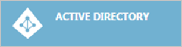
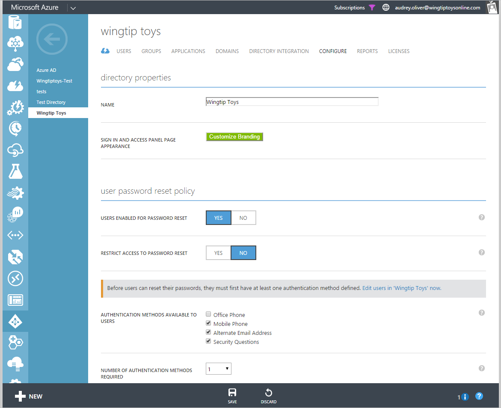
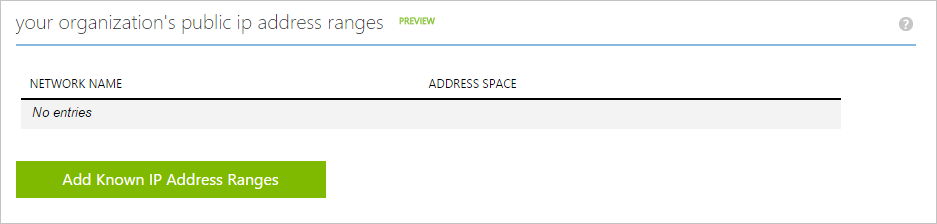
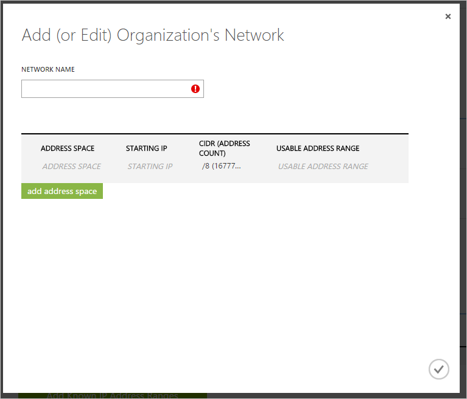

<properties 
    pageTitle="Bekannte Netzwerke | Microsoft Azure" 
    description="Bekannte Netzwerke konfiguriert wurde, können Sie vermeiden, dass IP-Adressen, die Besitz Ihrer Organisation in die ins melden Sie sich über mehrere Regionen und melden Sie sich ins von IP-Adressen mit verdächtige Aktivitätsberichten enthalten sind." 
    services="active-directory" 
    documentationCenter="" 
    authors="markusvi" 
    manager="femila"  
    editor=""/>

<tags 
    ms.service="active-directory" 
    ms.workload="identity" 
    ms.tgt_pltfrm="na" 
    ms.devlang="na" 
    ms.topic="article" 
    ms.date="10/10/2016" 
    ms.author="markvi"/>

# Bekannte Netzwerke

Azure Active Directory-Zugriff und Verwendungsberichte können Sie die um Transparenz für die Integrität und Sicherheit des Verzeichnisses Ihrer Organisation zu erhalten. Mithilfe dieser Informationen kann ein Administrators Directory besser bestimmen, wo mögliches Sicherheitsrisiko liegen möglicherweise so, dass er angemessen, diese Risiken planen können.

Es ist möglich, dass die Berichte "*Melden Sie sich ins aus mehreren geografischen Standorten*" und "*Melden Sie sich ins von IP-Adressen mit verdächtigen Aktivität*" falsch IP-Adressen kennzeichnen, die von Ihrer Organisation tatsächlich besitzt. 

Dies kann, beispielsweise geschehen, wenn: 

- Ein Benutzer in Ihrer Office auf Ihrem Data Center in San Francisco Remote angemeldet hat Boston löst den Bericht "Melden Sie sich über mehrere Regionen ins" 

- Ein Benutzer in Ihrer Organisation versucht, Anmelden mit einem falschen Kennwort Trigger mehrmals den Bericht "Signieren ins mit verdächtige Aktivitäten von IP-Adressen" 

Um zu verhindern, dass diese Fällen irreführend Sicherheitsberichte zu erstellen, sollten Sie die bekannten IP-Adressbereiche in die Liste der öffentlichen IP-Adresse Ihrer Organisation hinzufügen.    

###Wenn Ihre Organisation öffentliche IP-Adressbereiche hinzufügen möchten, führen Sie die folgenden Schritte aus: 

1.  Melden Sie sich für den Zugriff auf das [Azure-Verwaltungsportal](https://manage.windowsazure.com).

2.  Klicken Sie im linken Bereich auf **Active Directory**.   

3.  Wählen Sie in der Registerkarte **Verzeichnis** Ihrem Verzeichnis ein.

4.  Klicken Sie im Menü oben auf **Konfigurieren**.   

5.  Wechseln Sie auf der Registerkarte konfigurieren zu **Ihrer Organisationen öffentliche IP-Adressbereiche**   

6.  Klicken Sie auf **bekannte IP-Adressbereiche hinzufügen**.

7.  In der, das daraufhin angezeigten Dialogfeld fügen Sie Ihre Adressbereiche hinzu, und klicken Sie dann auf die Schaltfläche Überprüfen, wenn Sie fertig sind.   

**Zusätzliche Ressourcen**

* [Zeigen Sie Ihrer Berichte Zugriff und Verwendung an](active-directory-view-access-usage-reports.md)
* [Melden Sie sich ins von IP-Adressen mit verdächtigen Aktivität](active-directory-reporting-sign-ins-from-ip-addresses-with-suspicious-activity.md)
* [Melden Sie sich über mehrere Regionen ins](active-directory-reporting-sign-ins-from-multiple-geographies.md)

