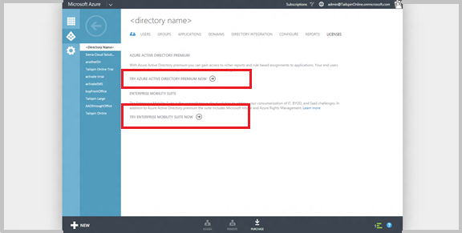
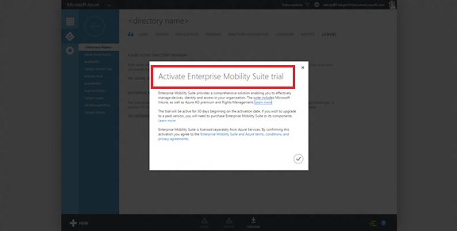
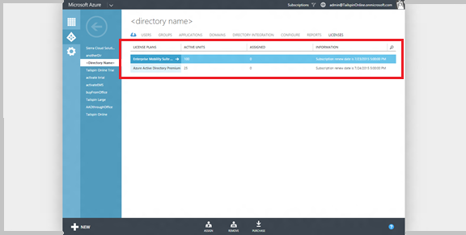
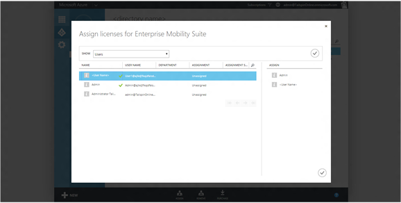
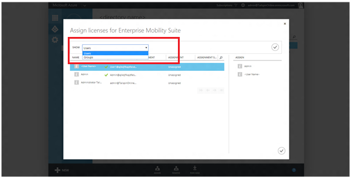
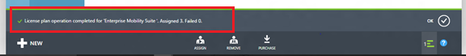
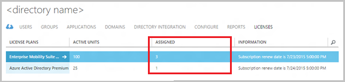
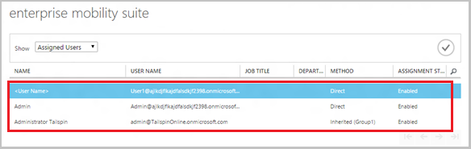
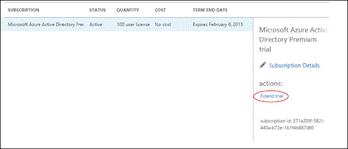
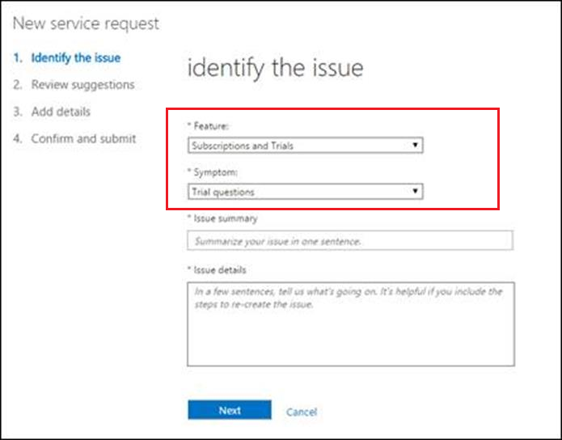

<properties
    pageTitle="Was ist Microsoft Azure-Active Directory-Lizenzierung? | Microsoft Azure"
    description="Beschreibung des Microsoft Azure-Active Directory-Lizenzierung, wie es funktioniert, Schritte und bewährte Methoden, einschließlich Office 365, Microsoft-Intune und Azure Active Directory Premium und grundlegende Editionen"
    services="active-directory"
      keywords="Azure AD-Lizenzierung"
    documentationCenter=""
    authors="curtand"
    manager="femila"
    editor=""/>

<tags
    ms.service="active-directory"
    ms.devlang="na"
    ms.topic="article"
    ms.tgt_pltfrm="na"
    ms.workload="identity"
    ms.date="08/23/2016"
    ms.author="curtand"/>

# Was ist Microsoft Azure-Active Directory-Lizenzierung?

##Beschreibung
Azure Active Directory (Azure AD) ist Microsoft Identität als Plattform und Service (IDaaS)-Lösung. Azure AD wird in einer Reihe von funktionsübergreifendes sowie technische Versionen von Azure AD-Free, die anderen Microsoft-Diensten wie Office 365, Dynamics, Microsoft Intune und Azure verfügbar ist, bis angeboten (Azure AD generiert keine Gebühren Verbrauch in diesem Modus), um Azure AD bezahlt Versionen wie Enterprise Mobilität Suite (EMS), Azure AD Premium und Basic sowie Azure mehrstufige Authentifizierung (MFA). Wie viele Microsoft online Services werden am häufigsten Azure AD bezahlt Versionen über die Berechtigungen für einzelne Benutzer übermittelt, wie in Office 365 und Intune Microsoft Azure AD-. In diesen Fällen wird der Dienst Einkauf mit einem oder mehreren Abonnements dargestellt, und jedes Abonnement umfasst eine vor dem Kauf Anzahl von Lizenzen in Ihrem Mandanten. Ansprüche pro Benutzer, die über Lizenzen zugewiesen, erstellen eine Verknüpfung zwischen dem Benutzer und das Produkt, die Service-Komponenten für den Benutzer aktivieren, und eine Lizenz prepaid Verarbeitung erzielt werden.

[Testen Sie jetzt Azure AD-Premium.](https://portal.office.com/Signup/Signup.aspx?OfferId=01824d11-5ad8-447f-8523-666b0848b381&ali=1#0)

> [AZURE.NOTE] Azure AD-Administration Portal ist Bestandteil der klassischen Azure-Portal an. Ein aktives Azure-Abonnement oder ein [Testabonnement Azure](https://azure.microsoft.com/pricing/free-trial/)während Azure AD-keine Azure Einkäufe erfordern, erfordert dieses Portal zugreifen.

Eine allgemeine Übersicht über Azure AD-Service-Funktionen finden Sie unter [Was ist Azure AD](active-directory-whatis.md).
[Weitere Informationen zu Azure AD-Service-Level](https://azure.microsoft.com/support/legal/sla/)

> [AZURE.NOTE]  Azure Quellenbesteuerung Abonnements unterscheiden: während auch in Ihrem Verzeichnis dargestellt, diese Abonnements Besprechungsarbeitsbereich Azure Ressourcen und Ihre Zahlungsmethode zuordnen. In diesem Fall sind keine Lizenzanzahl mit dem Abonnement verknüpft ist. Benutzer Association mit dem Abonnement, Zugriff des Benutzers zum Verwalten von Ressourcen Abonnement, wird durch gewähren sie Berechtigungen zum Verarbeiten von Azure das Abonnement zugeordneten Ressourcen erreicht.

##Wie funktioniert die Lizenzierung Azure AD-?

Lizenz-basierten (Anspruch-basiert) Azure AD services Arbeit durch Aktivieren eines Abonnements in Ihrem Azure AD-Mandanten Directory-Dienst an. Nachdem das Abonnement aktiv ist können Servicefunktionen von Administratoren Directory-Dienst verwaltet werden und von lizenzierten Benutzern verwendet werden.

Wenn Sie für den Kauf oder Enterprise Mobilität Suite, Azure AD Premium oder Azure AD grundlegende aktivieren, wird Ihr Verzeichnis mit dem Abonnement, einschließlich der Gültigkeitsdauer und prepaid Lizenzen aktualisiert. Informationen zu Ihrem Abonnement, einschließlich Status, nächste Lebenszyklus Ereignis und die Anzahl der zugeordneten oder verfügbaren Lizenzen ist über die klassischen Azure-Portal unter der Registerkarte Lizenzen für bestimmte Verzeichnis verfügbar. Dadurch wird auch am besten zum Verwalten Ihrer lizenzzuweisungen.

Jedes Abonnement besteht aus einen oder mehrere Servicepläne, jeweils die darin enthaltenen funktionsübergreifendes Ebene vom Servicetyp Zuordnung; beispielsweise Azure AD Azure MFA, Microsoft Intune, Exchange Online und SharePoint Online. Azure AD-Lizenzmanagement ist keine Ebene Plan Servicemanagement erforderlich. Dies unterscheidet sich von Office 365, die diesem Modus erweiterte Konfiguration zum Verwalten des Zugriffs auf die darin enthaltenen Services benötigt. Azure AD abhängig in Dienstkonfiguration, zum Aktivieren von Features und Verwalten von einzelnen Berechtigungen.

Im Allgemeinen wird Azure AD-Abonnementinformationen über das Azure klassischen Portal, klicken Sie auf die Registerkarte Lizenzen für bestimmte Verzeichnis verwaltet. Azure AD-Abonnements, mit Ausnahme von Azure AD Premium, führen Sie im Office-Portal nicht angezeigt.

> [AZURE.IMPORTANT] Azure AD Premium und Basic, sowie Enterprise Mobilität Suite-Abonnements sind auf deren bereitgestellte Directory-Mandanten beschränkt. Abonnements nicht verwendet, um Benutzer in anderen Verzeichnissen berechtigen oder zwischen Verzeichnissen teilen. Verschieben eines Abonnements zwischen Verzeichnissen, Übermitteln einer Support-Ticket oder Abbruch- und erneut bei direkter Einkäufe kaufen erfordert jedoch möglich ist.

> Beim Kauf von Azure AD oder Enterprise Mobilität Suite über Volume Licensing-Abonnement Aktivierung bei die Vereinbarung andere Microsoft Online Services, z. B. Office 365 umfasst automatisch tritt.

Kostenpflichtiger Azure Active Directory-Funktionen umfassen die große Bandbreite von Verzeichnis. Beispiele für:
- Gruppen basierende Zuordnung auf Anwendungen, die unter der jeweiligen Anwendung aktiviert ist, die Sie verwalten.
- Erweiterte und Verwaltungsfunktionen Self-service-Gruppe zur Verfügung stehen, unter der Verzeichniskonfiguration oder in der Gruppe.
- Premium Sicherheitsberichte werden auf der Registerkarte Bericht
- Cloud-Anwendung Suche wird in der Azure-Portal unter Identität.

###Zuweisen von Lizenzen
Erhalten ein Abonnement alle ist, zwar, die Sie kostenpflichtiges Funktionen konfigurieren müssen benötigt Ihre Azure AD-bezahlt Features Lizenzen, die richtigen Personen verteilen. Im Allgemeinen muss für alle Benutzer, die Zugriff haben sollten oder, die über eine Azure AD verwaltet werden Features bezahlt eine Lizenz zugewiesen werden. Eine Lizenz Zuordnung ist eine Zuordnung zwischen einem Benutzer und einem erworbenen Dienst, beispielsweise Azure AD Premium, Basic oder Enterprise Mobilität Suite.

Verwalten der Benutzer in Ihrem Verzeichnis über eine Lizenz verfügen, ist einfach. Es kann zu einer Gruppe zum Erstellen von Regeln der Zuordnung über das Azure AD-Administration Portal zuweisen oder Zuweisen von Lizenzen direkt an die richtigen Personen über ein Portal, PowerShell oder APIs erfolgen. Wenn Sie Lizenzen zu einer Gruppe zuordnen, werden alle Mitglieder der Gruppe eine Lizenz zugeordnet werden. Wenn Benutzer hinzugefügt oder aus der Gruppe entfernt werden diese zugewiesen werden oder die entsprechende Lizenz entfernt. Gruppenzuordnung kann basiert auf einer beliebigen Gruppenmanagement zur Verfügung und mit Gruppen basierende Zuordnung auf Anwendungen konsistent ist. Mit diesem Ansatz, können Regeln so einrichten, dass alle Benutzer in Ihrem Verzeichnis automatisch zugeordnet sind, stellen Sie sicher, dass jede Person mit der entsprechenden Position einer Lizenz ausgestattet ist oder sogar Stellvertretung die Entscheidung, ob andere Manager in der Organisation.

Mit Arbeitsgruppen-Lizenzen zugewiesen wird jeder Benutzer einen Verwendungsspeicherort fehlende Verzeichnis für die bei der Zuordnung erben. Dieser Speicherort kann zu einem beliebigen Zeitpunkt vom Administrator geändert werden. In Fällen, wo automatisierte Zuordnung aufgrund eines Fehlers konnte nicht, wider die Benutzerinformationen unter Lizenztyps diesen Status aus.

##Erste Schritte mit Azure AD-Lizenzierung

Erste Schritte mit Azure AD ist einfach. Sie können Ihrem Verzeichnis als Teil des anmelden, um eine kostenlose Testversion Azure immer erstellen. [Erfahren Sie mehr über als Organisation anmelden](sign-up-organization.md). Die folgenden helfen Ihnen sicherzustellen, dass das Verzeichnis am besten mit anderen Microsoft-Diensten, die Sie möglicherweise verbraucht oder planen, nutzen und Ihre Ziele beim Abrufen des Diensts ausgerichtet wird.

Hier sind einige bewährte Methoden:
- Wenn Sie bereits eine Organisation Dienste von Microsoft verwenden, besitzen Sie bereits ein Azure AD-Verzeichnis aus. In diesem Fall sollten Sie weiterhin dasselbe Verzeichnis für andere Dienste verwenden, sodass die Core Identitätsmanagement, einschließlich bereitgestellt und Hybrid SSO, über die Dienste genutzt werden kann. Ihre Benutzer haben einen einzelnen Anmeldevorgang und umfangreichere Funktionen, die über die Dienste nutzbringend werden. Wenn Sie eine Azure AD-Dienst für Ihre Mitarbeiter gezahlten kaufen möchten, empfehlen wir daher, dass Sie das gleiche Verzeichnis dazu verwenden.
- Wenn Sie planen, Azure AD für eine andere Gruppe von Benutzern (Partner, Kunden usw.), oder wenn Sie Azure AD-Services auswerten möchten und isoliert von Ihrem Dienst Herstellung erledigen möchten, oder wenn Sie suchen, um die Einrichtung einer geschützten Umgebung für Ihre Dienstleistungen, es empfiehlt sich, Sie zuerst ein neues Verzeichnis über das klassische Azure Azure-Portal erstellen zu verwenden. [Weitere Informationen zum Erstellen eines neuen Azure AD-Verzeichnis im klassischen Azure-Portal](active-directory-licensing-directory-independence.md). Das neue Verzeichnis wird als externer Benutzer mit Berechtigungen des globalen Administrators mit Ihrem Konto erstellt. Wenn Sie nicht zum klassischen Azure Portal mit diesem Konto anmelden, werden Sie können finden dieses Verzeichnis und alle Directory Verwaltungsaufgaben. Es empfiehlt sich, dass Sie ein lokales Konto mit den entsprechenden Berechtigungen zum Verwalten von anderen Microsoft-Diensten (die nicht über die klassischen Azure-Portal) erstellen. [Weitere Informationen zum Erstellen von Benutzerkonten in Azure AD-](active-directory-create-users.md).

> [AZURE.NOTE] Azure AD unterstützt die Benutzerkonten in einer Instanz von Azure AD, die erstellt wurden, verwenden entweder ein Microsoft-Konto (MSA) oder eine Azure AD-Identität aus einem anderen Verzeichnis sind "externe Benutzer". Während wir beschäftigt sind, werden erweitern diese Funktion in alle organisationsinterne Dienste von Microsoft, gerade diese Konten nicht in einige der Dienste Erfahrung unterstützt. Office 365-Portal Administration unterstützt keine beispielsweise aktuell diese Benutzer. Daher werden externe Benutzern mit Microsoft-Konten nicht auf Office 365-Portal Verwaltungskonsole zugreifen überhaupt, während externe Benutzer aus anderen Verzeichnissen Azure AD-werden ignoriert. Im zweiten Fall, nur die lokale Benutzerkonten, die Azure AD oder Office 365-Verzeichnis, in dem der Benutzer ursprünglich erstellt wurde, würden Sie über diese Erfahrung zugegriffen werden kann.

Wie angegeben wird, weist Azure AD andere bezahlte Versionen. Diese Versionen sind einige kleinere Unterschiede bei ihrer Verfügbarkeit erwerben:

| Produkt   | EA/VL     | Öffnen  |   CSP |   MPN Nutzungsrechte  |   Direkter Kauf | Testversion |
|---|---|---|---|---|---|---|
| Enterprise-Mobilität Suite |   X | X | X | X |  |      X |
| Azure AD-Premium  | X | X | X |   | X | X |
| Azure AD-Basic    | X | X | X | X |    |     |

###Wählen Sie eine oder mehrere Lizenz Versuche
 In allen Fällen können Sie ein Testabonnement Azure AD-Premium- oder Enterprise Mobilität Suite aktivieren, indem Sie die bestimmte Testversion, die in Ihrem Verzeichnis auf die Registerkarte Lizenzen aus auswählen. Entweder Testversion enthält ein Abonnement 30 Tage mit 100 Lizenzen.

###Zuweisen von Lizenzen
Nachdem das Abonnement aktiv ist, sollten Sie sich selbst eine Lizenz zuweisen und aktualisieren Sie den Browser, um sicherzustellen, dass Sie alle Ihre Features angezeigt werden. Im nächsten Schritt wird den Benutzern Lizenzen zuweisen, die für den Zugriff oder in einbezogen bezahlt Azure Active Directory-Funktionen. Wie oben unter "Zuweisen von Lizenzen" erwähnt, ist die beste Methode zur zum Identifizieren der Gruppe, die die gewünschte Zielgruppe darstellt und die Lizenz zuweisen. auf diese Weise werden hinzugefügt oder aus der Gruppe im gesamten Lebenszyklus entfernt werden Benutzer zugewiesen oder aus der Lizenz entfernt werden.

Um Gruppen oder einzelne Benutzer eine Lizenz zuweisen möchten, wählen Sie den Lizenz Plan aus, die, den Sie zuweisen, und klicken Sie auf der Befehlsleiste auf **zuweisen** möchten.

Klicken Sie im Dialogfeld Zuordnung für den ausgewählten Plan können Sie einmal Benutzer und rechts der Spalte **zuweisen** hinzufügen auswählen. Können die Benutzerliste durchblättern oder für bestimmte Einzelpersonen verwenden, suchen Sie die oben Glas Suchen nach rechts des Rasters Benutzer. Um Gruppen zuweisen möchten, wählen Sie "Gruppen" im Menü **Anzeigen** , und klicken Sie dann auf die Schaltfläche "Überprüfen" auf der rechten Seite, um die Zuordnungen zu aktualisieren, die angezeigt werden.

Sie können jetzt suchen oder durchblättern von Gruppen und diese auf die gleiche Weise wie in der Spalte **zuweisen** hinzufügen. Diese können Sie eine Kombination von Benutzern und Gruppen in einem einzigen Vorgang zuweisen. Klicken Sie auf die Schaltfläche Überprüfen in der unteren rechten Ecke der Seite, um die Zuordnung abzuschließen.

Wenn Sie eine Gruppe zugewiesen ist, erben die Mitglieder die Lizenzen innerhalb von 30 Minuten, aber in der Regel innerhalb von 1 und 2 Minuten.

Zuordnung Fehler auftreten können, während Azure AD-Lizenzen zugewiesen, aber relativ selten sind. Mögliche Fehler bei der Zuordnung ist beschränkt auf:
- Zuordnung Konflikt -, wenn ein Benutzer zuvor eine Lizenz zugewiesen wurde, die mit der aktuellen Lizenz nicht kompatibel ist. In diesem Fall müssen die neue Lizenz zuweisen Sie das vorherige Schema zu entfernen.
- Überschrittenes Kontingent verfügbaren Lizenzen - Wenn die Anzahl der Benutzer in zugeordneten Gruppen verfügbare Lizenzen überschreiten die Zuordnungsstatus des Benutzers einen Fehler aufgrund von fehlenden Lizenzen zuweisen wider.

###Lizenzen zugewiesen anzeigen

Eine Zusammenfassungsansicht zugewiesene Lizenzen zur Verfügung, zugeordneten und nächsten Abonnement Lebenszyklus Ereignis einschließlich werden angezeigt, klicken Sie auf die Registerkarte **Lizenzen** .

Eine ausführliche Liste der zugeordneten Benutzer und Gruppen, ist die Zuordnungsstatus und den Pfad (direkt oder geerbt von einer oder mehreren Gruppen) einschließlich verfügbar, wenn in eine Lizenz Plan navigieren.

Entfernen von Lizenzen ist ebenso einfach wie das zuordnen. Wenn der Benutzer direkt zugeordnet ist oder für eine zugewiesene Gruppe, können Sie die Lizenz auswählen den Lizenztyp **Entfernen**auswählen, dem Benutzer oder der Gruppe der Liste entfernen hinzufügen und bestätigen die Aktion entfernen. Sie können alternativ öffnen einen Lizenztyp, die bestimmte Benutzer oder Gruppe auswählen, und tippen Sie auf der Befehlsleiste auf **Entfernen** . Zum Beenden des Benutzers Vererbung einer Lizenz aus einer Gruppe entfernen Sie einfach den Benutzer aus der Gruppe ein.

###Erweitern einer Versuchsreihe

Zum Testen Erweiterungen für Kunden stehen als Self-service über Office 365-Portal. Ein Kunden-Administrator kann navigieren Sie zu der [Office-Portal](https://portal.office.com/#Billing) (Access hängt von Berechtigungen für das Office-Portal), und wählen Sie Ihre Testversion Azure AD Premium. Klicken Sie auf den Link **zum Testen erweitern** , und folgen Sie den Anweisungen. Sie müssen eine Kreditkarte eingeben, aber es wird nicht berechnet.

Kunden können auch eine Testversion Erweiterung anfordern, indem Sie eine Supportanfrage. Ein Kunden-Administrator kann navigieren Sie zu der Office 365 Portal [Supportseite](http://aka.ms/extendAADtrial) (Access hängt von Berechtigungen für die Office-Supportseite). Wählen Sie auf dieser Seite "Abonnements und Versuche" unter Features und "Testversion Fragen" unter Problem. Schließlich geben Sie Informationen über die Umstände

## Nächste Schritte

Jetzt können Sie möglicherweise konfigurieren und verwenden einige Features Azure AD Premium bereit.

- [Self-service-Kennwort zurücksetzen](active-directory-manage-passwords.md)
- [Die Self-service-Verwaltungskonsole](active-directory-accessmanagement-self-service-group-management.md)
- [Azure AD verbinden Health](active-directory-aadconnect-health.md)
- [Gruppenzuordnung auf Anwendungen](active-directory-manage-groups.md)
- [Azure kombinierte Authentifizierung](../multi-factor-authentication/multi-factor-authentication.md)
- [Direkter Kauf von Azure AD Premium Lizenzen](http://aka.ms/buyaadp)
