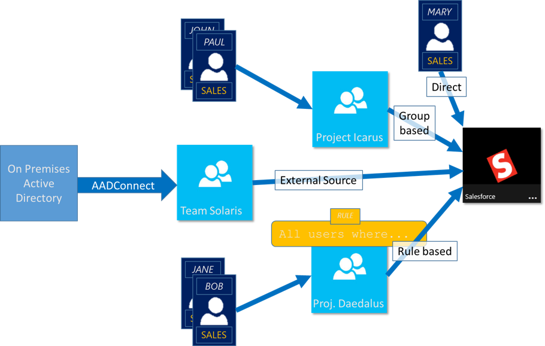
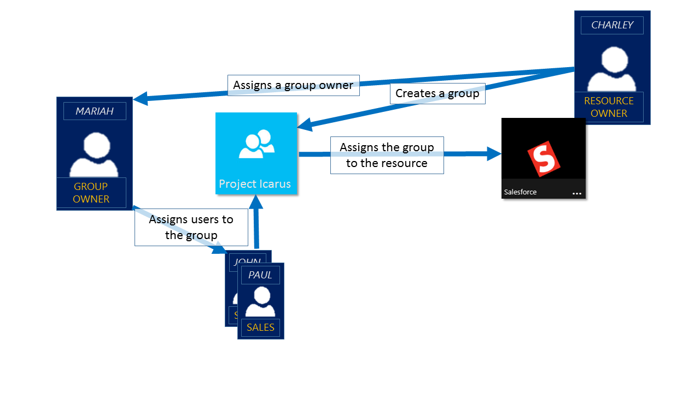

<properties
    pageTitle="Verwalten des Zugriffs auf Ressourcen mit Azure-Active Directory-Gruppen | Microsoft Azure"
    description="Verwendung von Gruppen in Azure Active Directory zum Verwalten des Benutzerzugriffs auf lokale und Cloud Applikationen und Ressourcen."
    services="active-directory"
    documentationCenter=""
    authors="curtand"
    manager="femila"
    editor=""
/>

<tags
    ms.service="active-directory"
    ms.workload="identity"
    ms.tgt_pltfrm="na"
    ms.devlang="na"
    ms.topic="article"
    ms.date="08/10/2016"
    ms.author="curtand"/>

# Verwalten des Zugriffs auf Ressourcen mit Azure-Active Directory-Gruppen

Azure Active Directory (Azure AD) ist eine umfassende Identität und Access Management Lösung, die eine umfangreiche Sammlung von Funktionen zum Verwalten des Zugriffs auf lokale und Cloudanwendungen und Ressourcen, einschließlich Microsoft online Services wie Office 365 und eine Welt von nicht - Microsoft SaaS Applikationen bereitstellt. Dieser Artikel enthält eine Übersicht über, aber folgen den Anweisungen in der [Verwaltung von Sicherheitsgruppen in Azure AD-](active-directory-accessmanagement-manage-groups.md)Azure AD-sofort, Entwurfsphase beginnen soll. Wenn Nutzung PowerShell zum Verwalten von Gruppen in Azure-Active Directory angezeigt werden sollen, können Sie weitere im [Vorschau-Cmdlets für die Verwaltung der Azure Active Directory](active-directory-accessmanagement-groups-settings-v2-cmdlets.md)lesen.

> [AZURE.NOTE] Wenn Azure Active Directory verwenden möchten, benötigen Sie ein Azure-Konto an. Wenn Sie kein Konto haben, können Sie [für ein kostenloses Azure-Konto anmelden](https://azure.microsoft.com/pricing/free-trial/).

In Azure AD ist eines der wichtigsten Features die Möglichkeit zum Verwalten des Zugriffs auf Ressourcen. Diese Ressourcen können Teil des Verzeichnisses, wie in der Groß-/Kleinschreibung von Berechtigungen zum Verwalten von Objekten durch Rollen im Verzeichnis oder Ressourcen, die außerhalb Verzeichnis, wie z. B. SaaS Applications, Azure Services und SharePoint-Websites oder auf lokale Ressourcen werden. Es gibt vier Arten, um die ein Benutzer Zugriffsrechte für eine Ressource zugeordnet werden kann:

1. Direkte Zuordnung

    Benutzer können direkt auf eine Ressource durch den Besitzer dieser Ressource zugeordnet werden.

2. Gruppenmitgliedschaft

    Eine Gruppe kann an eine Ressource durch den Ressourcenbesitzer, und klicken Sie auf diese Weise, zugeordnet werden die Mitglieder dieser Gruppe den Zugriff auf die Ressource gewähren. Mitgliedschaft in der Gruppe kann dann durch den Besitzer der Gruppe verwaltet werden. Der Ressourcenbesitzer delegiert effektiv, die Berechtigung zum Zuweisen von Benutzern, die die Ressource an den Besitzer der Gruppe.

3. Regel-basierten

    Der Ressourcenbesitzer kann mithilfe eine Regel express, welchen Benutzern Zugriff auf eine Ressource zugewiesen werden soll. Das Ergebnis der Regel hängt von den Attributen, die in die Regel und deren Werte für bestimmte Benutzer verwendet und auf diese Weise delegiert effektiv der Ressourcenbesitzer das Recht, Zugriff auf ihre Ressourcen zur autorisierenden Quelle für den Attributen, die in der Regel verwendet werden. Der Ressourcenbesitzer weiterhin verwaltet die Regel selbst und bestimmt, welche Attribute und Werte Zugriff auf ihre Ressourcen zu ermöglichen.

4. Externe Zertifizierungsstelle

    Der Zugriff auf eine Ressource wird von einer externen Quelle abgeleitet; Angenommen, eine Gruppe, die aus einer autorisierenden Quelle wie beispielsweise einem lokalen Verzeichnis oder eine app SaaS wie Arbeitstag synchronisiert wird. Der Ressourcenbesitzer weist die Gruppe für den Zugriff auf die Ressource und die externe Quelle verwaltet die Mitglieder der Gruppe.

  

## Schauen Sie sich einem Video, das Access Management erläutert.

Sie können ein kurzes Video ansehen, das Weitere Informationen hierzu finden Sie erläutert:

**Azure AD: Einführung in dynamischen Mitgliedschaft für Gruppen**

> [AZURE.VIDEO azure-ad--introduction-to-dynamic-memberships-for-groups]

## Wie greift Management im Azure Active Directory funktionieren?
In der Mitte der Anzeige Azure ist die Lösung für die Verwaltung der Sicherheitsgruppe. Verwalten des Zugriffs auf Ressourcen mithilfe einer Sicherheitsgruppe ist ein bekannter Paradigma, der für eine flexible und verständliche Möglichkeit, die gewünschte Gruppe von Benutzern Zugriff auf eine Ressource hinzufügen kann. Der Ressourcenbesitzer (oder der Administrator des Verzeichnisses) weisen eine Gruppe aus, um einen bestimmten Zugangspunkt nach den Ressourcen zu schaffen, die sie besitzen. Die Mitglieder der Gruppe Zugriff bereitgestellt werden, und der Ressourcenbesitzer das Recht, die Mitgliederliste einer Gruppe, Person, wie etwa einen Abteilungsleiter oder eine Helpdesk-Administratoren delegieren kann.

Der Besitzer einer Gruppe kann auch diese Gruppe für Self-service-Anfragen verfügbar machen. Auf diese Weise, können ein Endbenutzer suchen und suchen Sie nach der Gruppe und eine Anforderung zum Teilnehmen an effektiv Suchvorgänge über die Berechtigung zum Zugriff auf die Ressourcen, die verwaltet werden über die Gruppe. Der Besitzer der Gruppe kann der Gruppe einrichten, sodass die Verknüpfung Besprechungsanfragen automatisch genehmigt werden oder Anfordern der Genehmigung durch den Besitzer der Gruppe. Wenn ein Benutzer zum Beitritt zu einer Gruppe anfordert, wird die Anfrage an den Besitzer der Gruppe weitergeleitet. Wenn eine der der Besitzer die Anforderung genehmigt, das Anfordern des Benutzers benachrichtigt, und der Benutzer der Gruppe hinzugefügt wird. Wenn eine der der Besitzer die Anfrage verweigert, ist das Anfordern des Benutzers benachrichtigt jedoch nicht Mitglied der Gruppe.

## Erste Schritte mit Access management
Möchten Sie die ersten Schritte? Sie sollten sich einige der grundlegenden Aufgaben, die Sie mit Azure AD-Gruppen ausführen können. Verwenden Sie diese Funktionen speziellen Zugriff auf unterschiedliche Personengruppen für verschiedene Ressourcen in Ihrer Organisation bereit. Ersten grundlegenden Schritte sind nachstehend aufgeführt.

* [Erstellen einer einfachen Regel zum Konfigurieren von dynamischer Mitgliedschaften für eine Gruppe](active-directory-accessmanagement-manage-groups.md#how-can-i-manage-the-membership-of-a-group-dynamically)

* [Verwalten des Zugriffs auf SaaS Applikationen mithilfe einer Gruppe](active-directory-accessmanagement-group-saasapps.md)

* [Verfügbarmachen einer Gruppe für Endbenutzer Self-service](active-directory-accessmanagement-self-service-group-management.md)

* [Synchronisieren einer lokalen Gruppe Azure mit Azure AD-verbinden](active-directory-aadconnect.md)

* [Verwalten von Besitzer für eine Gruppe](active-directory-accessmanagement-managing-group-owners.md)

## Nächste Schritte für die Verwaltung von access
Jetzt, dass Sie die Grundlagen der Verwaltung von Access verstanden haben, sind hier einige zusätzlichen erweiterten Funktionen verfügbar in Azure Active Directory für das Verwalten des Zugriffs auf Ihre Applikationen und Ressourcen.

* [Verwenden von Attributen zum Erstellen erweiterter Regeln](active-directory-accessmanagement-groups-with-advanced-rules.md)

* [Verwalten von Sicherheitsgruppen in Azure Active Directory](active-directory-accessmanagement-manage-groups.md)

* [Einrichten von dedizierte Gruppen in Azure Active Directory](active-directory-accessmanagement-dedicated-groups.md)

* [Diagramm-API-Referenz für Gruppen](https://msdn.microsoft.com/Library/Azure/Ad/Graph/api/groups-operations#GroupFunctions)

* [Azure Active Directory-Cmdlets für die Konfiguration von gruppeneinstellungen](active-directory-accessmanagement-groups-settings-cmdlets.md)
