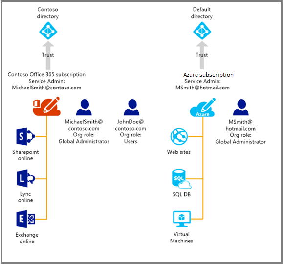

<properties
   pageTitle="Verwalten von Verzeichnis für Ihr Office 365-Abonnement in Azure | Microsoft Azure"
   description="Verwalten von einer Office 365-Abonnement Directory mithilfe von Azure Active Directory und den klassischen Azure-portal"
   services="active-directory"
   documentationCenter=""
   authors="curtand"
   manager="femila"
   editor=""/>

<tags
   ms.service="active-directory"
   ms.devlang="na"
   ms.topic="get-started-article"
   ms.tgt_pltfrm="na"
   ms.workload="identity"
   ms.date="08/23/2016"
   ms.author="curtand"/>

# Verwalten Sie Verzeichnis für Ihr Office 365-Abonnement in Azure

Dieser Artikel beschreibt, wie ein Verzeichnis zu verwalten, die für ein Office 365-Abonnement über das klassische Azure-Portal erstellt wurde. Sie müssen entweder Dienstadministrator oder eine gemeinsame Administrator eines Azure-Abonnements klassischen Azure-Portal anmelden können. Wenn Sie noch nicht über ein Azure-Abonnement verfügen, können für eine [30-Tage-Testversion frei](https://azure.microsoft.com/trial/get-started-active-directory/) heute registrieren und Ihre erste Cloudlösung in weniger als 5 Minuten, verwenden diesen Link bereitstellen. Achten Sie darauf, dass das Konto geschäftlichen oder schulnotizbücher verwenden, mit denen Sie sich bei Office 365 anmelden.

Nach Abschluss das Azure-Abonnement können Sie klassische Azure-Portal anmelden und Azure Dienste zuzugreifen. Klicken Sie auf die Active Directory-Erweiterung zum selben Verzeichnis zu verwalten, das Ihre Office 365-Benutzer authentifiziert.

Wenn Sie bereits über ein Azure-Abonnement verfügen, ist der Vorgang zum Verwalten von eines zusätzlichen Verzeichnis auch recht einfach. Angenommen, haben Michael Smith ein Office 365-Abonnement für "contoso.com". Er kann auch ein er die Anmeldung bei Ihrem Microsoft-Konto mit Azure-Abonnement msmith@hotmail.com. In diesem Fall verwaltet er zwei Verzeichnisse durchsuchen.

  Abonnement |  Office 365  |  Azure
  -------------- | ------------- | -------------------------------
  Anzeigename |  Contoso  |     Standard-Azure Active Directory (Azure AD)-Verzeichnis
  Domänennamen  |  "contoso.com"  | msmithhotmail.onmicrosoft.com

Er möchte die Benutzeridentitäten im Verzeichnis "Contoso" verwalten, während er Azure mit Ihrem Microsoft-Konto angemeldet ist, dass er Azure Active Directory-Funktionen, wie z. B. kombinierte Authentifizierung aktivieren kann. Das folgende Diagramm kann hilfreich sein, um den Vorgang zu veranschaulichen.

In diesem Fall sind die zwei Verzeichnisse unabhängig voneinander.

## Zum Verwalten von zwei unabhängiger Verzeichnisse durchsuchen
In der Reihenfolge für Michael Smith beide Verzeichnisse zu verwalten, während er als Azure angemeldet ist msmith@hotmail.com, er muss die folgenden Schritte ausführen:

> [AZURE.NOTE]
> Nur, wenn ein Benutzer mit einem Microsoft-Konto angemeldet ist, können diese Schritte ausgeführt werden. Wenn der Benutzer, mit einer Arbeit oder Schule Konto, die Option angemeldet ist steht nicht zur Verfügung **vorhandenen Verzeichnis verwenden** . Ein geschäftlichen oder schulnotizbücher-Konto kann nur von sein home-Verzeichnis (d. h., dass das Verzeichnis, wo das Konto geschäftlichen oder schulnotizbücher gespeichert ist, und, die das Business Schule besitzt, oder) authentifiziert werden.

1.  Melden Sie sich bei der [Azure klassischen Portal](https://manage.windowsazure.com) als msmith@hotmail.com.
2.  Klicken Sie auf **neu** > **App Services** > **Active Directory** > **Verzeichnis** > **Benutzerdefinierte erstellen**.
3.  Klicken Sie auf vorhandene Verzeichnis verwenden, und aktivieren Sie das Kontrollkästchen **ich möchte nun abgemeldet** .
4.  Melden Sie sich zum klassischen Azure-Portal als globaler Administrator von Contoso.onmicrosoft.com (z. B. msmith@contoso.com).
5.  Wenn Sie dazu aufgefordert werden **Verzeichnis Contoso mit Azure verwenden?**, klicken Sie auf **Weiter**.
6.  Klicken Sie auf **jetzt abmelden**.
7.  Melden Sie sich bei dem klassischen Azure-Portal als msmith@hotmail.com. Contoso-Verzeichnis und standardmäßigen Verzeichnis werden in der Active Directory-Erweiterung.

Nachdem Sie diese Schritte msmith@hotmail.com ist ein globaler Administrator im Verzeichnis "Contoso".

## Verwalten von Ressourcen als globaler Administrator
Jetzt angenommen, Susanne muss Verwalten von Websites und Ressourcen, die für das Azure Abonnement zugeordnet sind msmith@hotmail.com. Bevor sie dies möglich ist, muss Michael Smith diese zusätzliche Schritte ausführen:

1.  Melden Sie sich mit dem Dienst-Administratorkonto für das Abonnement Azure [Azure klassischen-Portal](https://manage.windowsazure.com) (in diesem Beispiel msmith@hotmail.com).
2.  Übertragen Sie das Abonnement in das Contoso-Verzeichnis: Klicken Sie auf **Einstellungen** > **Abonnements** > Wählen Sie das Abonnement > **Verzeichnis bearbeiten** > Wählen Sie **Contoso (Contoso.com)**aus. Als Teil der Übertragung, Arbeit oder Schule werden Konten, die Co-Administratoren des Abonnements sind, entfernt.
3.  Hinzufügen von Susanne als gemeinsame Administrator des Abonnements: Klicken Sie auf **Einstellungen** > **Administratoren** > Wählen Sie das Abonnement > **Hinzufügen** > Typ **JohnDoe@Contoso.com**.

## Nächste Schritte
Weitere Informationen über die Beziehung zwischen Abonnements und Verzeichnissen finden Sie unter [wie ein Abonnement ein Verzeichnis zugeordnet ist](active-directory-how-subscriptions-associated-directory.md).
