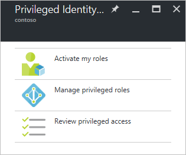

<properties
   pageTitle="Erste Schritte mit Azure AD berechtigten Identitätsmanagement | Microsoft Azure"
   description="Informationen Sie zum Verwalten von Berechtigungen Identitäten mit der Anwendung Azure Active Directory berechtigten Identität Verwaltung Azure-Portal."
   services="active-directory"
   documentationCenter=""
   authors="kgremban"
   manager="femila"
   editor=""/>

<tags
   ms.service="active-directory"
   ms.devlang="na"
   ms.topic="get-started-article"
   ms.tgt_pltfrm="na"
   ms.workload="identity"
   ms.date="09/16/2016"
   ms.author="kgremban"/>

# Erste Schritte mit Azure AD berechtigten Identitätsmanagement

Mit Berechtigungen Identitätsmanagement Azure Active Directory (AD) können Sie verwalten, steuern und Überwachen von Access innerhalb Ihrer Organisation. Zugriff auf Ressourcen in Azure Active Directory und anderen Microsoft-Onlinedienste wie Office 365 oder Microsoft Intune umfasst.

Dieser Artikel beschreibt, wie Sie die Azure AD PIM app zu Ihrer Azure Portals Dashboard hinzufügen.

## Fügen Sie die Berechtigungen Identitätsmanagement-Anwendung

Bevor Sie Azure AD berechtigten Identitätsmanagement verwenden, müssen Sie die Anwendung zu Ihrem Azure Portals Dashboard hinzufügen.

1. Melden Sie sich bei der [Azure-Portal](https://portal.azure.com/) als globaler Administrator Ihres Verzeichnisses.
2. Wenn Ihre Organisation mehr als ein Verzeichnis verfügt, wählen Sie Ihren Benutzernamen in der oberen rechten Ecke des Portals Azure ein. Wählen Sie das Verzeichnis, in dem PIM soll verwendet werden.
3. Wählen Sie **Weitere Dienste** und verwenden Sie das Filters Textfeld um zu suchenden **Azure AD berechtigten Identitätsmanagement**.
4. Überprüfen Sie **Pin zum Dashboard** , und klicken Sie dann auf **Erstellen**. Die Anwendung berechtigten Identitätsmanagement wird geöffnet.

Wenn Sie die erste Person Azure AD berechtigten Identitätsmanagement in Ihrem Verzeichnis verwendet haben, führt Sie den [Datensicherheits-Assistenten](active-directory-privileged-identity-management-security-wizard.md) durch die ursprüngliche Zuordnung Oberfläche. Anschließend werden Sie automatisch die erste **Security Administrator** "und" **Rolle Stufe Administrator** des Verzeichnisses geworden. Nur ein Rolle Stufe-Administrator kann diese Anwendung zum Verwalten des Zugriffs für andere Administratoren zugreifen.  

## Navigieren Sie zu Ihrer Aufgaben

Nachdem Azure AD berechtigten Identitätsmanagement haben eingerichtet, sehen Sie bei jedem die Anwendung öffnen im Navigationsbereich Blade. Verwenden Sie diese Blade, um Ihre Identität Verwaltungsaufgaben durchzuführen.

- **Aktivieren Sie meine Rollen** gelangen Sie zu der Liste der Rollen, die Ihnen zugewiesen sind. Dies ist die Stelle, an der Sie alle Rollen aktivieren möchten, denen Sie für berechtigt sind.

- **Verwalten von Berechtigungen Rollen** ist das Dashboard für Rolle Stufe Administratoren verwalten rollenzuweisungen Rolle Aktivierung Einstellungen ändern, starten Access Prüfungen und vieles mehr. Die Optionen in diesem Dashboard werden für jeden deaktiviert, die ein Administrator Rolle Stufe nicht zur Verfügung.

- **Überprüfen von Berechtigungen Access** gelangen Sie alle steht noch aus Access-Prüfungen, die Sie ausführen müssen, ob Überprüfen von Access für sich selbst oder an eine andere Person sind. 

<!--Every topic should have next steps and links to the next logical set of content to keep the customer engaged-->
## Nächste Schritte

Die [Azure AD berechtigten Identitätsmanagement Overview](active-directory-privileged-identity-management-configure.md) enthält weitere Details wie Sie Administratorzugriff in Ihrer Organisation verwalten können.

[AZURE.INCLUDE [active-directory-privileged-identity-management-toc](../../includes/active-directory-privileged-identity-management-toc.md)]

<!--Image references-->

[1]: ./media/active-directory-privileged-identity-management-configure/PIM_EnablePim.png
