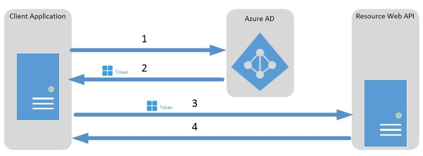

<properties
    pageTitle="Azure AD, um den Dienst, Authentifizierung mit OAuth2.0 | Microsoft Azure"
    description="Dieser Artikel beschreibt, wie HTTP-Nachrichten verwendet, um den Dienst Authentifizierung mithilfe des OAuth2.0 Client Anmeldeinformationen gewähren des Ablaufs implementiert wird."
    services="active-directory"
    documentationCenter=".net"
    authors="priyamohanram"
    manager="mbaldwin"
    editor=""/>

<tags
    ms.service="active-directory"
    ms.workload="identity"
    ms.tgt_pltfrm="na"
    ms.devlang="na"
    ms.topic="article"
    ms.date="10/03/2016"
    ms.author="priyamo"/>

# <a name="service-to-service-calls-using-client-credentials"></a>Dienst zum Dienst Anrufe mit Clientanmeldeinformationen

OAuth 2.0 Client Anmeldeinformationen erteilen Datenfluss dieser Funktion kann einen Webdienst (ein *vertrauliche Client*) mit einem eigenen Anmeldeinformationen authentifizieren beim Aufrufen von einem anderen Webdienst, statt die Identität eines Benutzers. In diesem Szenario ist der Client in der Regel einen mittleren Ebene-Webdienst, eine Daemon-Dienst oder die Website an.

## <a name="client-credentials-grant-flow-diagram"></a>Clientanmeldeinformationen erteilen Datenflussdiagramm

Das folgende Diagramm wird erläutert, wie die Anmeldeinformationen des Clients Fluss arbeitet in Azure Active Directory (Azure AD) erteilen.



1. Die Clientanwendung an den Endpunkt des Azure AD-token Emission authentifiziert und einer Access-Token anfordert.
2. Der Azure AD-token Emission Endpunkt Probleme das Access-Token.
3. Das Access-Token wird verwendet, der abgesicherten Ressource authentifizieren.
4. Daten aus der abgesicherten Ressource ist mit der Webanwendung zurückgegeben.

## <a name="register-the-services-in-azure-ad"></a>Registrieren Sie sich die Dienste in Azure Active Directory

Registrieren Sie sowohl den einen Dienst und der Dienst empfangen in Azure Active Directory (Azure AD) ein. Weitere Informationen finden Sie unter [Hinzufügen, aktualisieren, und Entfernen einer App](active-directory-integrating-applications.md#BKMK_Native)

## <a name="request-an-access-token"></a>Anfordern einer Access-Token

Verwenden Sie zum Anfordern einer Access-Token HTTP POST für den Mandanten-spezifische Azure AD-Endpunkt.

```
https://login.microsoftonline.com/<tenant id>/oauth2/token
```

## <a name="service-to-service-access-token-request"></a>Token zugriffsanforderung Dienst

Anforderung einer Access Dienst-token enthält die folgenden Parameter.

| Parameter | | Beschreibung |
|-----------|------|------------|
| response_type | Erforderlich | Gibt den gewünschten Antworttyp an. In einen Fluss Client Anmeldeinformationen erteilen muss der Wert **Client_credentials**sein.|
| client_id | Erforderlich | Gibt die Azure AD-Client-Id des einen Webdiensts an. Zum Aufrufen der einen Anwendung Client-ID im Verwaltungsportal Azure finden Sie klicken Sie auf **Active Directory**, klicken Sie auf das Verzeichnis, klicken Sie auf die Anwendung, und klicken Sie dann auf **Konfigurieren**.|
| client_secret | Erforderlich |  Geben Sie einen Schlüssel für einen Webdienst in Azure AD registriert. Um einen Schlüssel, im Verwaltungsportal Azure erstellen möchten, klicken Sie auf **Active Directory**auf Verzeichnis, klicken Sie auf die Anwendung, und klicken Sie dann auf **Konfigurieren**. |
| Ressource | Erforderlich | Geben Sie die App-ID URI des Webdiensts empfangen. Um den App-ID-URI im Verwaltungsportal Azure zu finden, klicken Sie auf **Active Directory**, klicken Sie auf das Verzeichnis, klicken Sie auf die Anwendung und klicken Sie dann auf **Konfigurieren**. |

## <a name="example"></a>Beispiel

Die folgenden HTTP-POST fordert ein Access-Token für den Webdienst https://service.contoso.com/. Die `client_id` identifiziert den Webdienst, der das Access-Token anfordert.

```
POST contoso.com/oauth2/token HTTP/1.1
Host: login.microsoftonline.com
Content-Type: application/x-www-form-urlencoded

grant_type=client_credentials&client_id=625bc9f6-3bf6-4b6d-94ba-e97cf07a22de&client_secret=qkDwDJlDfig2IpeuUZYKH1Wb8q1V0ju6sILxQQqhJ+s=&resource=https%3A%2F%2Fservice.contoso.com%2F
```

## <a name="service-to-service-access-token-response"></a>Access Dienst Token Antwort

Eine Antwort Erfolg enthält eine Antwort JSON OAuth 2.0 mit den folgenden Parametern.

| Parameter   | Beschreibung |
|-------------|-------------|
|access_token |Die angeforderten Zugriffstoken. Dieses Token können einen Webdienst zum Empfangen Webdienst authentifizieren. |
|access_type  | Gibt den Wert des Sicherheitstokens an. **Person**ist nur der Typ, der Azure AD unterstützt. Weitere Informationen zu der Person Token, finden Sie unter der [OAuth 2.0 Autorisierung Framework: Person Token Verwendung (RFC 6750)](http://www.rfc-editor.org/rfc/rfc6750.txt).
|expires_in   | Wie lange das Access-Token (in Sekunden) gültig ist.|
|expires_on   |Die Zeit, wenn das Access-Token abgelaufen ist. Das Datum wird als die Anzahl der Sekunden zwischen 1970 dargestellt-01-01T0:0:0Z UTC erst Ablauf. Dieser Wert wird verwendet, um die Gültigkeitsdauer des zwischengespeicherten Token zu bestimmen. |
|Ressource     | Der App-ID-URI des Webdiensts empfangen. |

## <a name="example"></a>Beispiel

Im folgenden Beispiel wird eine Antwort Erfolg zu einer Besprechungsanfrage für eine Access-Token mit einem Webdienst verbunden.

```
{
"access_token":"eyJhbGciOiJSUzI1NiIsIng1dCI6IjdkRC1nZWNOZ1gxWmY3R0xrT3ZwT0IyZGNWQSIsInR5cCI6IkpXVCJ9.eyJhdWQiOiJodHRwczovL3NlcnZpY2UuY29udG9zby5jb20vIiwiaXNzIjoiaHR0cHM6Ly9zdHMud2luZG93cy5uZXQvN2ZlODE0NDctZGE1Ny00Mzg1LWJlY2ItNmRlNTdmMjE0NzdlLyIsImlhdCI6MTM4ODQ0ODI2NywibmJmIjoxMzg4NDQ4MjY3LCJleHAiOjEzODg0NTIxNjcsInZlciI6IjEuMCIsInRpZCI6IjdmZTgxNDQ3LWRhNTctNDM4NS1iZWNiLTZkZTU3ZjIxNDc3ZSIsIm9pZCI6ImE5OTE5MTYyLTkyMTctNDlkYS1hZTIyLWYxMTM3YzI1Y2RlYSIsInN1YiI6ImE5OTE5MTYyLTkyMTctNDlkYS1hZTIyLWYxMTM3YzI1Y2RlYSIsImlkcCI6Imh0dHBzOi8vc3RzLndpbmRvd3MubmV0LzdmZTgxNDQ3LWRhNTctNDM4NS1iZWNiLTZkZTU3ZjIxNDc3ZS8iLCJhcHBpZCI6ImQxN2QxNWJjLWM1NzYtNDFlNS05MjdmLWRiNWYzMGRkNThmMSIsImFwcGlkYWNyIjoiMSJ9.aqtfJ7G37CpKV901Vm9sGiQhde0WMg6luYJR4wuNR2ffaQsVPPpKirM5rbc6o5CmW1OtmaAIdwDcL6i9ZT9ooIIicSRrjCYMYWHX08ip-tj-uWUihGztI02xKdWiycItpWiHxapQm0a8Ti1CWRjJghORC1B1-fah_yWx6Cjuf4QE8xJcu-ZHX0pVZNPX22PHYV5Km-vPTq2HtIqdboKyZy3Y4y3geOrRIFElZYoqjqSv5q9Jgtj5ERsNQIjefpyxW3EwPtFqMcDm4ebiAEpoEWRN4QYOMxnC9OUBeG9oLA0lTfmhgHLAtvJogJcYFzwngTsVo6HznsvPWy7UP3MINA",
"token_type":"Bearer",
"expires_in":"3599",
"expires_on":"1388452167",
"resource":"https://service.contoso.com/"
}
```

## <a name="see-also"></a>Siehe auch

* [OAuth 2.0 in Azure Active Directory](active-directory-protocols-oauth-code.md)
