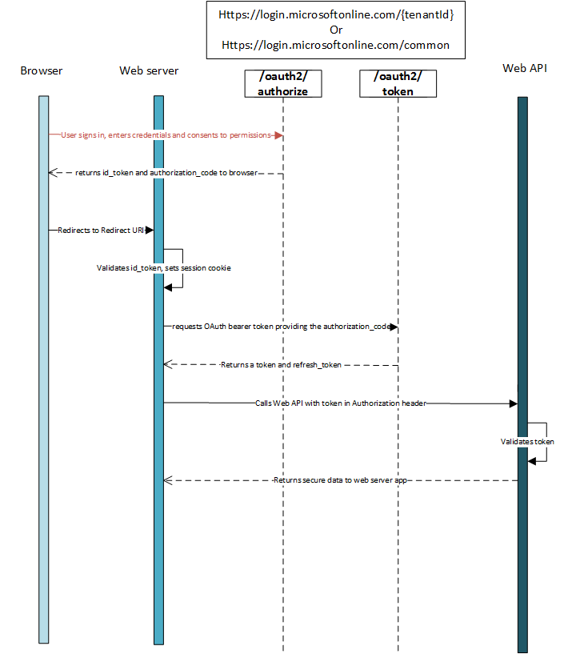

<properties
    pageTitle="Azure AD-.NET Protokoll Übersicht | Microsoft Azure"
    description="Dieser Artikel beschreibt, wie HTTP-Nachrichten zu verwenden, um die Autorisierung des Zugriffs auf Webanwendungen und Web-APIs in Ihrem Mandanten über Azure Active Directory und OpenID verbinden."
    services="active-directory"
    documentationCenter=".net"
    authors="priyamohanram"
    manager="mbaldwin"
    editor=""/>

<tags
    ms.service="active-directory"
    ms.workload="identity"
    ms.tgt_pltfrm="na"
    ms.devlang="na"
    ms.topic="article"
    ms.date="10/03/2016"
    ms.author="priyamo"/>


# <a name="authorize-access-to-web-applications-using-openid-connect-and-azure-active-directory"></a>Autorisierung des Zugriffs auf OpenID verbinden und Azure Active Directory mithilfe von Webanwendungen

[Verbinden OpenID](http://openid.net/specs/openid-connect-core-1_0.html) ist eine einfache Identität Ebene über das Protokoll OAuth 2.0 erstellt. OAuth 2.0 definiert Verfahren zum Beziehen und Verwenden von **Access Token** Zugriff auf geschützte Ressourcen, aber sie legen Sie keine standard Methoden zum Identitätsinformationen bereitstellen. Verbinden von OpenID implementiert Authentifizierung als Erweiterung für die Autorisierung OAuth 2.0 Bereitstellen von Informationen über den Endbenutzer in Form von einer `id_token` , die bestätigt die Identität des Benutzers als auch bietet grundlegende Profilinformationen über den Benutzer.

OpenID verbinden ist unserer Empfehlungen, wenn Sie eine Webanwendung erstellen, die auf einem Server gehostet wird und Sie über einen Browser.

## <a name="authentication-flow-using-openid-connect"></a>Authentifizierung Fluss mit OpenID verbinden

Grundlegendsten Anmeldung illustrieren enthält die folgenden Schritte aus: jeder von ihnen im folgenden ausführlich beschrieben ist.




## <a name="send-the-sign-in-request"></a>Senden Sie die Anfrage Anmeldung

Wenn die Webanwendung zum Authentifizieren des Benutzers erforderlich ist, müssen sie weisen Sie ihn an die `/authorize` Endpunkt. Diese Anforderung ähnelt des ersten Abschnitts eines der [OAuth 2.0 Autorisierung Code Datenfluss](active-directory-protocols-oauth-code.md), mit ein paar wichtige Unterschiede:

- Die Anforderung muss den Bereich einschließen `openid` in der `scope` Parameter.
- Die `response_type` Parameter darf enthalten `id_token`.
- Die Anforderung darf enthalten die `nonce` Parameter.

Eine Beispiel für eine Anforderung würde also wie folgt aussehen:

```
// Line breaks for legibility only

GET https://login.microsoftonline.com/{tenant}/oauth2/authorize?
client_id=6731de76-14a6-49ae-97bc-6eba6914391e
&response_type=id_token
&redirect_uri=http%3A%2F%2Flocalhost%2Fmyapp%2F
&response_mode=form_post
&scope=openid
&state=12345
&nonce=7362CAEA-9CA5-4B43-9BA3-34D7C303EBA7
```

| Parameter | | Beschreibung |
| ----------------------- | ------------------------------- | --------------- |
| Mandanten | Erforderlich | Die `{tenant}` Wert in den Pfad der Anforderung zum Steuern, wer bei der Anwendung anmelden kann verwendet werden kann.  Die zulässigen Werte sind Mandanten Bezeichnern, z. B. `8eaef023-2b34-4da1-9baa-8bc8c9d6a490` oder `contoso.onmicrosoft.com` oder `common` für den Mandanten unabhängig Token |
| client_id | Erforderlich | Die Anwendung-Id zu Ihrer Anwendung zugewiesen werden, wenn Sie ihn mit Azure AD registriert. Sie können dies im klassischen Azure-Portal suchen. Klicken Sie auf **Active Directory**, klicken Sie auf das Verzeichnis, klicken Sie auf die Anwendung und klicken Sie dann auf **Konfigurieren** |
| response_type | Erforderlich | Darf enthalten `id_token` für OpenID verbinden Anmeldung.  Sie können auch andere Response_types, enthalten, z. B. `code`. |
| Bereich | Erforderlich | Ein Leerzeichen getrennte Liste mit Bereichen.  Für OpenID verbinden möchten, muss es den Bereich enthalten `openid`, die die Berechtigung "Signieren Sie" in der Benutzeroberfläche für die Zustimmung übersetzt.  Sie können auch die anderen Bereiche in dieser Anforderung zum Anfordern der Genehmigung aufnehmen. |
| Nonce | Erforderlich | Einen Wert enthalten, in der Besprechungsanfrage, die von der app, die im resultierenden einbezogen werden generiert `id_token` als Anspruch.  Die app kann dann diesen Wert, um die Wiedergabe token Angriffen zu verringern überprüfen.  Der Wert ist in der Regel eine zufällige, eindeutige Zeichenfolge oder GUID, die verwendet werden kann, um den Ursprung der Anfrage zu identifizieren.  |
| redirect_uri | empfohlen | Die Redirect_uri der app, wo Authentifizierungsantworten gesendet und Empfangen von Ihrer app werden können.  Es muss exakt eine der Redirect_uris übereinstimmen, die Sie im Portal registriert, außer es Url codiert werden muss. |
| response_mode | empfohlen | Gibt die Methode, die verwendet werden soll, das sich daraus ergebende Authorization_code wieder zu Ihrer Anwendung zu senden.  Unterstützte Werte sind `form_post` für *HTTP-Formular bereitstellen* oder `fragment` für *URL-Fragment*.  Für Webanwendungen wir empfehlen mit `response_mode=form_post` um sicherzustellen, dass die sicherste Übertragung von Token an Ihrer Anwendung.  
| Bundesstaat | empfohlen | Einen Wert enthalten, in der Besprechungsanfrage, die auch in der token Antwort zurückgegeben wird.  Es kann eine Textzeichenfolge alle Inhalte, die Sie möchten.  Ein eindeutiger erzeugten Wert wird in der Regel für die [websiteübergreifende Anforderungsfälschungsangriffe verhindern](http://tools.ietf.org/html/rfc6749#section-10.12)verwendet.  Der Status wird auch Informationen zu den Status des Benutzers in der app codieren, bevor die Authentifizierungsanfrage ist, beispielsweise die Seite oder die Ansicht, die sie aufgetreten auf Waren, verwendet. |
| Aufforderung | Optional | Gibt den Typ der Interaktion mit dem Benutzer, die erforderlich ist.  Die einzige gültige Werte zu diesem Zeitpunkt sind 'Anmeldung', 'keine' und 'Zustimmung'.  `prompt=login`Erzwingt den Benutzer zur Eingabe ihrer Anmeldeinformationen auf die Anfrage Inverser_Operator einmaligen Anmeldung.  `prompt=none`ist die Umkehrung – es stellt sicher, dass der Benutzer jede interaktive Aufforderung überhaupt nicht angezeigt werden.  Wenn die Anfrage über einmaligen Anmeldung im Hintergrund ausgeführt werden kann, wird der Endpunkt einen Fehler zurück.  `prompt=consent`Nachdem sich der Benutzer den Benutzer auffordert signiert, erteilen, um die app, wird das Dialogfeld OAuth Zustimmung ausgelöst. |
| login_hint | Optional | Kann verwendet werden um vorab füllen Sie das Feld Benutzername/e-Mail-Adresse von der Anmeldeseite für den Benutzer, wenn Sie ihren Benutzernamen im Voraus kennen.  Häufig apps werden für diesen Parameter verwenden, während eine erneute Authentifizierung, haben Sie bereits den Benutzernamen aus einem vorherigen Anmeldung mit extrahiert die `preferred_username` beanspruchen. |


An diesem Punkt werden der Benutzer aufgefordert, geben Sie ihre Anmeldeinformationen ein, und führen Sie die Authentifizierung.

### <a name="sample-response"></a>Beispiel für Antwort

Eine Antwort Stichprobe könnte nach der Benutzerauthentifizierung wie folgt aussehen:

```
POST /myapp/ HTTP/1.1
Host: localhost
Content-Type: application/x-www-form-urlencoded

id_token=eyJ0eXAiOiJKV1QiLCJhbGciOiJSUzI1NiIsIng1dCI6Ik1uQ19WWmNB...&state=12345
```

| Parameter | Beschreibung |
| ----------------------- | ------------------------------- |
| id_token | Die `id_token` , die die app angefordert. Sie können die `id_token` zum Überprüfen der Identität des Benutzers, und beginnen eine Sitzung mit dem Benutzer.  |
| Bundesstaat | Einen Wert enthalten, in der Besprechungsanfrage, die auch in der token Antwort zurückgegeben wird. Ein eindeutiger erzeugten Wert wird in der Regel für die [websiteübergreifende Anforderungsfälschungsangriffe verhindern](http://tools.ietf.org/html/rfc6749#section-10.12)verwendet.  Der Status wird auch Informationen zu den Status des Benutzers in der app codieren, bevor die Authentifizierungsanfrage ist, beispielsweise die Seite oder die Ansicht, die sie aufgetreten auf Waren, verwendet. |

### <a name="error-response"></a>Antwort zurück
Fehler beim Antworten möglicherweise auch gesendet werden, mit der `redirect_uri` , damit die app diese angemessen behandelt werden kann:

```
POST /myapp/ HTTP/1.1
Host: localhost
Content-Type: application/x-www-form-urlencoded

error=access_denied&error_description=the+user+canceled+the+authentication
```

| Parameter | Beschreibung |
| ----------------------- | ------------------------------- |
| Fehler | Eine Zeichenfolge des Fehlercodes, die zum Fehlertypen klassifizieren, die auftreten verwendet werden kann, und kann verwendet werden, um auf Fehler zu reagieren. |
| error_description | Eine bestimmte Fehlermeldung, die einen Entwickler die Ursache eines Authentifizierungsfehlers ermitteln helfen können.  |

#### <a name="error-codes-for-authorization-endpoint-errors"></a>Fehlercodes Autorisierung Endpunkt Fehler

Die folgende Tabelle beschreibt die verschiedenen Fehlercodes, der in zurückgegeben werden, können die `error` Parameter der Antwort zurück.

| Fehlercode | Beschreibung | Clientaktion |
|------------|-------------|---------------|
| invalid_request | Protokoll Fehler aufgetreten, beispielsweise ein fehlender erforderlicher Parameter. | Beheben, und senden Sie die Anfrage erneut. Dies ist eine Entwicklung Fehler in der Regel während der anfänglichen Testen abgefangen wird.|
| unauthorized_client | Die Clientanwendung ist nicht zulässig, um einen Autorisierungscode anzufordern. | Das Problem tritt gewöhnlich auf, wenn die Clientanwendung in Azure AD nicht registriert ist oder nicht auf des Benutzers Azure AD-Mandanten hinzugefügt wird. Die Anwendung kann den Benutzer mit für das Installieren der Anwendung und das Hinzufügen zur Azure AD auffordern. |
| ACCESS_DENIED | Ressourcenbesitzer Zustimmung verweigert | Die Clientanwendung kann den Benutzer benachrichtigen, den fortgesetzt werden kann, wenn der Benutzer zulässt. |
| unsupported_response_type | Der Autorisierung Server unterstützt nicht den Antworttyp in der Besprechungsanfrage. | Beheben, und senden Sie die Anfrage erneut. Dies ist eine Entwicklung Fehler in der Regel während der anfänglichen Testen abgefangen wird.|
|server_error | Der Server ist einen unerwarteten Fehler aufgetreten. | Wiederholen Sie die Anforderung. Dieser Fehler können temporäre Bedingungen führen. Die Clientanwendung möglicherweise für den Benutzer erläutern, dass seine Antwort Fälligkeitsdatum ein temporärer Fehler verzögert ist. |
| temporarily_unavailable | Der Server ist vorübergehend ausgelastet und kann die Anfrage zu behandeln. | Wiederholen Sie die Anforderung. Die Clientanwendung möglicherweise für den Benutzer erläutern, dass seine Antwort aufgrund einer vorübergehenden Bedingung verzögert ist. |
| invalid_resource |Die Zielressource ist ungültig, da es ist nicht vorhanden, Azure AD nicht werden gefunden kann oder nicht richtig konfiguriert.| Dies zeigt an, dass die Ressource, sofern vorhanden, nicht in den Mandanten konfiguriert wurde. Die Anwendung kann den Benutzer mit für das Installieren der Anwendung und das Hinzufügen zur Azure AD auffordern. |

## <a name="validate-the-idtoken"></a>Überprüfen der id_token

Nur empfangen eine `id_token` reicht nicht zum Authentifizieren des Benutzers; müssen Sie die Signatur überprüfen, und überprüfen Sie die Ansprüche in der `id_token` pro Anforderungen Ihrer app. Der Azure AD-Endpunkt verwendet JSON Web Token (JWTs) und öffentlichem Schlüssel Token melden, und stellen Sie sicher, dass sie gültig sind.

Können Sie auswählen, um zu überprüfen der `id_token` im Client Code, sondern üblich besteht darin, senden die `id_token` mit einem Back-End-Server, und führen Sie die Überprüfung vorhanden. Nachdem Sie die Signatur überprüft haben die `id_token`, es gibt ein paar Ansprüche, die Sie zur Überprüfung erforderlich.

Sie möchten möglicherweise auch zusätzliche Ansprüche abhängig von Ihrem Szenario überprüfen. Einige allgemeinen Validierungen umfassen:

- Sicherstellung der Benutzer-Organisation wurde für die app registriert.
- Sicherstellung des Benutzers verfügt nicht über ordnungsgemäße Autorisierung/Berechtigungen
- Um eine bestimmte Stärke von Authentifizierung sicherzustellen, wie z. B. mehrstufige Authentifizierung aufgetreten.

Nachdem Sie vollständig überprüft haben die `id_token`, können Sie eine Sitzung mit dem Benutzer beginnen und verwenden Sie die Ansprüche in der `id_token` zum Abrufen von Informationen über den Benutzer in Ihrer app. Diese Informationen kann verwendet werden, für die Anzeige, Datensätze, Autorisierungs. Lesen Sie weitere Informationen zu den Arten von token und Ansprüche [Token unterstützt und Ansprüche](active-directory-token-and-claims.md).

## <a name="send-a-sign-out-request"></a>Senden einer Abmelden Anforderung

Wenn Sie den Benutzer bei der app Abmelden melden möchten, ist es nicht ausreichend, deaktivieren Sie die Sitzung mit dem Benutzer Cookies oder andernfalls Ende Ihrer app.  Sie müssen den Benutzer auch Umleiten der `end_session_endpoint` für abmelden.  Wenn Sie dies nicht tun, wird der Benutzer zu Ihrer Anwendung erneut authentifiziert ohne ihre Anmeldeinformationen erneut eingeben, da eine gültige einzelne anmelden Sitzung mit dem Azure AD-Endpunkt besteht sein.

Sie können den Benutzer einfach Umleiten der `end_session_endpoint` im Dokument Metadaten OpenID Verbinden aufgeführt:

```
GET https://login.microsoftonline.com/common/oauth2/logout?
post_logout_redirect_uri=http%3A%2F%2Flocalhost%2Fmyapp%2F

```

| Parameter | | Beschreibung |
| ----------------------- | ------------------------------- | ------------ |
| post_logout_redirect_uri | empfohlen | Die URL, die der Benutzer nach der erfolgreichen Abmeldung umgeleitet werden soll.  Wenn Sie nicht enthalten ist, wird der Benutzer eine allgemeine Meldung angezeigt.  |

## <a name="token-acquisition"></a>Token Acquisition

Viele Web apps müssen nicht nur den Benutzer melden, sondern auch für diesen Benutzer OAuth mit einen Webdienst zugreifen. Dieses Szenario kombiniert OpenID verbinden, für die Benutzerauthentifizierung, während gleichzeitig beim Abrufen eines `authorization_code` , die verwendet werden kann, um die erste `access_tokens` OAuth Autorisierung Code Datenfluss verwenden.

## <a name="get-access-tokens"></a>Abrufen von Access-Token

Zum Erfassen von Access Token, müssen Sie die Anfrage Anmeldung von oben zu ändern:

```
// Line breaks for legibility only

GET https://login.microsoftonline.com/{tenant}/oauth2/authorize?
client_id=6731de76-14a6-49ae-97bc-6eba6914391e      // Your registered Application Id
&response_type=id_token+code
&redirect_uri=http%3A%2F%2Flocalhost%2Fmyapp%2F       // Your registered Redirect Uri, url encoded
&response_mode=form_post                              // form_post', or 'fragment'
&scope=openid
&resource=https%3A%2F%2Fservice.contoso.com%2F                                   
&state=12345                                         // Any value, provided by your app
&nonce=678910                                        // Any value, provided by your app
```

Indem Berechtigung Bereiche in der Besprechungsanfrage und mithilfe `response_type=code+id_token`, die `authorize` Endpunkt wird sichergestellt, dass der Benutzer die Berechtigungen, die im angegebenen zugestimmt hat die `scope` Abfrage Parameter und Ihre app einen Autorisierungscode für eine Access-Token austauschen zurück.

### <a name="successful-response"></a>Erfolgreiche Antwort

Eine erfolgreiche Antwort mit `response_mode=form_post` sieht wie folgt aus:

```
POST /myapp/ HTTP/1.1
Host: localhost
Content-Type: application/x-www-form-urlencoded

id_token=eyJ0eXAiOiJKV1QiLCJhbGciOiJSUzI1NiIsIng1dCI6Ik1uQ19WWmNB...&code=AwABAAAAvPM1KaPlrEqdFSBzjqfTGBCmLdgfSTLEMPGYuNHSUYBrq...&state=12345
```

| Parameter | Beschreibung |
| ----------------------- | ------------------------------- |
| id_token | Die `id_token` , die die app angefordert. Sie können die `id_token` zum Überprüfen der Identität des Benutzers, und beginnen eine Sitzung mit dem Benutzer. |
| Code | Die Authorization_code, die die app angefordert. Den Autorisierungscode können die app in einer Access-Token für die Zielressource anfordern. Authorization_codes sind sehr kurzlebige, in der Regel sie ablaufen nach etwa 10 Minuten. |
| Bundesstaat | Wenn der Parameter Status in der Besprechungsanfrage enthalten ist, sollte der gleiche Wert in der Antwort angezeigt werden. Die app sollte überprüfen Sie, ob die Bundesstaat Werte in die Anforderung und Antwort identisch sind. |

### <a name="error-response"></a>Antwort zurück

Fehler beim Antworten möglicherweise auch gesendet werden, mit der `redirect_uri` , damit die app diese angemessen behandelt werden kann:

```
POST /myapp/ HTTP/1.1
Host: localhost
Content-Type: application/x-www-form-urlencoded

error=access_denied&error_description=the+user+canceled+the+authentication
```

| Parameter | Beschreibung |
| ----------------------- | ------------------------------- |
| Fehler | Eine Zeichenfolge des Fehlercodes, die zum Fehlertypen klassifizieren, die auftreten verwendet werden kann, und kann verwendet werden, um auf Fehler zu reagieren. |
| error_description | Eine bestimmte Fehlermeldung, die einen Entwickler die Ursache eines Authentifizierungsfehlers ermitteln helfen können.  |

Eine Beschreibung der möglichen Fehlercodes und deren Aktion empfohlene Client finden Sie unter [Autorisierung Endpunkt Fehler Fehlercodes](#error-codes-for-authorization-endpoint-errors).

Nachdem Sie eine Autorisierung abgerufen haben `code` und eine `id_token`, können Sie den Benutzer anmelden und erhalten Sie Zugriffstoken in deren Auftrag.  Wenn den Benutzer sich anmelden, überprüfen Sie die `id_token` genau wie zuvor beschrieben. Um Access Token zu gelangen, können Sie die in unseren [OAuth Protokoll Dokumentation](active-directory-protocols-oauth-code.md#Use-the-Authorization-Code-to-Request-an-Access-Token)beschriebenen Schritte.
