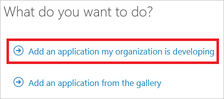
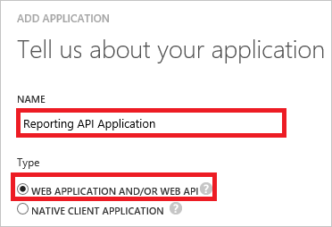
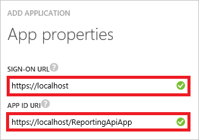
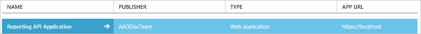
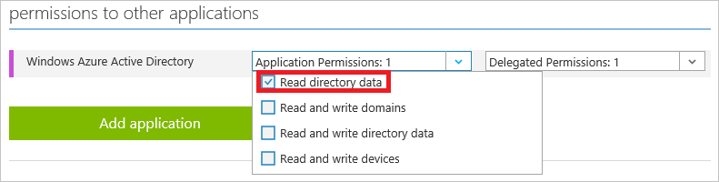
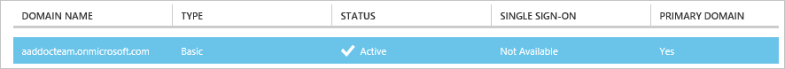
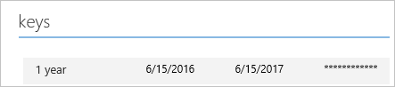

<properties
    pageTitle="Voraussetzungen für die Berichterstattung API Azure AD-Zugriff auf. | Microsoft Azure"
    description="Erfahren Sie mehr über die erforderlichen Komponenten über die Azure AD-API reporting zugreifen"
    services="active-directory"
    documentationCenter=""
    authors="dhanyahk"
    manager="femila"
    editor=""/>

<tags
    ms.service="active-directory"
    ms.devlang="na"
    ms.topic="article"
    ms.tgt_pltfrm="na"
    ms.workload="identity"
    ms.date="09/25/2016"
    ms.author="dhanyahk;markvi"/>

# <a name="prerequisites-to-access-the-azure-ad-reporting-api"></a>Voraussetzungen für die Berichterstattung API Azure AD-Zugriff auf 

Die [Azure AD-APIs reporting](https://msdn.microsoft.com/library/azure/ad/graph/howto/azure-ad-reports-and-events-preview) bieten Ihnen den programmgesteuerten Zugriff auf die Daten über eine Reihe von REST-basierten APIs. Sie können diese APIs aus einer Vielzahl von Sprachen und Tools programming aufrufen.

Die reporting-API verwendet [OAuth](https://msdn.microsoft.com/library/azure/dn645545.aspx) zum Zugriff auf das Web-APIs autorisieren. 

Um Ihren Zugriff auf die reporting-API vorbereiten zu können, müssen Sie folgende Aktionen ausführen:

1. Erstellen Sie eine Anwendung in Ihrem Azure AD-Mandanten 

2. Erteilen Sie die Anwendung geeigneten Berechtigungen zum Zugriff auf die Azure AD-Daten

3. Sammeln Sie Konfiguration Einstellungen in Ihrem Verzeichnis

Wenden Sie für Fragen, Probleme oder Feedback sich an [AAD Reporting helfen](mailto:aadreportinghelp@microsoft.com).


## <a name="create-an-azure-ad-application"></a>Erstellen einer Azure AD-Anwendung

Um Ihrem Verzeichnis Zugriff auf das Azure AD-API reporting konfigurieren zu können, müssen Sie sich Azure klassischen-Portal mit einem Administratorkonto Azure-Abonnement anmelden, die auch ein Mitglied der Rolle Directory globaler Administrator in Ihrer Azure AD-Mandanten ist.

> [AZURE.IMPORTANT] Unter Anmeldeinformationen mit "admininistratorberechtigungen" wie folgt ausgeführt Applications können sehr leistungsfähige werden, sodass Sie unbedingt der Anwendung ID/geheim Anmeldeinformationen schützen können.


1. Klicken Sie im [Azure klassischen Portal](https://manage.windowsazure.com)auf der linken Navigationsbereich auf **Active Directory**.

     

2. Wählen Sie aus der Liste **active Directory** Ihres Verzeichnisses ein.

3. Klicken Sie im Menü oben auf **Applications**.

     

4. Klicken Sie in der unteren Leiste auf **Hinzufügen**.

     

5. Klicken Sie auf die **Was möchten Sie tun?** Dialogfeld, klicken Sie auf **eine Anwendung, die zur Entwicklung von meinem Unternehmen hinzufügen**. 

     


6. Klicken Sie im Dialogfeld **Teilen Sie uns zu Ihrer Anwendung** führen Sie die folgenden Schritte aus: 

     

    ein. Geben Sie in das Textfeld **Name** einen Namen (z. B.: Reporting API-Anwendung).

    b. Wählen Sie **Web-Anwendung und/oder Web-API**.

    c. Klicken Sie auf **Weiter**.


7. Führen Sie die folgenden Schritte aus, klicken Sie im Dialogfeld **Eigenschaften von App** : 

     

    ein. Geben Sie in das Textfeld **Anmelden URL** `https://localhost`.

    b. Geben Sie in das Textfeld **App-ID-URI** ```https://localhost/ReportingApiApp```.

    c. Klicken Sie auf **abgeschlossen**.


## <a name="grant-your-application-permission-to-use-the-api"></a>Erteilen der die Anwendungsberechtigung zum Verwenden von der-API

1. Klicken Sie im [Azure klassischen Portal](https://manage.windowsazure.com/)auf der linken Navigationsbereich auf **Active Directory**.

     

2. Wählen Sie aus der Liste **active Directory** Ihres Verzeichnisses ein.

3. Klicken Sie im Menü oben auf **Applications**.

    


3. Wählen Sie in der Liste Applications aus der neu erstellten Anwendung.

    

4. Klicken Sie im Menü oben auf **Konfigurieren**.

    


5. Im Abschnitt **Berechtigungen für andere Programme** für die Ressource **Azure Active Directory** klicken Sie auf die Dropdownliste **Berechtigungen der Anwendung** , und wählen Sie dann **die Directory Daten lesen**.

    


5. Klicken Sie in der unteren Leiste auf **Speichern**.

    


## <a name="gather-configuration-settings-from-your-directory"></a>Sammeln Sie Konfiguration Einstellungen in Ihrem Verzeichnis

In diesem Abschnitt wird gezeigt, wie die folgenden Einstellungen aus Ihrem Verzeichnis abgerufen werden können:

- Domänennamen
- Client-ID
- Geheim Client

Sie benötigen diese Werte, wenn Anrufe an die berichterstellung-API konfigurieren. 


### <a name="get-your-domain-name"></a>Erhalten Sie Ihren Domänennamen

1. Klicken Sie im [Azure klassischen Portal](https://manage.windowsazure.com)auf der linken Navigationsbereich auf **Active Directory**.

     

2. Wählen Sie aus der Liste **active Directory** Ihres Verzeichnisses ein.

3. Klicken Sie im Menü im oberen Bereich auf **Domänen**.

     

4. Kopieren Sie in der Spalte **Domänennamen** Ihren Domänennamen ein.

     


### <a name="get-the-applications-client-id"></a>Abrufen der Anwendung Client-ID

1. Klicken Sie im [Azure klassischen Portal](https://manage.windowsazure.com)auf der linken Navigationsbereich auf **Active Directory**.

     

2. Wählen Sie aus der Liste **active Directory** Ihres Verzeichnisses ein.

3. Klicken Sie im Menü oben auf **Applications**.

     

4. Wählen Sie in der Liste Applications aus der neu erstellten Anwendung.

    

4. Klicken Sie im Menü oben auf **Konfigurieren**.

    

4. Kopieren Sie Ihre **Kunden-ID**an.

    


### <a name="get-the-applications-client-secret"></a>Abrufen der Anwendung Client geheim

Wenn der Anwendung Client geheim erhalten möchten, müssen Sie erstellen einen neuen Product Key, und speichern den Wert beim Speichern des neuen Product Keys, da es nicht möglich, diesen Wert später nicht mehr abrufen steht.

1. Klicken Sie im [Azure klassischen Portal](https://manage.windowsazure.com)auf der linken Navigationsbereich auf **Active Directory**.

     

2. Wählen Sie aus der Liste **active Directory** Ihres Verzeichnisses ein.

3. Klicken Sie im Menü oben auf **Applications**.

     

4. Wählen Sie in der Liste Applications aus der neu erstellten Anwendung.

    

4. Klicken Sie im Menü oben auf **Konfigurieren**.

    

5. Führen Sie im Abschnitt **Schlüssel** die folgenden Schritte aus: 

    

    ein. Wählen Sie in der Liste Dauer eine Dauer aus.

    b. Klicken Sie in der unteren Leiste auf **Speichern**.

    

    c. Kopieren Sie den Schlüsselwert ein.

## <a name="next-steps"></a>Nächste Schritte

- Möchten Sie die Daten aus der Azure AD Berichterstattung API in der programmgesteuerten Weise zugreifen? Schauen Sie sich die [Erste Schritte mit der Azure Active Directory Reporting-API](active-directory-reporting-api-getting-started.md).

- Wenn Sie mehr zur Verwendung von Berichten Azure Active Directory erfahren möchten, finden Sie unter der [Azure Active Directory Reporting Guide](active-directory-reporting-guide.md).  
