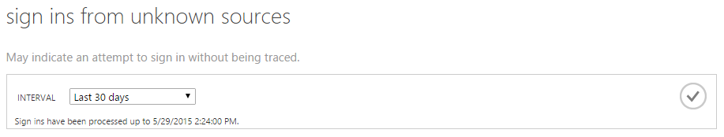
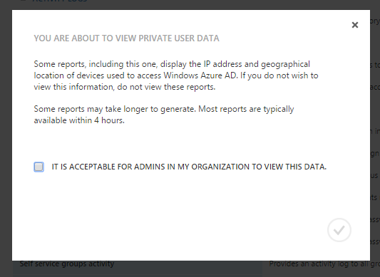
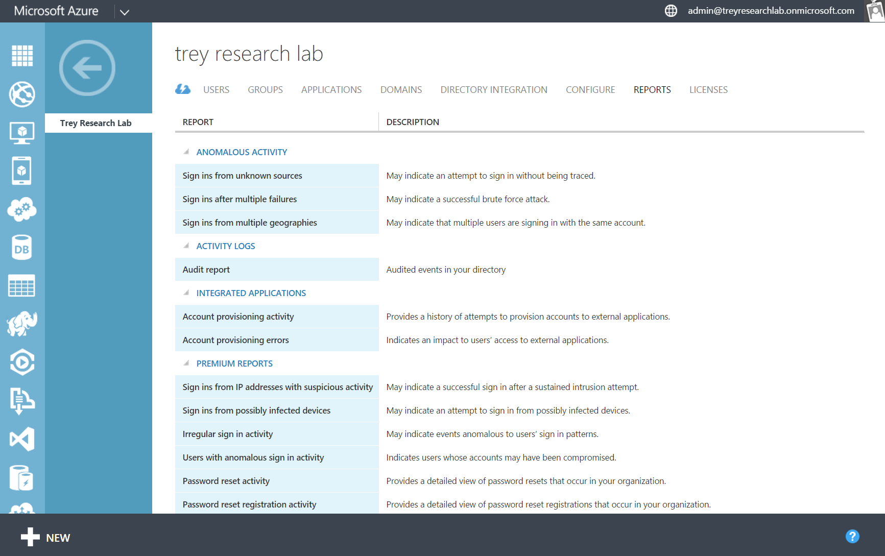
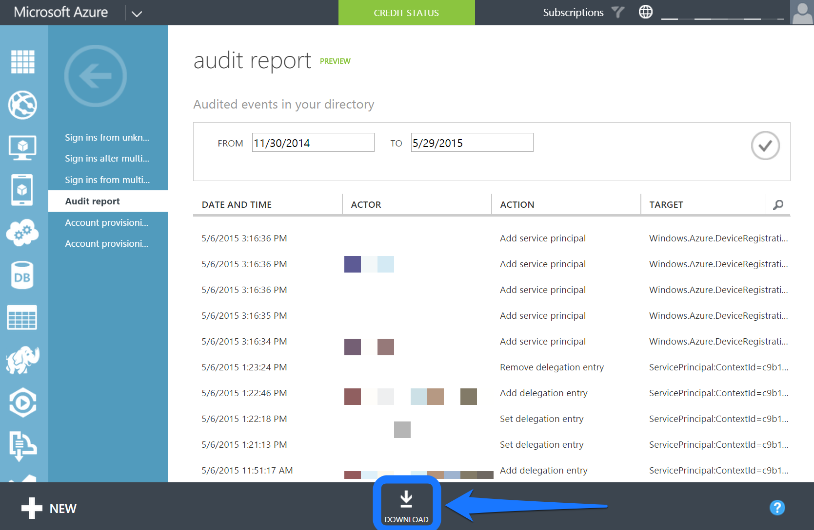
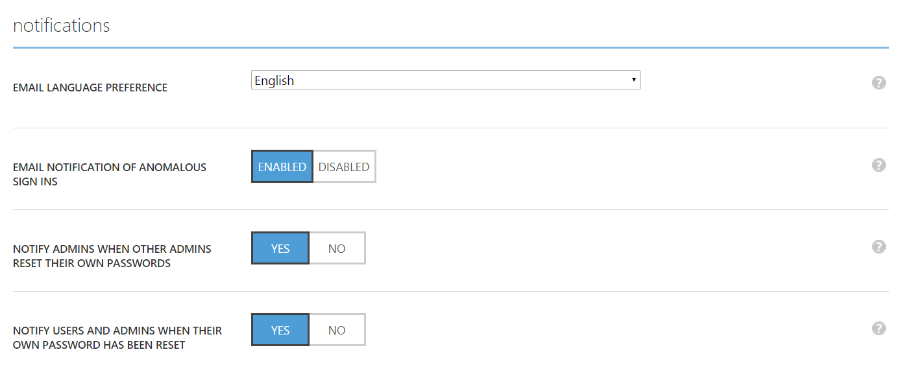
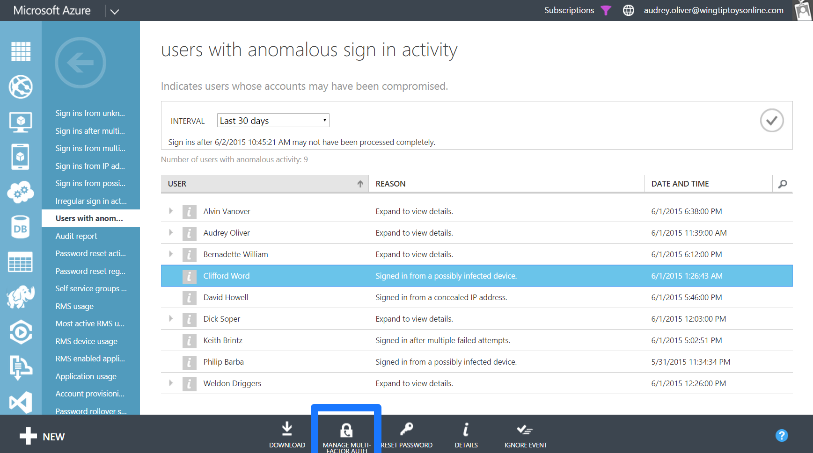

<properties
   pageTitle="Azure Active Directory Reporting: Erste Schritte | Microsoft Azure"
   description="Listen der verschiedenen verfügbaren Berichte in Azure Active Directory-Berichten"
   services="active-directory"
   documentationCenter=""
   authors="dhanyahk"
   manager="femila"
   editor=""/>

<tags
   ms.service="active-directory"
   ms.devlang="na"
   ms.topic="get-started-article"
   ms.tgt_pltfrm="na"
   ms.workload="identity"
   ms.date="03/07/2016"
   ms.author="dhanyahk"/>

# Erste Schritte mit Azure Active Directory-Berichte

## Zweck

Azure Active Directory (Azure AD) enthält, Sicherheit, Aktivitäten und Überwachungsberichte für Ihr Verzeichnis. Hier ist eine Liste der Berichte enthalten:

### Berichte zur Sicherheit

- Melden Sie sich-ins aus unbekannten Quellen
- Melden Sie sich-ins nach mehreren Fehlern
- Melden Sie sich-ins aus mehreren geografischen Standorten
- Melden Sie sich-ins von IP-Adressen mit verdächtigen Aktivität
- Unregelmäßiges Aktivität
- Melden Sie sich-ins von möglicherweise infizierten Geräte
- Benutzer mit abweichenden Aktivität

### Aktivitätsberichte

- Anwendungsverwendung: Zusammenfassung
- Anwendungsverwendung: detaillierte
- Anwendung dashboard
- Fehler bei der Bereitstellung zu berücksichtigen
- Geräte für einzelne Benutzer
- Aktivität für einzelne Benutzer
- Bericht zu Gruppen Aktivitäten
- Kennwort zurücksetzen Registrierung Aktivitätsbericht
- Zurücksetzen des Kennworts Aktivität

### Überwachungsberichte

- Überwachungsbericht Verzeichnis

> [AZURE.TIP] Weitere Dokumentation zur Azure AD-Berichterstattung checken Sie [Anzeigen Ihrer Berichte Access und die Verwendung aus](active-directory-view-access-usage-reports.md).

## So funktioniert es

### Reporting Verkaufspipeline

Der Verkaufspipeline reporting umfasst drei Hauptschritte. Jedes Mal, wenn sich der Benutzer anmeldet oder eine Authentifizierung besteht, passiert Folgendes:

- Zunächst der Benutzer authentifiziert (erfolgreich oder erfolglos), und das Ergebnis wird in der Azure-Active Directory-Service-Datenbanken gespeichert.
- In regelmäßigen Abständen, alle zuletzt verwendete Signieren ins verarbeitet werden. An diesem Punkt unsere Sicherheit und Algorithmen abweichenden Aktivität suchen alle zuletzt verwendete Signieren ins verdächtige Aktivitäten.
- Nach der Verarbeitung werden die Berichte geschrieben, Cache und in der klassischen Azure-Portal served.

### Melden der zweiten Generation Zeiten

Aufgrund der großen Anzahl von Authentifizierung und melden Sie sich ins verarbeiteten Azure AD-Plattform, die zuletzt verarbeitete Sign-ins sind im Durchschnitt eine Stunde alten. In Ausnahmefällen kann es die letzte Zeichen-ins Verarbeitungszeit bis zu 8 Stunden dauern.

Sie können der letzten verarbeiteten Anmeldung suchen, indem Sie den Hilfetext "am oberen Rand jeder Bericht.

> [AZURE.TIP] Weitere Dokumentation zur Azure AD-Berichterstattung checken Sie [Anzeigen Ihrer Berichte Access und die Verwendung aus](active-directory-view-access-usage-reports.md).

## Erste Schritte

### Melden Sie sich bei dem klassischen Azure-portal

Zuerst müssen Sie sich bei der [Azure klassischen Portal](https://manage.windowsazure.com) als globaler oder Compliance-Administrator anmelden. Sie müssen außerdem eine Azure-Abonnement Dienstadministrator oder gemeinsame Administrator sein, oder verwenden "Zugriff auf Azure AD" Azure-Abonnement.

### Navigieren Sie zu Berichten

Navigieren Sie zum Anzeigen von Berichten zur Registerkarte Berichte am oberen Rand Ihres Verzeichnisses.

Ist dies zum ersten Mal Berichte anzeigen, müssen Sie das Dialogfeld hinweisen zustimmen, bevor Sie die Berichte anzeigen können. Dies ist, um sicherzustellen, dass es spricht für Administratoren in Ihrer Organisation zum Anzeigen dieser Daten, privaten Informationen in einigen Ländern betrachtet werden können.

### Untersuchen Sie jeden Bericht

Navigieren Sie in jeder Bericht wird gesammelten Daten angezeigt und die Sign-ins verarbeitet. Sie können eine [Liste aller Berichte hier](active-directory-reporting-guide.md)suchen.

### Herunterladen von Berichten als CSV-Datei

Jeder Bericht kann als CSV-Datei (durch Trennzeichen getrennte) heruntergeladen werden. Sie können diese Dateien in Excel, PowerBI oder Drittanbieter-Analyse, dass die Programme zum weiteren Analysieren Ihrer Daten verwenden.

Wenn sämtliche Berichte als eine CSV-Datei herunterladen möchten, navigieren Sie zu dem Bericht, und klicken Sie unten auf "Download".

> [AZURE.TIP] Weitere Dokumentation zur Azure AD-Berichterstattung checken Sie [Anzeigen Ihrer Berichte Access und die Verwendung aus](active-directory-view-access-usage-reports.md).

## Nächste Schritte

### Anpassen von Benachrichtigungen für abweichenden melden Sie sich in der Aktivität

Navigieren Sie zur Registerkarte "Konfigurieren" Ihres Verzeichnisses an.

Führen Sie einen Bildlauf zum Abschnitt "Benachrichtigungen".

Aktivieren Sie oder deaktivieren Sie im Abschnitt "E-Mail-Benachrichtigungen über abweichenden Sign-ins".

### Mit der Azure AD-API Reporting integrieren

Finden Sie unter [Erste Schritte mit der Reporting-API](active-directory-reporting-api-getting-started.md).

### Mehrstufige Authentifizierung auf Benutzer populärer

Wählen Sie einen Benutzer in einem Bericht aus.

Klicken Sie auf die Schaltfläche "aktivieren MFA" am unteren Rand des Bildschirms.

> [AZURE.TIP] Weitere Dokumentation zur Azure AD-Berichterstattung checken Sie [Anzeigen Ihrer Berichte Access und die Verwendung aus](active-directory-view-access-usage-reports.md).

## Weitere Informationen

### Überwachen von Ereignissen

Erfahren Sie mehr über welche Ereignisse im Verzeichnis in [Azure Active Directory Reporting Audit Ereignisse](active-directory-reporting-audit-events.md)überwacht werden.

### API-Integration

Finden Sie unter [Erste Schritte mit der Reporting-API](active-directory-reporting-api-getting-started.md) und in der [Dokumentation zur API](https://msdn.microsoft.com/library/azure/mt126081.aspx).

### Aufnehmen von Kontakt

E-Mail [aadreportinghelp@microsoft.com](mailto:aadreportinghelp@microsoft.com) für Feedback, die Hilfe oder Fragen, die Sie möglicherweise haben.

> [AZURE.TIP] Weitere Dokumentation zur Azure AD-Berichterstattung checken Sie [Anzeigen Ihrer Berichte Access und die Verwendung aus](active-directory-view-access-usage-reports.md).
