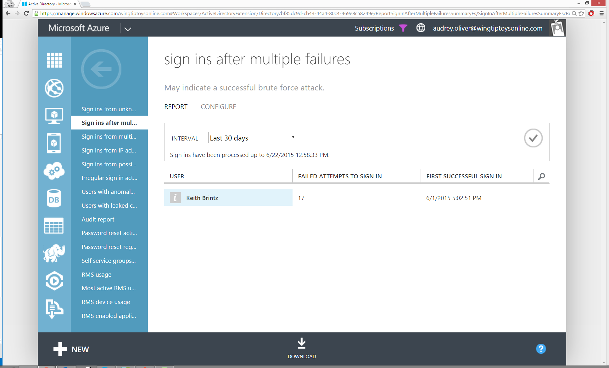

<properties
    pageTitle="Melden Sie sich ins nach mehreren Fehlern"
    description="Ein Bericht, der Benutzer, die erfolgreich angemeldet haben angibt nach mehreren aufeinander folgenden Signieren in Versuche fehlgeschlagen ist."
    services="active-directory"
    documentationCenter=""
    authors="SSalahAhmed"
    manager="femila"
    editor=""/>

<tags
    ms.service="active-directory"
    ms.workload="identity"
    ms.tgt_pltfrm="na"
    ms.devlang="na"
    ms.topic="article"
    ms.date="03/04/2016"
    ms.author="saah;kenhoff"/>

# Melden Sie sich-ins nach mehreren Fehlern
Dieser Bericht gibt an, welche Benutzer erfolgreich angemeldet haben nach mehreren aufeinander folgenden Signieren in Versuche fehlgeschlagen ist. Zu den möglichen Ursachen gehören:

- Benutzer, dessen Kennwort vergessen hat</li><li>Benutzer ist das Opfer eines Kennworts erfolgreich Raten brute-force-Methoden

Ergebnisse aus diesem Bericht zeigt Ihnen die Anzahl der aufeinander folgenden ungültigen Anmeldung Versuche vor dem erfolgreiche Anmeldung vorgenommen und einen Zeitstempel der ersten erfolgreichen Anmeldung zugeordnet.

**Berichtseinstellungen**: Sie können die minimale Anzahl von aufeinander folgender Fehler beim Anmelden konfigurieren, in Versuche, die erfolgen müssen, bevor er im Bericht angezeigt werden kann. Wenn Sie diese Einstellung ändern, ist es wichtig zu beachten, dass diese Änderungen nicht auf eine beliebige vorhandenen Fehler beim Anmelden ins einrichten, die derzeit in den vorhandenen Bericht anzeigen angewendet werden soll. Jedoch wird für alle zukünftigen Sign-ins angewendet werden. Mit diesem Bericht können nur lizenzierte Administratoren geändert werden.

