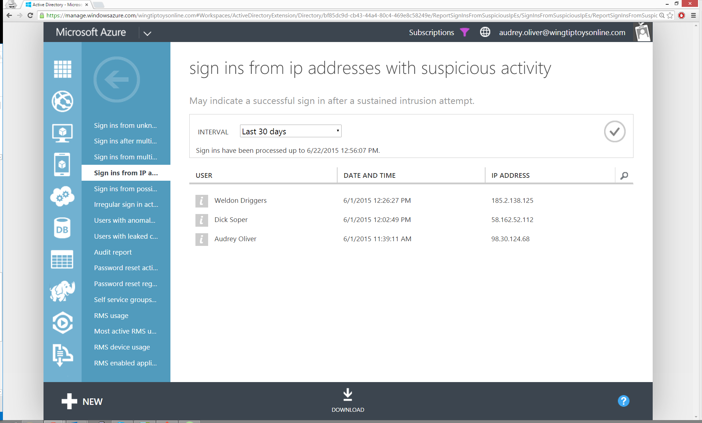

<properties
    pageTitle="Melden Sie sich ins von IP-Adressen mit verdächtigen Aktivität"
    description="Einen Bericht, der melden Sie sich in Versuche enthält, die Stelle, an der registrierten verdächtiger Aktivitäten von IP-Adressen ausgeführt wurden."
    services="active-directory"
    documentationCenter=""
    authors="SSalahAhmed"
    manager="femila"
    editor=""/>

<tags
    ms.service="active-directory"
    ms.workload="identity"
    ms.tgt_pltfrm="na"
    ms.devlang="na"
    ms.topic="article"
    ms.date="03/04/2016"
    ms.author="saah; kenhoff"/>

# Melden Sie sich ins von IP-Adressen mit verdächtigen Aktivität
Dieser Bericht zeigt Sign-ins von IP-Adressen, auf denen verdächtiger Aktivitäten erkannt wurde. Verdächtiger Aktivitäten ist in diesem Fall definiert eine ungewöhnlich hohe Verhältnis zwischen der Fehler beim Anmelden-ins müssen erfolgreich anmelden-ins, werden die hindeuten, dass eine IP-Adresse für bösartige Zwecke verwendet wird.

