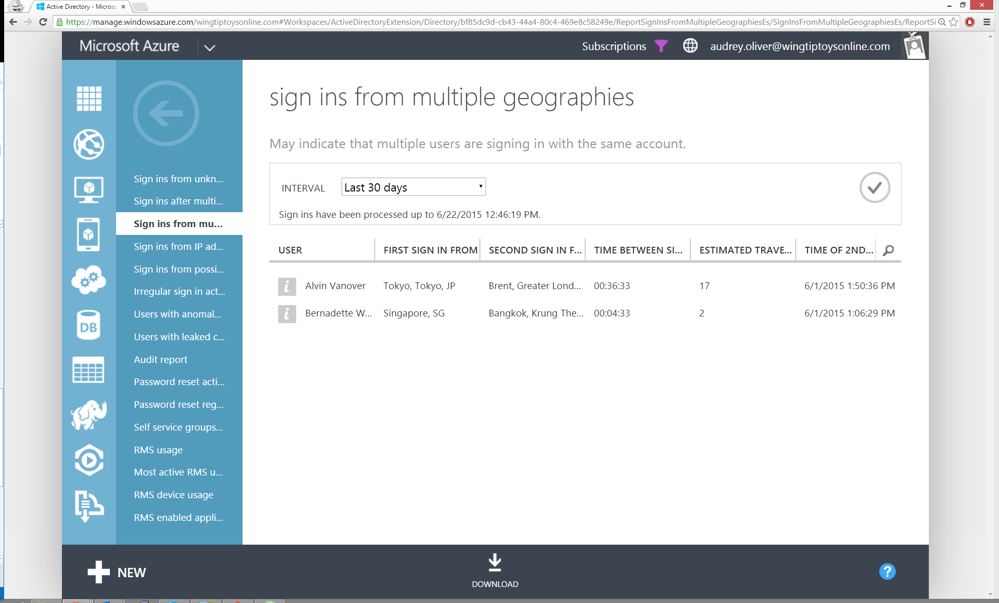

<properties
    pageTitle="Melden Sie sich über mehrere Regionen ins"
    description="Ein Bericht, der Benutzer gibt an, wo zwei ins melden, erschien stammen aus unterschiedlichen Regionen und die Uhrzeit zwischen den Zeichen, die ins für den Benutzer, um zwischen diesen Regionen bewegt wurde, verfügen unmöglich macht."
    services="active-directory"
    documentationCenter=""
    authors="SSalahAhmed"
    manager="gchander"
    editor=""/>

<tags
    ms.service="active-directory"
    ms.workload="identity"
    ms.tgt_pltfrm="na"
    ms.devlang="na"
    ms.topic="article"
    ms.date="03/04/2016"
    ms.author="saah;kenhoff"/>

# Melden Sie sich-ins aus mehreren geografischen Standorten

Der Bericht enthält erfolgreich anmelden-ins von einem Benutzer, wo zwei Zeichen-ins aus verschiedenen Bereichen kommt dargestellt und die Uhrzeit zwischen den Sign-ins ist es nicht möglich, für den Benutzer aus, um zwischen diesen Regionen zurückgelegten haben. Zu den möglichen Ursachen gehören:

- Benutzer ist ihr Kennwort für andere Benutzer freigeben.

- Benutzer ist einen Remotedesktop verwenden, um einen Webbrowser für Anmeldung zu starten

- Ein Hacker hat mit dem Konto eines Benutzers aus einem anderen Land angemeldet

- Benutzer ist ein VPN oder des Proxyservers verwenden.

- Benutzer ist signiert von mehreren Geräten zur gleichen Zeit, wie etwa einen Desktop und dann ein Mobiltelefon, und die IP-Adresse des Mobiltelefons ungewöhnliche.

Ergebnisse aus diesem Bericht zeigt Ihnen die erfolgreiche Anmeldung Ereignisse, zusammen mit der Zeitraum zwischen der Sign-ins, die Stelle, an der die Zeichen-ins angezeigte aus kommt Regionen und die geschätzte Reisen viel Zeit zwischen diesen Regionen. Die angezeigte Reisen Zeitangabe ist nur eine Schätzung und möglicherweise ab dem Zeitpunkt der tatsächlichen Reisen zwischen den Speicherorten unterschiedlich sein.

