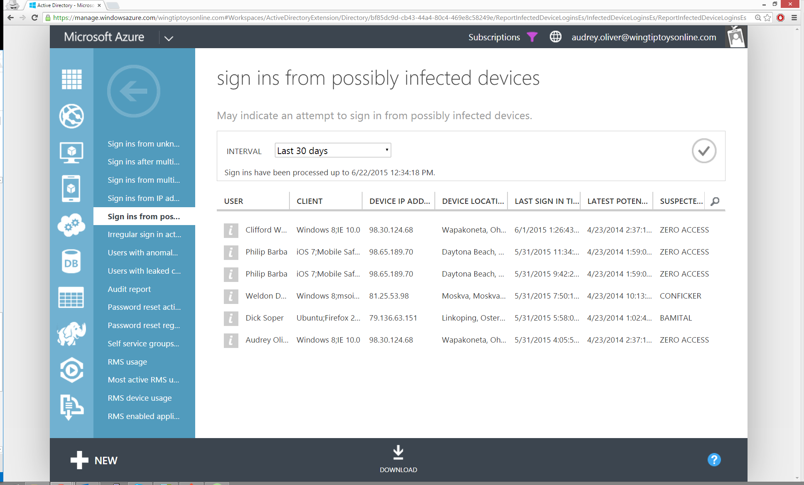

<properties
    pageTitle="Melden Sie sich ins von möglicherweise infizierten Geräte"
    description="Einen Bericht, der melden Sie sich in Versuche enthält, die von Geräten ausgeführt wurde, auf denen einige Malware (bösartige Software) ausgeführt werden kann."
    services="active-directory"
    documentationCenter=""
    authors="SSalahAhmed"
    manager="gchander"
    editor=""/>

<tags
    ms.service="active-directory"
    ms.workload="identity"
    ms.tgt_pltfrm="na"
    ms.devlang="na"
    ms.topic="article"
    ms.date="03/04/2016"
    ms.author="saah;kenhoff"/>

# Melden Sie sich ins von möglicherweise infizierten Geräte
Diesen Bericht versucht, Geräte Ihrer Benutzer zu identifizieren, die infiziert haben und sind jetzt Teil einer Botnet. Wir analysieren IP-Adressen der Benutzer anmelden-ins für die IP-Adressen, die wir wissen, dass sich Botnet-Servern..

Empfehlungen: Dieser Bericht kennzeichnet IP-Adressen nicht Benutzer Geräte. Es empfiehlt sich, dass Sie wenden Sie sich an den Benutzer und Geräte des Benutzers, um sicherzugehen, scannen. Es ist es möglich, dass persönliche Gerät eines Benutzers infiziert ist oder eine andere Person als Benutzer, die die IP-Adresse des Benutzers verwendet wurde, ein infizierte Gerät hat.

Weitere Informationen dazu, wie Sie Adresse Malware infiziert finden Sie unter der [Malware Protection Center](http://go.microsoft.com/fwlink/?linkid=335773).

