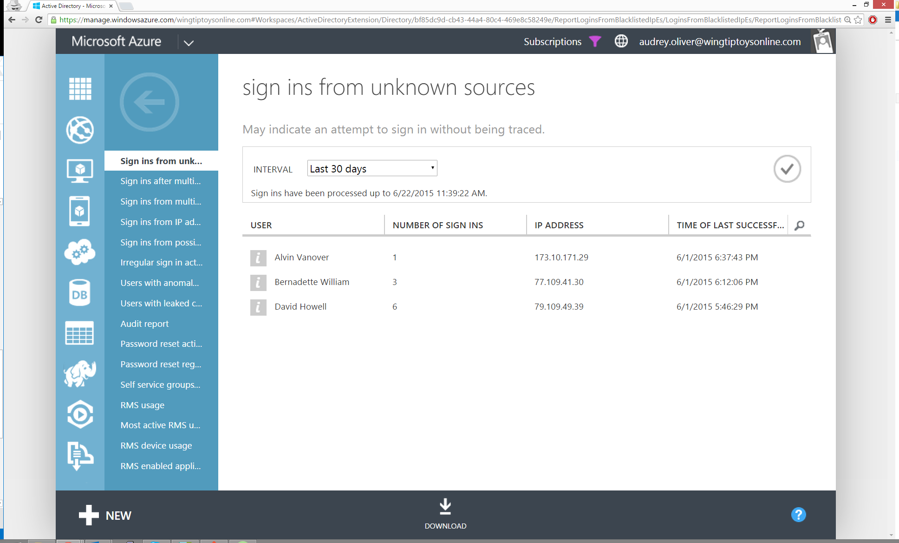

<properties
    pageTitle="Melden Sie sich ins von unbekannten Quellen"
    description="Ein Bericht, der Benutzer angibt, die in Ihrem Verzeichnis aus einen anonymen Proxy IP-Adresse angemeldet haben."
    services="active-directory"
    documentationCenter=""
    authors="SSalahAhmed"
    manager="femila"
    editor=""/>

<tags
    ms.service="active-directory"
    ms.workload="identity"
    ms.tgt_pltfrm="na"
    ms.devlang="na"
    ms.topic="article"
    ms.date="03/04/2016"
    ms.author="saah;kenhoff"/>

# Melden Sie sich ins von unbekannten Quellen
Dieser Bericht gibt an, welche Benutzer erfolgreich angemeldet sind in Ihrem Verzeichnis während einer Client-IP-Adresse zugewiesen, die vom Microsoft als eine anonyme Proxy IP-Adresse (beispielsweise eine Tor IP-Adresse) erkannt wurde. Diese Proxys werden häufig von Benutzern verwendet, die IP-Adresse des Computers ausblenden möchten, und für Absichten verwendet werden kann.

Ergebnisse aus diesem Bericht werden angezeigt, wie oft ein Benutzer erfolgreich zu Ihrem Verzeichnis aus, und die IP-Adresse des Proxys angemeldet.

