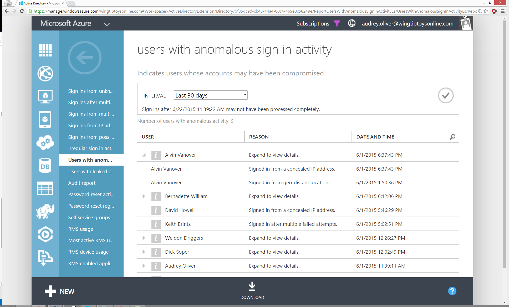

<properties
    pageTitle="Benutzer mit abweichenden anmelden Aktivität"
    description="Ein Bericht, der angibt, dass alle Benutzerkonten für die abweichenden in Aktivität melden wurde identifiziert."
    services="active-directory"
    documentationCenter=""
    authors="SSalahAhmed"
    manager="gchander"
    editor=""/>

<tags
    ms.service="active-directory"
    ms.workload="identity"
    ms.tgt_pltfrm="na"
    ms.devlang="na"
    ms.topic="article"
    ms.date="03/04/2016"
    ms.author="saah;kenhoff"/>

# Benutzer mit abweichenden anmelden Aktivität
Dies ist die eines Zusammenfassungsberichts, das kombiniert verdächtigen Sign-ins aus den folgenden Berichten:

<ul><li>Melden Sie sich ins von unbekannten Quellen</li>
<li>Melden Sie sich-ins nach mehreren Fehlern</li>
<li>Melden Sie sich-ins aus mehreren geografischen Standorten</li>
<li>Melden Sie sich-ins von IP-Adressen mit verdächtigen Aktivität</li>
<li>Melden Sie sich-ins von möglicherweise infizierten Geräte</li>
<li>Unregelmäßiges Aktivität</li>
</ul>

