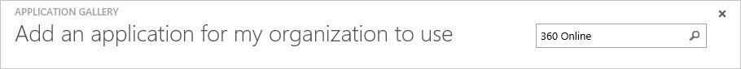
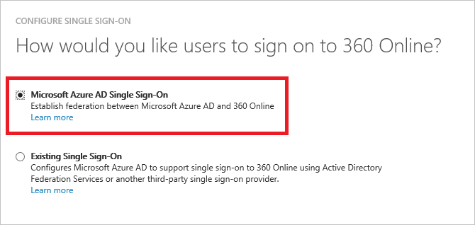
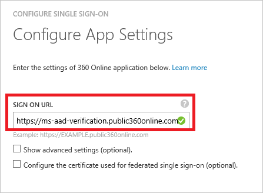
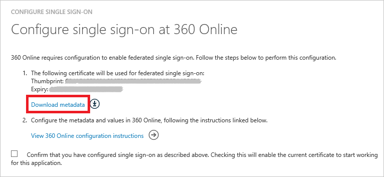
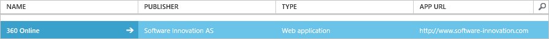

<properties
    pageTitle="Lernprogramm: Azure-Active Directory-Integration in 360° Online | Microsoft Azure"
    description="Informationen Sie zum einmaligen Anmeldens zwischen Azure Active Directory und 360 ° Online zu konfigurieren."
    services="active-directory"
    documentationCenter=""
    authors="jeevansd"
    manager="femila"
    editor=""/>

<tags
    ms.service="active-directory"
    ms.workload="identity"
    ms.tgt_pltfrm="na"
    ms.devlang="na"
    ms.topic="article"
    ms.date="09/01/2016"
    ms.author="jeedes"/>

# Lernprogramm: Azure-Active Directory-Integration in 360° Online

Ziel dieses Lernprogramms ist es zu zeigen, wie Sie Online 360 ° mit Azure Active Directory (Azure AD) integrieren.

Integration von 360° bietet mit Azure AD Online die folgenden Vorteile:

- Sie können in Azure AD steuern, wer auf 360 ° Online Server zugreifen kann
- Sie können Ihre Benutzer automatisch angemeldet-und 360 Grad Online (einmaliges Anmelden) mit ihren Azure AD-Konten auf erste aktivieren.
- Sie können Ihre Konten an einem zentralen Ort – im klassischen Azure-Portal verwalten.

Wenn Sie weitere Details zu SaaS app-Integration in Azure AD-wissen möchten, finden Sie unter [Was ist Zugriff auf die Anwendung und einmaliges Anmelden mit Azure Active Directory](active-directory-appssoaccess-whatis.md).

## Erforderliche Komponenten

Um Azure AD-Integration mit 360 ° Online zu konfigurieren, benötigen Sie die folgenden Elemente:

- Ein Azure AD-Abonnement
- Eine 360° Online-Mandanten

> [AZURE.NOTE] Wenn Sie um die Schritte in diesem Lernprogramm zu testen, empfehlen wir nicht mit einer Umgebung für die Herstellung.

Führen Sie zum Testen der Schritte in diesem Lernprogramm Tips:

- Sie sollten Ihre Umgebung Herstellung nicht verwenden, es sei denn, dies erforderlich ist.
- Wenn Sie eine Testversion Azure AD-Umgebung besitzen, können Sie eine einen Monat zum Testen [hier](https://azure.microsoft.com/pricing/free-trial/)erhalten.

## Szenario Beschreibung
Ziel dieses Lernprogramms ist, sodass Sie in einer Umgebung für Azure AD-einmaligen Anmeldens testen können. 

In diesem Lernprogramm beschriebenen Szenario besteht aus zwei Hauptfenster Bausteine:

1. 360° Online aus dem Katalog hinzufügen
2. Konfigurieren und Testen Azure AD einmaliges Anmelden

## 360° Online aus dem Katalog hinzufügen
Zum Konfigurieren der Integration von 360 ° Online in Azure AD müssen Sie Online 360 ° zu Ihrer Liste der verwalteten SaaS apps aus dem Katalog hinzuzufügen.

**Wenn 360 ° Online aus dem Katalog hinzufügen möchten, führen Sie die folgenden Schritte aus:**

1. Klicken Sie im **Azure klassischen Portal**auf der linken Navigationsbereich auf **Active Directory**.

    ![Active Directory][1]

2. Wählen Sie aus der Liste **Verzeichnis** Verzeichnis für das Sie Verzeichnisintegration aktivieren möchten.

3. Klicken Sie zum Öffnen der Anwendungsansicht in der Verzeichnisansicht im oberen Menü auf **Applications** .

    ![Applikationen][2]

4. Klicken Sie auf **Hinzufügen** , am unteren Rand der Seite.

    ![Applikationen][3]

5. Klicken Sie im Dialogfeld **Was möchten Sie tun** klicken Sie auf **eine Anwendung aus dem Katalog hinzufügen**.

    ![Applikationen][4]

6. Geben Sie in das Suchfeld **360 ° Online**ein.

    

7. Im Bereich Ergebnisse wählen Sie **360 ° Online aus**und dann auf **abgeschlossen** , um die Anwendung hinzuzufügen.
 
    

##  Konfigurieren und Testen Azure AD einmaliges Anmelden
Das Ziel der in diesem Abschnitt ist erläutert, wie Sie konfigurieren und Testen der Azure AD-einmaliges Anmelden mit 360° eines Namens "Britta Simon" Testbenutzers Online abhängig.

Azure AD muss für einmaliges Anmelden entwickelt welche Gegenstück Benutzer im 360 ° kennen, die an einen Benutzer in Azure AD Online ist. Kurzum, muss ein Link Beziehung zwischen einem Azure AD-Benutzer und dem entsprechenden Benutzer in 360 ° Online hergestellt werden.

Zum Konfigurieren und Azure AD-einmaliges Anmelden mit 360° Online testen, müssen Sie die folgenden Bausteine durchführen:

1. **[Konfigurieren von Azure AD einmaligen Anmeldens](#configuring-azure-ad-single-sign-on)** - damit Ihre Benutzer dieses Feature verwenden können.
2. **[Erstellen einer Azure AD Benutzer testen](#creating-an-azure-ad-test-user)** : Azure AD-einmaliges Anmelden mit Britta Simon testen.
4. **[Erstellen einer 360 ° Online Benutzer testen](#creating-a-360-online-test-user)** : ein Gegenstück von Britta Simon in 360 ° Online sein, die in der Azure AD-Darstellung Ihrer verknüpft ist.
5. **[Testen Sie Benutzer zuweisen Azure AD](#assigning-the-azure-ad-test-user)** - Britta Simon mit Azure AD-einmaliges Anmelden aktivieren.
5. **[Testen der einmaligen Anmeldens](#testing-single-sign-on)** - zur Überprüfung, ob die Konfiguration funktioniert.

### Konfigurieren von Azure AD einmaliges Anmelden

Das Ziel der in diesem Abschnitt ist Azure AD-einmaliges Anmelden im klassischen Azure-Portal aktivieren und konfigurieren einmaliges Anmelden in Ihrer 360 ° Online-Anwendung.

**Um Azure AD-einmaliges Anmelden mit 360 ° Online zu konfigurieren, führen Sie die folgenden Schritte aus:**

1. In der Azure klassischen-Portal auf der Seite Anwendung Integration **360 ° Online** klicken Sie auf **Konfigurieren einmaliges Anmelden** , öffnen Sie das Dialogfeld **Konfigurieren einmaliges Anmelden** .

    ![Konfigurieren Sie einmaliges Anmelden][13] 

2. Klicken Sie auf der Seite **Wie möchten Sie Benutzer melden Sie sich Online 360 °** **Azure AD einmaliges Anmelden**wählen Sie aus, und klicken Sie dann auf **Weiter**.

     

3. Führen Sie auf der Dialogseite **Konfigurieren der App-URL** die folgenden Schritte aus, und klicken Sie dann auf **Weiter**.

    

    ein. Geben Sie in das Textfeld **Melden Sie sich auf URL** die URL Ihrer Benutzer melden Sie sich für den Zugriff auf Ihre 360 ° Online-Anwendung unter Verwendung des folgenden Musters untersuchten aus:`https://<company name>.public360online.com`

    b. Klicken Sie auf **Weiter**

4. Führen Sie auf der Dialogseite **Konfigurieren der App-URL** die folgenden Schritte aus, und klicken Sie dann auf **Weiter**.

     

    ein. Klicken Sie auf **Metadaten herunterladen**, und klicken Sie dann auf Ihrem Computer gespeichert.

    b. Klicken Sie auf **Weiter**.

5. Um für die Anwendung konfigurierten SSO zu gelangen, wenden Sie sich an Ihr Team 360° Onlinesupport, über [360online@software-innovation.com](mailto:360online@software-innovation.com) und die heruntergeladene Metadatendatei an Ihre e-Mail anzufügen.

6. Im Portal Azure klassischen wählen Sie die Konfiguration für einzelne Zeichen Bestätigung, und klicken Sie dann auf **Weiter**.

    ![Azure AD einmaliges Anmelden][10]

7. Klicken Sie auf der Seite **Bestätigung für einzelne anmelden** auf **abgeschlossen**.  

    ![Azure AD einmaliges Anmelden][11]

### Erstellen eines Benutzers mit Azure AD-testen
Das Ziel der in diesem Abschnitt besteht im Erstellen eines Testbenutzers aufgerufen Britta Simon im klassischen Azure-Portal.

![Erstellen von Azure AD-Benutzer][20]

**Führen Sie die folgenden Schritte aus, um einen Testbenutzer in Azure AD zu erstellen:**

1. Klicken Sie im **Azure klassischen Portal**auf der linken Navigationsbereich auf **Active Directory**.

     

2. Wählen Sie aus der Liste **Verzeichnis** Verzeichnis für das Sie Verzeichnisintegration aktivieren möchten.

3. Wenn die Liste der Benutzer, klicken Sie im Menü oben anzeigen möchten, klicken Sie auf **Benutzer**.
 
     

4. Klicken Sie im Dialogfeld **Benutzer hinzufügen** um in der Symbolleiste auf der Unterseite öffnen, auf **Benutzer hinzufügen**.

    

5. Führen Sie auf der Seite **Teilen Sie uns zu diesem Benutzer** die folgenden Schritte aus:

     

    ein. Wählen Sie als **Typ des Benutzers** **neuen Benutzer in Ihrer Organisation**ein.

    b. Geben Sie in das Textfeld **Benutzername** **BrittaSimon**ein.

    c. Klicken Sie auf **Weiter**.

6.  Klicken Sie auf der Seite **Benutzerprofil** Dialogfeld führen Sie die folgenden Schritte aus:

     

    ein. Geben Sie im Textfeld **Vorname** **Britta**aus.  

    b. In das letzte Textfeld **Name** , Typ, **Simon**.

    c. Geben Sie im Textfeld **Anzeigename** **Britta Simon**aus.

    d. Wählen Sie in der Liste **Rolle** **Benutzer**aus.

    e. Klicken Sie auf **Weiter**.

7. Klicken Sie auf der Seite **erste temporäres Kennwort** auf **Erstellen**.

     

8. Führen Sie auf der Seite **erste temporäres Kennwort** die folgenden Schritte aus:
 
     

    ein. Notieren Sie den Wert für das **Neue Kennwort ein**.

    b. Klicken Sie auf **abgeschlossen**.   

### Erstellen eines Online Testbenutzers 360 Grad

Das Ziel der in diesem Abschnitt wird einen Benutzer mit dem Namen Britta Simon in 360 ° Online erstellt. 

Zum Abrufen eines Benutzers 360 ° Online erstellt haben, müssen Sie Ihr 360 ° Online über Supportteam [360online@software-innovation.com](mailto:360online@software-innovation.com).

### Zuweisen des Azure AD-Test-Benutzers

Das Ziel der in diesem Abschnitt ist für die Aktivierung der Britta Simon Azure einmaliges Anmelden verwenden, indem Sie keinen Zugriff auf 360° Online.

![Benutzer zuweisen][200] 

**Um Online 360 ° Britta Simon zuzuweisen, führen Sie die folgenden Schritte aus:**

1. Klicken Sie im Portal Azure klassischen zum Öffnen der Anwendungsansicht in der Verzeichnisansicht klicken Sie auf **Applikationen** im oberen Menü.
 
    ![Benutzer zuweisen][201] 

2. Wählen Sie in der Liste Applications **360 ° Online**aus.

     

1. Klicken Sie auf **Benutzer**, klicken Sie im Menü oben.

    ![Benutzer zuweisen][203]

1. Wählen Sie in der Liste Benutzer **Britta Simon**aus.

2. Klicken Sie unten auf der Symbolleiste auf **zuweisen**.

    ![Benutzer zuweisen][205]

### Testen einmaliges Anmelden

Das Ziel der in diesem Abschnitt ist zum Azure AD-einzelne anmelden Überprüfen der Konfiguration mithilfe des Bedienfelds Access.

Wenn Sie Online die 360 ° Kachel im Bereich Access klicken, Sie sollten automatisch angemeldet-und Ihre 360 Grad Online-Anwendung auf abrufen.

## Zusätzliche Ressourcen

* [Liste der zum Integrieren SaaS-Apps mit Azure-Active Directory-Lernprogramme](active-directory-saas-tutorial-list.md)
* [Was ist die Anwendungszugriff und einmaliges Anmelden mit Azure Active Directory?](active-directory-appssoaccess-whatis.md)

<!--Image references-->

[1]: ./media/active-directory-saas-360online-tutorial/tutorial_general_01.png
[2]: ./media/active-directory-saas-360online-tutorial/tutorial_general_02.png
[3]: ./media/active-directory-saas-360online-tutorial/tutorial_general_03.png
[4]: ./media/active-directory-saas-360online-tutorial/tutorial_general_04.png

[10]: ./media/active-directory-saas-360online-tutorial/tutorial_general_06.png
[11]: ./media/active-directory-saas-360online-tutorial/tutorial_general_07.png
[12]: ./media/active-directory-saas-360online-tutorial/tutorial_general_08.png
[13]: ./media/active-directory-saas-360online-tutorial/tutorial_general_09.png
[20]: ./media/active-directory-saas-360online-tutorial/tutorial_general_100.png

[200]: ./media/active-directory-saas-360online-tutorial/tutorial_general_200.png
[201]: ./media/active-directory-saas-360online-tutorial/tutorial_general_201.png
[203]: ./media/active-directory-saas-360online-tutorial/tutorial_general_203.png
[205]: ./media/active-directory-saas-360online-tutorial/tutorial_general_205.png
