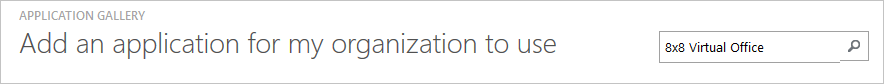
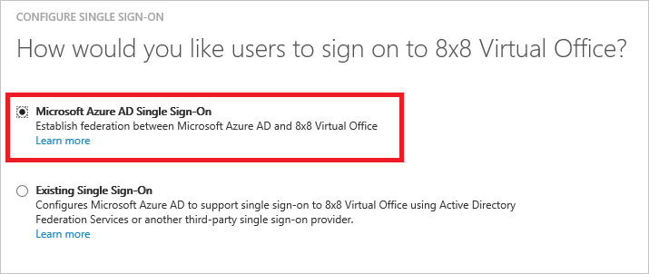
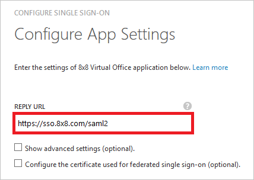
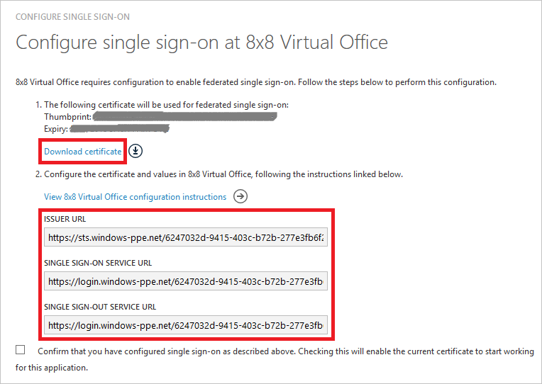
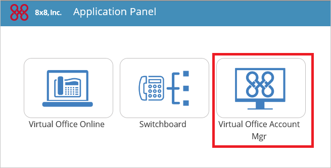
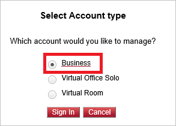
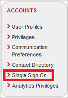
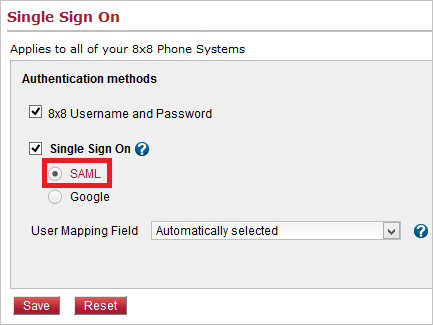
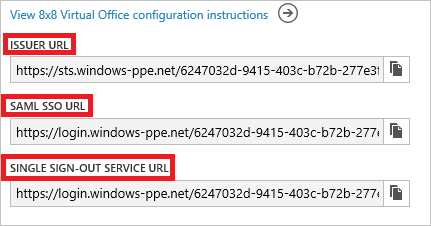
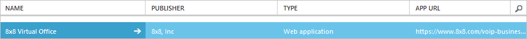

<properties
    pageTitle="Lernprogramm: Azure-Active Directory-Integration in 8 x 8 virtuellen Office | Microsoft Azure"
    description="Informationen Sie zum Konfigurieren der einmaligen Anmeldens zwischen Azure Active Directory und 8 x 8 virtuelle Office."
    services="active-directory"
    documentationCenter=""
    authors="jeevansd"
    manager="femila"
    editor=""/>

<tags
    ms.service="active-directory"
    ms.workload="identity"
    ms.tgt_pltfrm="na"
    ms.devlang="na"
    ms.topic="article"
    ms.date="10/10/2016"
    ms.author="jeedes"/>

# Lernprogramm: Azure-Active Directory-Integration in 8 x 8 virtuellen Office

Ziel dieses Lernprogramms ist es zu zeigen, wie Sie die Integration von 8 x 8 virtuellen Office mit Azure Active Directory (Azure AD).

Integration von 8 x 8 bietet virtuelle Office mit Azure AD die folgenden Vorteile:

- Sie können in Azure AD steuern, wer Zugriff auf 8 x 8 virtuellen Office hat
- Sie können Ihre Benutzer automatisch auf 8 x 8 virtuellen Office (einmaliges Anmelden) angemeldete Abrufen mit ihren Azure AD-Konten aktivieren.
- Sie können Ihre Konten an einem zentralen Ort – im klassischen Azure-Portal verwalten.

Wenn Sie weitere Details zu SaaS app-Integration in Azure AD-wissen möchten, finden Sie unter [Was ist Zugriff auf die Anwendung und einmaliges Anmelden mit Azure Active Directory](active-directory-appssoaccess-whatis.md).

## Erforderliche Komponenten

Um Azure AD-Integration mit 8 x 8 virtuellen Office konfigurieren zu können, benötigen Sie die folgenden Elemente:

- Ein Azure AD-Abonnement
- Ein 8 x 8 virtuelle Office einmaligen Anmeldung aktiviert Abonnement

> [AZURE.NOTE] Wenn Sie um die Schritte in diesem Lernprogramm zu testen, empfehlen wir nicht mit einer Umgebung für die Herstellung.

Führen Sie zum Testen der Schritte in diesem Lernprogramm Tips:

- Sie sollten Ihre Umgebung Herstellung nicht verwenden, es sei denn, dies erforderlich ist.
- Wenn Sie eine Testversion Azure AD-Umgebung besitzen, können Sie eine einen Monat zum Testen [hier](https://azure.microsoft.com/pricing/free-trial/)erhalten.

## Szenario Beschreibung
Ziel dieses Lernprogramms ist, sodass Sie in einer Umgebung für einmaliges Anmelden für Microsoft Azure AD testen können.

In diesem Lernprogramm beschriebenen Szenario besteht aus zwei Hauptfenster Bausteine:

1. Hinzufügen von 8 x 8 virtuellen Office aus dem Katalog
2. Konfigurieren und Testen Microsoft Azure AD einmaliges Anmelden

## Hinzufügen von 8 x 8 virtuellen Office aus dem Katalog
Um die Integration von 8 x 8 virtuellen Office in Azure AD konfigurieren zu können, müssen Sie 8 x 8 virtuellen Office aus dem Katalog zu Ihrer Liste der verwalteten SaaS apps hinzufügen.

**Um 8 x 8 virtuellen Office aus dem Katalog hinzufügen möchten, führen Sie die folgenden Schritte aus:**

1. Klicken Sie im **Azure klassischen Portal**auf der linken Navigationsbereich auf **Active Directory**.

    ![Active Directory][1]

2. Wählen Sie aus der Liste **Verzeichnis** Verzeichnis für das Sie Verzeichnisintegration aktivieren möchten.

3. Klicken Sie zum Öffnen der Anwendungsansicht in der Verzeichnisansicht im oberen Menü auf **Applications** .
    
    ![Applikationen][2]

4. Klicken Sie auf **Hinzufügen** , am unteren Rand der Seite.

    ![Applikationen][3]

5. Klicken Sie im Dialogfeld **Was möchten Sie tun** klicken Sie auf **eine Anwendung aus dem Katalog hinzufügen**.

    ![Applikationen][4]

6. Geben Sie in das Suchfeld ein **8 x 8 virtuellen Office**.

    
7. Im Ergebnisbereich Option **8 x 8 virtuellen Office**, und klicken Sie dann auf **abgeschlossen** , um die Anwendung hinzuzufügen.

    

##  Konfigurieren und Testen Microsoft Azure AD einmaliges Anmelden
Das Ziel der in diesem Abschnitt wird veranschaulicht, wie konfigurieren und Testen Microsoft Azure AD einmaliges Anmelden mit 8 x 8 eines Namens "Britta Simon" Testbenutzers virtuelle Office abhängig.

Azure AD muss für einmaliges Anmelden entwickelt was den Gegenstück Benutzer in 8 x 8, wann virtuelle Office an einen Benutzer in Azure AD ist. Kurzum, muss ein Link Beziehung zwischen einem Azure AD-Benutzer und dem entsprechenden Benutzer in 8 x 8 virtuelle Office eingerichtet werden.

Dieser Link Beziehung wird hergestellt, indem Sie den Wert des **Benutzernamens** in Azure AD als der Wert für den **Benutzernamen** in 8 x 8 virtuellen Office zuweisen.

Zum Konfigurieren und Microsoft Azure AD einmaliges Anmelden mit 8 x 8 virtuellen Office testen, müssen Sie die folgenden Bausteine durchführen:

1. **[Konfigurieren von Microsoft Azure AD einmaliges Anmelden](#configuring-azure-ad-single-single-sign-on)** - damit Ihre Benutzer dieses Feature verwenden können.
2. **[Erstellen einer Azure AD Benutzer testen](#creating-an-azure-ad-test-user)** : Microsoft Azure AD einmaliges Anmelden mit Britta Simon testen.
3. **[Erstellen eines Testbenutzers von 8 x 8 virtuelle Office](#creating-a-8x8-virtual-office-test-user)** - ein Gegenstück von Britta Simon in 8 x 8 virtuellen Office haben, die in der Azure AD-Darstellung Ihrer verknüpft ist.
4. **[Testen Sie Benutzer zuweisen Azure AD](#assigning-the-azure-ad-test-user)** - Britta Simon mit Microsoft Azure AD einmaliges Anmelden aktivieren.
5. **[Testen der einmaligen Anmeldens](#testing-single-sign-on)** - zur Überprüfung, ob die Konfiguration funktioniert.

### Konfigurieren von Microsoft Azure AD einmaliges Anmelden

In diesem Abschnitt Microsoft Azure AD einmaliges Anmelden im klassischen Portal aktivieren und Konfigurieren der Ihrer 8 x 8 virtuelle Office-Anwendung einmaliges Anmelden.

**Führen Sie die folgenden Schritte aus, um Microsoft Azure AD einmaliges Anmelden mit 8 x 8 virtuellen Office konfigurieren:**

1. Im Portal klassischen auf der Seite **8 x 8 virtuellen Office** -Anwendung Integration klicken Sie auf **Konfigurieren einmaligen Anmeldens** zum Öffnen des Dialogfelds **Konfigurieren einmaliges Anmelden** .
     
    ![Konfigurieren Sie einmaliges Anmelden][6] 

2. Auf der Seite **Wie möchten Sie Benutzer anmelden bei Office von 8 x 8 virtuellen** **Microsoft Azure AD einmaliges Anmelden**wählen Sie aus, und klicken Sie dann auf **Weiter**.

     

3. Führen Sie auf der Seite **Einstellungen für die App konfigurieren** Dialogfeld die folgenden Schritte aus, und klicken Sie auf **Weiter**:

    

    ein. Geben Sie in das Textfeld **URL Antworten** :`https://sso.8x8.com/saml2`

    b. Klicken Sie auf **Weiter**

4. Klicken Sie auf der Seite **einmaliges Anmelden bei Office von 8 x 8 virtuellen konfigurieren** führen Sie die folgenden Schritte aus, und klicken Sie auf **Weiter**:

    

    ein. Klicken Sie auf **Zertifikat herunterladen**, und speichern Sie die Datei auf Ihrem Computer.

    b. Klicken Sie auf **Weiter**.

5. Melden Sie sich für den Zugriff auf Ihre 8 x 8 virtuelle Office Mandanten als Administrator.
6. Wählen Sie **Virtual Office-Konto-Manager** auf das Feld "Anwendung" aus.

    

7. Wählen Sie **Business** -Konto verwalten, und klicken Sie auf **Anmelden** .

    

8. Klicken Sie auf die Registerkarte **Firmen** in der Menüliste.

    

9. Klicken Sie auf **Single Sign On** , in der Liste der Konten.

    

10. Wählen Sie unter Authentifizierungsmethode **Einzelnes für einmaliges Anmelden** aus, und klicken Sie auf **SAML**.

    

11. Kopieren Sie **SSO SAML-URL**, **Single Optimierung, Dienst-URL** und **Herausgeber URL** aus Azure AD **URL anmelden**, **URL Abmelden** und 8 x 8 virtuelle Office **Herausgeber URL** . 

    

    

12. Klicken Sie auf **Browser** -Schaltfläche, um das Zertifikat hochladen, die Sie von Azure AD heruntergeladen haben.

13. Klicken Sie auf die Schaltfläche **Speichern** .

14. Im Portal klassischen wählen Sie die Bestätigung Konfiguration für einzelne Zeichen, und klicken Sie dann auf **Weiter**.

    ![Azure AD einmaliges Anmelden][10]

15. Klicken Sie auf der Seite **Bestätigung für einzelne anmelden** auf **abgeschlossen**.  

    ![Azure AD einmaliges Anmelden][11]

### Erstellen eines Benutzers mit Azure AD-testen
Das Ziel der in diesem Abschnitt besteht im Erstellen eines Testbenutzers im klassischen Portal Britta Simon bezeichnet.
    
![Erstellen von Azure AD-Benutzer][20]

**Führen Sie die folgenden Schritte aus, um einen Testbenutzer in Azure AD zu erstellen:**

1. Klicken Sie im **Azure klassischen Portal**auf der linken Navigationsbereich auf **Active Directory**.

    

2. Wählen Sie aus der Liste **Verzeichnis** Verzeichnis für das Sie Verzeichnisintegration aktivieren möchten.

3. Wenn die Liste der Benutzer, klicken Sie im Menü oben anzeigen möchten, klicken Sie auf **Benutzer**.
    
    

4. Klicken Sie im Dialogfeld **Benutzer hinzufügen** um in der Symbolleiste auf der Unterseite öffnen, auf **Benutzer hinzufügen**.
    
    

5. Führen Sie auf der Seite **Teilen Sie uns zu diesem Benutzer** die folgenden Schritte aus:

    

    ein. Wählen Sie als Typ des Benutzers neuen Benutzer in Ihrer Organisation ein.

    b. Geben Sie den Benutzernamen **Textfeld** **BrittaSimon**ein.

    c. Klicken Sie auf **Weiter**.

6.  Klicken Sie auf der Seite **Benutzerprofil** Dialogfeld führen Sie die folgenden Schritte aus:
    
    

    ein. Geben Sie im Textfeld **Vorname** **Britta**aus.  

    b. In das letzte Textfeld **Name** , Typ, **Simon**.

    c. Geben Sie im Textfeld **Anzeigename** **Britta Simon**aus.

    d. Wählen Sie in der Liste **Rolle** **Benutzer**aus.

    e. Klicken Sie auf **Weiter**.

7. Klicken Sie auf der Seite **erste temporäres Kennwort** auf **Erstellen**.
    
    

8. Führen Sie auf der Seite **erste temporäres Kennwort** die folgenden Schritte aus:
    
    

    ein. Notieren Sie den Wert für das **Neue Kennwort ein**.

    b. Klicken Sie auf **abgeschlossen**.   

### Erstellen eines 8 x 8 virtuelle Office Testbenutzers

Das Ziel der in diesem Abschnitt ist zum Erstellen eines Benutzers Britta Simon in 8 x 8 virtuellen Office bezeichnet. 8 x 8 unterstützt Virtual Office in-Time-Bereitstellung, welche ist standardmäßig aktiviert.

Keine für Sie in diesem Abschnitt Aktionselement ist vorhanden. Bei dem Versuch, 8 x 8 virtuellen Office zugreifen, wenn er noch nicht vorhanden ist, wird ein neuer Benutzer erstellt werden. 

> [AZURE.NOTE] Wenn Sie einen Benutzer manuell zu erstellen müssen, müssen Sie die 8 x 8 virtuelle Office-Supportteam.

### Zuweisen des Azure AD-Test-Benutzers

Das Ziel der in diesem Abschnitt ist für die Aktivierung der Britta Simon Azure einmaliges Anmelden verwenden, indem Sie keinen Zugriff auf 8 x 8 virtuellen Office erteilen.
    
![Benutzer zuweisen][200]

**Um 8 x 8 virtuellen Office Britta Simon zuzuweisen, führen Sie die folgenden Schritte aus:**

1. Klicken Sie im Portal klassischen zum Öffnen der Anwendungsansicht in der Verzeichnisansicht klicken Sie auf **Applikationen** im oberen Menü.

    ![Benutzer zuweisen][201]

2. Wählen Sie in der Liste Applikationen **8 x 8 virtuellen Office**aus.

    

3. Klicken Sie auf **Benutzer**, klicken Sie im Menü oben.
    
    ![Benutzer zuweisen][203]

4. Wählen Sie in der Liste Benutzer **Britta Simon**aus.

5. Klicken Sie unten auf der Symbolleiste auf **zuweisen**.

    ![Benutzer zuweisen][205]

### Testen einmaliges Anmelden

Das Ziel der in diesem Abschnitt ist zum Überprüfen der Microsoft Azure AD einmaliges Anmelden Konfiguration im Bereich Access verwenden.

Wenn Sie die Kachel 8 x 8 virtuelle Office im Bereich Access klicken, Sie sollten automatisch an Ihrer 8 x 8 virtuelle Office-Anwendung angemeldete abrufen.

## Zusätzliche Ressourcen

* [Liste der zum Integrieren SaaS-Apps mit Azure-Active Directory-Lernprogramme](active-directory-saas-tutorial-list.md)
* [Was ist die Anwendungszugriff und einmaliges Anmelden mit Azure Active Directory?](active-directory-appssoaccess-whatis.md)

<!--Image references-->

[1]: ./media/active-directory-saas-8x8virtualoffice-tutorial/tutorial_general_01.png
[2]: ./media/active-directory-saas-8x8virtualoffice-tutorial/tutorial_general_02.png
[3]: ./media/active-directory-saas-8x8virtualoffice-tutorial/tutorial_general_03.png
[4]: ./media/active-directory-saas-8x8virtualoffice-tutorial/tutorial_general_04.png

[6]: ./media/active-directory-saas-8x8virtualoffice-tutorial/tutorial_general_05.png
[10]: ./media/active-directory-saas-8x8virtualoffice-tutorial/tutorial_general_06.png
[11]: ./media/active-directory-saas-8x8virtualoffice-tutorial/tutorial_general_07.png
[20]: ./media/active-directory-saas-8x8virtualoffice-tutorial/tutorial_general_100.png

[200]: ./media/active-directory-saas-8x8virtualoffice-tutorial/tutorial_general_200.png
[201]: ./media/active-directory-saas-8x8virtualoffice-tutorial/tutorial_general_201.png
[203]: ./media/active-directory-saas-8x8virtualoffice-tutorial/tutorial_general_203.png
[204]: ./media/active-directory-saas-8x8virtualoffice-tutorial/tutorial_general_204.png
[205]: ./media/active-directory-saas-8x8virtualoffice-tutorial/tutorial_general_205.png
