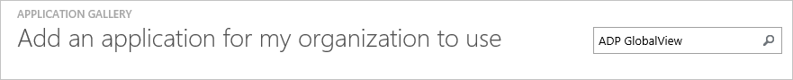
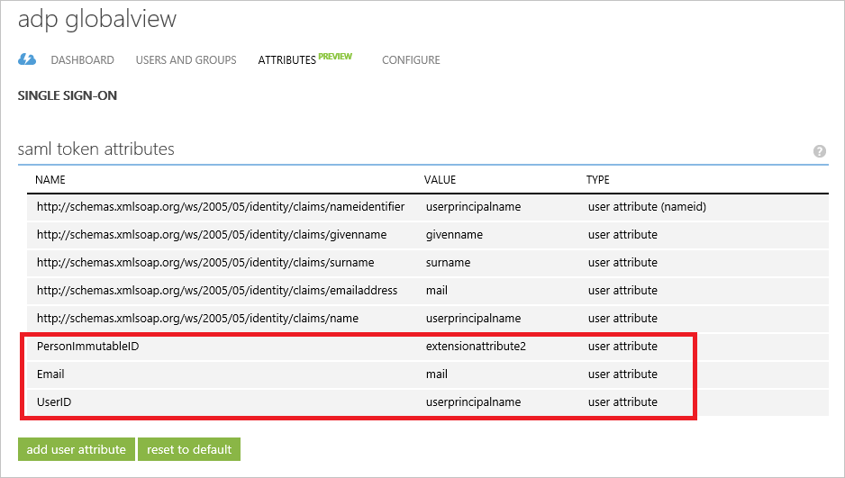
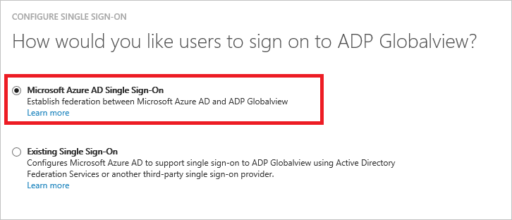
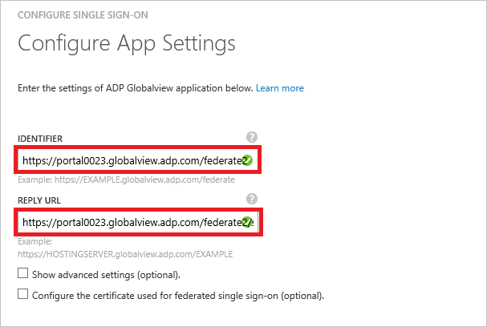
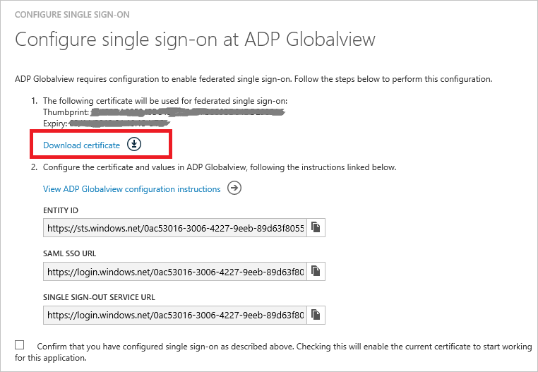
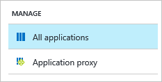
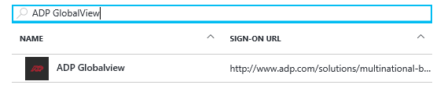
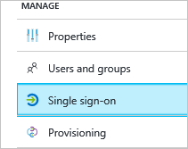
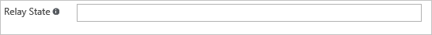
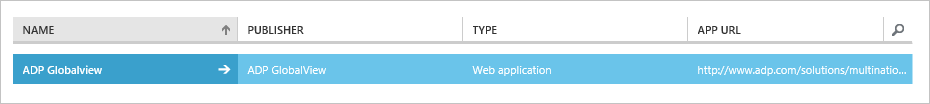

<properties
    pageTitle="Lernprogramm: Azure-Active Directory-Integration in Access Data Project GlobalView | Microsoft Azure"
    description="Informationen Sie zum einmaligen Anmeldens zwischen Azure Active Directory und Access Data Project GlobalView konfigurieren."
    services="active-directory"
    documentationCenter=""
    authors="jeevansd"
    manager="femila"
    editor=""/>

<tags
    ms.service="active-directory"
    ms.workload="identity"
    ms.tgt_pltfrm="na"
    ms.devlang="na"
    ms.topic="article"
    ms.date="10/26/2016"
    ms.author="jeedes"/>

# Lernprogramm: Azure-Active Directory-Integration in Access Data Project GlobalView

Ziel dieses Lernprogramms ist es zu zeigen, wie Sie das Access Data Project GlobalView mit Azure Active Directory (Azure AD) integrieren.  
Integrieren von Access Data Project GlobalView in Azure AD bietet Ihnen die folgenden Vorteile:

- Sie können in Azure AD steuern, wer Zugriff auf Access Data Project GlobalView hat
- Sie können mit ihren Azure AD-Konten Ihrer Benutzer automatisch zu Access Data Project GlobalView (einmaliges Anmelden) angemeldete abrufen aktivieren.
- Sie können Ihre Konten an einem zentralen Ort – im klassischen Azure-Portal verwalten.

Wenn Sie weitere Details zu SaaS app-Integration in Azure AD-wissen möchten, finden Sie unter [Was ist Zugriff auf die Anwendung und einmaliges Anmelden mit Azure Active Directory](active-directory-appssoaccess-whatis.md).

## Erforderliche Komponenten

Um Azure AD-Integration in Access Data Project GlobalView konfigurieren zu können, benötigen Sie die folgenden Elemente:

- Ein Azure AD-Abonnement
- Access Data Project GlobalView einmalige Anmeldung aktiviert Abonnements

> [AZURE.NOTE] Wenn Sie um die Schritte in diesem Lernprogramm zu testen, empfehlen wir nicht mit einer Umgebung für die Herstellung.

Führen Sie zum Testen der Schritte in diesem Lernprogramm Tips:

- Sie sollten Ihre Umgebung Herstellung nicht verwenden, es sei denn, dies erforderlich ist.
- Wenn Sie eine Testversion Azure AD-Umgebung besitzen, können Sie eine einen Monat zum Testen [hier](https://azure.microsoft.com/pricing/free-trial/)erhalten.

## Szenario Beschreibung
Ziel dieses Lernprogramms ist, sodass Sie in einer Umgebung für Azure AD-einmaligen Anmeldens testen können.  
In diesem Lernprogramm beschriebenen Szenario besteht aus zwei Hauptfenster Bausteine:

1. Hinzufügen von Access Data Project GlobalView aus dem Katalog
2. Konfigurieren und Testen Azure AD einmaliges Anmelden

## Hinzufügen von Access Data Project GlobalView aus dem Katalog
Zum Konfigurieren der Integration von Access Data Project GlobalView in Azure AD müssen Sie Access Data Project GlobalView zu Ihrer Liste der verwalteten SaaS apps aus dem Katalog hinzuzufügen.

**Wenn Access Data Project GlobalView aus dem Katalog hinzufügen möchten, führen Sie die folgenden Schritte aus:**

1. Klicken Sie im **Azure klassischen Portal**auf der linken Navigationsbereich auf **Active Directory**. 

    ![Active Directory][1]

2. Wählen Sie aus der Liste **Verzeichnis** Verzeichnis für das Sie Verzeichnisintegration aktivieren möchten.

3. Klicken Sie zum Öffnen der Anwendungsansicht in der Verzeichnisansicht im oberen Menü auf **Applications** .

    ![Applikationen][2]

4. Klicken Sie auf **Hinzufügen** , am unteren Rand der Seite.

    ![Applikationen][3]

5. Klicken Sie im Dialogfeld **Was möchten Sie tun** klicken Sie auf **eine Anwendung aus dem Katalog hinzufügen**.

    ![Applikationen][4]

6. Geben Sie in das Suchfeld **ADP GlobalView**ein.

    

7. Wählen Sie im Ergebnisbereich **ADP GlobalView aus**und dann auf **abgeschlossen** , um die Anwendung hinzuzufügen.

    

##  Konfigurieren und Testen Azure AD einmaliges Anmelden
Das Ziel der in diesem Abschnitt wird erläutert, wie Sie konfigurieren und Testen der Azure AD-einmaliges Anmelden mit Access Data Project GlobalView eines Namens "Britta Simon" Testbenutzers basierend auf.

Für einmaliges Anmelden entwickelt muss Azure AD wissen, was der Benutzer Entsprechung in Access Data Project GlobalView an einen Benutzer in Azure AD ist. Kurzum, muss eine Link Beziehung zwischen einem Azure AD-Benutzer und dem entsprechenden Benutzer in Access Data Project GlobalView eingerichtet werden.  
Dieser Link Beziehung wird hergestellt, indem Sie den Wert des **Benutzernamens** in Azure AD als der Wert für den **Benutzernamen** in Access Data Project GlobalView zuweisen.

Zum Konfigurieren und Azure AD-einmaliges Anmelden mit Access Data Project GlobalView testen, müssen Sie die folgenden Bausteine durchführen:

1. **[Konfigurieren von Azure AD einmaligen Anmeldens](#configuring-azure-ad-single-single-sign-on)** - damit Ihre Benutzer dieses Feature verwenden können.
2. **[Erstellen einer Azure AD Benutzer testen](#creating-an-azure-ad-test-user)** : Azure AD-einmaliges Anmelden mit Britta Simon testen.
4. **[Erstellen einer Access Data Project GlobalView Benutzer testen](#creating-a-adp-globalview-test-user)** : ein Gegenstück von Britta Simon in Access Data Project GlobalView haben, die in der Azure AD-Darstellung Ihrer verknüpft ist.
5. **[Testen Sie Benutzer zuweisen Azure AD](#assigning-the-azure-ad-test-user)** - Britta Simon mit Azure AD-einmaliges Anmelden aktivieren.
5. **[Testen der einmaligen Anmeldens](#testing-single-sign-on)** - zur Überprüfung, ob die Konfiguration funktioniert.

### Konfigurieren von Azure AD einmaliges Anmelden

Das Ziel der in diesem Abschnitt ist Azure AD-einmaliges Anmelden im klassischen Azure-Portal aktivieren und konfigurieren einmaliges Anmelden in Ihrer Anwendung Access Data Project GlobalView.

Die ADP GlobalView-Anwendung erwartet die SAML-Assertionen in einem bestimmten Format, das Hinzufügen von benutzerdefinierten Attribut Zuordnungen zu der SAML-token Attribute Konfiguration erfordert. Das folgende Bildschirmabbild zeigt ein Beispiel dafür. Der Name des anfordern werden immer **"PersonImmutableID"** und den Wert, mit dem wir ExtensionAttribute2 zugeordnet haben die EmployeeID des Benutzers enthält. Hier werden die Benutzer Zuordnung Vordergrund Azure AD-zu Access Data Project GlobalView auf EmployeeID ausgeführt werden, jedoch können Sie dies auf einen anderen Wert auch basierend auf der Anwendungseinstellungen für die zuordnen. Also bitte Arbeit mit Access Data Project GlobalView Team zuerst verwenden Sie die richtige ID eines Benutzers und dieser Wert wird mit dem **"PersonImmutableID"** Antrag zuordnen. Sie können auch die e-Mail- und Benutzer-ID anfordern zuordnen, wie in der Abbildung dargestellt.
 
 

Bevor Sie die SAML-Assertion konfigurieren können, müssen Sie wenden Sie sich an Ihr Supportteam ADP GlobalView und den Wert für das Attribut eindeutige ID für Ihren Mandanten anfordern. Sie benötigen diesen Wert, um den benutzerdefinierten Anspruch für eine Anwendung zu konfigurieren.

**Führen Sie die folgenden Schritte aus, um Azure AD-einmaliges Anmelden mit Access Data Project GlobalView konfigurieren:**

1. Im Azure klassischen-Portal auf der Seite Anwendung Integration **ADP GlobalView** klicken Sie auf **Konfigurieren einmaligen Anmeldens** zum Öffnen des Dialogfelds **Konfigurieren einmaliges Anmelden** .

    ![Konfigurieren Sie einmaliges Anmelden][6] 

2. Klicken Sie auf der Seite **Wie möchten Sie Benutzer Access Data Project GlobalView auf bei** **Azure AD einmaliges Anmelden**wählen Sie aus, und klicken Sie dann auf **Weiter**.
 
     

3. Führen Sie auf der Seite Dialogfeld **Konfigurieren der App-Einstellungen** die folgenden Schritte aus:

     

    ein. Geben Sie in das Textfeld **Bezeichner** die URL verwendet, um die Identifizierung ADP GlobalView-Anwendung, die mit einer der folgenden Muster: `https://<server name>.globalview.adp.com/federate2` oder`https://<server name>.globalview.adp.com/federate`

    b. Im Textfeld **URL Antworten** , geben Sie die URL von Azure AD verwendet, um die Antwort auf die Anwendung Access Data Project GlobalView Posten mithilfe einer der folgenden Muster: `https://<server name>.globalview.adp.com/federate2/sp/ACS.saml2` oder`https://<server name>.globalview.adp.com/federate/sp/ACS.saml2`

    c. Klicken Sie auf **Weiter**.

4. Klicken Sie auf der Seite **Konfigurieren einmaliges Anmelden bei Access Data Project GlobalView** führen Sie die folgenden Schritte aus:

     

    ein. Klicken Sie auf **Zertifikat herunterladen**, und speichern Sie die Datei auf Ihrem Computer.

    b. Klicken Sie auf **Weiter**.

5. Um für die Anwendung konfigurierten SSO zu gelangen, wenden Sie sich an Ihr Supportteam ADP GlobalView, und teilen Sie sie mit der folgenden: 

    - Die heruntergeladene **Zertifikat**
    - **Element-ID**
    - **SAML SSO-URL**
    - **Einzelne Abmeldung Dienst-URL**

    > [AZURE.NOTE] Nach Team **Access Data Project GlobalView** konfigurieren Sie die Instanz, und erhalten Sie den Wert **RelayState** von ihnen. Führen Sie die nachfolgend aufgeführten Schritte aus, um ihn zu konfigurieren. Nach dieser Konfiguration können Sie die Integration testen. Also bitte beachten Sie, dass diese wichtigen Konfiguration für diese Anwendungsintegration entwickelt verwendet wird

6. Führen Sie die folgenden Schritte aus, um den Wert RelayState in Azure AD konfigurieren: 
    
    ein. Melden Sie sich als Administrator [Azure-Verwaltungsportal](https://portal.azure.com) .

    b. Klicken Sie im linken Navigationsbereich auf **Weitere Dienste**. 
    
    

    c. Klicken Sie in **das Suchtextfeld** Geben Sie **Azure Active Directory**, und klicken Sie dann auf den zugehörigen Link.
    
    

    d. Klicken Sie auf **Enterprise Applications**.

    

    e. Klicken Sie im Abschnitt **Verwalten** auf **Alle Programme**.
    
    

    f. Klicken Sie in **das Suchtextfeld** Geben Sie **ADP eTime**, und klicken Sie dann auf den zugehörigen Link. 
    
    

    g. Klicken Sie im Abschnitt **Verwalten** auf **einmaliges Anmelden**.

    

    h. Wählen Sie **Erweiterte URL-Einstellungen anzeigen**aus.
    
    
    
    Ich. Geben Sie in das Textfeld **Relay Zustand** eines Werts mithilfe der folgenden Muster:
    
    `https://<server name>.globalview.adp.com/gvolution/session/<instance name>/sso` 

    

    j. Speichern Sie die Einstellungen.

7. Im Portal Azure klassischen wählen Sie die Konfiguration für einzelne Zeichen Bestätigung, und klicken Sie dann auf **Weiter**.

    ![Azure AD einmaliges Anmelden][10]

7. Klicken Sie auf der Seite **Bestätigung für einzelne anmelden** auf **abgeschlossen**.  

    ![Azure AD einmaliges Anmelden][11]

### Erstellen eines Benutzers mit Azure AD-testen
Das Ziel der in diesem Abschnitt besteht im Erstellen eines Testbenutzers aufgerufen Britta Simon im klassischen Azure-Portal.  
Wählen Sie in der Liste Benutzer **Britta Simon**aus.

![Erstellen von Azure AD-Benutzer][20]

**Führen Sie die folgenden Schritte aus, um einen Testbenutzer in Azure AD zu erstellen:**

1. Klicken Sie im **Azure klassischen Portal**auf der linken Navigationsbereich auf **Active Directory**.

     

2. Wählen Sie aus der Liste **Verzeichnis** Verzeichnis für das Sie Verzeichnisintegration aktivieren möchten.

3. Wenn die Liste der Benutzer, klicken Sie im Menü oben anzeigen möchten, klicken Sie auf **Benutzer**.

     

4. Klicken Sie im Dialogfeld **Benutzer hinzufügen** um in der Symbolleiste auf der Unterseite öffnen, auf **Benutzer hinzufügen**.

     

5. Führen Sie auf der Seite **Teilen Sie uns zu diesem Benutzer** die folgenden Schritte aus:

     

    ein. Wählen Sie als Typ des Benutzers neuen Benutzer in Ihrer Organisation ein.

    b. Geben Sie den Benutzernamen **Textfeld** **BrittaSimon**ein.

    c. Klicken Sie auf **Weiter**.

6.  Klicken Sie auf der Seite **Benutzerprofil** Dialogfeld führen Sie die folgenden Schritte aus:

     

    ein. Geben Sie im Textfeld **Vorname** **Britta**aus.  

    b. In das letzte Textfeld **Name** , Typ, **Simon**.

    c. Geben Sie im Textfeld **Anzeigename** **Britta Simon**aus.

    d. Wählen Sie in der Liste **Rolle** **Benutzer**aus.

    e. Klicken Sie auf **Weiter**.

7. Klicken Sie auf der Seite **erste temporäres Kennwort** auf **Erstellen**.

     

8. Klicken Sie auf der Seite **erste temporäres Kennwort** führen Sie die folgenden Schritte aus:

     

    ein. Notieren Sie den Wert für das **Neue Kennwort ein**.

    b. Klicken Sie auf **abgeschlossen**.   

### Erstellen eines Testbenutzers ADP GlobalView

Das Ziel der in diesem Abschnitt ist zum Erstellen eines Benutzers Britta Simon in Access Data Project GlobalView bezeichnet. Arbeiten Sie mit Access Data Project GlobalView Supportteam um die Benutzer in das Access Data Project GlobalView Konto hinzuzufügen. 

> [AZURE.NOTE]Wenn Sie einen Benutzer manuell zu erstellen müssen, müssen Sie das Access Data Project GlobalView Supportteam.

### Zuweisen des Azure AD-Test-Benutzers

Das Ziel der in diesem Abschnitt ist für die Aktivierung der Britta Simon Azure einmaliges Anmelden verwenden, indem Sie keinen Zugriff zu Access Data Project GlobalView erteilen.

![Benutzer zuweisen][200] 

**Um Britta Simon ADP GlobalView zuzuweisen, führen Sie die folgenden Schritte aus:**

1. Klicken Sie im Portal Azure klassischen zum Öffnen der Anwendungsansicht in der Verzeichnisansicht klicken Sie auf **Applikationen** im oberen Menü.

    ![Benutzer zuweisen][201] 

2. Wählen Sie in der Liste Applikationen **ADP GlobalView**ein.

     

1. Klicken Sie auf **Benutzer**, klicken Sie im Menü oben.

    ![Benutzer zuweisen][203] 

1. Wählen Sie in der Liste Benutzer **Britta Simon**aus.

2. Klicken Sie unten auf der Symbolleiste auf **zuweisen**.

    ![Benutzer zuweisen][205]

### Testen einmaliges Anmelden

Das Ziel der in diesem Abschnitt ist zum Azure AD-einzelne anmelden Überprüfen der Konfiguration mithilfe des Bedienfelds Access.  
Wenn Sie die Kachel Access Data Project GlobalView im Bereich Access klicken, Sie sollten automatisch angemeldet-an Ihrer Anwendung ADP GlobalView auf abrufen.

## Zusätzliche Ressourcen

* [Liste der zum Integrieren SaaS-Apps mit Azure-Active Directory-Lernprogramme](active-directory-saas-tutorial-list.md)
* [Was ist die Anwendungszugriff und einmaliges Anmelden mit Azure Active Directory?](active-directory-appssoaccess-whatis.md)

<!--Image references-->

[1]: ./media/active-directory-saas-adpglobalview-tutorial/tutorial_general_01.png
[2]: ./media/active-directory-saas-adpglobalview-tutorial/tutorial_general_02.png
[3]: ./media/active-directory-saas-adpglobalview-tutorial/tutorial_general_03.png
[4]: ./media/active-directory-saas-adpglobalview-tutorial/tutorial_general_04.png

[6]: ./media/active-directory-saas-adpglobalview-tutorial/tutorial_general_05.png
[10]: ./media/active-directory-saas-adpglobalview-tutorial/tutorial_general_06.png
[11]: ./media/active-directory-saas-adpglobalview-tutorial/tutorial_general_07.png
[20]: ./media/active-directory-saas-adpglobalview-tutorial/tutorial_general_100.png

[200]: ./media/active-directory-saas-adpglobalview-tutorial/tutorial_general_200.png
[201]: ./media/active-directory-saas-adpglobalview-tutorial/tutorial_general_201.png
[203]: ./media/active-directory-saas-adpglobalview-tutorial/tutorial_general_203.png
[204]: ./media/active-directory-saas-adpglobalview-tutorial/tutorial_general_204.png
[205]: ./media/active-directory-saas-adpglobalview-tutorial/tutorial_general_205.png
