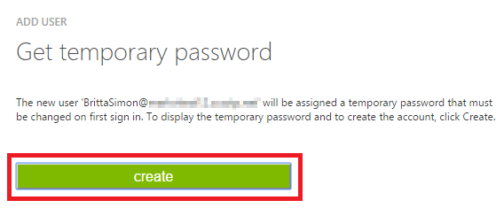

<properties
    pageTitle="Lernprogramm: Azure-Active Directory-Integration in Alcumus Informationen Exchange | Microsoft Azure"
    description="Informationen Sie zum einmaligen Anmeldens zwischen Azure Active Directory und Alcumus Informationen Exchange konfigurieren."
    services="active-directory"
    documentationCenter=""
    authors="jeevansd"
    manager="femila"
    editor=""/>

<tags
    ms.service="active-directory"
    ms.workload="identity"
    ms.tgt_pltfrm="na"
    ms.devlang="na"
    ms.topic="article"
    ms.date="09/01/2016"
    ms.author="jeedes"/>

# Lernprogramm: Azure-Active Directory-Integration in Exchange von Alcumus Informationen

Ziel dieses Lernprogramms ist es zu zeigen, wie Sie mit Azure Active Directory (Azure AD) Alcumus Informationen Exchange integriert werden soll.  
Integration von Alcumus Informationen Exchange mit Azure AD bietet Ihnen die folgenden Vorteile: 

- Sie können in Azure AD steuern, wer auf Alcumus Info Exchange zugreifen können 
- Sie können Ihre Benutzer automatisch auf Alcumus Info Exchange (einmaliges Anmelden) angemeldete Abrufen mit ihren Azure AD-Konten aktivieren.
- Sie können Ihre Konten an einem zentralen Ort – im klassischen Azure-Portal verwalten.

Wenn Sie weitere Details zu SaaS app-Integration in Azure AD-wissen möchten, finden Sie unter [Was ist Zugriff auf die Anwendung und einmaliges Anmelden mit Azure Active Directory](active-directory-appssoaccess-whatis.md).

## Erforderliche Komponenten 

Um Azure AD-Integration mit Alcumus Informationen Exchange konfigurieren zu können, benötigen Sie die folgenden Elemente:

- Ein [Azure AD](https://azure.microsoft.com/) -Abonnement
- Eine [Alcumus Informationen Exchange](http://www.alcumusgroup.com/) einmaligen Anmeldung aktiviert Abonnement

> [AZURE.NOTE] Wenn Sie um die Schritte in diesem Lernprogramm zu testen, empfehlen wir nicht mit einer Umgebung für die Herstellung.

Führen Sie zum Testen der Schritte in diesem Lernprogramm Tips:

- Sie sollten Ihre Umgebung Herstellung nicht verwenden, es sei denn, dies erforderlich ist.
- Wenn Sie eine Testversion Azure AD-Umgebung besitzen, können Sie eine einen Monat zum Testen [hier](https://azure.microsoft.com/pricing/free-trial/)erhalten. 

 
## Szenario Beschreibung
Ziel dieses Lernprogramms ist, sodass Sie in einer Umgebung für Azure AD-einmaligen Anmeldens testen können.  
In diesem Lernprogramm beschriebenen Szenario besteht aus drei wichtigsten Bausteine:

1. Hinzufügen von Alcumus Informationen Exchange aus dem Katalog 
2. Konfigurieren und Testen Azure AD einmaliges Anmelden

## Hinzufügen von Alcumus Informationen Exchange aus dem Katalog
Zum Konfigurieren der Integration von Alcumus Informationen Exchange in Azure AD müssen Sie Alcumus Informationen Exchange zu Ihrer Liste der verwalteten SaaS apps aus dem Katalog hinzuzufügen.

**Um Alcumus Informationen Exchange aus dem Katalog hinzuzufügen, führen Sie die folgenden Schritte aus:**

1. Klicken Sie im **Azure klassischen Portal**auf der linken Navigationsbereich auf **Active Directory**. 

    ![Active Directory][1]

2. Wählen Sie aus der Liste **Verzeichnis** Verzeichnis für das Sie Verzeichnisintegration aktivieren möchten.

3. Klicken Sie zum Öffnen der Anwendungsansicht in der Verzeichnisansicht im oberen Menü auf **Applications** .

    ![Applikationen][2]

4. Klicken Sie auf **Hinzufügen** , am unteren Rand der Seite.

    ![Applikationen][3]

5. Klicken Sie im Dialogfeld **Was möchten Sie tun** klicken Sie auf **eine Anwendung aus dem Katalog hinzufügen**.

    ![Applikationen][4]

6. Geben Sie im Suchfeld **Alcumus Informationen Exchange**aus.

    ![Applikationen][5]

7. Wählen Sie im Ergebnisbereich **Alcumus Infos Exchange**, und klicken Sie dann auf **abgeschlossen** , um die Anwendung hinzugefügt haben.

    ![Applikationen][400]

##  Konfigurieren und Testen Azure AD einmaliges Anmelden
Das Ziel der in diesem Abschnitt wird veranschaulicht, wie konfigurieren und Testen Azure AD-einmaliges Anmelden mit Alcumus Informationen Exchange basierend auf einen Testbenutzer "Britta Simon" bezeichnet.

Für einmaliges Anmelden entwickelt muss Azure AD Gegenstück Benutzer im Alcumus Informationen Exchange an einen Benutzer in Azure AD kennen. Kurzum, muss eine Link Beziehung zwischen einem Azure AD-Benutzer und dem entsprechenden Benutzer Alcumus Informationen Exchange hergestellt werden.  
Dieser Link Beziehung wird hergestellt, indem Sie den Wert des **Benutzernamens** in Azure AD als der Wert für den **Benutzernamen** Alcumus Informationen Exchange zuweisen.
 
Zum Konfigurieren und Azure AD-einmaliges Anmelden mit Alcumus Informationen Exchange testen, müssen Sie die folgenden Bausteine durchführen:

1. **[Konfigurieren von Azure AD einmaligen Anmeldens](#configuring-azure-ad-single-single-sign-on)** - damit Ihre Benutzer dieses Feature verwenden können.
2. **[Erstellen einer Azure AD Benutzer testen](#creating-an-azure-ad-test-user)** : Azure AD-einmaliges Anmelden mit Britta Simon testen.
4. **[Erstellen einer Alcumus Informationen Exchange Benutzer testen](#creating-a-alcumus-info-exchange-test-user)** : ein Gegenstück von Britta Simon Alcumus Informationen Exchange haben, die in der Azure AD-Darstellung Ihrer verknüpft ist.
5. **[Testen Sie Benutzer zuweisen Azure AD](#assigning-the-azure-ad-test-user)** - Britta Simon mit Azure AD-einmaliges Anmelden aktivieren.
5. **[Testen der einmaligen Anmeldens](#testing-single-sign-on)** - zur Überprüfung, ob die Konfiguration funktioniert.

### Konfigurieren von Azure AD einmaliges Anmelden

Das Ziel der in diesem Abschnitt ist Azure AD-einmaliges Anmelden im klassischen Azure-Portal aktivieren und konfigurieren einmaliges Anmelden in Ihrer Anwendung Alcumus Informationen Exchange.

**Führen Sie die folgenden Schritte aus, um Azure AD-einmaliges Anmelden mit Alcumus Informationen Exchange konfigurieren:**

1. Im Azure klassischen-Portal auf der Seite **Alcumus Informationen Exchange** -Integration Anwendung klicken Sie auf **Konfigurieren einmaligen Anmeldens** zum Öffnen des Dialogfelds **Konfigurieren einmaliges Anmelden** .

    ![Konfigurieren Sie einmaliges Anmelden][6]

2. Klicken Sie auf der Seite **Wie möchten Sie Benutzer bei der Alcumus Informationen Exchange auf** **Azure AD einmaliges Anmelden**wählen Sie aus, und klicken Sie dann auf **Weiter**.

    ![Azure AD einmaliges Anmelden][7]

3. Führen Sie auf der Seite Dialogfeld **Konfigurieren der App-Einstellungen** die folgenden Schritte aus: 

    ![Azure AD einmaliges Anmelden][8]
 
    ein. Geben Sie im Textfeld **URL Antworten** die Consumer-URL, die für Sie von Ihrem Supportteam Alcumus Informationen Exchange konnte ein.

    > [AZURE.NOTE] Wenn Sie nicht wissen, was mit der richtige Wert ist, wenden Sie sich an das Supportteam Alcumus Informationen Exchange über [helpdesk@alcumusgroup.com](mailto:helpdesk@alcumusgroup.com).

    b. Klicken Sie auf **Weiter**.
 
4. Klicken Sie auf der Seite **Konfigurieren einmaliges Anmelden bei Alcumus Informationen Exchange** klicken Sie auf **Herunterladen von Metadaten**, und speichern Sie die Metadatendatei lokal auf Ihrem Computer.

    ![Was ist Azure AD-Verbindung herstellen][9]

5. Wenden Sie sich an das Supportteam Alcumus Informationen Exchange über [helpdesk@alcumusgroup.com](mailto:helpdesk@alcumusgroup.com), stellen sie mit der Metadatendatei zur Verfügung, und sie informieren, dass SSO für Sie aktiviert werden sollten.

6. Klicken Sie im Portal Azure klassischen wählen Sie die Bestätigung Konfiguration für einzelne Zeichen, und klicken Sie dann auf **Weiter**. 

    ![Was ist Azure AD-Verbindung herstellen][10]

7. Klicken Sie auf der Seite **Bestätigung für einzelne anmelden** auf **abgeschlossen**.  

    ![Was ist Azure AD-Verbindung herstellen][11]

### Erstellen eines Benutzers mit Azure AD-testen
Das Ziel der in diesem Abschnitt besteht im Erstellen eines Testbenutzers aufgerufen Britta Simon im klassischen Azure-Portal.  

![Erstellen von Azure AD-Benutzer][20]

**Führen Sie die folgenden Schritte aus, um einen Testbenutzer in Azure AD zu erstellen:**

1. Klicken Sie im **Azure klassischen Portal**auf der linken Navigationsbereich auf **Active Directory**.

     

2. Wählen Sie aus der Liste **Verzeichnis** Verzeichnis für das Sie Verzeichnisintegration aktivieren möchten.

3. Wenn die Liste der Benutzer, klicken Sie im Menü oben anzeigen möchten, klicken Sie auf **Benutzer**.

     
 
4. Klicken Sie im Dialogfeld **Benutzer hinzufügen** um in der Symbolleiste auf der Unterseite öffnen, auf **Benutzer hinzufügen**. 

     

5. Führen Sie auf der Seite **Teilen Sie uns zu diesem Benutzer** die folgenden Schritte aus: 

     

    ein. Wählen Sie als Typ des Benutzers neuen Benutzer in Ihrer Organisation ein.
  
    b. Geben Sie den Benutzernamen **Textfeld** **BrittaSimon**ein.
  
    c. Klicken Sie auf Weiter.

6.  Klicken Sie auf der Seite **Benutzerprofil** Dialogfeld führen Sie die folgenden Schritte aus: 

     
  

    ein. Geben Sie im Textfeld **Vorname** **Britta**aus.  
  
    b. In der **Nachname** Txtbox, Typ **Simon**.
  
    c. Geben Sie im Textfeld **Anzeigename** **Britta Simon**aus.
  
    d. Wählen Sie in der Liste **Rolle** **Benutzer**aus.
  
    e. Klicken Sie auf **Weiter**.

7. Klicken Sie auf der Seite **erste temporäres Kennwort** auf **Erstellen**.

     
 

8. Führen Sie auf der Seite **erste temporäres Kennwort** die folgenden Schritte aus:

     

    ein. Notieren Sie den Wert für das **Neue Kennwort ein**.
  
    b. Klicken Sie auf **abgeschlossen**.   

  
 
### Erstellen eines Testbenutzers Alcumus Informationen Exchange

Das Ziel der in diesem Abschnitt ist zum Erstellen eines Benutzers Britta Simon Alcumus Informationen Exchange bezeichnet.

**Führen Sie die folgenden Schritte aus, um einen Benutzer namens Britta Simon Alcumus Informationen Exchange zu erstellen:**

1. Wenden Sie sich an das Supportteam Alcumus Informationen Exchange über [helpdesk@alcumusgroup.com](mailto:helpdesk@alcumusgroup.com),

### Zuweisen des Azure AD-Test-Benutzers

Das Ziel der in diesem Abschnitt ist für die Aktivierung der Britta Simon Azure einmaliges Anmelden verwenden, indem Sie keinen Zugriff auf Alcumus Informationen Exchange erteilen.

![Benutzer zuweisen][200]

**Um Britta Simon Alcumus Informationen Exchange zuzuweisen, führen Sie die folgenden Schritte aus:**

1. Klicken Sie im Portal Azure zum Öffnen der Anwendungsansicht in der Verzeichnisansicht klicken Sie auf **Applikationen** im oberen Menü.

    ![Benutzer zuweisen][201]

2. Wählen Sie in der Liste Applications **Alcumus Informationen Exchange**ein.

    ![Benutzer zuweisen][202]

1. Klicken Sie auf **Benutzer**, klicken Sie im Menü oben.

    ![Benutzer zuweisen][203]

1. Wählen Sie in der Liste Benutzer **Britta Simon**aus.

2. Klicken Sie unten auf der Symbolleiste auf **zuweisen**.

    ![Benutzer zuweisen][205]

### Testen einmaliges Anmelden

Das Ziel der in diesem Abschnitt ist zum Azure AD-einzelne anmelden Überprüfen der Konfiguration mithilfe des Bedienfelds Access.  
Wenn Sie die Kachel Alcumus Informationen Exchange im Bereich Access klicken, Sie sollten automatisch an Ihrer Anwendung Alcumus Informationen Exchange angemeldete abrufen.

## Zusätzliche Ressourcen

* [Liste der zum Integrieren SaaS-Apps mit Azure-Active Directory-Lernprogramme](active-directory-saas-tutorial-list.md)
* [Was ist die Anwendungszugriff und einmaliges Anmelden mit Azure Active Directory?](active-directory-appssoaccess-whatis.md)

<!--Image references-->
[1]: ./media/active-directory-saas-alcumus-info-tutorial/tutorial_general_01.png
[2]: ./media/active-directory-saas-alcumus-info-tutorial/tutorial_general_02.png
[3]: ./media/active-directory-saas-alcumus-info-tutorial/tutorial_general_03.png
[4]: ./media/active-directory-saas-alcumus-info-tutorial/tutorial_general_04.png
[5]: ./media/active-directory-saas-alcumus-info-tutorial/tutorial_alcumus_01.png
[6]: ./media/active-directory-saas-alcumus-info-tutorial/tutorial_alcumus_02.png
[7]: ./media/active-directory-saas-alcumus-info-tutorial/tutorial_alcumus_03.png
[8]: ./media/active-directory-saas-alcumus-info-tutorial/tutorial_alcumus_04.png
[9]: ./media/active-directory-saas-alcumus-info-tutorial/tutorial_alcumus_05.png
[10]: ./media/active-directory-saas-alcumus-info-tutorial/tutorial_alcumus_06.png
[11]: ./media/active-directory-saas-alcumus-info-tutorial/tutorial_alcumus_07.png
[20]: ./media/active-directory-saas-alcumus-info-tutorial/tutorial_general_100.png

[200]: ./media/active-directory-saas-alcumus-info-tutorial/tutorial_general_200.png
[201]: ./media/active-directory-saas-alcumus-info-tutorial/tutorial_general_201.png
[202]: ./media/active-directory-saas-alcumus-info-tutorial/tutorial_alcumus_08.png
[203]: ./media/active-directory-saas-alcumus-info-tutorial/tutorial_general_203.png
[204]: ./media/active-directory-saas-alcumus-info-tutorial/tutorial_general_204.png
[205]: ./media/active-directory-saas-alcumus-info-tutorial/tutorial_general_205.png
[400]: ./media/active-directory-saas-alcumus-info-tutorial/tutorial_alcumus_402.png