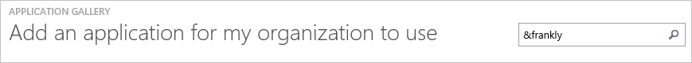
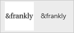
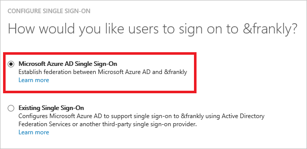
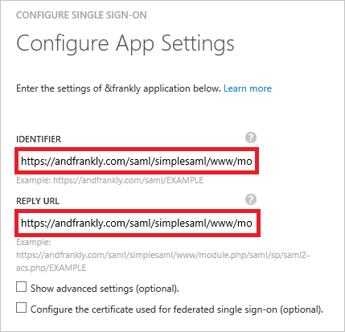
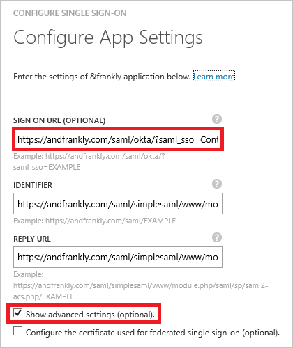
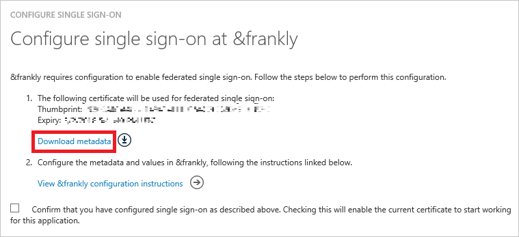
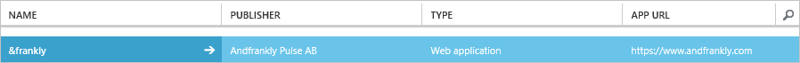

<properties
    pageTitle="Lernprogramm: Azure-Active Directory-Integration in & offen | Microsoft Azure"
    description="Informationen zum Konfigurieren der einmaligen Anmeldens zwischen Azure Active Directory und & offen."
    services="active-directory"
    documentationCenter=""
    authors="jeevansd"
    manager="femila"
    editor=""/>

<tags
    ms.service="active-directory"
    ms.workload="identity"
    ms.tgt_pltfrm="na"
    ms.devlang="na"
    ms.topic="article"
    ms.date="08/12/2016"
    ms.author="jeedes"/>

# Lernprogramm: Azure-Active Directory-Integration in & offen

Das Ziel dieses Lernprogramms besteht darin, die zeigen, wie Sie integrieren und offen mit Azure Active Directory (Azure AD).

Integration und offen mit Azure AD bietet Ihnen die folgenden Vorteile:

- Sie können in Azure AD steuern, wer Zugriff auf & offen hat
- Sie können die Benutzer automatisch angemeldet auf zu & offen abrufen aktivieren (einmaliges Anmelden) mit ihren Azure AD-Konten
- Sie können Ihre Konten an einem zentralen Ort – im klassischen Azure-Portal verwalten.

Wenn Sie weitere Details zu SaaS app-Integration in Azure AD-wissen möchten, finden Sie unter [Was ist Zugriff auf die Anwendung und einmaliges Anmelden mit Azure Active Directory](active-directory-appssoaccess-whatis.md).

## Erforderliche Komponenten

Benötigen zum Konfigurieren von Azure AD-Integration in & gesagt Sie die folgenden Elemente:

- Ein Azure AD-Abonnement
- A & offen einmalige Anmelden aktiviert Abonnements

> [AZURE.NOTE] Wenn Sie um die Schritte in diesem Lernprogramm zu testen, empfehlen wir nicht mit einer Umgebung für die Herstellung.

Führen Sie zum Testen der Schritte in diesem Lernprogramm Tips:

- Sie sollten Ihre Umgebung Herstellung nicht verwenden, es sei denn, dies erforderlich ist.
- Wenn Sie eine Testversion Azure AD-Umgebung besitzen, können Sie eine einen Monat zum Testen [hier](https://azure.microsoft.com/pricing/free-trial/)erhalten.

## Szenario Beschreibung
Ziel dieses Lernprogramms ist, sodass Sie in einer Umgebung für Azure AD-einmaligen Anmeldens testen können.

In diesem Lernprogramm beschriebenen Szenario besteht aus zwei Hauptfenster Bausteine:

1. Hinzufügen und offen aus dem Katalog
2. Konfigurieren und Testen Azure AD einmaliges Anmelden

## Hinzufügen und offen aus dem Katalog
Um die Integration von & offen in Azure AD-konfigurieren zu können, müssen Sie hinzufügen und offen aus dem Katalog zu Ihrer Liste der verwalteten SaaS apps.

**So fügen Sie & offen aus dem Katalog, gehen Sie folgendermaßen vor:**

1. Klicken Sie im **Azure klassischen Portal**auf der linken Navigationsbereich auf **Active Directory**. 

    ![Active Directory][1]

2. Wählen Sie aus der Liste **Verzeichnis** Verzeichnis für das Sie Verzeichnisintegration aktivieren möchten.

3. Klicken Sie zum Öffnen der Anwendungsansicht in der Verzeichnisansicht im oberen Menü auf **Applications** .
    
    ![Applikationen][2]

4. Klicken Sie auf **Hinzufügen** , am unteren Rand der Seite.
    
    ![Applikationen][3]

5. Klicken Sie im Dialogfeld **Was möchten Sie tun** klicken Sie auf **eine Anwendung aus dem Katalog hinzufügen**.

    ![Applikationen][4]

6. Geben Sie in das Suchfeld **& offen**aus.

    

7. Wählen Sie im Ergebnisfeld **& offen aus**, und klicken Sie dann auf **abgeschlossen** , um die Anwendung hinzuzufügen.

    

##  Konfigurieren und Testen Azure AD einmaliges Anmelden
Das Ziel der in diesem Abschnitt ist so konfigurieren sowie Test Azure AD einzeln anmelden mit & offen basierend auf einen Testbenutzer namens "Britta Simon" angezeigt.

Für einmaliges Anmelden entwickelt muss Azure AD wissen, was der Benutzer Gegenstück in und, um einen Benutzer in Azure AD offen ist. Kurzum, muss eine Link Beziehung zwischen einem Azure AD-Benutzer und dem entsprechenden Benutzer in & offen eingerichtet werden.

Dieser Link Beziehung wird hergestellt, indem Sie den Wert des **Benutzernamens** in Azure AD als der Wert für den **Benutzernamen** zuweisen, in & offen.

Zum Konfigurieren und Testen Azure AD einmaliges Anmelden mit & gesagt Sie die folgenden Bausteine ausführen müssen:

1. **[Konfigurieren von Azure AD einmaligen Anmeldens](#configuring-azure-ad-single-single-sign-on)** - damit Ihre Benutzer dieses Feature verwenden können.
2. **[Erstellen einer Azure AD Benutzer testen](#creating-an-azure-ad-test-user)** : Azure AD-einmaliges Anmelden mit Britta Simon testen.
3. **[Erstellen einer & offen Testbenutzer](#creating-a-&frankly-test-user)** – ein Gegenstück von Britta Simon haben sich die Darstellung Azure AD-in & offen d. h. verknüpft.
4. **[Testen Sie Benutzer zuweisen Azure AD](#assigning-the-azure-ad-test-user)** - Britta Simon mit Azure AD-einmaliges Anmelden aktivieren.
5. **[Testen der einmaligen Anmeldens](#testing-single-sign-on)** - zur Überprüfung, ob die Konfiguration funktioniert.

### Konfigurieren von Azure AD-einmaliges Anmelden

In diesem Abschnitt Azure AD-einmaliges Anmelden im klassischen Portal aktivieren und konfigurieren Sie einmaliges Anmelden in Ihrem & offen Anwendung.

**So konfigurieren Sie Azure AD einzeln anmelden mit & gesagt gehen Sie folgendermaßen vor:**

1. Im Portal klassischen auf der **& offen** Integrationsseite Anwendung klicken Sie auf **Konfigurieren einmaligen Anmeldens** zum Öffnen des Dialogfelds **Konfigurieren einmaliges Anmelden** .
     
    ![Konfigurieren Sie einmaliges Anmelden][6] 

2. Klicken Sie auf der Seite **Wie möchten Sie Benutzer zu & offen anmelden auf** **Azure AD einmaliges Anmelden**wählen Sie aus, und klicken Sie dann auf **Weiter**.
    
    

3. Auf der Seite **Einstellungen für die App konfigurieren** Dialogfeld Wenn Sie die Anwendung im **IDP initiiert Modus**konfigurieren möchten, führen Sie die folgenden Schritte aus und klicken Sie auf **Weiter**:

    

    ein. Geben Sie in das Textfeld **Bezeichner** einer URL dem folgenden Muster:`https://andfrankly.com/saml/simplesaml/www/module.php/saml/sp/metadata.php/<tenant id>`

    b. Geben Sie im Textfeld **URL Antworten** einer URL dem folgenden Muster:`https://andfrankly.com/saml/simplesaml/www/module.php/saml/sp/saml2-acs.php/<tenant id>`

    c. Klicken Sie auf **Weiter**

4. Wenn Sie die Anwendung in **SP initiiert Modus** auf der **App-Einstellungen konfigurieren** Dialogseite konfigurieren möchten, klicken Sie dann auf die **"Erweiterte Einstellungen (optional) anzeigen"** , und geben Sie die **Melden Sie sich auf URL** , und klicken Sie auf **Weiter**.

    

    ein. Geben Sie in das Textfeld **Melden Sie sich auf URL** eine URL, die mit dem folgenden Muster:`https://andfrankly.com/saml/okta/?saml_sso=<tenant id>`

    b. Klicken Sie auf **Weiter**

    > [AZURE.NOTE] Bitte beachten Sie, dass diese nicht die tatsächlichen Werte sind. Sie müssen diese Werte mit dem tatsächlichen melden Sie sich auf URL, Bezeichner und Antworten URL zu aktualisieren. Kontakt [help@andfrankly.com](emailTo:help@andfrankly.com) , diese Werte abzurufen.

5. Klicken Sie auf die **einmaliges Anmelden bei konfigurieren und offen** Seite, führen Sie die folgenden Schritte aus, und klicken Sie auf **Weiter**:

    

    ein. Klicken Sie auf **Zertifikat herunterladen**, und speichern Sie die Datei auf Ihrem Computer.

    b. Klicken Sie auf **Weiter**.

6. Wenn für die Anwendung konfigurierten SSO erhalten möchten, wenden Sie sich an Ihrem & offen Supportteam über [help@andfrankly.com](emailTo:help@andfrankly.com). Fügen Sie die heruntergeladenen Metadatendatei, und teilen Sie sie mit und offen Teamwebsite zum SSO auf ihrer Seite einrichten.

7. Im Portal klassischen wählen Sie die Bestätigung Konfiguration für einzelne Zeichen, und klicken Sie dann auf **Weiter**.
    
    ![Azure AD einmaliges Anmelden][10]

8. Klicken Sie auf der Seite **Bestätigung für einzelne anmelden** auf **abgeschlossen**.  
    
    ![Azure AD einmaliges Anmelden][11]

### Erstellen eines Benutzers mit Azure AD-testen
Das Ziel der in diesem Abschnitt besteht im Erstellen eines Testbenutzers im klassischen Portal Britta Simon bezeichnet.

![Erstellen von Azure AD-Benutzer][20]

**Führen Sie die folgenden Schritte aus, um einen Testbenutzer in Azure AD zu erstellen:**

1. Klicken Sie im **Azure klassischen Portal**auf der linken Navigationsbereich auf **Active Directory**.

    

2. Wählen Sie aus der Liste **Verzeichnis** Verzeichnis für das Sie Verzeichnisintegration aktivieren möchten.

3. Wenn die Liste der Benutzer, klicken Sie im Menü oben anzeigen möchten, klicken Sie auf **Benutzer**.
    
    

4. Klicken Sie im Dialogfeld **Benutzer hinzufügen** um in der Symbolleiste auf der Unterseite öffnen, auf **Benutzer hinzufügen**.

    

5. Führen Sie auf der Seite **Teilen Sie uns zu diesem Benutzer** die folgenden Schritte aus:

    

    ein. Wählen Sie als Typ des Benutzers neuen Benutzer in Ihrer Organisation ein.

    b. Geben Sie den Benutzernamen **Textfeld** **BrittaSimon**ein.

    c. Klicken Sie auf **Weiter**.

6.  Klicken Sie auf der Seite **Benutzerprofil** Dialogfeld führen Sie die folgenden Schritte aus:
    
    

    ein. Geben Sie im Textfeld **Vorname** **Britta**aus.  

    b. In das letzte Textfeld **Name** , Typ, **Simon**.

    c. Geben Sie im Textfeld **Anzeigename** **Britta Simon**aus.

    d. Wählen Sie in der Liste **Rolle** **Benutzer**aus.

    e. Klicken Sie auf **Weiter**.

7. Klicken Sie auf der Seite **erste temporäres Kennwort** auf **Erstellen**.
    
    

8. Führen Sie auf der Seite **erste temporäres Kennwort** die folgenden Schritte aus:
    
    

    ein. Notieren Sie den Wert für das **Neue Kennwort ein**.

    b. Klicken Sie auf **abgeschlossen**.   

### Erstellen einer & offen Testbenutzers

In diesem Abschnitt erstellen Sie einen Benutzer mit dem Namen Britta Simon in & offen. Arbeiten Sie an und offen Supportteam über [help@andfrankly.com](emailTo:help@andfrankly.com) Benutzer in die & offen hinzufügen Plattform.

### Zuweisen des Azure AD-Test-Benutzers

Das Ziel der in diesem Abschnitt ist für die Aktivierung der Britta Simon Azure einmaliges Anmelden verwenden, indem Sie keinen Zugriff erteilen, zu & offen.
    
![Benutzer zuweisen][200]

**Um Britta Simon zu & offen zuzuweisen, führen Sie die folgenden Schritte aus:**

1. Klicken Sie im Portal klassischen zum Öffnen der Anwendungsansicht in der Verzeichnisansicht klicken Sie auf **Applikationen** im oberen Menü.
    
    ![Benutzer zuweisen][201]

2. Wählen Sie in der Liste Applikationen **und offen**aus.
    
    

1. Klicken Sie auf **Benutzer**, klicken Sie im Menü oben.
    
    ![Benutzer zuweisen][203]

1. Wählen Sie in der Liste Benutzer **Britta Simon**aus.

2. Klicken Sie unten auf der Symbolleiste auf **zuweisen**.
    
    ![Benutzer zuweisen][205]

### Testen einmaliges Anmelden

Das Ziel der in diesem Abschnitt ist zum Azure AD-einzelne anmelden Überprüfen der Konfiguration mithilfe des Bedienfelds Access.
 
Beim Klicken auf die & offen Kachel im Bereich Access, sollte werden automatisch angemeldet für den Zugriff auf Ihre & offen Anwendung.

## Zusätzliche Ressourcen

* [Liste der zum Integrieren SaaS-Apps mit Azure-Active Directory-Lernprogramme](active-directory-saas-tutorial-list.md)
* [Was ist die Anwendungszugriff und einmaliges Anmelden mit Azure Active Directory?](active-directory-appssoaccess-whatis.md)

<!--Image references-->

[1]: ./media/active-directory-saas-andfrankly-tutorial/tutorial_general_01.png
[2]: ./media/active-directory-saas-andfrankly-tutorial/tutorial_general_02.png
[3]: ./media/active-directory-saas-andfrankly-tutorial/tutorial_general_03.png
[4]: ./media/active-directory-saas-andfrankly-tutorial/tutorial_general_04.png

[6]: ./media/active-directory-saas-andfrankly-tutorial/tutorial_general_05.png
[10]: ./media/active-directory-saas-andfrankly-tutorial/tutorial_general_06.png
[11]: ./media/active-directory-saas-andfrankly-tutorial/tutorial_general_07.png
[20]: ./media/active-directory-saas-andfrankly-tutorial/tutorial_general_100.png

[200]: ./media/active-directory-saas-andfrankly-tutorial/tutorial_general_200.png
[201]: ./media/active-directory-saas-andfrankly-tutorial/tutorial_general_201.png
[203]: ./media/active-directory-saas-andfrankly-tutorial/tutorial_general_203.png
[204]: ./media/active-directory-saas-andfrankly-tutorial/tutorial_general_204.png
[205]: ./media/active-directory-saas-andfrankly-tutorial/tutorial_general_205.png
