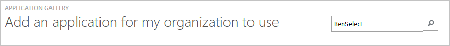
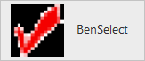
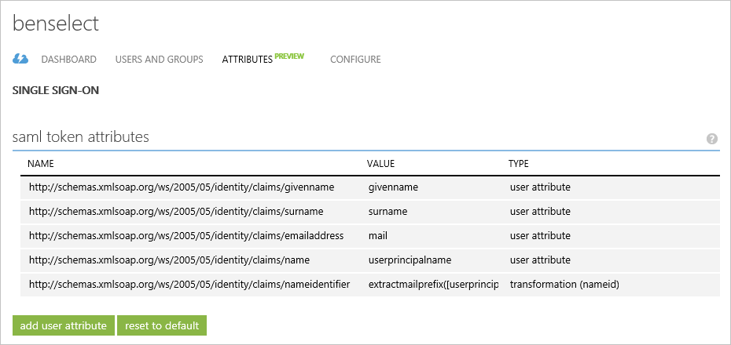
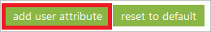
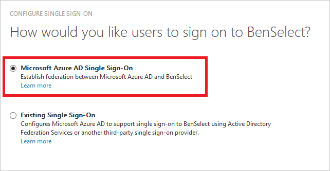
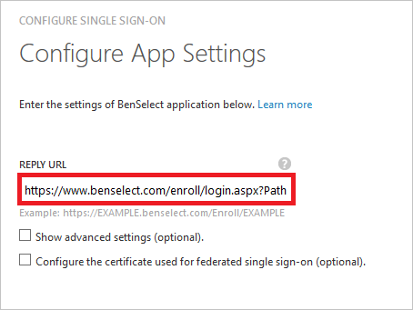
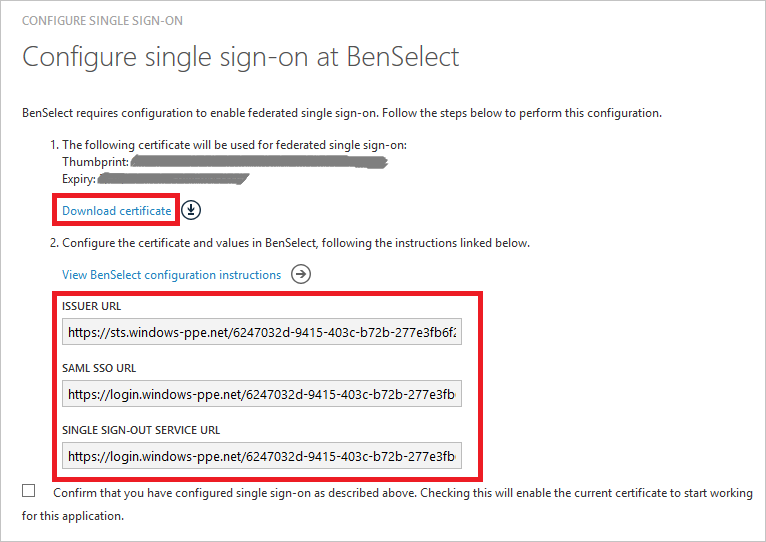
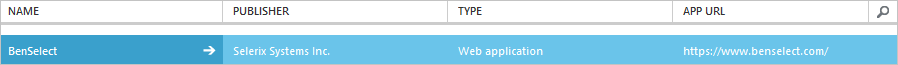

<properties
    pageTitle="Lernprogramm: Azure-Active Directory-Integration in BenSelect | Microsoft Azure"
    description="Informationen Sie zum einmaligen Anmeldens zwischen Azure Active Directory und BenSelect konfigurieren."
    services="active-directory"
    documentationCenter=""
    authors="jeevansd"
    manager="femila"
    editor=""/>

<tags
    ms.service="active-directory"
    ms.workload="identity"
    ms.tgt_pltfrm="na"
    ms.devlang="na"
    ms.topic="article"
    ms.date="10/07/2016"
    ms.author="jeedes"/>

# Lernprogramm: Azure-Active Directory-Integration in BenSelect

In diesem Lernprogramm erfahren Sie, wie BenSelect mit Azure Active Directory (Azure AD) integriert werden soll.

Integration von BenSelect mit Azure AD bietet Ihnen die folgenden Vorteile:

- Sie können in Azure AD steuern, die auf BenSelect zugreifen
- Sie können Ihre Benutzer automatisch auf BenSelect (einmaliges Anmelden) mit ihren Konten Azure AD-angemeldete abrufen aktivieren.
- Sie können Ihre Konten an einem zentralen Ort – im klassischen Azure-Portal verwalten.

Wenn Sie weitere Details zu SaaS app-Integration in Azure AD-wissen möchten, finden Sie unter [Was ist Zugriff auf die Anwendung und einmaliges Anmelden mit Azure Active Directory](active-directory-appssoaccess-whatis.md).

## Erforderliche Komponenten

Zum Konfigurieren von Azure AD-Integration mit BenSelect, benötigen Sie die folgenden Elemente:

- Ein Azure AD-Abonnement
- Eine BenSelect einmaligen Anmeldung aktiviert Abonnement

> [AZURE.NOTE] Wenn Sie um die Schritte in diesem Lernprogramm zu testen, empfehlen wir nicht mit einer Umgebung für die Herstellung.

Führen Sie zum Testen der Schritte in diesem Lernprogramm Tips:

- Sie sollten Ihre Umgebung Herstellung nicht verwenden, es sei denn, dies erforderlich ist.
- Wenn Sie eine Testversion Azure AD-Umgebung besitzen, können Sie eine einen Monat zum Testen [hier](https://azure.microsoft.com/pricing/free-trial/)erhalten.

## Szenario Beschreibung
In diesem Lernprogramm testen Sie Azure AD-einmaliges Anmelden in einer testumgebung.

In diesem Lernprogramm beschriebenen Szenario besteht aus zwei Hauptfenster Bausteine:

1. Hinzufügen von BenSelect aus dem Katalog
2. Konfigurieren und Testen Azure AD einmaliges Anmelden

## Hinzufügen von BenSelect aus dem Katalog
Um die Integration der BenSelect in Azure AD zu konfigurieren, müssen Sie BenSelect zu Ihrer Liste der verwalteten SaaS apps aus dem Katalog hinzuzufügen.

**Um BenSelect aus dem Katalog hinzufügen möchten, führen Sie die folgenden Schritte aus:**

1. Klicken Sie im **Azure klassischen Portal**auf der linken Navigationsbereich auf **Active Directory**.

    ![Active Directory][1]
2. Wählen Sie aus der Liste **Verzeichnis** Verzeichnis für das Sie Verzeichnisintegration aktivieren möchten.

3. Klicken Sie zum Öffnen der Anwendungsansicht in der Verzeichnisansicht im oberen Menü auf **Applications** .

    ![Applikationen][2]

4. Klicken Sie auf **Hinzufügen** , am unteren Rand der Seite.

    ![Applikationen][3]

5. Klicken Sie im Dialogfeld **Was möchten Sie tun** klicken Sie auf **eine Anwendung aus dem Katalog hinzufügen**.

    ![Applikationen][4]

6. Geben Sie im Suchfeld **BenSelect**ein.

    

7. Wählen Sie im Ergebnisbereich **BenSelect aus**, und klicken Sie dann auf **abgeschlossen** , um die Anwendung hinzugefügt haben.

    

##  Konfigurieren und Testen Azure AD einmaliges Anmelden
In diesem Abschnitt Konfigurieren und Testen Azure AD-einmaliges Anmelden mit BenSelect basierend auf einen Testbenutzer "Britta Simon" bezeichnet.

Für einmaliges Anmelden entwickelt muss Azure AD kennen, kann der Benutzer Gegenstück BenSelect einem Benutzer in Azure AD. Kurzum, muss eine Link Beziehung zwischen einem Azure AD-Benutzer und dem entsprechenden Benutzer in BenSelect eingerichtet werden.

Dieser Link Beziehung wird hergestellt, indem Sie den Wert des **Benutzernamens** in Azure AD als der Wert für den **Benutzernamen** in BenSelect zuweisen.

Zum Konfigurieren und Azure AD-einmaliges Anmelden mit BenSelect testen, müssen Sie die folgenden Bausteine durchführen:

1. **[Konfigurieren von Azure AD einmaligen Anmeldens](#configuring-azure-ad-single-sign-on)** - damit Ihre Benutzer dieses Feature verwenden können.
2. **[Erstellen einer Azure AD Benutzer testen](#creating-an-azure-ad-test-user)** : Azure AD-einmaliges Anmelden mit Britta Simon testen.
3. **[Erstellen einer BenSelect Benutzer testen](#creating-a-benselect-test-user)** : ein Gegenstück von Britta Simon in BenSelect haben, die in der Azure AD-Darstellung Ihrer verknüpft ist.
4. **[Testen Sie Benutzer zuweisen Azure AD](#assigning-the-azure-ad-test-user)** - Britta Simon mit Azure AD-einmaliges Anmelden aktivieren.
5. **[Testen der einmaligen Anmeldens](#testing-single-sign-on)** - zur Überprüfung, ob die Konfiguration funktioniert.

### Konfigurieren von Azure AD einmaliges Anmelden

Das Ziel der in diesem Abschnitt ist Azure AD-einmaliges Anmelden im klassischen Azure-Portal aktivieren und konfigurieren einmaliges Anmelden in Ihrer Anwendung BenSelect.

BenSelect Anwendung erwartet die SAML-Assertionen in einem bestimmten Format an. Konfigurieren Sie die folgenden Ansprüche für diese Anwendung. Sie können die Werte dieser Attribute der Registerkarte "**Atrribute**" der Anwendung verwalten. Das folgende Bildschirmabbild zeigt ein Beispiel dafür. 

**Führen Sie die folgenden Schritte aus, um Azure AD-einmaliges Anmelden mit BenSelect konfigurieren:**

1. Im klassischen Azure Portal **BenSelect** Anwendung Integration in die Seite, klicken Sie im Menü oben klicken Sie auf **Attribute**.

     

2. Klicken Sie im Dialogfeld **token SAML-Attribute** für jede Zeile in der folgenden Tabelle werden führen Sie die folgenden Schritte aus:

  	| Attributname | Attributwert |
  	| --- | --- |    
  	| http://Schemas.xmlsoap.org/ws/2005/05/Identity/Claims/NameIdentifier    | extractmailprefix([userPrincipalName]) |

    ein. Klicken Sie auf **Benutzerattribut hinzufügen** , um das Dialogfeld **Benutzer Attribure hinzufügen** zu öffnen.

    

    b. Geben Sie in das Textfeld **Name Attribut** das Attribut Bankname für diese Zeile ein.

    c. Geben Sie in der Liste **Attributwert** ExtractMailPrefix() ein.

    d. Geben Sie in der Liste **E-Mail** User.userprincipalname aus.
    
    e. Klicken Sie auf **abgeschlossen**

3. Klicken Sie im Menü oben auf **Schnellstart**.

    

4. Klicken Sie auf der Seite **Wie möchten Sie Benutzer bei der BenSelect auf** **Azure AD einmaliges Anmelden**wählen Sie aus, und klicken Sie dann auf **Weiter**.

     

5. Führen Sie auf der Seite Dialogfeld **Konfigurieren der App-Einstellungen** die folgenden Schritte aus:

     

    ein. Geben Sie in das Textfeld **Antwort-URL** die URL mit dem folgenden Muster:`https://www.benselect.com/enroll/login.aspx?Path={<tenant name>}`
    
    b. Klicken Sie auf **Weiter**
 
6. Klicken Sie auf der Seite **Konfigurieren einmaliges Anmelden bei BenSelect** führen Sie die folgenden Schritte aus:

    

    ein. Klicken Sie auf **Zertifikat herunterladen**, und speichern Sie die Datei auf Ihrem Computer.

    b. Klicken Sie auf **Weiter**.

7. Wenn für die Anwendung konfigurierten SSO erhalten möchten, wenden Sie sich an Ihr Supportteam BenSelect über [support@selerix.com](mailto:support@selerix.com) , und teilen Sie sie mit den folgenden:

    - Die heruntergeladene Zertifikat
    - Die URL der SAML-SSO
    - Die Abmeldung URL 
    - Der Herausgeber 

    > [AZURE.NOTE] Erwähnen Sie, dass diese Integration der SHA256-Algorithmus erfordert (SHA1 wird nicht unterstützt) müssen Sie die SSO auf dem entsprechenden Server wie app2101 usw. festlegen.

8. Im Portal klassischen wählen Sie die Bestätigung Konfiguration für einzelne Zeichen, und klicken Sie dann auf **Weiter**.
    
    ![Azure AD einmaliges Anmelden][10]

9. Klicken Sie auf der Seite **Bestätigung für einzelne anmelden** auf **abgeschlossen**.  
 
    ![Azure AD einmaliges Anmelden][11]

### Erstellen eines Benutzers mit Azure AD-testen
In diesem Abschnitt erstellen Sie einen Testbenutzer im klassischen Portal Britta Simon bezeichnet.

![Erstellen von Azure AD-Benutzer][20]

**Führen Sie die folgenden Schritte aus, um einen Testbenutzer in Azure AD zu erstellen:**

1. Klicken Sie im **Azure klassischen Portal**auf der linken Navigationsbereich auf **Active Directory**.

     

2. Wählen Sie aus der Liste **Verzeichnis** Verzeichnis für das Sie Verzeichnisintegration aktivieren möchten.

3. Wenn die Liste der Benutzer, klicken Sie im Menü oben anzeigen möchten, klicken Sie auf **Benutzer**.

     

4. Klicken Sie im Dialogfeld **Benutzer hinzufügen** um in der Symbolleiste auf der Unterseite öffnen, auf **Benutzer hinzufügen**.

     

5. Führen Sie auf der Seite **Teilen Sie uns zu diesem Benutzer** die folgenden Schritte aus:   

    ein. Wählen Sie als Typ des Benutzers neuen Benutzer in Ihrer Organisation ein.

    b. Geben Sie den Benutzernamen **Textfeld** **BrittaSimon**ein.

    c. Klicken Sie auf **Weiter**.

6.  Klicken Sie auf der Seite **Benutzerprofil** -Dialogfeld führen Sie die folgenden Schritte aus:  

    ein. Geben Sie im Textfeld **Vorname** **Britta**aus.  

    b. In das letzte Textfeld **Name** , Typ, **Simon**.

    c. Geben Sie im Textfeld **Anzeigename** **Britta Simon**aus.

    d. Wählen Sie in der Liste **Rolle** **Benutzer**aus.

    e. Klicken Sie auf **Weiter**.

7. Klicken Sie auf der Seite **erste temporäres Kennwort** auf **Erstellen**.

     

8. Klicken Sie auf der Seite **erste temporäres Kennwort** führen Sie die folgenden Schritte aus:

     

    ein. Notieren Sie den Wert für das **Neue Kennwort ein**.

    b. Klicken Sie auf **abgeschlossen**.   

### Erstellen eines Benutzers mit BenSelect testen

Das Ziel der in diesem Abschnitt ist zum Erstellen eines Benutzers Britta Simon in BenSelect bezeichnet. Arbeiten Sie mit BenSelect Supportteam Benutzer in der BenSelect-Konto hinzufügen.

> [AZURE.NOTE] Wenn Sie einen Benutzer manuell erstellen müssen, müssen Sie wenden Sie sich an das Supportteam BenSelect über <mailto:support@selerix.com>.

### Zuweisen des Azure AD-Test-Benutzers

In diesem Abschnitt aktivieren Sie Britta Simon Azure einmaliges Anmelden verwenden, indem Sie keinen Zugriff auf BenSelect erteilen.

![Benutzer zuweisen][200] 

**Um Britta Simon BenSelect zuzuweisen, führen Sie die folgenden Schritte aus:**

1. Klicken Sie im Portal klassischen zum Öffnen der Anwendungsansicht in der Verzeichnisansicht klicken Sie auf **Applikationen** im oberen Menü.

    ![Benutzer zuweisen][201] 

2. Wählen Sie in der Liste Applications **BenSelect**.

     

3. Klicken Sie auf **Benutzer**, klicken Sie im Menü oben.

    ![Benutzer zuweisen][203]

4. Wählen Sie in der Liste Benutzer **Britta Simon**aus.

5. Klicken Sie unten auf der Symbolleiste auf **zuweisen**.

    ![Benutzer zuweisen][205]

### Testen einmaliges Anmelden

In diesem Abschnitt Testen Sie Ihre Azure AD-einzelne anmelden Konfiguration mit der Access-Systemsteuerung.

Wenn Sie die Kachel BenSelect im Bereich Access klicken, Sie sollten automatisch an Ihrer Anwendung BenSelect angemeldete abrufen.

## Zusätzliche Ressourcen

* [Liste der zum Integrieren SaaS-Apps mit Azure-Active Directory-Lernprogramme](active-directory-saas-tutorial-list.md)
* [Was ist die Anwendungszugriff und einmaliges Anmelden mit Azure Active Directory?](active-directory-appssoaccess-whatis.md)

<!--Image references-->

[1]: ./media/active-directory-saas-benselect-tutorial/tutorial_general_01.png
[2]: ./media/active-directory-saas-benselect-tutorial/tutorial_general_02.png
[3]: ./media/active-directory-saas-benselect-tutorial/tutorial_general_03.png
[4]: ./media/active-directory-saas-benselect-tutorial/tutorial_general_04.png

[6]: ./media/active-directory-saas-benselect-tutorial/tutorial_general_05.png
[10]: ./media/active-directory-saas-benselect-tutorial/tutorial_general_06.png
[11]: ./media/active-directory-saas-benselect-tutorial/tutorial_general_07.png
[20]: ./media/active-directory-saas-benselect-tutorial/tutorial_general_100.png

[200]: ./media/active-directory-saas-benselect-tutorial/tutorial_general_200.png
[201]: ./media/active-directory-saas-benselect-tutorial/tutorial_general_201.png
[203]: ./media/active-directory-saas-benselect-tutorial/tutorial_general_203.png
[204]: ./media/active-directory-saas-benselect-tutorial/tutorial_general_204.png
[205]: ./media/active-directory-saas-benselect-tutorial/tutorial_general_205.png
