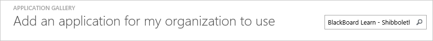
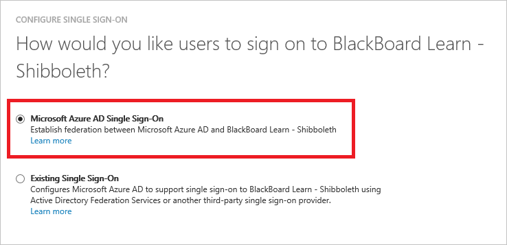
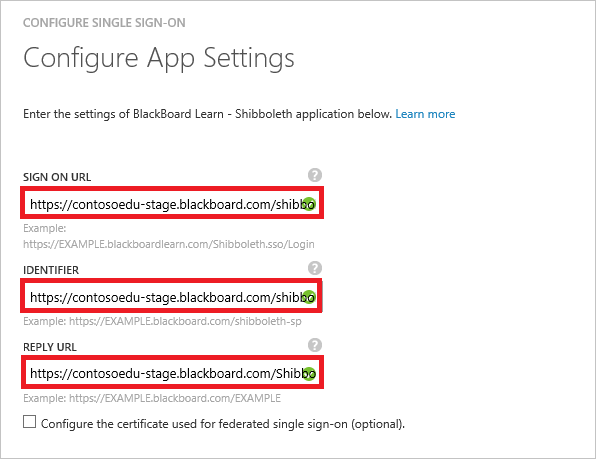
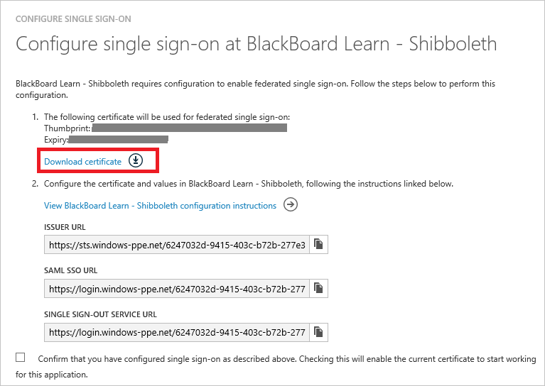
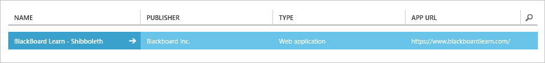

<properties
    pageTitle="Lernprogramm: Azure-Active Directory-Integration in "Schieferleiste" erfahren – Shibboleth | Microsoft Azure"
    description="Informationen Sie zum Konfigurieren der einmaligen Anmeldens zwischen Azure Active Directory und erfahren Sie, "Schieferleiste" - Shibboleth."
    services="active-directory"
    documentationCenter=""
    authors="jeevansd"
    manager="femila"
    editor=""/>

<tags
    ms.service="active-directory"
    ms.workload="identity"
    ms.tgt_pltfrm="na"
    ms.devlang="na"
    ms.topic="article"
    ms.date="09/10/2016"
    ms.author="jeedes"/>

# Lernprogramm: Azure-Active Directory-Integration in "Schieferleiste" erfahren – Shibboleth

In diesem Lernprogramm erfahren Sie, wie Shibboleth mit Azure Active Directory (Azure AD) erfahren Sie, "Schieferleiste" – integriert werden.

Integration von "Schieferleiste" lernen Sie, wie - Shibboleth mit Azure AD bietet Ihnen die folgenden Vorteile:

- Sie können in Azure AD steuern, die auf "Schieferleiste" erfahren - Shibboleth zugreifen
- Sie können Ihre Benutzer automatisch angemeldet-"Schieferleiste" Informationen - Shibboleth (einmaliges Anmelden) mit ihren Azure AD-Konten auf erste aktivieren.
- Sie können Ihre Konten an einem zentralen Ort – im klassischen Azure-Portal verwalten.

Wenn Sie weitere Details zu SaaS app-Integration in Azure AD-wissen möchten, finden Sie unter [Was ist Zugriff auf die Anwendung und einmaliges Anmelden mit Azure Active Directory](active-directory-appssoaccess-whatis.md).

## Erforderliche Komponenten

Zum Konfigurieren von Azure AD-Integration mit "Schieferleiste" erfahren – Shibboleth, benötigen Sie die folgenden Elemente:

- Ein Azure AD-Abonnement
- Eine "Schieferleiste" lernen Sie, wie - Shibboleth einmaligen Anmeldung aktiviert Abonnement

> [AZURE.NOTE] Wenn Sie um die Schritte in diesem Lernprogramm zu testen, empfehlen wir nicht mit einer Umgebung für die Herstellung.

Führen Sie zum Testen der Schritte in diesem Lernprogramm Tips:

- Sie sollten Ihre Umgebung Herstellung nicht verwenden, es sei denn, dies erforderlich ist.
- Wenn Sie eine Testversion Azure AD-Umgebung besitzen, können Sie eine einen Monat zum Testen [hier](https://azure.microsoft.com/pricing/free-trial/)erhalten.

## Szenario Beschreibung
In diesem Lernprogramm testen Sie Azure AD-einmaliges Anmelden in einer testumgebung.

In diesem Lernprogramm beschriebenen Szenario besteht aus zwei Hauptfenster Bausteine:

1. Hinzufügen von "Schieferleiste" lernen Sie, wie - Shibboleth aus dem Katalog
2. Konfigurieren und Testen Azure AD einmaliges Anmelden

## Hinzufügen von "Schieferleiste" lernen Sie, wie - Shibboleth aus dem Katalog
Zum Konfigurieren der Integration von "Schieferleiste" erfahren - Shibboleth in Azure AD, müssen Sie "Schieferleiste" erfahren Sie, – Shibboleth aus dem Katalog zu Ihrer Liste der verwalteten SaaS apps hinzufügen.

**Erfahren Sie, "Schieferleiste" – hinzufügen Shibboleth aus dem Katalog, führen Sie die folgenden Schritte aus:**

1. Klicken Sie im **Azure klassischen Portal**auf der linken Navigationsbereich auf **Active Directory**.

    ![Active Directory][1]
2. Wählen Sie aus der Liste **Verzeichnis** Verzeichnis für das Sie Verzeichnisintegration aktivieren möchten.

3. Klicken Sie zum Öffnen der Anwendungsansicht in der Verzeichnisansicht im oberen Menü auf **Applications** .

    ![Applikationen][2]

4. Klicken Sie auf **Hinzufügen** , am unteren Rand der Seite.

    ![Applikationen][3]

5. Klicken Sie im Dialogfeld **Was möchten Sie tun** klicken Sie auf **eine Anwendung aus dem Katalog hinzufügen**.

    ![Applikationen][4]

6. Geben Sie im Suchfeld **"Schieferleiste" erfahren - Shibboleth**ein.

    

7. Wählen Sie im Ergebnisbereich **"Schieferleiste" erfahren Sie, – Shibboleth**und dann auf **abgeschlossen** , um die Anwendung hinzuzufügen.
    
    

##  Konfigurieren und Testen Azure AD einmaliges Anmelden
In diesem Abschnitt Sie konfigurieren und Testen der Azure AD-einmaliges Anmelden mit "Schieferleiste" erfahren – Shibboleth auf Grundlage eines Testbenutzers "Britta Simon" bezeichnet.

Für einmaliges Anmelden entwickelt "Schieferleiste" erfahren Sie, welche den Gegenstück Benutzer wissen muss Azure AD - Shibboleth ist ein Benutzer in Azure AD. Kurzum, muss ein Link Beziehung zwischen einem Azure AD-Benutzer und dem entsprechenden Benutzer in "Schieferleiste" erfahren Sie, – Shibboleth eingerichtet werden.

Dieser Link Beziehung wird hergestellt, indem Sie den Wert des **Benutzernamens** in Azure AD als der Wert für den **Benutzernamen** in "Schieferleiste" erfahren – Shibboleth zuweisen.

Zum Konfigurieren und Azure AD-einmaliges Anmelden mit "Schieferleiste" erfahren Sie, – testen müssen Shibboleth, führen Sie die folgenden Bausteine erforderlich:

1. **[Konfigurieren von Azure AD einmaligen Anmeldens](#configuring-azure-ad-single-sign-on)** - damit Ihre Benutzer dieses Feature verwenden können.
2. **[Erstellen einer Azure AD Benutzer testen](#creating-an-azure-ad-test-user)** : Azure AD-einmaliges Anmelden mit Britta Simon testen.
3. **[Erstellen einer "Schieferleiste" erfahren Sie, – Shibboleth Testbenutzer](#creating-a-blackboard-learn-shibboleth-test-user)** - ein Gegenstück von Britta Simon in "Schieferleiste" erfahren - Shibboleth haben, die in der Azure AD-Darstellung Ihrer verknüpft ist.
4. **[Testen Sie Benutzer zuweisen Azure AD](#assigning-the-azure-ad-test-user)** - Britta Simon mit Azure AD-einmaliges Anmelden aktivieren.
5. **[Testen der einmaligen Anmeldens](#testing-single-sign-on)** - zur Überprüfung, ob die Konfiguration funktioniert.

### Konfigurieren von Azure AD-einmaliges Anmelden

In diesem Abschnitt Azure AD-einmaliges Anmelden im klassischen Portal aktivieren und konfigurieren in der "Schieferleiste" erfahren - Anwendung Shibboleth einmaliges Anmelden.

**Zum Konfigurieren Azure AD-einmaliges Anmelden mit "Schieferleiste" erfahren – Shibboleth, führen Sie die folgenden Schritte aus:**

1. Im Portal klassischen auf der **"Schieferleiste" erfahren – Shibboleth** Integrationsseite Anwendung klicken Sie auf **Konfigurieren einmaligen Anmeldens** zum Öffnen des Dialogfelds **Konfigurieren einmaliges Anmelden** .
     
    ![Konfigurieren Sie einmaliges Anmelden][6] 

2. Klicken Sie auf der Seite **Wie möchten Sie Benutzer anmelden "Schieferleiste" Informationen - Shibboleth** **Azure AD einmaliges Anmelden**wählen Sie aus, und klicken Sie dann auf **Weiter**.

     

3. Führen Sie auf der Seite Dialogfeld **Konfigurieren der App-Einstellungen** die folgenden Schritte aus:

     

    ein. Geben Sie in das Textfeld **Melden Sie sich auf URL** die URL Ihrer Benutzer melden Sie sich für den Zugriff auf Ihre "Schieferleiste" erfahren Sie, – Shibboleth-Anwendung unter Verwendung des folgenden Musters untersuchten: **https://\<Yourblackoardlearnserver\>.blackboardlearn.com/Shibboleth.sso/Login**
    
    b. Geben Sie in das Textfeld **Bezeichner** die URL, die mit dem folgenden Muster: **https://\<Yourblackoardlearnserver\>.blackboardlearn.com/shibboleth-sp**

    c. Geben Sie in das Textfeld **Antwort-URL** die URL mit dem folgenden Muster: **https://\<Yourblackoardlearnserver\>.blackboardlearn.com/Shibboleth.sso/SAML2/POST**

    > [AZURE.NOTE] Sie können alle folgenden Werte in der Föderation Metadaten Doucument bereitgestellt, die von Ihrem Partner "Schieferleiste" Informationen zu finden.

    d. Klicken Sie auf **Weiter**
 
4. Klicken Sie auf der Seite **Konfigurieren einmaliges Anmelden bei "Schieferleiste" erfahren - Shibboleth** führen Sie die folgenden Schritte aus:

    

    ein. Klicken Sie auf **Herunterladen von Metadaten**aus, und speichern Sie die Datei auf Ihrem Computer.

    b. Klicken Sie auf **Weiter**.

5. Um für die Anwendung konfigurierten SSO zu gelangen, wenden Sie sich an Ihre "Schieferleiste" erfahren Sie, – Shibboleth Partner, und teilen Sie sie mit der folgenden:

    • Die heruntergeladene **Metadaten**

    • Die **URL des Herausgebers**

    • Der **SAML SSO-URL**

    • Die **einzelnen Abmeldung Dienst-URL**

6. Im Portal klassischen wählen Sie die Bestätigung Konfiguration für einzelne Zeichen, und klicken Sie dann auf **Weiter**.
    
    ![Azure AD einmaliges Anmelden][10]

7. Klicken Sie auf der Seite **Bestätigung für einzelne anmelden** auf **abgeschlossen**.  
 
    ![Azure AD einmaliges Anmelden][11]

### Erstellen eines Benutzers mit Azure AD-testen
In diesem Abschnitt erstellen Sie einen Testbenutzer im klassischen Portal Britta Simon bezeichnet.

![Erstellen von Azure AD-Benutzer][20]

**Führen Sie die folgenden Schritte aus, um einen Testbenutzer in Azure AD zu erstellen:**

1. Klicken Sie im **Azure klassischen Portal**auf der linken Navigationsbereich auf **Active Directory**.

     

2. Wählen Sie aus der Liste **Verzeichnis** Verzeichnis für das Sie Verzeichnisintegration aktivieren möchten.

3. Wenn die Liste der Benutzer, klicken Sie im Menü oben anzeigen möchten, klicken Sie auf **Benutzer**.

     

4. Klicken Sie im Dialogfeld **Benutzer hinzufügen** um in der Symbolleiste auf der Unterseite öffnen, auf **Benutzer hinzufügen**.

     

5. Führen Sie auf der Seite **Teilen Sie uns zu diesem Benutzer** die folgenden Schritte aus:   

    ein. Wählen Sie als Typ des Benutzers neuen Benutzer in Ihrer Organisation ein.

    b. Geben Sie den Benutzernamen **Textfeld** **BrittaSimon**ein.

    c. Klicken Sie auf **Weiter**.

6.  Klicken Sie auf der Seite **Benutzerprofil** -Dialogfeld führen Sie die folgenden Schritte aus:  

    ein. Geben Sie im Textfeld **Vorname** **Britta**aus.  

    b. In das letzte Textfeld **Name** , Typ, **Simon**.

    c. Geben Sie im Textfeld **Anzeigename** **Britta Simon**aus.

    d. Wählen Sie in der Liste **Rolle** **Benutzer**aus.

    e. Klicken Sie auf **Weiter**.

7. Klicken Sie auf der Seite **erste temporäres Kennwort** auf **Erstellen**.

     

8. Klicken Sie auf der Seite **erste temporäres Kennwort** führen Sie die folgenden Schritte aus:

     

    ein. Notieren Sie den Wert für das **Neue Kennwort ein**.

    b. Klicken Sie auf **abgeschlossen**.   

### Erstellen einer "Schieferleiste" erfahren Sie, – Shibboleth Testbenutzers

In diesem Abschnitt erstellen Sie einen Benutzer namens Britta Simon in "Schieferleiste" erfahren - Shibboleth. Arbeiten Sie mit Ihrem Partner "Schieferleiste" erfahren Sie, die Benutzer in der "Schieferleiste" erfahren - Plattform Shibboleth hinzu.

### Zuweisen des Azure AD-Test-Benutzers

In diesem Abschnitt aktivieren Sie Britta Simon Azure einmaliges Anmelden verwenden, indem Sie ihre Access "Schieferleiste" Informationen - Shibboleth erteilen.

![Benutzer zuweisen][200] 

**Zum Zuweisen von Britta Simon "Schieferleiste" Informationen - Shibboleth, führen Sie die folgenden Schritte aus:**

1. Klicken Sie im Portal klassischen zum Öffnen der Anwendungsansicht in der Verzeichnisansicht klicken Sie auf **Applikationen** im oberen Menü.

    ![Benutzer zuweisen][201] 

2. Wählen Sie in der Liste Applications **"Schieferleiste" erfahren - Shibboleth**ein.

     

3. Klicken Sie auf **Benutzer**, klicken Sie im Menü oben.

    ![Benutzer zuweisen][203]

4. Wählen Sie in der Liste Benutzer **Britta Simon**aus.

5. Klicken Sie unten auf der Symbolleiste auf **zuweisen**.

    ![Benutzer zuweisen][205]

### Testen einmaliges Anmelden

In diesem Abschnitt Testen Sie Ihre Azure AD-einzelne anmelden Konfiguration mit der Access-Systemsteuerung.

Beim Klicken auf die "Schieferleiste" erfahren Sie, – Shibboleth Kachel im Bereich Access Sie sollte automatisch Ihre "Schieferleiste" Informationen - Anwendung Shibboleth angemeldete abrufen.

## Zusätzliche Ressourcen

* [Liste der zum Integrieren SaaS-Apps mit Azure-Active Directory-Lernprogramme](active-directory-saas-tutorial-list.md)
* [Was ist die Anwendungszugriff und einmaliges Anmelden mit Azure Active Directory?](active-directory-appssoaccess-whatis.md)

<!--Image references-->

[1]: ./media/active-directory-saas-blackboard-learn-shibboleth-tutorial/tutorial_general_01.png
[2]: ./media/active-directory-saas-blackboard-learn-shibboleth-tutorial/tutorial_general_02.png
[3]: ./media/active-directory-saas-blackboard-learn-shibboleth-tutorial/tutorial_general_03.png
[4]: ./media/active-directory-saas-blackboard-learn-shibboleth-tutorial/tutorial_general_04.png

[6]: ./media/active-directory-saas-blackboard-learn-shibboleth-tutorial/tutorial_general_05.png
[10]: ./media/active-directory-saas-blackboard-learn-shibboleth-tutorial/tutorial_general_06.png
[11]: ./media/active-directory-saas-blackboard-learn-shibboleth-tutorial/tutorial_general_07.png
[20]: ./media/active-directory-saas-blackboard-learn-shibboleth-tutorial/tutorial_general_100.png

[200]: ./media/active-directory-saas-blackboard-learn-shibboleth-tutorial/tutorial_general_200.png
[201]: ./media/active-directory-saas-blackboard-learn-shibboleth-tutorial/tutorial_general_201.png
[203]: ./media/active-directory-saas-blackboard-learn-shibboleth-tutorial/tutorial_general_203.png
[204]: ./media/active-directory-saas-blackboard-learn-shibboleth-tutorial/tutorial_general_204.png
[205]: ./media/active-directory-saas-blackboard-learn-shibboleth-tutorial/tutorial_general_205.png