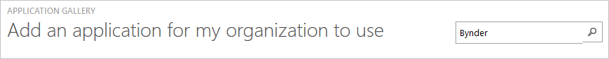
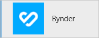
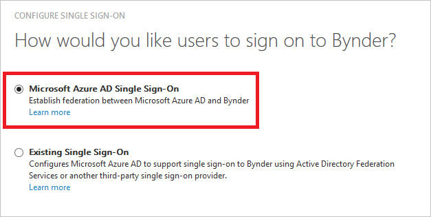
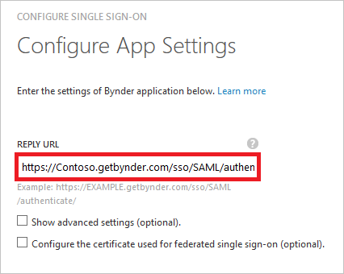
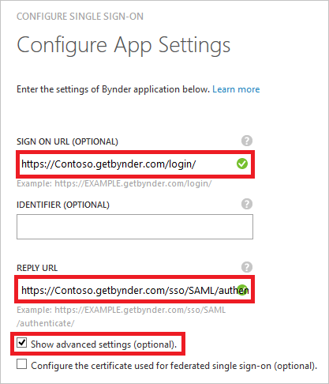
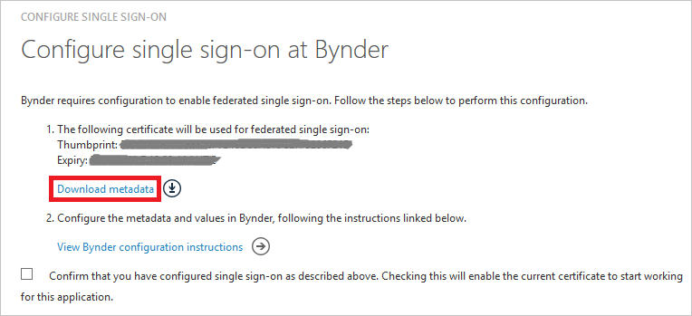
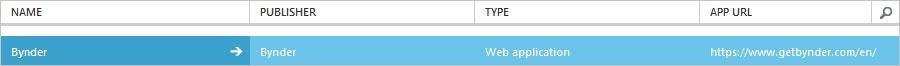

<properties
    pageTitle="Lernprogramm: Azure-Active Directory-Integration in Bynder | Microsoft Azure"
    description="Informationen Sie zum einmaligen Anmeldens zwischen Azure Active Directory und Bynder konfigurieren."
    services="active-directory"
    documentationCenter=""
    authors="jeevansd"
    manager="femila"
    editor=""/>

<tags
    ms.service="active-directory"
    ms.workload="identity"
    ms.tgt_pltfrm="na"
    ms.devlang="na"
    ms.topic="article"
    ms.date="10/10/2016"
    ms.author="jeedes"/>

# Lernprogramm: Azure-Active Directory-Integration in Bynder

Ziel dieses Lernprogramms ist es zu zeigen, wie Sie Bynder in Azure Active Directory (Azure AD) zu integrieren.

Integration von Bynder mit Azure AD bietet Ihnen die folgenden Vorteile:

- Sie können in Azure AD steuern, die auf Bynder zugreifen
- Sie können Ihre Benutzer automatisch auf Bynder (einmaliges Anmelden) mit ihren Konten Azure AD-angemeldete abrufen aktivieren.
- Sie können Ihre Konten an einem zentralen Ort – im klassischen Azure-Portal verwalten.

Wenn Sie weitere Details zu SaaS app-Integration in Azure AD-wissen möchten, finden Sie unter [Was ist Zugriff auf die Anwendung und einmaliges Anmelden mit Azure Active Directory](active-directory-appssoaccess-whatis.md).

## Erforderliche Komponenten

Zum Konfigurieren von Azure AD-Integration mit Bynder, benötigen Sie die folgenden Elemente:

- Ein Azure AD-Abonnement
- Eine Bynder einmaligen Anmeldung aktiviert Abonnement

> [AZURE.NOTE] Wenn Sie um die Schritte in diesem Lernprogramm zu testen, empfehlen wir nicht mit einer Umgebung für die Herstellung.

Führen Sie zum Testen der Schritte in diesem Lernprogramm Tips:

- Sie sollten Ihre Umgebung Herstellung nicht verwenden, es sei denn, dies erforderlich ist.
- Wenn Sie eine Testversion Azure AD-Umgebung besitzen, können Sie eine einen Monat zum Testen [hier](https://azure.microsoft.com/pricing/free-trial/)erhalten.

## Szenario Beschreibung
Ziel dieses Lernprogramms ist, sodass Sie in einer Umgebung für einmaliges Anmelden für Microsoft Azure AD testen können.

In diesem Lernprogramm beschriebenen Szenario besteht aus zwei Hauptfenster Bausteine:

1. Hinzufügen von Bynder aus dem Katalog
2. Konfigurieren und Testen Microsoft Azure AD einmaliges Anmelden

## Hinzufügen von Bynder aus dem Katalog
Um die Integration der Bynder in Azure AD zu konfigurieren, müssen Sie Bynder zu Ihrer Liste der verwalteten SaaS apps aus dem Katalog hinzuzufügen.

**Um Bynder aus dem Katalog hinzufügen möchten, führen Sie die folgenden Schritte aus:**

1. Klicken Sie im **Azure klassischen Portal**auf der linken Navigationsbereich auf **Active Directory**. 

    ![Active Directory][1]

2. Wählen Sie aus der Liste **Verzeichnis** Verzeichnis für das Sie Verzeichnisintegration aktivieren möchten.

3. Klicken Sie zum Öffnen der Anwendungsansicht in der Verzeichnisansicht im oberen Menü auf **Applications** .
    
    ![Applikationen][2]

4. Klicken Sie auf **Hinzufügen** , am unteren Rand der Seite.
    
    ![Applikationen][3]

5. Klicken Sie im Dialogfeld **Was möchten Sie tun** klicken Sie auf **eine Anwendung aus dem Katalog hinzufügen**.

    ![Applikationen][4]

6. Geben Sie im Suchfeld **Bynder**ein.

    

7. Im Ergebnisfeld **Bynder**wählen Sie aus, und klicken Sie dann auf **abgeschlossen** , um die Anwendung hinzugefügt haben.

    

##  Konfigurieren und Testen Microsoft Azure AD einmaliges Anmelden
Ziel dieses Abschnitts ist es, die erläutert, wie Sie konfigurieren und Testen Microsoft Azure AD einmaliges Anmelden mit Bynder auf einen Testbenutzer namens "Britta Simon" basiert.

Für einmaliges Anmelden entwickelt muss Azure AD wissen, was der Benutzer Gegenstück Bynder an einen Benutzer in Azure AD ist. Kurzum, muss eine Link Beziehung zwischen einem Azure AD-Benutzer und dem entsprechenden Benutzer in Bynder eingerichtet werden.

Dieser Link Beziehung wird hergestellt, indem Sie den Wert des **Benutzernamens** in Azure AD als der Wert für den **Benutzernamen** in Bynder zuweisen.

Zum Konfigurieren und Testen Microsoft Azure AD einmaliges Anmelden mit Bynder, müssen Sie die folgenden Bausteine durchführen:

1. **[Konfigurieren von Microsoft Azure AD einmaliges Anmelden](#configuring-azure-ad-single-single-sign-on)** - damit Ihre Benutzer dieses Feature verwenden können.
2. **[Erstellen einer Azure AD Benutzer testen](#creating-an-azure-ad-test-user)** : Microsoft Azure AD einmaliges Anmelden mit Britta Simon testen.
3. **[Erstellen einer Bynder Benutzer testen](#creating-a-bynder-test-user)** : ein Gegenstück von Britta Simon in Bynder haben, die in der Azure AD-Darstellung Ihrer verknüpft ist.
4. **[Testen Sie Benutzer zuweisen Azure AD](#assigning-the-azure-ad-test-user)** - Britta Simon mit Microsoft Azure AD einmaliges Anmelden aktivieren.
5. **[Testen der einmaligen Anmeldens](#testing-single-sign-on)** - zur Überprüfung, ob die Konfiguration funktioniert.

### Konfigurieren von Microsoft Azure AD einmaliges Anmelden

In diesem Abschnitt Microsoft Azure AD einmaliges Anmelden im klassischen Portal aktivieren und konfigurieren in Ihrer Anwendung Bynder einmaliges Anmelden.

**So konfigurieren Sie Microsoft Azure AD einmaliges Anmelden mit Bynder die folgenden Schritte aus:**

1. Im Portal klassischen auf der Seite **Bynder** Integration Anwendung klicken Sie auf **Konfigurieren einmaligen Anmeldens** zum Öffnen des Dialogfelds **Konfigurieren einmaliges Anmelden** .
     
    ![Konfigurieren Sie einmaliges Anmelden][6] 

2. Klicken Sie auf der Seite **Wie möchten Sie Benutzer bei der Bynder auf** **Microsoft Azure AD einmaliges Anmelden**wählen Sie aus, und klicken Sie dann auf **Weiter**.
    
    

3. Auf der Seite **Einstellungen für die App konfigurieren** Dialogfeld Wenn Sie die Anwendung im **IDP initiiert Modus**konfigurieren möchten, führen Sie die folgenden Schritte aus und klicken Sie auf **Weiter**:

    

    ein. Geben Sie im Textfeld **URL Antworten** einer URL dem folgenden Muster: `https://<company name>.getbynder.com/sso/SAML/authenticate/`

    b. Klicken Sie auf **Weiter**

4. Wenn Sie die Anwendung in **SP initiiert Modus** auf der **App-Einstellungen konfigurieren** Dialogseite konfigurieren möchten, klicken Sie dann auf die **"Erweiterte Einstellungen (optional) anzeigen"** , und geben Sie die **Melden Sie sich auf URL** , und klicken Sie auf **Weiter**.

    

    ein. Geben Sie in das Textfeld **Melden Sie sich auf URL** eine URL, die mit dem folgenden Muster: `https://<company name>.getbynder.com/login/`

    b. Klicken Sie auf **Weiter**

    > [AZURE.NOTE] Der Wert für die URL melden Sie sich in diesem Lernprogramm ist nur eine Placeholfer. Um der tatsächliche Wert für Ihre Umgebung zu erhalten, wenden Sie sich an Bynder.

5. Klicken Sie auf der Seite **Konfigurieren einmaliges Anmelden bei Bynder** führen Sie die folgenden Schritte aus, und klicken Sie auf **Weiter**:

    

    ein. Klicken Sie auf **Herunterladen von Metadaten**aus, und speichern Sie die Datei auf Ihrem Computer.

    b. Klicken Sie auf **Weiter**.

6. Um für die Anwendung konfigurierten SSO zu erhalten, wenden Sie sich an Ihr Supportteam Bynder. Fügen Sie die heruntergeladenen Metadatendatei, und teilen Sie sie mit Bynder Team SSO auf ihrer Seite einrichten.

7. Im Portal klassischen wählen Sie die Bestätigung Konfiguration für einzelne Zeichen, und klicken Sie dann auf **Weiter**.
    
    ![Azure AD einmaliges Anmelden][10]

8. Klicken Sie auf der Seite **Bestätigung für einzelne anmelden** auf **abgeschlossen**.  
    
    ![Azure AD einmaliges Anmelden][11]

### Erstellen eines Benutzers mit Azure AD-testen
Das Ziel der in diesem Abschnitt besteht im Erstellen eines Testbenutzers im klassischen Portal Britta Simon bezeichnet.

![Erstellen von Azure AD-Benutzer][20]

**Führen Sie die folgenden Schritte aus, um einen Testbenutzer in Azure AD zu erstellen:**

1. Klicken Sie im **Azure klassischen Portal**auf der linken Navigationsbereich auf **Active Directory**.

    

2. Wählen Sie aus der Liste **Verzeichnis** Verzeichnis für das Sie Verzeichnisintegration aktivieren möchten.

3. Wenn die Liste der Benutzer, klicken Sie im Menü oben anzeigen möchten, klicken Sie auf **Benutzer**.
    
    

4. Klicken Sie im Dialogfeld **Benutzer hinzufügen** um in der Symbolleiste auf der Unterseite öffnen, auf **Benutzer hinzufügen**.

    

5. Führen Sie auf der Seite **Teilen Sie uns zu diesem Benutzer** die folgenden Schritte aus:

    

    ein. Wählen Sie als Typ des Benutzers neuen Benutzer in Ihrer Organisation ein.

    b. Geben Sie den Benutzernamen **Textfeld** **BrittaSimon**ein.

    c. Klicken Sie auf **Weiter**.

6.  Klicken Sie auf der Seite **Benutzerprofil** Dialogfeld führen Sie die folgenden Schritte aus:
    
    

    ein. Geben Sie im Textfeld **Vorname** **Britta**aus.  

    b. In das letzte Textfeld **Name** , Typ, **Simon**.

    c. Geben Sie im Textfeld **Anzeigename** **Britta Simon**aus.

    d. Wählen Sie in der Liste **Rolle** **Benutzer**aus.

    e. Klicken Sie auf **Weiter**.

7. Klicken Sie auf der Seite **erste temporäres Kennwort** auf **Erstellen**.
    
    

8. Führen Sie auf der Seite **erste temporäres Kennwort** die folgenden Schritte aus:
    
    

    ein. Notieren Sie den Wert für das **Neue Kennwort ein**.

    b. Klicken Sie auf **abgeschlossen**.   

### Erstellen eines Testbenutzers Bynder

Das Ziel der in diesem Abschnitt ist zum Erstellen eines Benutzers Britta Simon in Bynder bezeichnet. Bynder unterstützt in-Time-Bereitstellung, welche ist standardmäßig aktiviert.

Keine für Sie in diesem Abschnitt Aktionselement ist vorhanden. Bei dem Versuch, Bynder zugreifen, wenn er noch nicht vorhanden ist, wird ein neuer Benutzer erstellt werden.

> [AZURE.NOTE] Wenn Sie einen Benutzer manuell erstellen müssen, müssen Sie wenden Sie sich an das Supportteam Bynder.

### Zuweisen des Azure AD-Test-Benutzers

Das Ziel der in diesem Abschnitt ist für die Aktivierung der Britta Simon Azure einmaliges Anmelden verwenden, indem Sie keinen Zugriff auf Bynder erteilen.
    
   ![Benutzer zuweisen][200]

**Um Britta Simon Bynder zuzuweisen, führen Sie die folgenden Schritte aus:**

1. Klicken Sie im Portal klassischen zum Öffnen der Anwendungsansicht in der Verzeichnisansicht klicken Sie auf **Applikationen** im oberen Menü.
    
    ![Benutzer zuweisen][201]

2. Wählen Sie in der Liste Applications **Bynder**.
    
    

1. Klicken Sie auf **Benutzer**, klicken Sie im Menü oben.
    
    ![Benutzer zuweisen][203]

1. Wählen Sie in der Liste Benutzer **Britta Simon**aus.

2. Klicken Sie unten auf der Symbolleiste auf **zuweisen**.
    
    ![Benutzer zuweisen][205]

### Testen einmaliges Anmelden

Das Ziel der in diesem Abschnitt ist zum Überprüfen der Microsoft Azure AD einmaliges Anmelden Konfiguration im Bereich Access verwenden.
 
Wenn Sie die Kachel Bynder im Bereich Access klicken, Sie sollten automatisch an Ihrer Anwendung Bynder angemeldete abrufen.

## Zusätzliche Ressourcen

* [Liste der zum Integrieren SaaS-Apps mit Azure-Active Directory-Lernprogramme](active-directory-saas-tutorial-list.md)
* [Was ist die Anwendungszugriff und einmaliges Anmelden mit Azure Active Directory?](active-directory-appssoaccess-whatis.md)

<!--Image references-->

[1]: ./media/active-directory-saas-bynder-tutorial/tutorial_general_01.png
[2]: ./media/active-directory-saas-bynder-tutorial/tutorial_general_02.png
[3]: ./media/active-directory-saas-bynder-tutorial/tutorial_general_03.png
[4]: ./media/active-directory-saas-bynder-tutorial/tutorial_general_04.png

[6]: ./media/active-directory-saas-bynder-tutorial/tutorial_general_05.png
[10]: ./media/active-directory-saas-bynder-tutorial/tutorial_general_06.png
[11]: ./media/active-directory-saas-bynder-tutorial/tutorial_general_07.png
[20]: ./media/active-directory-saas-bynder-tutorial/tutorial_general_100.png

[200]: ./media/active-directory-saas-bynder-tutorial/tutorial_general_200.png
[201]: ./media/active-directory-saas-bynder-tutorial/tutorial_general_201.png
[203]: ./media/active-directory-saas-bynder-tutorial/tutorial_general_203.png
[204]: ./media/active-directory-saas-bynder-tutorial/tutorial_general_204.png
[205]: ./media/active-directory-saas-bynder-tutorial/tutorial_general_205.png
