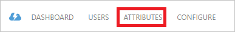

<properties
    pageTitle="Lernprogramm: Azure-Active Directory-Integration in Ceridian Dayforce HCM | Microsoft Azure"
    description="Informationen Sie zum Konfigurieren der einmaligen Anmeldens zwischen Azure Active Directory und Ceridian Dayforce HCM."
    services="active-directory"
    documentationCenter=""
    authors="jeevansd"
    manager="femila"
    editor=""/>

<tags
    ms.service="active-directory"
    ms.workload="identity"
    ms.tgt_pltfrm="na"
    ms.devlang="na"
    ms.topic="article"
    ms.date="09/01/2016"
    ms.author="jeedes"/>

# Lernprogramm: Azure-Active Directory-Integration in Ceridian Dayforce HCM

Ziel dieses Lernprogramms ist es zu zeigen, wie Sie Ceridian Dayforce HCM mit Azure Active Directory (Azure AD) integrieren.  
Integrieren von Ceridian Dayforce HCM in Azure AD bietet Ihnen die folgenden Vorteile:

- Sie können in Azure AD steuern, wer auf Ceridian Dayforce HCM zugreifen kann
- Sie können Ihre Benutzer automatisch auf Ceridian Dayforce HCM (einmaliges Anmelden) angemeldete Abrufen mit ihren Azure AD-Konten aktivieren.
- Sie können Ihre Konten an einem zentralen Ort – im klassischen Azure-Portal verwalten.

Wenn Sie weitere Details zu SaaS app-Integration in Azure AD-wissen möchten, finden Sie unter [Was ist Zugriff auf die Anwendung und einmaliges Anmelden mit Azure Active Directory](active-directory-appssoaccess-whatis.md).

## Erforderliche Komponenten

Zum Konfigurieren von Azure AD-Integration mit Ceridian Dayforce HCM, benötigen Sie die folgenden Elemente:

- Ein Azure AD-Abonnement
- Ceridian Dayforce HCM einmalige Anmeldung aktiviert Abonnements

> [AZURE.NOTE] Wenn Sie um die Schritte in diesem Lernprogramm zu testen, empfehlen wir nicht mit einer Umgebung für die Herstellung.

Führen Sie zum Testen der Schritte in diesem Lernprogramm Tips:

- Sie sollten Ihre Umgebung Herstellung nicht verwenden, es sei denn, dies erforderlich ist.
- Wenn Sie eine Testversion Azure AD-Umgebung besitzen, können Sie eine einen Monat zum Testen [hier](https://azure.microsoft.com/pricing/free-trial/)erhalten.

## Szenario Beschreibung
Ziel dieses Lernprogramms ist, sodass Sie in einer Umgebung für Azure AD-einmaligen Anmeldens testen können.  
In diesem Lernprogramm beschriebenen Szenario besteht aus zwei Hauptfenster Bausteine:

1. Ceridian Dayforce HCM aus dem Katalog hinzufügen
2. Konfigurieren und Testen Azure AD einmaliges Anmelden

## Ceridian Dayforce HCM aus dem Katalog hinzufügen
Um die Integration der Ceridian Dayforce HCM in Azure AD zu konfigurieren, müssen Sie Ceridian Dayforce HCM zu Ihrer Liste der verwalteten SaaS apps aus dem Katalog hinzuzufügen.

**Um Ceridian Dayforce HCM aus dem Katalog hinzufügen möchten, führen Sie die folgenden Schritte aus:**

1. Klicken Sie im **Azure klassischen Portal**auf der linken Navigationsbereich auf **Active Directory**. 

    ![Active Directory][1]

2. Wählen Sie aus der Liste **Verzeichnis** Verzeichnis für das Sie Verzeichnisintegration aktivieren möchten.

3. Klicken Sie zum Öffnen der Anwendungsansicht in der Verzeichnisansicht im oberen Menü auf **Applications** .

    ![Applikationen][2]

4. Klicken Sie auf **Hinzufügen** , am unteren Rand der Seite.

    ![Applikationen][3]

5. Klicken Sie im Dialogfeld **Was möchten Sie tun** klicken Sie auf **eine Anwendung aus dem Katalog hinzufügen**.

    ![Applikationen][4]

6. Geben Sie im Suchfeld **Ceridian Dayforce HCM**ein.

    

7. Wählen Sie im Ergebnisbereich **Ceridian Dayforce HCM aus**, und klicken Sie dann auf **abgeschlossen** , um die Anwendung hinzugefügt haben.

    

##  Konfigurieren und Testen Azure AD einmaliges Anmelden
Das Ziel der in diesem Abschnitt ist erläutert, wie Sie konfigurieren und Testen der Azure AD-einmaliges Anmelden mit Ceridian Dayforce HCM basierend auf einen Testbenutzer "Britta Simon" bezeichnet.

Für einmaliges Anmelden entwickelt muss Azure AD Gegenstück Benutzer im Ceridian Dayforce HCM an einen Benutzer in Azure AD kennen. Kurzum, muss eine Link Beziehung zwischen einem Azure AD-Benutzer und dem entsprechenden Benutzer in Ceridian Dayforce HCM eingerichtet werden.

Zum Konfigurieren und Azure AD-einmaliges Anmelden mit Ceridian Dayforce HCM testen, müssen Sie die folgenden Bausteine durchführen:

1. **[Konfigurieren von Azure AD einmaligen Anmeldens](#configuring-azure-ad-single-sign-on)** - damit Ihre Benutzer dieses Feature verwenden können.
2. **[Erstellen einer Azure AD Benutzer testen](#creating-an-azure-ad-test-user)** : Azure AD-einmaliges Anmelden mit Britta Simon testen.
4. **[Erstellen einer Ceridian Dayforce HCM Benutzer testen](#creating-a-ceridian-dayforce-hcm-test-user)** : ein Gegenstück von Britta Simon in Ceridian Dayforce HCM haben, die in der Azure AD-Darstellung Ihrer verknüpft ist.
5. **[Testen Sie Benutzer zuweisen Azure AD](#assigning-the-azure-ad-test-user)** - Britta Simon mit Azure AD-einmaliges Anmelden aktivieren.
5. **[Testen der einmaligen Anmeldens](#testing-single-sign-on)** - zur Überprüfung, ob die Konfiguration funktioniert.

### Konfigurieren von Azure AD-einmaliges Anmelden

Das Ziel der in diesem Abschnitt ist Azure AD-einmaliges Anmelden im klassischen Azure-Portal aktivieren und konfigurieren einmaliges Anmelden in Ihrer Anwendung Ceridian Dayforce HCM.

Ihrer Anwendung Ceridian Dayforce HCM erwartet die SAML-Assertionen in einem bestimmten Format an. Arbeiten Sie mit Dayforce HCM Team zuerst, um die richtige Benutzer-ID zu identifizieren. Microsoft empfiehlt das Attribut **"Name"** als Benutzer-ID verwenden. Sie können den Wert für dieses Attribut klicken Sie im Dialogfeld **"Atrribute"** verwalten. Das folgende Bildschirmabbild zeigt ein Beispiel dafür. 

 

**So konfigurieren Sie Azure AD-einmaliges Anmelden mit Ceridian Dayforce HCM die folgenden Schritte aus:**

1. Im klassischen Azure Portal **Ceridian Dayforce HCM** Anwendung Integration in die Seite, klicken Sie im Menü oben klicken Sie auf **Attribute**.

     

1. Klicken Sie in der Attributliste **token Saml-Attribute** wählen Sie das Namensattribut, und klicken Sie dann auf **Bearbeiten**.

     

1. Klicken Sie im Dialogfeld **Benutzerattribut bearbeiten** führen Sie die folgenden Schritte aus:
 
    ein. Wählen Sie aus der Liste **Attributwert** Benutzer-Attribut, die, das Sie für Ihre Implementierung verwenden möchten.  
    Angenommen, wenn die EmployeeID als eindeutige Benutzer-ID verwenden möchten, und Sie den Attributwert in der ExtensionAttribute2 gespeichert haben, wählen Sie dann **user.extensionattribute2**. 

    b. Klicken Sie auf **abgeschlossen**.  
    

1. Klicken Sie im Menü oben auf **Schnellstart**.

      

1. Klicken Sie in der Azure auf klassische-Portal auf der Seite **Ceridian Dayforce HCM** Anwendung Integration **Konfigurieren einmaliges Anmelden**.

    ![Konfigurieren Sie einmaliges Anmelden][6] 

2. Klicken Sie auf der Seite **Wie möchten Sie Benutzer bei der Ceridian Dayforce HCM auf** **Azure AD einmaliges Anmelden**wählen Sie aus, und klicken Sie dann auf **Weiter**.

     

3. Führen Sie auf der Seite **Einstellungen für die App konfigurieren** Dialogfeld die folgenden Schritte aus:.

     

    ein. Geben Sie in das Textfeld **Melden Sie sich auf URL** die URL, die von den Benutzern die Anmeldung an Ihrer Anwendung Ceridian Dayforce HCM verwendet. Verwenden Sie für die Herstellung Umgebungen das folgende URL-Format ein:`https://sso.dayforcehcm.com/DayforcehcmNamespace`

    Ersetzen Sie DayforcehcmNamespace durch den Namespace des Ihrer Umgebung oder Ihrer Firmen-ID, aus Gründen der Übersichtlichkeit; Beispiel:`https://sso.dayforcehcm.com/contoso`
    
    Verwenden Sie für Test-Umgebungen das folgende URL-Format ein:`https://ssotest.dayforcehcm.com/DayforcehcmNamespace` 

    b. Geben Sie in das Textfeld **Antwort-URL** die URL, die von Azure AD verwendet, um die Antwort zu veröffentlichen.  
    Verwenden Sie für die Herstellung-Umgebungen:`https://ncpingfederate.dayforcehcm.com/sp/ACS.saml2`  
    Verwenden Sie für Test-Umgebungen:`https://fs-test.dayforcehcm.com/sp/ACS.saml2`  
   

4. Führen Sie auf der Seite **Konfigurieren einmaliges Anmelden bei Ceridian Dayforce HCM** die folgenden Schritte aus:

     

    ein. Klicken Sie auf **Zertifikat herunterladen**, und speichern Sie die Datei auf Ihrem Computer.

    b. Klicken Sie auf **Weiter**.

5. Um SSO für die Anwendung konfigurierten zu gelangen, wenden Sie sich an Ihr Supportteam Ceridian Dayforce HCM per e-Mail, und bieten sie Folgendes:

    - Die heruntergeladene Zertifikatsdatei
    - Die **URL des Herausgebers**
    - Die **URL der SAML-SSO** 
    - Die **einzelnen Abmelden Dienst-URL** 

6. Im Portal Azure klassischen wählen Sie die Konfiguration für einzelne Zeichen Bestätigung, und klicken Sie dann auf **Weiter**.

    ![Azure AD einmaliges Anmelden][10]

7. Klicken Sie auf der Seite **Bestätigung für einzelne anmelden** auf **abgeschlossen**.  

    ![Azure AD einmaliges Anmelden][11]

### Erstellen eines Benutzers mit Azure AD-testen
Das Ziel der in diesem Abschnitt besteht im Erstellen eines Testbenutzers aufgerufen Britta Simon im klassischen Azure-Portal.

![Erstellen von Azure AD-Benutzer][20]

**Führen Sie die folgenden Schritte aus, um einen Testbenutzer in Azure AD zu erstellen:**

1. Klicken Sie im **Azure klassischen Portal**auf der linken Navigationsbereich auf **Active Directory**.

     

2. Wählen Sie aus der Liste **Verzeichnis** Verzeichnis für das Sie Verzeichnisintegration aktivieren möchten.

3. Wenn die Liste der Benutzer, klicken Sie im Menü oben anzeigen möchten, klicken Sie auf **Benutzer**.

     

4. Klicken Sie im Dialogfeld **Benutzer hinzufügen** um in der Symbolleiste auf der Unterseite öffnen, auf **Benutzer hinzufügen**.

     

5. Führen Sie auf der Seite **Teilen Sie uns zu diesem Benutzer** die folgenden Schritte aus:

     

    ein. Wählen Sie als Typ des Benutzers neuen Benutzer in Ihrer Organisation ein.

    b. Geben Sie den Benutzernamen **Textfeld** **BrittaSimon**ein.

    c. Klicken Sie auf **Weiter**.

6.  Klicken Sie auf der Seite **Benutzerprofil** Dialogfeld führen Sie die folgenden Schritte aus:

     

    ein. Geben Sie im Textfeld **Vorname** **Britta**aus.  

    b. In das letzte Textfeld **Name** , Typ, **Simon**.

    c. Geben Sie im Textfeld **Anzeigename** **Britta Simon**aus.

    d. Wählen Sie in der Liste **Rolle** **Benutzer**aus.

    e. Klicken Sie auf **Weiter**.

7. Klicken Sie auf der Seite **erste temporäres Kennwort** auf **Erstellen**.

     

8. Klicken Sie auf der Seite **erste temporäres Kennwort** führen Sie die folgenden Schritte aus:

     

    ein. Notieren Sie den Wert für das **Neue Kennwort ein**.

    b. Klicken Sie auf **abgeschlossen**.   

### Erstellen eines Testbenutzers Ceridian Dayforce HCM

Das Ziel der in diesem Abschnitt ist zum Erstellen eines Benutzers Britta Simon in Ceridian Dayforce HCM bezeichnet. 

Arbeiten Sie an das Supportteam Ceridian Dayforce HCM um Benutzer hinzugefügt zu Ihrer in der Anwendung Ceridian Dayforce HCM. 

### Zuweisen des Azure AD-Test-Benutzers

Das Ziel der in diesem Abschnitt ist für die Aktivierung der Britta Simon Azure einmaliges Anmelden verwenden, indem Sie keinen Zugriff auf Ceridian Dayforce HCM erteilen.

![Benutzer zuweisen][200] 

**Um Britta Simon Ceridian Dayforce HCM zuzuweisen, führen Sie die folgenden Schritte aus:**

1. Klicken Sie im Portal Azure klassischen zum Öffnen der Anwendungsansicht in der Verzeichnisansicht klicken Sie auf **Applikationen** im oberen Menü.

    ![Benutzer zuweisen][201] 

2. Wählen Sie in der Liste Applications **Ceridian Dayforce HCM**ein.

     

1. Klicken Sie auf **Benutzer**, klicken Sie im Menü oben.

    ![Benutzer zuweisen][203] 

1. Wählen Sie in der Liste Benutzer **Britta Simon**aus.

2. Klicken Sie unten auf der Symbolleiste auf **zuweisen**.

    ![Benutzer zuweisen][205]

### Testen einmaliges Anmelden

Das Ziel der in diesem Abschnitt ist zum Azure AD-einzelne anmelden Überprüfen der Konfiguration mithilfe des Bedienfelds Access.  
Wenn Sie die Kachel Ceridian Dayforce HCM im Bereich Access klicken, Sie sollten automatisch an Ihrer Anwendung Ceridian Dayforce HCM angemeldete abrufen.

## Zusätzliche Ressourcen

* [Liste der zum Integrieren SaaS-Apps mit Azure-Active Directory-Lernprogramme](active-directory-saas-tutorial-list.md)
* [Was ist die Anwendungszugriff und einmaliges Anmelden mit Azure Active Directory?](active-directory-appssoaccess-whatis.md)

<!--Image references-->

[1]: ./media/active-directory-saas-ceridiandayforcehcm-tutorial/tutorial_general_01.png
[2]: ./media/active-directory-saas-ceridiandayforcehcm-tutorial/tutorial_general_02.png
[3]: ./media/active-directory-saas-ceridiandayforcehcm-tutorial/tutorial_general_03.png
[4]: ./media/active-directory-saas-ceridiandayforcehcm-tutorial/tutorial_general_04.png

[6]: ./media/active-directory-saas-ceridiandayforcehcm-tutorial/tutorial_general_05.png
[10]: ./media/active-directory-saas-ceridiandayforcehcm-tutorial/tutorial_general_06.png
[11]: ./media/active-directory-saas-ceridiandayforcehcm-tutorial/tutorial_general_07.png
[20]: ./media/active-directory-saas-ceridiandayforcehcm-tutorial/tutorial_general_100.png

[200]: ./media/active-directory-saas-ceridiandayforcehcm-tutorial/tutorial_general_200.png
[201]: ./media/active-directory-saas-ceridiandayforcehcm-tutorial/tutorial_general_201.png
[203]: ./media/active-directory-saas-ceridiandayforcehcm-tutorial/tutorial_general_203.png
[204]: ./media/active-directory-saas-ceridiandayforcehcm-tutorial/tutorial_general_204.png
[205]: ./media/active-directory-saas-ceridiandayforcehcm-tutorial/tutorial_general_205.png
