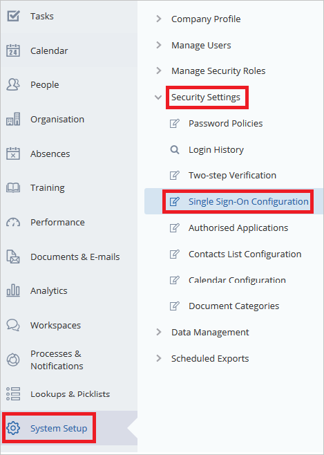

<properties
    pageTitle="Lernprogramm: Azure-Active Directory-Integration in Cezanne HR Software | Microsoft Azure"
    description="Informationen Sie zum Konfigurieren der einmaligen Anmeldens zwischen Azure Active Directory und Cezanne HR Software."
    services="active-directory"
    documentationCenter=""
    authors="jeevansd"
    manager="femila"
    editor=""/>

<tags
    ms.service="active-directory"
    ms.workload="identity"
    ms.tgt_pltfrm="na"
    ms.devlang="na"
    ms.topic="article"
    ms.date="10/26/2016"
    ms.author="jeedes"/>

# Lernprogramm: Azure-Active Directory-Integration in Cezanne HR Software

Ziel dieses Lernprogramms ist es zu zeigen, wie Sie Cezanne HR Software in Azure Active Directory (Azure AD) zu integrieren.

Integration Cezanne HR Software mit Azure AD bietet Ihnen die folgenden Vorteile:

- Sie können in Azure AD steuern, wer auf Cezanne HR Software zugreifen kann
- Sie können Ihre Benutzer automatisch auf Cezanne HR Software (einmaliges Anmelden) angemeldete Abrufen mit ihren Azure AD-Konten aktivieren.
- Sie können Ihre Konten an einem zentralen Ort – im klassischen Azure-Portal verwalten.

Wenn Sie weitere Details zu SaaS app-Integration in Azure AD-wissen möchten, finden Sie unter [Was ist Zugriff auf die Anwendung und einmaliges Anmelden mit Azure Active Directory](active-directory-appssoaccess-whatis.md).

## Erforderliche Komponenten

Zum Konfigurieren von Azure AD-Integration mit Cezanne HR Software, benötigen Sie die folgenden Elemente:

- Ein Azure AD-Abonnement
- Eine Cezanne HR Software einmaligen Anmeldung aktiviert Abonnement

> [AZURE.NOTE] Wenn Sie um die Schritte in diesem Lernprogramm zu testen, empfehlen wir nicht mit einer Umgebung für die Herstellung.

Führen Sie zum Testen der Schritte in diesem Lernprogramm Tips:

- Sie sollten Ihre Umgebung Herstellung nicht verwenden, es sei denn, dies erforderlich ist.
- Wenn Sie eine Testversion Azure AD-Umgebung besitzen, können Sie eine einen Monat zum Testen [hier](https://azure.microsoft.com/pricing/free-trial/)erhalten.

## Szenario Beschreibung
Ziel dieses Lernprogramms ist, sodass Sie in einer Umgebung für Azure AD-einmaligen Anmeldens testen können.

In diesem Lernprogramm beschriebenen Szenario besteht aus zwei Hauptfenster Bausteine:

1. Hinzufügen von Cezanne HR Software aus dem Katalog
2. Konfigurieren und Testen Azure AD einmaliges Anmelden

## Hinzufügen von Cezanne HR Software aus dem Katalog
Zum Konfigurieren der Integration von Cezanne HR Software in Azure AD müssen Sie Cezanne HR Software zu Ihrer Liste der verwalteten SaaS apps aus dem Katalog hinzuzufügen.

**Um Cezanne HR Software aus dem Katalog hinzufügen möchten, führen Sie die folgenden Schritte aus:**

1. Klicken Sie im **Azure klassischen Portal**auf der linken Navigationsbereich auf **Active Directory**. 

    ![Active Directory][1]

2. Wählen Sie aus der Liste **Verzeichnis** Verzeichnis für das Sie Verzeichnisintegration aktivieren möchten.

3. Klicken Sie zum Öffnen der Anwendungsansicht in der Verzeichnisansicht im oberen Menü auf **Applications** .
    
    ![Applikationen][2]

4. Klicken Sie auf **Hinzufügen** , am unteren Rand der Seite.
    
    ![Applikationen][3]

5. Klicken Sie im Dialogfeld **Was möchten Sie tun** klicken Sie auf **eine Anwendung aus dem Katalog hinzufügen**.

    ![Applikationen][4]

6. Geben Sie im Suchfeld **Cezanne HR Software**aus.

    

7. Klicken Sie im Ergebnisfeld wählen Sie **Cezanne HR Software**, und klicken Sie dann auf **abgeschlossen** , um die Anwendung hinzugefügt haben.

    

##  Konfigurieren und Testen Azure AD einmaliges Anmelden
Das Ziel der in diesem Abschnitt ist erläutert, wie Sie konfigurieren und Testen der Azure AD-einmaliges Anmelden mit Cezanne HR Software auf Grundlage eines Testbenutzers "Britta Simon" bezeichnet.

Für einmaliges Anmelden entwickelt muss Azure AD wissen, was der Benutzer Gegenstück Cezanne HR Software an einen Benutzer in Azure AD ist. Kurzum, muss eine Link Beziehung zwischen einem Azure AD-Benutzer und dem entsprechenden Benutzer Cezanne HR Software hergestellt werden.

Dieser Link Beziehung wird hergestellt, indem Sie den Wert des **Benutzernamens** in Azure AD als der Wert für den **Benutzernamen** Cezanne HR Software zuweisen.

Zum Konfigurieren und Azure AD-einmaliges Anmelden mit Cezanne HR Software testen, müssen Sie die folgenden Bausteine durchführen:

1. **[Konfigurieren von Azure AD einmaligen Anmeldens](#configuring-azure-ad-single-single-sign-on)** - damit Ihre Benutzer dieses Feature verwenden können.
2. **[Erstellen einer Azure AD Benutzer testen](#creating-an-azure-ad-test-user)** : Azure AD-einmaliges Anmelden mit Britta Simon testen.
3. **[Erstellen einer Cezanne HR Software testen Benutzer](#creating-a-cezanne-hr-software-test-user)** : ein Gegenstück von Britta Simon Cezanne HR Software haben, die in der Azure AD-Darstellung Ihrer verknüpft ist.
4. **[Testen Sie Benutzer zuweisen Azure AD](#assigning-the-azure-ad-test-user)** - Britta Simon mit Azure AD-einmaliges Anmelden aktivieren.
5. **[Testen der einmaligen Anmeldens](#testing-single-sign-on)** - zur Überprüfung, ob die Konfiguration funktioniert.

### Konfigurieren von Azure AD-einmaliges Anmelden

In diesem Abschnitt Azure AD-einmaliges Anmelden im klassischen Portal aktivieren und konfigurieren in Ihrer Anwendung Cezanne HR Software einmaliges Anmelden.

**So konfigurieren Sie Azure AD-einmaliges Anmelden mit Cezanne HR Software die folgenden Schritte aus:**

1. Im Portal klassischen auf der Seite Anwendung Integration **Cezanne HR Software** klicken Sie auf **Konfigurieren einmaligen Anmeldens** zum Öffnen des Dialogfelds **Konfigurieren einmaliges Anmelden** .
     
    ![Konfigurieren Sie einmaliges Anmelden][6] 

2. Klicken Sie auf der Seite **Wie möchten Sie Benutzer bei der Cezanne HR Software auf** **Azure AD einmaliges Anmelden**wählen Sie aus, und klicken Sie dann auf **Weiter**.
    
    

3. Führen Sie auf der Seite **Einstellungen für die App konfigurieren** Dialogfeld die folgenden Schritte aus, und klicken Sie auf **Weiter**:

    

    ein. Geben Sie in das Textfeld **Melden Sie sich auf URL** eine URL, die mit dem folgenden Muster: `https://w3.cezanneondemand.com/cezannehr/-/<tenant id>`.

    b. Geben Sie im Textfeld **URL Antworten** eine URL, die mit dem folgenden Muster: `https://w3.cezanneondemand.com:443/CezanneOnDemand/-/<tenant id>/Saml/samlp`.

    c. Klicken Sie auf **Weiter**

    > [AZURE.NOTE] Bitte beachten Sie, dass Sie diese Werte mit der tatsächlichen melden Sie sich auf URL und die Antworten URL aktualisieren müssen. Diese Werte abrufen, wenden Sie sich an Cezanne HR Software Supportteam über <mailto:info@cezannehr.com>.

4. Klicken Sie auf der Seite **Konfigurieren einmaliges Anmelden bei Cezanne HR Software** führen Sie die folgenden Schritte aus, und klicken Sie auf **Weiter**:

    

    ein. Klicken Sie auf **Zertifikat herunterladen**, und speichern Sie die Datei auf Ihrem Computer.

    b. Klicken Sie auf **Weiter**.

5. In einem anderen Webbrowserfenster melden Sie sich für den Zugriff auf Ihre Cezanne HR Software Mandanten als Administrator.

6. Klicken Sie im linken Navigationsbereich auf **System einrichten**. Wechseln Sie zu **Sicherheitseinstellungen**. Navigieren Sie zu der **Konfiguration für einzelne anmelden**.

    

7. In den **Benutzern erlauben, melden Sie sich mit den folgenden Dienst für einmaliges Anmelden (SSO)** Systemsteuerung **SAML 2.0** das Kontrollkästchen, und wählen Sie die Option **Erweiterte Konfiguration** daneben.

    

8. Klicken Sie auf die Schaltfläche " **Neu hinzufügen** ".

    

9. Führen Sie die folgenden Schritte auf **SAML 2.0-IDENTITÄTSANBIETER** Abschnitt ein.

    

    ein. Geben Sie den Namen des Ihrer Identitätsanbieter als **Anzeigenamen**ein.

    b. In der **Entitätsbezeichner** setzen Textfeld den Wert der **Element-ID** aus Azure AD-Anwendung Kontokonfigurations-Assistenten aus.

    c. **Binden von SAML** in 'POST' ändern.

    d. In den **Security Token Service-Endpunkts an** setzen Textfeld den Wert der **Einzelnen anmelden Service URL** aus Azure AD-Anwendung Kontokonfigurations-Assistenten aus.

    e. Geben Sie den **Benutzernamen-ID-Attribut**'http://schemas.xmlsoap.org/ws/2005/05/identity/claims/name'.

    f. Klicken Sie auf **Hochladen** -Symbol, um die heruntergeladene Zertifikat von Azure AD hochzuladen.

    g. Klicken Sie auf die Schaltfläche **Ok** . 

10. Klicken Sie auf die Schaltfläche **Speichern** .

    

11. Im Portal klassischen wählen Sie die Bestätigung Konfiguration für einzelne Zeichen, und klicken Sie dann auf **Weiter**.
    
    ![Azure AD einmaliges Anmelden][10]

12. Klicken Sie auf der Seite **Bestätigung für einzelne anmelden** auf **abgeschlossen**.  
    
    ![Azure AD einmaliges Anmelden][11]

### Erstellen eines Benutzers mit Azure AD-testen
Das Ziel der in diesem Abschnitt besteht im Erstellen eines Testbenutzers im klassischen Portal Britta Simon bezeichnet.

![Erstellen von Azure AD-Benutzer][20]

**Führen Sie die folgenden Schritte aus, um einen Testbenutzer in Azure AD zu erstellen:**

1. Klicken Sie im **Azure klassischen Portal**auf der linken Navigationsbereich auf **Active Directory**.

    

2. Wählen Sie aus der Liste **Verzeichnis** Verzeichnis für das Sie Verzeichnisintegration aktivieren möchten.

3. Wenn die Liste der Benutzer, klicken Sie im Menü oben anzeigen möchten, klicken Sie auf **Benutzer**.
    
    

4. Klicken Sie im Dialogfeld **Benutzer hinzufügen** um in der Symbolleiste auf der Unterseite öffnen, auf **Benutzer hinzufügen**.

    

5. Führen Sie auf der Seite **Teilen Sie uns zu diesem Benutzer** die folgenden Schritte aus:

    

    ein. Wählen Sie als Typ des Benutzers neuen Benutzer in Ihrer Organisation ein.

    b. Geben Sie den Benutzernamen **Textfeld** **BrittaSimon**ein.

    c. Klicken Sie auf **Weiter**.

6.  Klicken Sie auf der Seite **Benutzerprofil** Dialogfeld führen Sie die folgenden Schritte aus:
    
    

    ein. Geben Sie im Textfeld **Vorname** **Britta**aus.  

    b. Geben Sie im Textfeld **Nachname** **Simon**aus.

    c. Geben Sie im Textfeld **Anzeigename** **Britta Simon**aus.

    d. Wählen Sie in der Liste **Rolle** **Benutzer**aus.

    e. Klicken Sie auf **Weiter**.

7. Klicken Sie auf der Seite **erste temporäres Kennwort** auf **Erstellen**.
    
    

8. Führen Sie auf der Seite **erste temporäres Kennwort** die folgenden Schritte aus:
    
    

    ein. Notieren Sie den Wert für das **Neue Kennwort ein**.

    b. Klicken Sie auf **abgeschlossen**.   

### Erstellen eines Testbenutzers Cezanne HR Software

Um Azure AD-Benutzern zur Anmeldung bei Cezanne HR Software zu ermöglichen, müssen er in Cezanne HR Software bereitgestellt werden. Wenn Cezanne HR Software ist die Bereitstellung eine manuelle Aufgabe.

####Um ein Benutzerkonto bereitstellen, führen Sie die folgenden Schritte aus:

1.  Melden Sie sich als Administrator in Ihrer Firmenwebsite Cezanne HR Software.

2.  Klicken Sie im linken Navigationsbereich auf **System einrichten**. Wechseln Sie zum **Verwalten von Benutzern**. Navigieren Sie zu der **Neuen Benutzer hinzufügen**.

    ![Neuer Benutzer] (./media/active-directory-saas-cezannehrsoftware-tutorial/tutorial_cezannehrsoftware_005.png "Neuer Benutzer")

3.  Führen Sie auf **Person** Detailabschnitt folgende Schritte aus:

    ![Neuer Benutzer] (./media/active-directory-saas-cezannehrsoftware-tutorial/tutorial_cezannehrsoftware_006.png "Neuer Benutzer")

    ein. Festlegen von **internen Benutzer** als aus.

    b. Geben Sie im Textfeld **Vorname** **Britta**aus.  

    c. Geben Sie im Textfeld **Nachname** **Simon**aus.

    d. Geben Sie in das Textfeld **E-mail** die e-Mail-Adresse des Kontos Britta Simon aus.

4.  Klicken Sie auf **Kontoinformationen** im Abschnitt führen Sie folgende Schritte aus:

    ![Neuer Benutzer] (./media/active-directory-saas-cezannehrsoftware-tutorial/tutorial_cezannehrsoftware_007.png "Neuer Benutzer")

    ein. Geben Sie in das Textfeld für den **Benutzernamen** die e-Mail-Adresse des Britta Simon aus.

    b. Geben Sie im Textfeld **Kennwort** das Kennwort des Kontos Britta Simon aus.

    c. Wählen Sie als **Sicherheitsrolle** **HR Professional** aus.

    d. Klicken Sie auf **OK**.

5. Navigieren Sie zu **Melden Sie sich auf** der Registerkarte, und wählen Sie im Bereich **SAML 2.0 Bezeichnern** **Neu hinzufügen** aus.

    ![Benutzer] (./media/active-directory-saas-cezannehrsoftware-tutorial/tutorial_cezannehrsoftware_008.png "Benutzer")

6. Wählen Sie Ihre Identitätsanbieter aus, für den **Identitätsanbieter** und der **Benutzer-ID**im Textfeld, geben Sie die e-Mail-Adresse des Kontos Britta Simon.

    ![Benutzer] (./media/active-directory-saas-cezannehrsoftware-tutorial/tutorial_cezannehrsoftware_009.png "Benutzer")
    
7. Klicken Sie auf die Schaltfläche **Speichern** .

    ![Benutzer] (./media/active-directory-saas-cezannehrsoftware-tutorial/tutorial_cezannehrsoftware_010.png "Benutzer")

### Zuweisen des Azure AD-Test-Benutzers

Das Ziel der in diesem Abschnitt ist für die Aktivierung der Britta Simon Azure einmaliges Anmelden verwenden, indem Sie keinen Zugriff auf Cezanne HR Software erteilen.
    
![Benutzer zuweisen][200]

**Um Britta Simon Cezanne HR Software zuzuweisen, führen Sie die folgenden Schritte aus:**

1. Klicken Sie im Portal klassischen zum Öffnen der Anwendungsansicht in der Verzeichnisansicht klicken Sie auf **Applikationen** im oberen Menü.
    
    ![Benutzer zuweisen][201]

2. Wählen Sie in der Liste Applications **Cezanne HR Software**aus.
    
    

3. Klicken Sie auf **Benutzer**, klicken Sie im Menü oben.
    
    ![Benutzer zuweisen][203]

4. Wählen Sie in der Liste Benutzer **Britta Simon**aus.

5. Klicken Sie unten auf der Symbolleiste auf **zuweisen**.
    
    ![Benutzer zuweisen][205]

### Testen einmaliges Anmelden

Das Ziel der in diesem Abschnitt ist zum Azure AD-einzelne anmelden Überprüfen der Konfiguration mithilfe des Bedienfelds Access.
 
Wenn Sie die Kachel Cezanne HR Software im Bereich Access klicken, Sie sollten automatisch an Ihrer Anwendung Cezanne HR Software angemeldete abrufen.

## Zusätzliche Ressourcen

* [Liste der zum Integrieren SaaS-Apps mit Azure-Active Directory-Lernprogramme](active-directory-saas-tutorial-list.md)
* [Was ist die Anwendungszugriff und einmaliges Anmelden mit Azure Active Directory?](active-directory-appssoaccess-whatis.md)

<!--Image references-->

[1]: ./media/active-directory-saas-cezannehrsoftware-tutorial/tutorial_general_01.png
[2]: ./media/active-directory-saas-cezannehrsoftware-tutorial/tutorial_general_02.png
[3]: ./media/active-directory-saas-cezannehrsoftware-tutorial/tutorial_general_03.png
[4]: ./media/active-directory-saas-cezannehrsoftware-tutorial/tutorial_general_04.png

[6]: ./media/active-directory-saas-cezannehrsoftware-tutorial/tutorial_general_05.png
[10]: ./media/active-directory-saas-cezannehrsoftware-tutorial/tutorial_general_06.png
[11]: ./media/active-directory-saas-cezannehrsoftware-tutorial/tutorial_general_07.png
[20]: ./media/active-directory-saas-cezannehrsoftware-tutorial/tutorial_general_100.png

[200]: ./media/active-directory-saas-cezannehrsoftware-tutorial/tutorial_general_200.png
[201]: ./media/active-directory-saas-cezannehrsoftware-tutorial/tutorial_general_201.png
[203]: ./media/active-directory-saas-cezannehrsoftware-tutorial/tutorial_general_203.png
[204]: ./media/active-directory-saas-cezannehrsoftware-tutorial/tutorial_general_204.png
[205]: ./media/active-directory-saas-cezannehrsoftware-tutorial/tutorial_general_205.png
