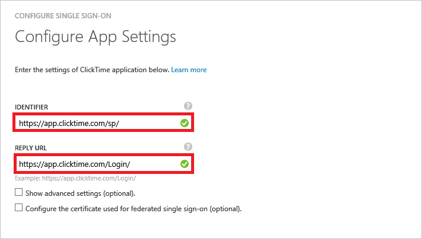
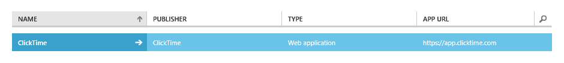

<properties 
    pageTitle="Lernprogramm: Azure-Active Directory-Integration in ClickTime | Microsoft Azure" 
    description="Informationen Sie zur Verwendung von ClickTime mit Azure Active Directory einmaliges Anmelden, automatisierte Bereitstellung und mehr aktivieren!" 
    services="active-directory" 
    authors="jeevansd"
    documentationCenter="na" 
    manager="femila" />
<tags
    ms.service="active-directory" 
    ms.devlang="na" 
    ms.topic="article" 
    ms.tgt_pltfrm="na" 
    ms.workload="identity" 
    ms.date="08/16/2016" 
    ms.author="jeedes" />

#Lernprogramm: Azure-Active Directory-Integration in ClickTime

In diesem Lernprogramm erfahren Sie, wie ClickTime mit Azure Active Directory (Azure AD) integriert werden soll.

Integration von ClickTime mit Azure AD bietet Ihnen die folgenden Vorteile:

- Sie können in Azure AD steuern, die auf ClickTime zugreifen
- Sie können Ihre Benutzer automatisch auf ClickTime (einmaliges Anmelden) mit ihren Konten Azure AD-angemeldete abrufen aktivieren.
- Sie können Ihre Konten an einem zentralen Ort – im klassischen Azure-Portal verwalten.

Wenn Sie weitere Details zu SaaS app-Integration in Azure AD-wissen möchten, finden Sie unter [Was ist Zugriff auf die Anwendung und einmaliges Anmelden mit Azure Active Directory](active-directory-appssoaccess-whatis.md).

## Erforderliche Komponenten

Zum Konfigurieren von Azure AD-Integration mit ClickTime, benötigen Sie die folgenden Elemente:

- Ein Azure AD-Abonnement
- Eine ClickTime einmaligen Anmeldung aktiviert Abonnement

> [AZURE.NOTE] Wenn Sie um die Schritte in diesem Lernprogramm zu testen, empfehlen wir nicht mit einer Umgebung für die Herstellung.

Führen Sie zum Testen der Schritte in diesem Lernprogramm Tips:

- Sie sollten Ihre Umgebung Herstellung nicht verwenden, es sei denn, dies erforderlich ist.
- Wenn Sie eine Testversion Azure AD-Umgebung besitzen, können Sie eine einen Monat zum Testen [hier](https://azure.microsoft.com/pricing/free-trial/)erhalten.

## Szenario Beschreibung
In diesem Lernprogramm testen Sie Azure AD-einmaliges Anmelden in einer testumgebung.

In diesem Lernprogramm beschriebenen Szenario besteht aus zwei Hauptfenster Bausteine:

1. Hinzufügen von ClickTime aus dem Katalog
2. Konfigurieren und Testen Azure AD einmaliges Anmelden

##Hinzufügen von ClickTime aus dem Katalog

Das Ziel der in diesem Abschnitt ist zu gliedernden wie die Anwendungsintegration für ClickTime aktiviert.

###Wenn die Anwendungsintegration für ClickTime aktivieren möchten, führen Sie die folgenden Schritte aus:

1.  Klicken Sie im Azure klassischen-Portal auf der linken Navigationsbereich auf **Active Directory**.

    ![Active Directory] (./media/active-directory-saas-clicktime-tutorial/tic700993.png "Active Directory")

2.  Wählen Sie aus der Liste **Verzeichnis** Verzeichnis für das Sie Verzeichnisintegration aktivieren möchten.

3.  Klicken Sie zum Öffnen der Anwendungsansicht in der Verzeichnisansicht im oberen Menü auf **Applications** .

    ![Applikationen] (./media/active-directory-saas-clicktime-tutorial/tic700994.png "Applikationen")

4.  Klicken Sie auf **Hinzufügen** , am unteren Rand der Seite.

    ![Anwendung hinzufügen] (./media/active-directory-saas-clicktime-tutorial/tic749321.png "Anwendung hinzufügen")

5.  Klicken Sie im Dialogfeld **Was möchten Sie tun** klicken Sie auf **eine Anwendung aus dem Katalog hinzufügen**.

    ![Hinzufügen einer Anwendung von gallerry] (./media/active-directory-saas-clicktime-tutorial/tic749322.png "Hinzufügen einer Anwendung von gallerry")

6.  Geben Sie im **Suchfeld** **ClickTime**.

    ![Katalog der Anwendung] (./media/active-directory-saas-clicktime-tutorial/tic777275.png "Katalog der Anwendung")

7.  Wählen Sie im Ergebnisbereich **ClickTime aus**, und klicken Sie dann auf **abgeschlossen** , um die Anwendung hinzugefügt haben.

    ![ClickTime] (./media/active-directory-saas-clicktime-tutorial/tic777276.png "ClickTime")

##  Konfigurieren und Testen Azure AD einmaliges Anmelden
In diesem Abschnitt Konfigurieren und Testen Azure AD-einmaliges Anmelden mit ClickTime basierend auf einen Testbenutzer "Britta Simon" bezeichnet.

Für einmaliges Anmelden entwickelt muss Azure AD kennen, kann der Benutzer Gegenstück ClickTime einem Benutzer in Azure AD. Kurzum, muss eine Link Beziehung zwischen einem Azure AD-Benutzer und dem entsprechenden Benutzer in ClickTime eingerichtet werden.

Dieser Link Beziehung wird hergestellt, indem Sie den Wert des **Benutzernamens** in Azure AD als der Wert für den **Benutzernamen** in ClickTime zuweisen.

Zum Konfigurieren und Azure AD-einmaliges Anmelden mit ClickTime testen, müssen Sie die folgenden Bausteine durchführen:

1. **[Konfigurieren von Azure AD einmaligen Anmeldens](#configuring-azure-ad-single-sign-on)** - damit Ihre Benutzer dieses Feature verwenden können.
2. **[Erstellen einer Azure AD Benutzer testen](#creating-an-azure-ad-test-user)** : Azure AD-einmaliges Anmelden mit Britta Simon testen.
3. **[Erstellen einer ClickTime Benutzer testen](#creating-a-clicktime-test-user)** : ein Gegenstück von Britta Simon in ClickTime haben, die in der Azure AD-Darstellung Ihrer verknüpft ist.
4. **[Testen Sie Benutzer zuweisen Azure AD](#assigning-the-azure-ad-test-user)** - Britta Simon mit Azure AD-einmaliges Anmelden aktivieren.
5. **[Testen der einmaligen Anmeldens](#testing-single-sign-on)** - zur Überprüfung, ob die Konfiguration funktioniert.

### Konfigurieren von Azure AD-einmaliges Anmelden

Das Ziel der in diesem Abschnitt ist zu gliedernden wie Benutzer authentifizieren zu ClickTime mit ihrem Konto in Azure Active Directory Federation je nach verwendetem SAML-Protokoll verwenden aktiviert.  

>[AZURE.IMPORTANT] Um einmaliges Anmelden auf Ihrem Mandanten ClickTime konfigurieren können, müssen Sie zuerst den ClickTime technischen Support zum Abrufen dieses Feature aktiviert.

**Führen Sie die folgenden Schritte aus, um Azure AD-einmaliges Anmelden mit ClickTime konfigurieren:**

1.  Im Azure klassischen-Portal auf der Seite **ClickTime** Integration Anwendung klicken Sie auf **Konfigurieren einmaligen Anmeldens** um das Dialogfeld **Konfigurieren Single Sign On** öffnen.

    ![Einmaliges Anmelden aktivieren] (./media/active-directory-saas-clicktime-tutorial/tic777277.png "Einmaliges Anmelden aktivieren")

2.  Klicken Sie auf der Seite **Wie möchten Sie Benutzer bei der ClickTime auf** **Microsoft Azure AD einmaliges Anmelden**wählen Sie aus, und klicken Sie dann auf **Weiter**.

    ![Konfigurieren einmaliges Anmelden] (./media/active-directory-saas-clicktime-tutorial/tic777278.png "Konfigurieren einmaliges Anmelden")

3. Führen Sie auf der Seite Dialogfeld **Konfigurieren der App-Einstellungen** die folgenden Schritte aus:

     

    ein. Geben Sie im Textfeld **IdentifierL** die URL, die mit dem folgenden Muster: **https://app.clicktime.com/sp/**
    
    b. Geben Sie in das Textfeld **Antwort-URL** die URL mit dem folgenden Muster: **https://app.clicktime.com/Login/**

    c. Klicken Sie auf **Weiter**

4.  Klicken Sie auf der Seite **Konfigurieren einmaliges Anmelden bei ClickTime** Wenn Ihr Zertifikat herunterladen möchten, klicken Sie auf **Zertifikat herunterladen**, und speichern Sie die Zertifikatdatei auf Ihrem Computer.

    ![Konfigurieren einmaliges Anmelden] (./media/active-directory-saas-clicktime-tutorial/tic777279.png "Konfigurieren einmaliges Anmelden")

4.  In einem anderen Webbrowserfenster melden Sie sich bei der Website Ihres Unternehmens ClickTime als Administrator.

5.  Klicken Sie in der Symbolleiste oben auf **Einstellungen**, und klicken Sie dann auf **Sicherheitseinstellungen**.

6.  Führen Sie im Konfigurationsabschnitt **Einstellungen für einzelne Zeichen** die folgenden Schritte aus:

    ![Sicherheitseinstellungen] (./media/active-directory-saas-clicktime-tutorial/tic777280.png "Sicherheitseinstellungen")

    ein.  Wählen Sie **Zulassen** aus anmelden für einmaliges Anmelden (SSO) mit **Azure AD**verwenden.
    
    b.  Im Azure klassischen-Portal auf der Seite **Konfigurieren einmaliges Anmelden bei ClickTime** kopieren Sie den Wert für die **Einzelnen anmelden Dienst-URL** , und fügen Sie ihn in das Textfeld **Identität Anbieterendpunkt** .

    c.  Öffnen Sie das Base-64-codierte Zertifikat in **Editor**, kopieren Sie den Inhalt, und fügen Sie ihn in das Textfeld **X 509-Zertifikat** .
    
    d.  Klicken Sie auf **Speichern**.

7.  Klicken Sie im Portal Azure klassischen wählen Sie die Konfiguration für einzelne Zeichen Bestätigung und dann auf **abgeschlossen** , um das Dialogfeld **Konfigurieren Single Sign On** schließen.

    ![Konfigurieren einmaliges Anmelden] (./media/active-directory-saas-clicktime-tutorial/tic777281.png "Konfigurieren einmaliges Anmelden")

##Konfigurieren der Benutzer bereitgestellt

Um Azure AD-Benutzern zur Anmeldung bei ClickTime zu ermöglichen, müssen er in ClickTime bereitgestellt werden.  
Im Falle von ClickTime ist die Bereitstellung eine manuelle Aufgabe.

###Um eine Benutzerkonten bereitzustellen, führen Sie die folgenden Schritte aus:

1.  Melden Sie sich bei Ihrem Mandanten **ClickTime** .

2.  Klicken Sie in der Symbolleiste oben auf die **Firma**, und klicken Sie dann auf **Personen**.

    ![Personen] (./media/active-directory-saas-clicktime-tutorial/tic777282.png "Personen")

3.  Klicken Sie auf die **Person hinzufügen**.

    ![Person hinzufügen] (./media/active-directory-saas-clicktime-tutorial/tic777283.png "Person hinzufügen")

4.  Führen Sie im Abschnitt neue Person die folgenden Schritte aus:

    ![Personen] (./media/active-directory-saas-clicktime-tutorial/tic777284.png "Personen")

    ein.  Geben Sie in das Textfeld **e-Mail-Adresse** die e-Mail-Adresse Ihres Kontos Azure AD-aus.
    
    b.  Geben Sie in das Textfeld **Vollständiger Name** den Namen Ihres Kontos Azure AD-aus.  

    >[AZURE.NOTE] Wenn Sie möchten, können Sie zusätzliche Eigenschaften des neuen Personenobjekts festlegen.

    c.  Klicken Sie auf **Speichern**.

>[AZURE.NOTE] Alle anderen ClickTime Benutzer Konto Creation Tools können oder APIs von ClickTime zur Bereitstellung von Azure AD-Benutzerkonten bereitgestellt.

### Zuweisen des Azure AD-Test-Benutzers

In diesem Abschnitt aktivieren Sie Britta Simon Azure einmaliges Anmelden verwenden, indem Sie keinen Zugriff auf ClickTime erteilen.

![Benutzer zuweisen][200]

Klicken Sie zum Testen der Konfigurations müssen Sie die Azure AD-Benutzer erteilen, dass Sie mit der Anwendung darauf zugreifen sollen, durch das Zuordnen zulassen möchten.

**Gehen Sie folgendermaßen vor, um Britta Simon ClickTime zuzuweisen,**

1. Klicken Sie im Portal klassischen zum Öffnen der Anwendungsansicht in der Verzeichnisansicht klicken Sie auf **Applikationen** im oberen Menü.

    ![Benutzer zuweisen][201] 

2. Wählen Sie in der Liste Applications **ClickTime**.

     

3. Klicken Sie auf **Benutzer**, klicken Sie im Menü oben.

    ![Benutzer zuweisen][203]

4. Wählen Sie in der Liste Benutzer **Britta Simon**aus.

5. Klicken Sie unten auf der Symbolleiste auf **zuweisen**.

    ![Benutzer zuweisen][205]

## Testen einmaliges Anmelden
In diesem Abschnitt Testen Sie Ihre Azure AD-einzelne anmelden Konfiguration mit der Access-Systemsteuerung.

Wenn Sie die Kachel ClickTime im Bereich Access klicken, Sie sollten automatisch an Ihrer Anwendung ClickTime angemeldete abrufen.

## Zusätzliche Ressourcen

* [Liste der zum Integrieren SaaS-Apps mit Azure-Active Directory-Lernprogramme](active-directory-saas-tutorial-list.md)
* [Was ist die Anwendungszugriff und einmaliges Anmelden mit Azure Active Directory?](active-directory-appssoaccess-whatis.md)

<!--Image references-->

[200]: ./media/active-directory-saas-clicktime-tutorial/tutorial_general_200.png
[201]: ./media/active-directory-saas-clicktime-tutorial/tutorial_general_201.png
[203]: ./media/active-directory-saas-clicktime-tutorial/tutorial_general_203.png
[205]: ./media/active-directory-saas-clicktime-tutorial/tutorial_general_205.png