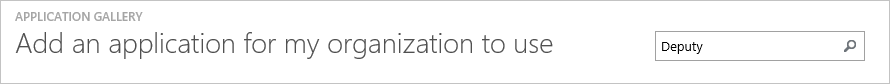
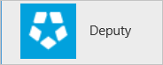
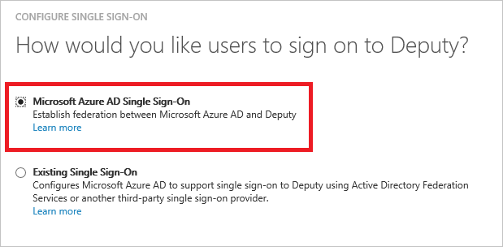
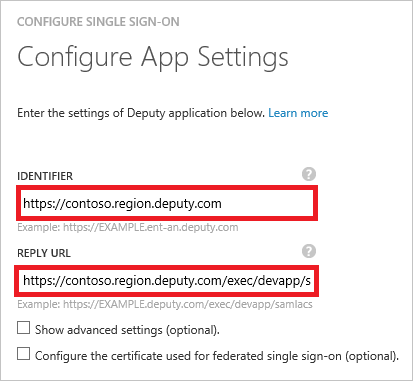
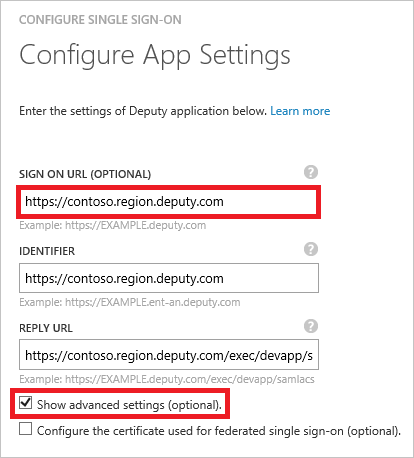
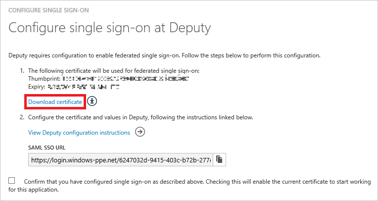
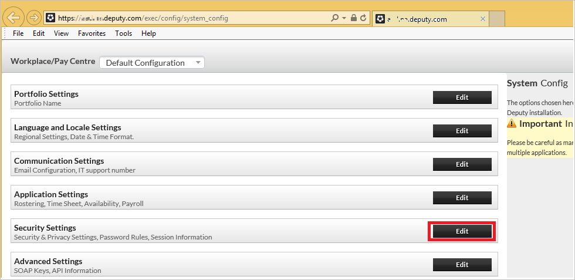
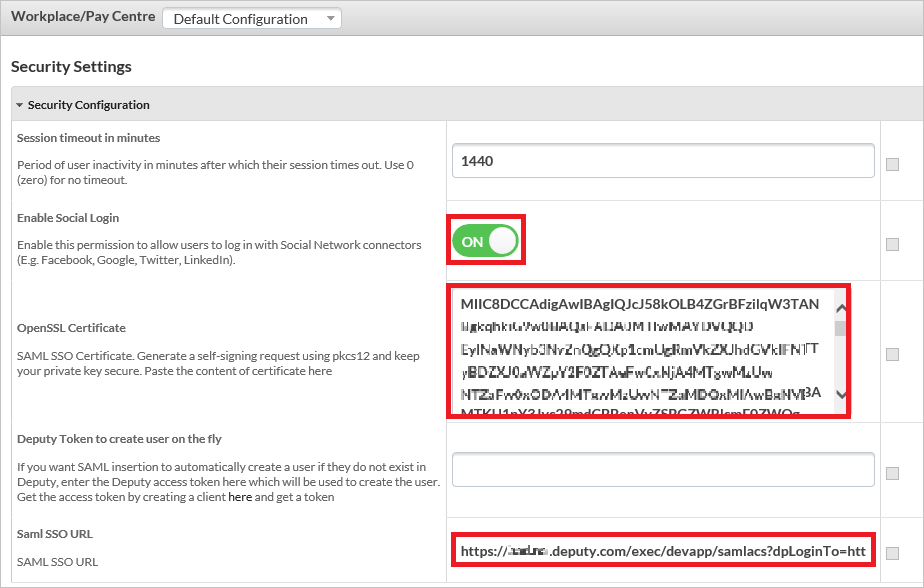
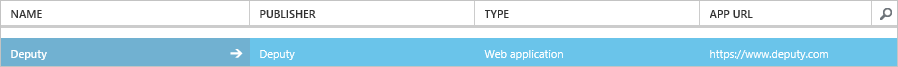

<properties
    pageTitle="Lernprogramm: Azure-Active Directory-Integration in stellvertretenden | Microsoft Azure"
    description="Informationen Sie zum einmaligen Anmeldens zwischen Azure Active Directory und stellvertretenden konfigurieren."
    services="active-directory"
    documentationCenter=""
    authors="jeevansd"
    manager="femila"
    editor=""/>

<tags
    ms.service="active-directory"
    ms.workload="identity"
    ms.tgt_pltfrm="na"
    ms.devlang="na"
    ms.topic="article"
    ms.date="09/28/2016"
    ms.author="jeedes"/>

# Lernprogramm: Azure-Active Directory-Integration in stellvertretenden

Ziel dieses Lernprogramms ist zu veranschaulichen stellvertretenden mit Azure Active Directory (Azure AD) integriert werden soll.

Integrieren von stellvertretenden in Azure AD bietet Ihnen die folgenden Vorteile:

- Sie können in Azure AD steuern, wer auf stellvertretenden zugreifen kann
- Sie können Ihre Benutzer automatisch angemeldet-zum stellvertretenden (einmaliges Anmelden) mit ihren Azure AD-Konten auf erste aktivieren.
- Sie können Ihre Konten an einem zentralen Ort – im klassischen Azure-Portal verwalten.

Wenn Sie weitere Details zu SaaS app-Integration in Azure AD-wissen möchten, finden Sie unter [Was ist Zugriff auf die Anwendung und einmaliges Anmelden mit Azure Active Directory](active-directory-appssoaccess-whatis.md).

## Erforderliche Komponenten

Um Azure AD-Integration mit stellvertretenden konfigurieren zu können, benötigen Sie die folgenden Elemente:

- Ein Azure AD-Abonnement
- Einen stellvertretenden einmaligen Anmeldung aktiviert Abonnement

> [AZURE.NOTE] Wenn Sie um die Schritte in diesem Lernprogramm zu testen, empfehlen wir nicht mit einer Umgebung für die Herstellung.

Führen Sie zum Testen der Schritte in diesem Lernprogramm Tips:

- Sie sollten Ihre Umgebung Herstellung nicht verwenden, es sei denn, dies erforderlich ist.
- Wenn Sie eine Testversion Azure AD-Umgebung besitzen, können Sie eine einen Monat zum Testen [hier](https://azure.microsoft.com/pricing/free-trial/)erhalten.

## Szenario Beschreibung
Ziel dieses Lernprogramms ist, sodass Sie in einer Umgebung für Azure AD-einmaligen Anmeldens testen können.

In diesem Lernprogramm beschriebenen Szenario besteht aus zwei Hauptfenster Bausteine:

1. Hinzufügen von stellvertretenden aus dem Katalog
2. Konfigurieren und Testen Azure AD einmaliges Anmelden

## Hinzufügen von stellvertretenden aus dem Katalog
Zum Konfigurieren der Integration von stellvertretenden in Azure AD müssen Sie stellvertretenden zu Ihrer Liste der verwalteten SaaS apps aus dem Katalog hinzuzufügen.

**Um stellvertretenden aus dem Katalog hinzuzufügen, führen Sie die folgenden Schritte aus:**

1. Klicken Sie im **Azure klassischen Portal**auf der linken Navigationsbereich auf **Active Directory**. 

    ![Active Directory][1]

2. Wählen Sie aus der Liste **Verzeichnis** Verzeichnis für das Sie Verzeichnisintegration aktivieren möchten.

3. Klicken Sie zum Öffnen der Anwendungsansicht in der Verzeichnisansicht im oberen Menü auf **Applications** .
    
    ![Applikationen][2]

4. Klicken Sie auf **Hinzufügen** , am unteren Rand der Seite.
    
    ![Applikationen][3]

5. Klicken Sie im Dialogfeld **Was möchten Sie tun** klicken Sie auf **eine Anwendung aus dem Katalog hinzufügen**.

    ![Applikationen][4]

6. Geben Sie in das Suchfeld **stellvertretenden**aus.

    

7. Wählen Sie im Ergebnisfeld **stellvertretenden aus**, und klicken Sie dann auf **abgeschlossen** , um die Anwendung hinzuzufügen.

    

##  Konfigurieren und Testen Azure AD einmaliges Anmelden
Das Ziel der in diesem Abschnitt ist erläutert, wie Sie konfigurieren und Testen der Azure AD-einmaliges Anmelden mit stellvertretenden basierend auf einen Testbenutzer "Britta Simon" bezeichnet.

Für einmaliges Anmelden entwickelt muss Azure AD wissen, was der Benutzer Gegenstück stellvertretenden an einen Benutzer in Azure AD ist. Kurzum, muss eine Link Beziehung zwischen einem Azure AD-Benutzer und dem entsprechenden Benutzer in stellvertretenden eingerichtet werden.

Dieser Link Beziehung wird hergestellt, indem Sie den Wert des **Benutzernamens** in Azure AD als der Wert für den **Benutzernamen** in stellvertretenden zuweisen.

Zum Konfigurieren und Azure AD-einmaliges Anmelden mit stellvertretenden testen, müssen Sie die folgenden Bausteine durchführen:

1. **[Konfigurieren von Azure AD einmaligen Anmeldens](#configuring-azure-ad-single-single-sign-on)** - damit Ihre Benutzer dieses Feature verwenden können.
2. **[Erstellen einer Azure AD Benutzer testen](#creating-an-azure-ad-test-user)** : Azure AD-einmaliges Anmelden mit Britta Simon testen.
3. **[Erstellen einen stellvertretenden Benutzer testen](#creating-a-deputy-test-user)** : ein Gegenstück von Britta Simon in Stellvertreter haben, die in der Azure AD-Darstellung Ihrer verknüpft ist.
4. **[Testen Sie Benutzer zuweisen Azure AD](#assigning-the-azure-ad-test-user)** - Britta Simon mit Azure AD-einmaliges Anmelden aktivieren.
5. **[Testen der einmaligen Anmeldens](#testing-single-sign-on)** - zur Überprüfung, ob die Konfiguration funktioniert.

### Konfigurieren von Azure AD-einmaliges Anmelden

In diesem Abschnitt Azure AD-einmaliges Anmelden im klassischen Portal aktivieren und konfigurieren in Ihrer Anwendung stellvertretenden einmaliges Anmelden.

**Führen Sie die folgenden Schritte aus, um Azure AD-einmaliges Anmelden mit stellvertretenden konfigurieren:**

1. Im Portal klassischen auf der Seite **stellvertretenden** Integration Anwendung klicken Sie auf **Konfigurieren einmaligen Anmeldens** zum Öffnen des Dialogfelds **Konfigurieren einmaliges Anmelden** .
     
    ![Konfigurieren Sie einmaliges Anmelden][6] 

2. Klicken Sie auf der Seite **Wie möchten Sie Benutzer bei der stellvertretenden auf** **Azure AD einmaliges Anmelden**wählen Sie aus, und klicken Sie dann auf **Weiter**.
    
    

3. Auf der Seite **Einstellungen für die App konfigurieren** Dialogfeld Wenn Sie die Anwendung im **IDP initiiert Modus**konfigurieren möchten, führen Sie die folgenden Schritte aus und klicken Sie auf **Weiter**:

    

    ein. Geben Sie in das Textfeld **Bezeichner** eine URL, die mit dem folgenden Muster: `https://<your-subdomain>.<region>.deputy.com`.

    b. Geben Sie im Textfeld **URL Antworten** eine URL, die mit dem folgenden Muster: `https://<your-subdomain>.<region>.deputy.com/exec/devapp/samlacs`.

    c. Klicken Sie auf **Weiter**.

4. Wenn Sie die Anwendung in **SP initiiert Modus** auf der **App-Einstellungen konfigurieren** Dialogseite konfigurieren möchten, klicken Sie dann auf die **"Erweiterte Einstellungen (optional) anzeigen"** , und geben Sie die **Melden Sie sich auf URL** , und klicken Sie auf **Weiter**.

    

    ein. Geben Sie in das Textfeld **Melden Sie sich auf URL** eine URL, die mit dem folgenden Muster: `https://<your-subdomain>.<region>.deputy.com`.

    b. Klicken Sie auf **Weiter**.

    > [AZURE.NOTE] Stellvertretenden Region Suffix opitional ist oder es sollte eine der folgenden verwenden: au | NV | EU | als | la | af | ein | ent-au | ent-NV | ent-Eu | ent-als | ent-la | ent-af | ent ein

5. Klicken Sie auf der Seite **Konfigurieren einmaliges Anmelden bei stellvertretenden** führen Sie die folgenden Schritte aus, und klicken Sie auf **Weiter**:

    

    ein. Klicken Sie auf **Zertifikat herunterladen**, und speichern Sie die Datei auf Ihrem Computer.

    
6. Navigieren Sie zu dem folgenden URL: Https://(your-subdomain).deputy.com/exec/config/System_config. Wechseln Sie zu **Sicherheitseinstellungen** , und klicken Sie auf **Bearbeiten**.

    

7. Kopieren Sie im Azure klassischen-Portal auf das Konfigurieren einmaliges Anmelden bei stellvertretenden Seite der SAML SSO-URL ein. 

8. Führen Sie auf dieser Seite **Sicherheitseinstellungen** folgende Schritte aus.

    

    ein. Aktivieren Sie **für soziale Netzwerke Login**.

    b. Öffnen Sie Ihr Base64-codierte Zertifikat in Editor, kopieren Sie den Inhalt der es in der Zwischenablage, und fügen Sie ihn in das Textfeld **Im Zertifikat** .

    c. Geben Sie in das Textfeld SAM SSO-URL ein.`https://<your subdomain>.deputy.com/exec/devapp/samlacs?dpLoginTo=<saml sso url>`
    
    d. Ersetzen Sie in das Textfeld SAM SSO-URL `<your subdomain>` mit Ihre Subdomain.

    e. Ersetzen Sie in das Textfeld SAM SSO-URL `<saml sso url>` mit der SAML SSO-URL, die Sie vom klassischen Azure-Portal kopiert haben.

    f. Klicken Sie auf **Einstellungen speichern**.

9. Im Portal klassischen wählen Sie die Bestätigung Konfiguration für einzelne Zeichen, und klicken Sie dann auf **Weiter**.
    
    ![Azure AD einmaliges Anmelden][10]

10. Klicken Sie auf der Seite **Bestätigung für einzelne anmelden** auf **abgeschlossen**.  
    
    ![Azure AD einmaliges Anmelden][11]

### Erstellen eines Benutzers mit Azure AD-testen
Das Ziel der in diesem Abschnitt besteht im Erstellen eines Testbenutzers im klassischen Portal Britta Simon bezeichnet.

![Erstellen von Azure AD-Benutzer][20]

**Führen Sie die folgenden Schritte aus, um einen Testbenutzer in Azure AD zu erstellen:**

1. Klicken Sie im **Azure klassischen Portal**auf der linken Navigationsbereich auf **Active Directory**.

    

2. Wählen Sie aus der Liste **Verzeichnis** Verzeichnis für das Sie Verzeichnisintegration aktivieren möchten.

3. Wenn die Liste der Benutzer, klicken Sie im Menü oben anzeigen möchten, klicken Sie auf **Benutzer**.
    
    

4. Klicken Sie im Dialogfeld **Benutzer hinzufügen** um in der Symbolleiste auf der Unterseite öffnen, auf **Benutzer hinzufügen**.

    

5. Führen Sie auf der Seite **Teilen Sie uns zu diesem Benutzer** die folgenden Schritte aus:

    

    ein. Wählen Sie als Typ des Benutzers neuen Benutzer in Ihrer Organisation ein.

    b. Geben Sie den Benutzernamen **Textfeld** **BrittaSimon**ein.

    c. Klicken Sie auf **Weiter**.

6.  Klicken Sie auf der Seite **Benutzerprofil** Dialogfeld führen Sie die folgenden Schritte aus:
    
    

    ein. Geben Sie im Textfeld **Vorname** **Britta**aus.  

    b. In das letzte Textfeld **Name** , Typ, **Simon**.

    c. Geben Sie im Textfeld **Anzeigename** **Britta Simon**aus.

    d. Wählen Sie in der Liste **Rolle** **Benutzer**aus.

    e. Klicken Sie auf **Weiter**.

7. Klicken Sie auf der Seite **erste temporäres Kennwort** auf **Erstellen**.
    
    

8. Führen Sie auf der Seite **erste temporäres Kennwort** die folgenden Schritte aus:
    
    

    ein. Notieren Sie den Wert für das **Neue Kennwort ein**.

    b. Klicken Sie auf **abgeschlossen**.   

### Erstellen einen stellvertretenden Testbenutzer

Um Azure AD-Benutzer zur Anmeldung bei stellvertretenden aktivieren zu können, müssen er in stellvertretenden bereitgestellt werden. Wenn Stellvertreter ist die Bereitstellung eine manuelle Aufgabe.

####Um ein Benutzerkonto bereitstellen, führen Sie die folgenden Schritte aus:

1.  Melden Sie sich als Administrator in Ihrer Firmenwebsite stellvertretenden.

2.  Im oberen Navigationsbereich klicken Sie auf **Personen**.

    ![Personen] (./media/active-directory-saas-deputy-tutorial/tutorial_deputy_001.png "Personen")

3.  Klicken Sie auf die Schaltfläche **Personen hinzufügen** , und klicken Sie auf **Hinzufügen, eine einzelne Person**.

    ![Hinzufügen von Personen] (./media/active-directory-saas-deputy-tutorial/tutorial_deputy_002.png "Hinzufügen von Personen")

4.  Führen Sie die folgenden Schritte aus, und klicken Sie auf **Speichern & einladen**.

    ![Neuer Benutzer] (./media/active-directory-saas-deputy-tutorial/tutorial_deputy_003.png "Neuer Benutzer")

    ein. Geben Sie in das Textfeld **Name** **Britta** und **Simon**aus.  

    b. Geben Sie in das Textfeld **-e-Mail** die e-Mail-Adresse eines Kontos Azure AD-, die Sie bereitstellen möchten.

    c. Geben Sie in das Textfeld **Arbeit an** den Bussniess Namen ein.

    d. Klicken Sie auf die Schaltfläche **Speichern und einladen** .

    >[AZURE.NOTE]Der Inhaber des AAD Konto wird erhalten eine e-Mail, und führen Sie einen Link, um ihr Konto zu bestätigen, bevor sie aktiviert wurde. Alle anderen stellvertretenden Benutzer Konto Creation Tools können oder APIs bereitgestellt durch stellvertretenden bereitstellen AAD Benutzerkonten.

### Zuweisen des Azure AD-Test-Benutzers

Das Ziel der in diesem Abschnitt ist für die Aktivierung der Britta Simon Azure einmaliges Anmelden verwenden, indem Sie keinen Zugriff auf stellvertretenden erteilen.
    
![Benutzer zuweisen][200]

**Um stellvertretenden Britta Simon zuzuweisen, führen Sie die folgenden Schritte aus:**

1. Klicken Sie im Portal klassischen zum Öffnen der Anwendungsansicht in der Verzeichnisansicht klicken Sie auf **Applikationen** im oberen Menü.
    
    ![Benutzer zuweisen][201]

2. Wählen Sie in der Liste Applikationen **stellvertretenden**aus.
    
    

3. Klicken Sie auf **Benutzer**, klicken Sie im Menü oben.
    
    ![Benutzer zuweisen][203]

4. Wählen Sie in der Liste Benutzer **Britta Simon**aus.

5. Klicken Sie unten auf der Symbolleiste auf **zuweisen**.
    
    ![Benutzer zuweisen][205]

### Testen einmaliges Anmelden

Das Ziel der in diesem Abschnitt ist zum Azure AD-einzelne anmelden Überprüfen der Konfiguration mithilfe des Bedienfelds Access.
 
Wenn Sie die Kachel stellvertretenden im Bereich Access klicken, Sie sollten automatisch an Ihrer Anwendung stellvertretenden angemeldete abrufen.

## Zusätzliche Ressourcen

* [Liste der zum Integrieren SaaS-Apps mit Azure-Active Directory-Lernprogramme](active-directory-saas-tutorial-list.md)
* [Was ist die Anwendungszugriff und einmaliges Anmelden mit Azure Active Directory?](active-directory-appssoaccess-whatis.md)

<!--Image references-->

[1]: ./media/active-directory-saas-deputy-tutorial/tutorial_general_01.png
[2]: ./media/active-directory-saas-deputy-tutorial/tutorial_general_02.png
[3]: ./media/active-directory-saas-deputy-tutorial/tutorial_general_03.png
[4]: ./media/active-directory-saas-deputy-tutorial/tutorial_general_04.png

[6]: ./media/active-directory-saas-deputy-tutorial/tutorial_general_05.png
[10]: ./media/active-directory-saas-deputy-tutorial/tutorial_general_06.png
[11]: ./media/active-directory-saas-deputy-tutorial/tutorial_general_07.png
[20]: ./media/active-directory-saas-deputy-tutorial/tutorial_general_100.png

[200]: ./media/active-directory-saas-deputy-tutorial/tutorial_general_200.png
[201]: ./media/active-directory-saas-deputy-tutorial/tutorial_general_201.png
[203]: ./media/active-directory-saas-deputy-tutorial/tutorial_general_203.png
[204]: ./media/active-directory-saas-deputy-tutorial/tutorial_general_204.png
[205]: ./media/active-directory-saas-deputy-tutorial/tutorial_general_205.png
